## 1. 시스템 아키텍처 개요

Portal의 Agent 모듈은 Android 디바이스를 대상으로 벤치마크, I/O trace, 앱 매크로 자동화를 수행하는 분산 시스템입니다. Spring Boot 백엔드가 Go Agent 서버와 gRPC로 통신하며, Go Agent가 ADB를 통해 실제 디바이스를 제어합니다.

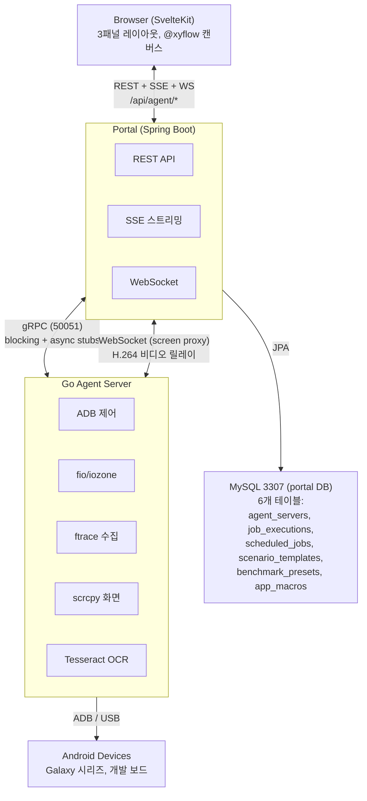

### 데이터 흐름

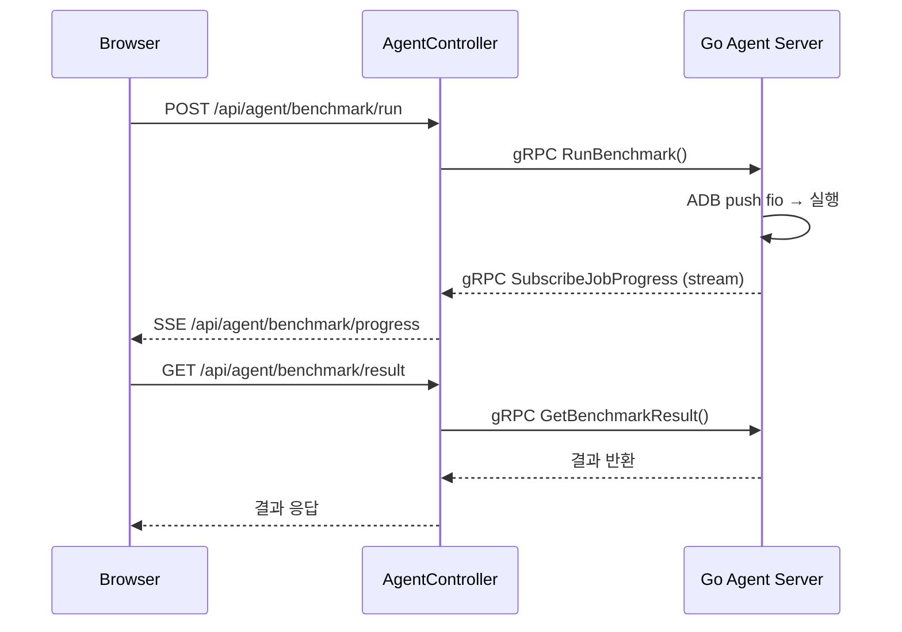

---

## 2. 백엔드 패키지 구조

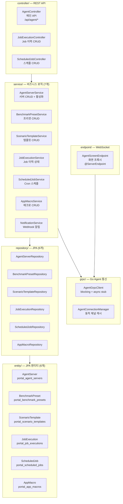

### 2.1 AgentController.java — 주요 엔드포인트

| HTTP | 경로 | 설명 |
|------|------|------|
| GET | `/servers` | 전체 서버 목록 |
| POST | `/servers` | 서버 등록 |
| PUT | `/servers/{id}` | 서버 수정 |
| DELETE | `/servers/{id}` | 서버 삭제 |
| GET | `/servers/{id}/status` | gRPC 연결 상태 (READY/IDLE/CONNECTING 등) |
| POST | `/servers/{id}/test` | 접속 테스트 (임시 채널) |
| POST | `/servers/{id}/reconnect` | 강제 재연결 |
| GET | `/servers/{serverId}/devices` | 디바이스 목록 (gRPC ListDevices) |
| POST | `/servers/{serverId}/devices/connect` | 디바이스 연결 |
| POST | `/servers/{serverId}/devices/disconnect` | 디바이스 해제 |
| POST | `/servers/{serverId}/benchmark/run` | 벤치마크 실행 |
| GET | `/servers/{serverId}/benchmark/progress/{jobId}` | SSE 진행률 스트림 |
| GET | `/servers/{serverId}/benchmark/result/{jobId}` | 결과 조회 |
| POST | `/servers/{serverId}/benchmark/cancel/{jobId}` | 작업 취소 |
| DELETE | `/servers/{serverId}/benchmark/{jobId}` | 작업 삭제 |
| POST | `/servers/{serverId}/scenario/run` | 시나리오 실행 |
| POST | `/servers/{serverId}/trace/start` | Trace 시작 |
| POST | `/servers/{serverId}/trace/stop` | Trace 중지 |
| POST | `/servers/{serverId}/trace/result` | Trace 결과 (필터 포함) |
| POST | `/servers/{serverId}/trace/raw` | Trace raw 이벤트 데이터 |
| POST | `/servers/{serverId}/trace/reparse/{jobId}` | Trace 재파싱 |
| GET | `/servers/{serverId}/monitoring/stream` | SSE 모니터링 스트림 |
| POST | `/servers/{serverId}/upload/trace` | MinIO trace 업로드 |
| POST | `/servers/{serverId}/upload/benchmark` | MinIO 벤치마크 업로드 |
| GET | `/servers/{serverId}/apps/{deviceId}` | 설치된 앱 목록 |
| POST | `/servers/{serverId}/macro/record/start` | 매크로 녹화 시작 |
| POST | `/servers/{serverId}/macro/record/stop` | 매크로 녹화 중지 |
| POST | `/servers/{serverId}/macro/replay` | 매크로 재생 |
| POST | `/servers/{serverId}/screenshot` | 스크린샷 촬영 |
| POST | `/servers/{serverId}/screenshot/ocr` | 스크린샷 OCR |
| CRUD | `/scenario-templates/*` | 시나리오 템플릿 |
| CRUD | `/benchmark-presets/*` | 벤치마크 프리셋 |
| CRUD | `/macros/*` | 앱 매크로 |

### 2.2 JobExecutionController.java

| HTTP | 경로 | 설명 |
|------|------|------|
| GET | `/api/agent/job-executions` | 전체 이력 (페이징, 필터) |
| GET | `/api/agent/job-executions/{id}` | 단건 조회 |
| GET | `/api/agent/job-executions/by-job-id/{jobId}` | jobId로 조회 |
| PUT | `/api/agent/job-executions/{id}` | 상태/결과 업데이트 |
| DELETE | `/api/agent/job-executions/{id}` | 이력 삭제 |

### 2.3 ScheduledJobController.java

| HTTP | 경로 | 설명 |
|------|------|------|
| GET | `/api/agent/scheduled-jobs` | 전체 스케줄 목록 |
| POST | `/api/agent/scheduled-jobs` | 스케줄 생성 |
| PUT | `/api/agent/scheduled-jobs/{id}` | 스케줄 수정 |
| DELETE | `/api/agent/scheduled-jobs/{id}` | 스케줄 삭제 |
| POST | `/api/agent/scheduled-jobs/{id}/toggle` | 활성화/비활성화 |
| POST | `/api/agent/scheduled-jobs/{id}/run-now` | 즉시 실행 |

### 2.4 AgentScreenEndpoint.java — WebSocket 화면 프록시

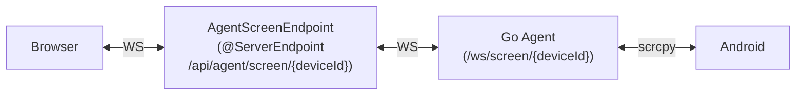

- `@ServerEndpoint("/api/agent/screen/{deviceId}")` — Spring WebSocket이 아닌 Jakarta WebSocket API 사용
- Go Agent의 scrcpy WebSocket에 연결하여 H.264 바이너리 데이터를 양방향 릴레이
- SPS/PPS + IDR 키프레임 캐시: 시트 재오픈 시 `requestSync` 메시지로 즉시 화면 표시
- 입력 릴레이: JSON text 메시지 (touch, key, scroll, back) → scrcpy control protocol 변환

---

## 3. gRPC 연동 상세

### 3.1 Proto 정의

`src/main/proto/device_agent.proto` — Go Agent의 `~/project/agent/proto/agent.proto`와 동일한 메시지 정의에 Java option만 추가합니다.

```protobuf
syntax = "proto3";
package agent;
option go_package = "agent/pb";
option java_package = "com.samsung.move.agent.proto";
option java_outer_classname = "DeviceAgentProto";
```

> Proto 변경 시 Go 서비스와 반드시 동기화해야 합니다.
> Go proto 생성: `PATH="$PATH:$HOME/go/bin" protoc --go_out=paths=source_relative:. --go-grpc_out=paths=source_relative:. proto/agent.proto && cp proto/*.go pb/`

### 3.2 RPC 전체 목록

```protobuf
service DeviceAgent {
  // ── Device Management ──
  rpc ListDevices(ListDevicesRequest) returns (ListDevicesResponse);
  rpc ConnectDevice(ConnectDeviceRequest) returns (ConnectDeviceResponse);
  rpc DisconnectDevice(DisconnectDeviceRequest) returns (DisconnectDeviceResponse);

  // ── Benchmarking ──
  rpc RunBenchmark(RunBenchmarkRequest) returns (RunBenchmarkResponse);
  rpc GetJobStatus(GetJobStatusRequest) returns (GetJobStatusResponse);
  rpc SubscribeJobProgress(SubscribeJobProgressRequest) returns (stream JobProgress);
  rpc GetBenchmarkResult(GetBenchmarkResultRequest) returns (GetBenchmarkResultResponse);
  rpc DeleteJob(DeleteJobRequest) returns (DeleteJobResponse);
  rpc CancelJob(CancelJobRequest) returns (CancelJobResponse);

  // ── Scenario ──
  rpc RunScenario(RunScenarioRequest) returns (RunScenarioResponse);

  // ── I/O Trace ──
  rpc StartTrace(StartTraceRequest) returns (StartTraceResponse);
  rpc StopTrace(StopTraceRequest) returns (StopTraceResponse);
  rpc GetTraceResult(GetTraceResultRequest) returns (GetTraceResultResponse);
  rpc GetTraceRawData(GetTraceRawDataRequest) returns (GetTraceRawDataResponse);
  rpc ReparseTrace(ReparseTraceRequest) returns (ReparseTraceResponse);

  // ── MinIO Upload ──
  rpc UploadTraceToMinio(UploadTraceRequest) returns (UploadTraceResponse);
  rpc UploadBenchmarkToMinio(UploadBenchmarkRequest) returns (UploadBenchmarkResponse);

  // ── Monitoring ──
  rpc MonitorDevices(MonitorDevicesRequest) returns (stream DeviceMetrics);

  // ── App Macro ──
  rpc ListInstalledApps(ListInstalledAppsRequest) returns (ListInstalledAppsResponse);
  rpc StartRecording(StartRecordingRequest) returns (StartRecordingResponse);
  rpc StopRecording(StopRecordingRequest) returns (StopRecordingResponse);
  rpc ReplayMacro(ReplayMacroRequest) returns (ReplayMacroResponse);
  rpc TakeScreenshot(TakeScreenshotRequest) returns (TakeScreenshotResponse);
  rpc ScreenshotOcr(ScreenshotOcrRequest) returns (ScreenshotOcrResponse);
}
```

### 3.3 RPC 분류 상세

#### Device Management

| RPC | 요청 | 응답 | 설명 |
|-----|------|------|------|
| `ListDevices` | (empty) | `repeated DeviceInfo` | 연결된 전체 디바이스 조회 |
| `ConnectDevice` | `serial` | `success, message` | ADB 디바이스 연결 |
| `DisconnectDevice` | `serial` | `success` | ADB 디바이스 해제 |

**DeviceInfo 필드**: device_id, serial, state(ONLINE/OFFLINE/BUSY), android_version, model, board, platform, hardware, cpu_abi, build_id, manufacturer, sdk_version

**DeviceState 열거형**: UNKNOWN(0), ONLINE(1), OFFLINE(2), BUSY(3)

#### Benchmarking

| RPC | 타입 | 설명 |
|-----|------|------|
| `RunBenchmark` | Unary | fio/iozone/tiotest/**iotest** 벤치마크 실행, job_id 반환 |
| `GetJobStatus` | Unary | Job 상태 + 디바이스별 진행률 조회 |
| `SubscribeJobProgress` | Server-stream | 실시간 진행 이벤트 (SSE로 브릿지) |
| `GetBenchmarkResult` | Unary | 완료된 벤치마크 결과 (metrics, raw_output) |
| `DeleteJob` | Unary | Job 데이터 삭제 |
| `CancelJob` | Unary | 실행 중인 Job 취소 |

**RunBenchmarkRequest 주요 필드**:

```protobuf
message RunBenchmarkRequest {
  repeated string device_ids = 1;      // 대상 디바이스 (복수)
  BenchmarkTool tool = 2;             // FIO / IOZONE / TIOTEST / IOTEST
  map<string, string> params = 3;     // 도구별 파라미터
  string job_name = 4;
  string busy_policy = 5;             // "reject" | "wait" | "force"
  int32 retry_count = 6;              // 실패 시 재시도 횟수
  int32 retry_delay_seconds = 7;      // 재시도 간격
}
```

**JobState 열거형**: UNKNOWN(0), QUEUED(1), PUSHING_TOOLS(2), RUNNING(3), COLLECTING(4), COMPLETED(5), FAILED(6), PARTIALLY_FAILED(7), CANCELLED(8), REPARSING(9)

**JobProgress (스트리밍 메시지)**:

```protobuf
message JobProgress {
  string job_id = 1;
  string device_id = 2;
  JobState state = 3;
  string message = 4;
  int32 progress_percent = 5;
  string error = 6;
  map<string, double> metrics = 7;     // step 완료 시 결과 포함
  string raw_output = 8;
  int32 retry_attempt = 9;            // 현재 재시도 횟수
}
```

#### Scenario

**RunScenarioRequest** — 시나리오 실행의 핵심 메시지:

```protobuf
message RunScenarioRequest {
  repeated string device_ids = 1;
  string scenario_name = 2;
  repeated ScenarioStep steps = 3;      // step 목록
  repeated ScenarioLoop loops = 4;      // 루프 정의
  int32 repeat = 5;                     // 전체 반복 횟수
  string busy_policy = 6;
  int32 retry_count = 7;
  int32 retry_delay_seconds = 8;
  bool has_branching = 9;               // true → DAG 실행 모드
  repeated StepEdge edges = 10;         // DAG 모드용 엣지 목록
}
```

**ScenarioStep types**:

| type | 설명 | 주요 params |
|------|------|------------|
| `benchmark` | 벤치마크 실행 | tool, params (fio/iozone/tiotest/**iotest** 옵션) |
| `shell` | 쉘 명령 실행 | `cmd` |
| `cleanup` | 파일 삭제 | `delete_files_from_steps`, `path` |
| `sleep` | 대기 | `seconds` |
| `trace_start` | ftrace 시작 | `trace_type` (ufs/block/both) |
| `trace_stop` | ftrace 중지 | (이전 trace_start 자동 매칭) |
| `condition` | 조건 분기 | ConditionalBranch 참조 |
| `app_macro` | 앱 매크로 실행 | AppMacroConfig 참조 |

**ConditionalBranch** — 조건 분기 메시지:

```protobuf
message ConditionalBranch {
  string metric_key = 1;              // 이전 step의 metrics 키 ("iops_read", "bw_write")
  string operator = 2;                // ">", "<", ">=", "<=", "==", "!=", "contains", "!contains"
  double threshold = 3;               // 숫자 비교 값
  int32 true_branch_step = 4;         // 참일 때 이동할 step index
  int32 false_branch_step = 5;        // 거짓일 때 이동할 step index
  string source = 6;                  // "metric" (기본) 또는 "shell"
  string shell_command = 7;           // source="shell"일 때 실행할 명령어
  string extract_pattern = 8;         // 정규식으로 결과에서 값 추출
  string threshold_string = 9;        // 문자열 비교용
  repeated ConditionRule rules = 10;  // 복합 조건 (AND/OR)
  string logic = 11;                  // "and" (기본) 또는 "or"
}
```

**DAG 실행 모드** (`has_branching = true`):

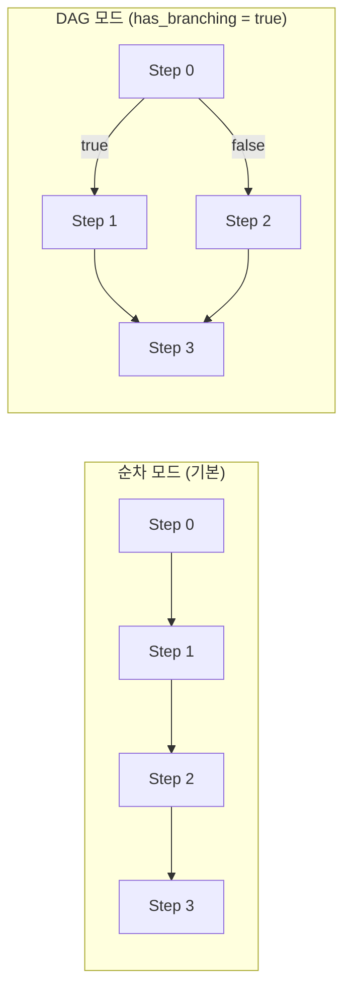

- `StepEdge { from_step, to_step, label }` — label: "true", "false", "" (순차)
- `ScenarioLoop { start_step, end_step, count }` — 특정 step 범위 반복

**AppMacroConfig** — 시나리오 내 앱 매크로 설정:

```protobuf
message AppMacroConfig {
  int64 macro_id = 1;                  // DB 저장된 매크로 ID
  string macro_name = 2;
  repeated MacroEvent events = 3;      // 인라인 이벤트 (macro_id 없을 때)
  int32 source_width = 4;              // 녹화 시 해상도
  int32 source_height = 5;
  string package_name = 6;             // 앱 패키지명
  string clear_mode = 7;              // "none" | "force_stop" | "clear"
}
```

#### I/O Trace

| RPC | 설명 |
|-----|------|
| `StartTrace` | ftrace I/O 수집 시작 (device_id, trace_type, window_seconds) |
| `StopTrace` | 수집 중지 + 파싱 |
| `GetTraceResult` | 통계 조회 (repeated job_ids + TraceFilter) |
| `GetTraceRawData` | raw 이벤트 조회 (scatter 차트용, 최대 256MB) |
| `ReparseTrace` | 기존 trace 데이터 재파싱 |

**TraceFilter** — trace 데이터 필터링:

```protobuf
message TraceFilter {
  double start_time = 1;           // ms
  double end_time = 2;
  uint64 start_lba = 3;
  uint64 end_lba = 4;
  double min_dtoc / max_dtoc       // D-to-C latency 범위
  double min_ctoc / max_ctoc       // C-to-C latency 범위
  double min_ctod / max_ctod       // C-to-D latency 범위
  uint32 min_qd / max_qd           // Queue Depth 범위
  repeated uint32 cpu_list         // CPU 필터
  repeated string cmd_list         // CMD 필터 (SCSI opcode)
  repeated uint32 size_list        // I/O 크기 필터
  repeated string action_list      // action 필터 (send_req/complete_rsp)
}
```

**TraceStats** — 통계 결과 구조:

```
TraceStats
├── total_events, duration_seconds
├── dtoc/ctod/ctoc/qd: LatencyStats {min, max, avg, stddev, median, p99~p999999}
├── cmd_stats[]: CmdStats {cmd, count, ratio, dtoc/ctod/ctoc/qd, total_size_bytes, ...}
├── latency_histograms[]: LatencyHistogram {cmd, latency_type, buckets[]}
├── cmd_size_counts[]: CmdSizeCount {cmd, size, count}
├── continuous_count/ratio, aligned_count/ratio
└── read/write/discard_total_bytes, send_count
```

**TraceEvent** — raw 이벤트 (scatter 차트 데이터):

| 필드 | 타입 | 설명 |
|------|------|------|
| time | double | 시간 (ms) |
| lba | uint64 | Logical Block Address |
| qd | uint32 | Queue Depth |
| cpu | uint32 | CPU 코어 번호 |
| dtoc | double | Dispatch-to-Complete latency |
| ctod | double | Complete-to-Dispatch latency |
| ctoc | double | Complete-to-Complete latency |
| cmd | string | SCSI opcode 또는 block 명령 |
| size | uint32 | I/O 크기 (bytes) |
| continuous | bool | 연속 I/O 여부 |
| action | string | "send_req"/"complete_rsp" (UFS) 또는 "block_rq_issue"/"block_rq_complete" (Block) |

#### Monitoring

```protobuf
rpc MonitorDevices(MonitorDevicesRequest) returns (stream DeviceMetrics);
```

- Server-streaming RPC: 지정된 interval_seconds 간격으로 메트릭 스트리밍
- **DeviceMetrics**: device_id, timestamp, cpu(usage_percent, per_core_percent), memory(total/available/used_kb, usage_percent), disk(read/write bytes/ios), data_partition(mount_point, filesystem, total/used/available bytes, usage_percent)

#### MinIO Upload

| RPC | 설명 |
|-----|------|
| `UploadTraceToMinio` | trace 데이터를 MinIO 오브젝트 스토리지에 업로드 |
| `UploadBenchmarkToMinio` | 벤치마크 결과를 MinIO에 업로드 |

#### App Macro (이벤트 녹화/재생 + OCR)

| RPC | 설명 |
|-----|------|
| `ListInstalledApps` | 디바이스 설치 앱 목록 (30초 타임아웃) |
| `StartRecording` | 터치 이벤트 녹화 시작 → session_id 반환 |
| `StopRecording` | 녹화 중지 → events[], device_width/height 반환 |
| `ReplayMacro` | 매크로 재생 (30분 타임아웃), OCR 결과 포함 |
| `TakeScreenshot` | PNG 스크린샷 촬영 |
| `ScreenshotOcr` | 스크린샷 + Tesseract OCR (영역 지정 가능) |

**MacroEvent types**:

| type | 설명 | 주요 필드 |
|------|------|----------|
| `tap` | 화면 터치 | x, y |
| `swipe` | 스와이프 | x, y, x2, y2, duration |
| `key` | 키 이벤트 | keycode |
| `wait` | 고정 대기 | seconds |
| `wait_until` | 조건부 대기 | wait_method(activity/ui_text/screen_stable), wait_pattern, timeout, poll_interval |
| `screenshot` | 스크린샷 촬영 | name, ocr_region |
| `scroll_capture` | 스크롤 + OCR | direction, max_scrolls, scroll_pause, ocr_pattern, ocr_region |

---

## 4. 동적 gRPC 채널 관리

Excel 서비스는 `application.yaml`에 정적 주소를 설정하고 `GrpcChannelFactory`로 단일 채널을 사용하지만, Agent는 여러 서버를 DB로 동적 관리하므로 **직접 채널을 생성/캐시**합니다.

### AgentConnectionManager

```java
@Component
public class AgentConnectionManager {
    private final ConcurrentHashMap<Long, AgentGrpcClient> clients = new ConcurrentHashMap<>();

    // 서버 ID로 client 가져오기 (없으면 생성, host/port 변경 시 재생성)
    AgentGrpcClient getOrCreate(Long serverId, String host, int port);

    // 캐시에서 직접 가져오기
    AgentGrpcClient get(Long serverId);

    // 캐시에서 제거 + 채널 종료
    void remove(Long serverId);

    // 접속 테스트 (임시 채널, 캐시 미저장)
    boolean testConnection(String host, int port);

    // 강제 재연결
    AgentGrpcClient reconnect(Long serverId, String host, int port);

    // 연결 상태 조회 (READY/IDLE/CONNECTING/TRANSIENT_FAILURE/SHUTDOWN)
    String getConnectionState(Long serverId);

    @PreDestroy  // 애플리케이션 종료 시 모든 채널 정리
    void shutdown();
}
```

### AgentGrpcClient

```java
public class AgentGrpcClient implements AutoCloseable {
    private final ManagedChannel channel;
    private final DeviceAgentGrpc.DeviceAgentBlockingStub blockingStub;   // Unary RPC
    private final DeviceAgentGrpc.DeviceAgentStub asyncStub;              // Streaming RPC

    // 채널 설정
    // - maxInboundMessageSize: 256MB (trace raw data 전송용)
    // - keepAliveTime: 30초
    // - keepAliveTimeout: 5초
    // - keepAliveWithoutCalls: true (유휴 상태에서도 keepalive)
    // - usePlaintext: true (TLS 미사용)
}
```

### 채널 라이프사이클

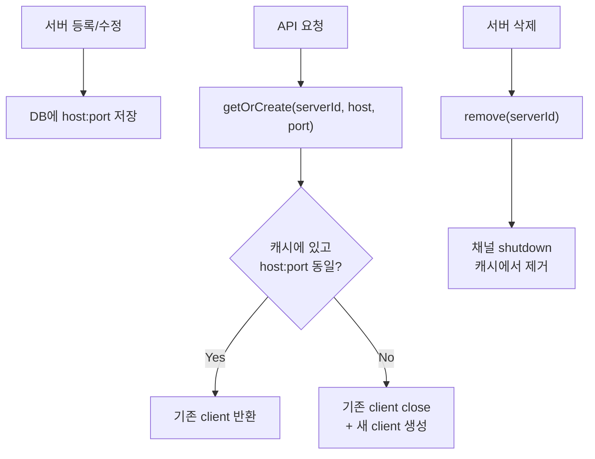

---

## 5. SSE 스트리밍 패턴

### 5.1 벤치마크 진행률 스트림

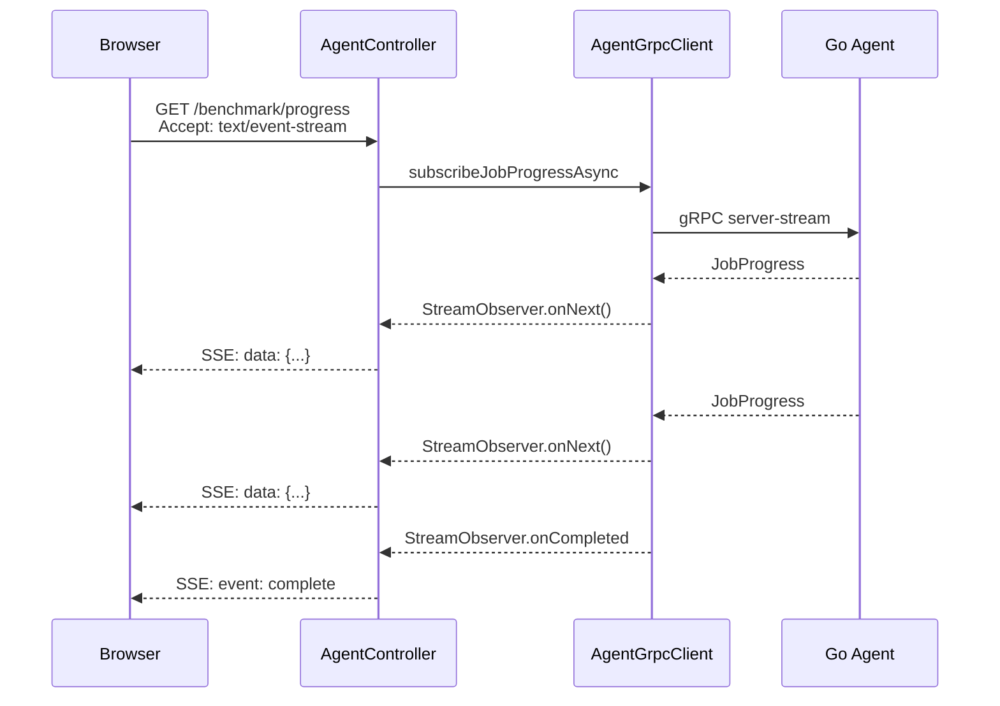

- `SseEmitter`에 무제한 타임아웃 설정 (`new SseEmitter(0L)`)
- `AtomicBoolean` 가드로 emitter가 닫힌 후 send 시도 방지
- 에러 발생 시 `SseEmitter.event().name("error").data(...)` 전송

### 5.2 모니터링 메트릭 스트림

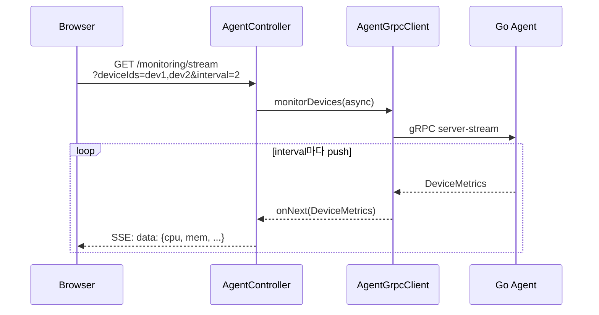

- **페이지 레벨 관리**: 모니터링 SSE 연결은 시트가 아닌 `+page.svelte`에서 관리 (시트를 닫아도 연결 유지)
- 프론트엔드에서 `EventSource`로 연결, JSON 파싱 후 차트 업데이트

---

## 6. 데이터베이스 스키마

portal datasource (MySQL 3307)에 6개 테이블을 사용합니다.

### 6.1 portal_agent_servers

| 컬럼 | 타입 | 제약 | 설명 |
|------|------|------|------|
| id | BIGINT | PK, AUTO_INCREMENT | |
| name | VARCHAR(100) | UNIQUE, NOT NULL | 서버 이름 |
| host | VARCHAR(100) | NOT NULL | gRPC 서버 호스트 |
| port | INT | NOT NULL, DEFAULT 50051 | gRPC 포트 |
| enabled | BOOLEAN | NOT NULL, DEFAULT true | 활성화 여부 |
| description | VARCHAR(500) | | 서버 설명 |
| created_at | DATETIME | | 생성 시각 |
| updated_at | DATETIME | | 수정 시각 |

### 6.2 portal_benchmark_presets

| 컬럼 | 타입 | 제약 | 설명 |
|------|------|------|------|
| id | BIGINT | PK, AUTO_INCREMENT | |
| name | VARCHAR(200) | NOT NULL | 프리셋 이름 |
| description | VARCHAR(500) | | 설명 |
| tool | VARCHAR(20) | NOT NULL | FIO / IOZONE / TIOTEST / IOTEST |
| params_json | TEXT | NOT NULL | JSON: `{"bs":"4k", "rw":"randread", ...}` |
| created_at | DATETIME | | 생성 시각 |
| updated_at | DATETIME | | 수정 시각 |

### 6.3 portal_scenario_templates

| 컬럼 | 타입 | 제약 | 설명 |
|------|------|------|------|
| id | BIGINT | PK, AUTO_INCREMENT | |
| name | VARCHAR(200) | NOT NULL | 템플릿 이름 |
| description | VARCHAR(500) | | 설명 |
| repeat_count | INT | NOT NULL, DEFAULT 1 | 전체 반복 횟수 |
| steps_json | TEXT | NOT NULL | JSON: `[{type, tool, params, condition, macro}]` |
| loops_json | TEXT | | JSON: `[{startStep, endStep, count}]` |
| created_at | DATETIME | | 생성 시각 |
| updated_at | DATETIME | | 수정 시각 |

### 6.4 portal_job_executions

| 컬럼 | 타입 | 제약 | 설명 |
|------|------|------|------|
| id | BIGINT | PK, AUTO_INCREMENT | |
| jobId | VARCHAR(255) | UNIQUE, NOT NULL | Go Agent가 발급한 Job ID |
| serverId | BIGINT | NOT NULL | 실행한 Agent 서버 ID |
| serverName | VARCHAR(100) | | 서버 이름 (비정규화) |
| type | VARCHAR(20) | NOT NULL | benchmark / scenario / trace |
| tool | VARCHAR(20) | | FIO / IOZONE / TIOTEST / IOTEST |
| jobName | VARCHAR(200) | | 사용자 지정 Job 이름 |
| deviceIds | TEXT | | JSON array: `["dev1","dev2"]` |
| state | VARCHAR(30) | NOT NULL, DEFAULT "running" | running / completed / failed / cancelled |
| config | TEXT | | JSON: 실행 파라미터 전체 |
| resultSummary | TEXT | | JSON: 주요 메트릭 요약 |
| scheduledJobId | BIGINT | | 스케줄에 의한 실행이면 FK |
| retryAttempt | INT | DEFAULT 0 | 현재 재시도 횟수 |
| errorMessage | TEXT | | 에러 메시지 |
| started_at | DATETIME | | 실행 시작 시각 |
| completed_at | DATETIME | | 실행 완료 시각 |
| created_at | DATETIME | | 레코드 생성 시각 |

> 참고: JPA entity에서 camelCase 컬럼명을 사용합니다 (`jobId`, `serverId` 등). Spring Boot의 `spring.jpa.hibernate.naming.physical-strategy` 설정에 따라 실제 DB 컬럼명이 결정됩니다.

### 6.5 portal_scheduled_jobs

| 컬럼 | 타입 | 제약 | 설명 |
|------|------|------|------|
| id | BIGINT | PK, AUTO_INCREMENT | |
| name | VARCHAR(200) | NOT NULL | 스케줄 이름 |
| description | VARCHAR(500) | | 설명 |
| enabled | BOOLEAN | NOT NULL, DEFAULT true | 활성화 여부 |
| type | VARCHAR(20) | NOT NULL | benchmark / scenario |
| serverId | BIGINT | NOT NULL | 실행 대상 Agent 서버 ID |
| deviceIds | TEXT | NOT NULL | JSON array: 대상 디바이스 목록 |
| config | TEXT | NOT NULL | JSON: benchmark={tool,params} / scenario={stepsJson,loopsJson,repeat} |
| cronExpression | VARCHAR(50) | NOT NULL | Cron 표현식 (예: `0 0 2 * * ?`) |
| busyPolicy | VARCHAR(20) | DEFAULT "reject" | reject / wait / force |
| retryCount | INT | DEFAULT 0 | 실패 시 재시도 횟수 |
| retryDelaySeconds | INT | DEFAULT 60 | 재시도 간격 (초) |
| notifyOnFailure | BOOLEAN | DEFAULT false | 실패 시 알림 |
| notifyOnSuccess | BOOLEAN | DEFAULT false | 성공 시 알림 |
| notifyWebhookUrl | VARCHAR(500) | | Webhook URL |
| last_run_at | DATETIME | | 마지막 실행 시각 |
| lastRunStatus | VARCHAR(30) | | 마지막 실행 상태 |
| next_run_at | DATETIME | | 다음 실행 예정 시각 |
| created_at | DATETIME | | 생성 시각 |
| updated_at | DATETIME | | 수정 시각 |

### 6.6 portal_app_macros

| 컬럼 | 타입 | 제약 | 설명 |
|------|------|------|------|
| id | BIGINT | PK, AUTO_INCREMENT | |
| name | VARCHAR(200) | NOT NULL | 매크로 이름 |
| description | VARCHAR(500) | | 설명 |
| package_name | VARCHAR(200) | | 앱 패키지명 (com.xxx.yyy) |
| events_json | MEDIUMTEXT | NOT NULL | JSON: MacroEvent 배열 |
| device_width | INT | | 녹화 시 디바이스 가로 해상도 |
| device_height | INT | | 녹화 시 디바이스 세로 해상도 |
| created_at | DATETIME | | 생성 시각 |
| updated_at | DATETIME | | 수정 시각 |

---

## 7. 프론트엔드 아키텍처

### 7.1 파일 구조

```
frontend/src/routes/agent/
├── +page.svelte                    # 메인 페이지 (전역 상태 + 3패널 레이아웃)
├── types.ts                        # TypeScript 타입 정의
├── benchmarkOptions.ts             # fio/iozone/tiotest 옵션 정의 + 도움말
│
├── AgentContextPanel.svelte        # 좌측: 서버 선택, 디바이스 체크리스트, Quick Actions
├── AgentBenchmarkForm.svelte       # 센터: 벤치마크 실행 폼
├── AgentScenarioBuilder.svelte     # 센터: 시나리오 빌더 (캔버스 포함)
├── AgentTraceForm.svelte           # 센터: Trace 시작/중지
├── AgentResultsView.svelte         # 센터: Job 히스토리 목록
├── AgentScheduleView.svelte        # 센터: 스케줄 작업 관리
├── AgentMacroRecorder.svelte       # 센터: 매크로 녹화/편집
├── AgentMacroResultView.svelte     # 센터: 매크로 결과 (OCR 포함)
│
├── AgentServerSheet.svelte         # 우측 시트: 서버 CRUD + 접속 테스트
├── AgentMonitoringSheet.svelte     # 우측 시트: CPU/Memory/Disk 실시간 차트
├── AgentResultDetailSheet.svelte   # 우측 시트: 벤치마크 결과 상세
├── AgentTraceResultSheet.svelte    # 우측 시트: trace 분석 (scatter + 통계)
├── AgentScreenSheet.svelte         # 우측 시트: 화면 공유 (H.264 WebSocket)
├── AgentStepEditDialog.svelte      # 다이얼로그: 시나리오 step 편집
│
├── AgentFloatingJobCard.svelte     # 플로팅: 실행 중 Job 진행률 카드
├── TraceScatterChart.svelte        # 공유: trace scatter 차트 컴포넌트
│
├── agent-result/                   # 결과 상세 서브 컴포넌트
└── scenario-canvas/                # @xyflow/svelte 캔버스 컴포넌트
    ├── ScenarioCanvas.svelte       # 메인 캔버스 (노드/엣지 렌더링)
    ├── StepNode.svelte             # step 노드 (benchmark/shell/cleanup 등)
    ├── ConditionNode.svelte        # 조건 분기 노드 (다이아몬드 형태)
    ├── LoopGroup.svelte            # 루프 그룹 (step 범위 시각화)
    ├── NodePalette.svelte          # 노드 팔레트 (드래그 앤 드롭)
    ├── CanvasToolbar.svelte        # 캔버스 툴바 (zoom, fit, export)
    ├── ExecutionMiniCanvas.svelte  # 실행 진행 미니 캔버스
    ├── serializer.ts               # 캔버스 → proto 메시지 직렬화
    └── types.ts                    # 캔버스 타입 정의
```

### 7.2 3패널 레이아웃

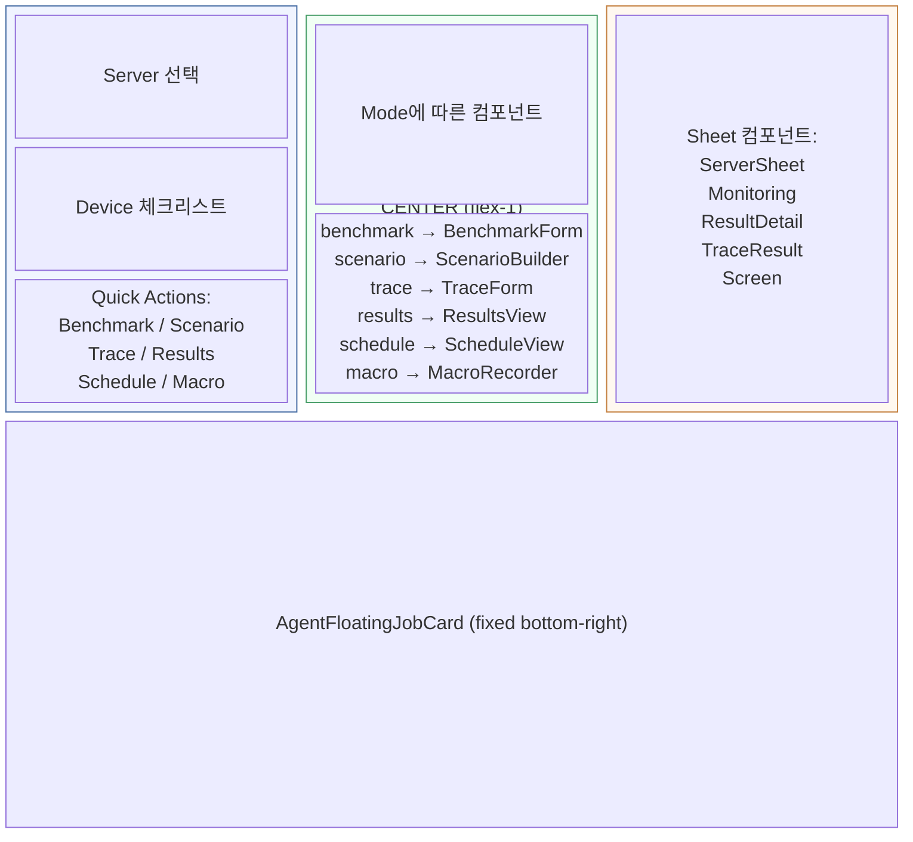

### 7.3 상태 관리 (Svelte 5 Runes)

```typescript
// +page.svelte 전역 상태
let servers = $state([]);              // Agent 서버 목록
let selectedServerId = $state(null);   // 선택된 서버 ID
let devices = $state([]);              // 디바이스 목록
let selectedDeviceIds = $state([]);    // 체크된 디바이스 ID 배열
let centerMode = $state('benchmark');  // 센터 패널 모드
let activeJobs = $state([]);           // 실행 중인 Job 목록
let jobHistory = $state([]);           // 완료된 Job 이력
let activeTraceJobId = $state(null);   // 활성 Trace Job ID
```

**localStorage 영속화**:

| 키 | 값 | 설명 |
|----|----|------|
| `agent:lastServerId` | 숫자 | 마지막 선택한 서버 ID |
| `agent:jobHistory` | JSON 배열 | Job 이력 (최대 100건, FIFO) |

**Trace job 복구**: 새로고침 시 SSE 재연결 대신 `GetJobStatus`로 상태만 확인하여 `activeTraceJobId`를 복원합니다 (벤치마크 SSE와 분리된 독립 메커니즘).

### 7.4 AgentScenarioBuilder — 캔버스 빌더

`@xyflow/svelte` (React Flow의 Svelte 포트)를 사용한 비주얼 시나리오 편집기입니다.

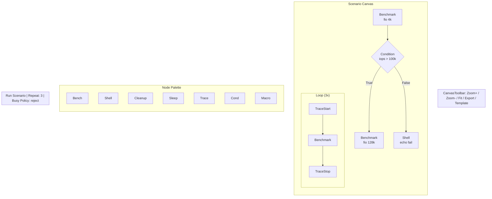

**주요 컴포넌트**:

- **ScenarioCanvas.svelte**: @xyflow/svelte `<SvelteFlow>` 래퍼, 노드/엣지 상태 관리
- **StepNode.svelte**: benchmark/shell/cleanup/sleep/trace_start/trace_stop/app_macro 노드
- **ConditionNode.svelte**: 조건 분기 노드 (다이아몬드 형태, true/false 출력 핸들)
- **LoopGroup.svelte**: step 범위를 감싸는 시각적 그룹 (반복 횟수 표시)
- **NodePalette.svelte**: 드래그 앤 드롭으로 노드 추가
- **CanvasToolbar.svelte**: 줌, 맞춤, 내보내기, 템플릿 로드/저장
- **ExecutionMiniCanvas.svelte**: 실행 중 step 진행 상황을 미니 캔버스로 표시
- **serializer.ts**: 캔버스 노드/엣지 → `RunScenarioRequest` proto 메시지로 직렬화

### 7.5 TraceScatterChart

`TraceScatterChart.svelte` — ECharts 기반 대용량 scatter 차트:

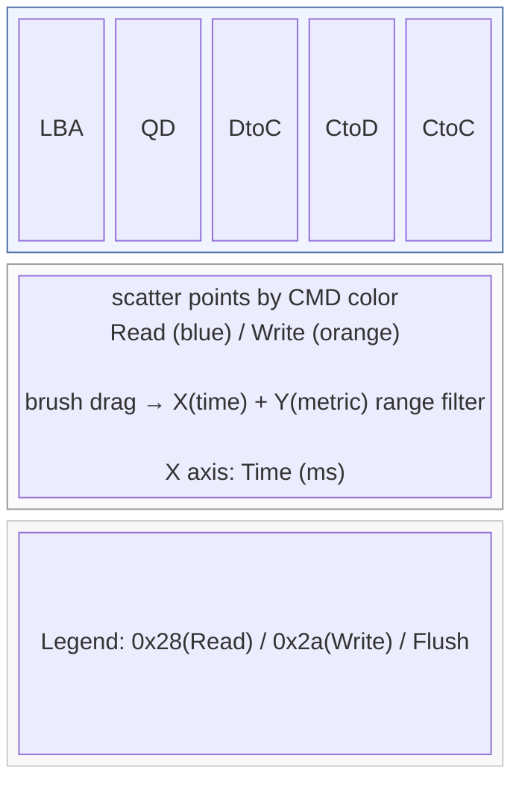

**기능**:

- **brush 드래그**: rect 선택 → X(time) + Y(metric) 범위 추출 → TraceFilter에 반영 → 통계 재조회
- **legend 동기화**: 여러 차트 인스턴스의 cmd 표시 상태를 `legendSelected` $state로 공유
- **대용량 최적화**: `large: true`, `progressive: 5000` 자동 설정
- **컨텍스트 메뉴 줌**: 우클릭으로 zoom-to-selection 또는 reset zoom

**CMD 색상 매핑**:

| 계열 | 키워드 / SCSI Opcode | 색상 |
|------|---------------------|------|
| Read | read, rd, 0x28, 0x88 | 파란색 계열 |
| Write | write, wr, 0x2a, 0x8a | 주황색 계열 |
| Flush | flush, sync, 0x35, 0x91 | 초록색 계열 |
| Discard | discard, trim, unmap, 0x42 | 보라색 계열 |
| Other | 기타 | 회색 계열 |

### 7.6 AgentFloatingJobCard

실행 중인 Job의 진행률을 화면 우하단에 고정 표시하는 플로팅 카드입니다.

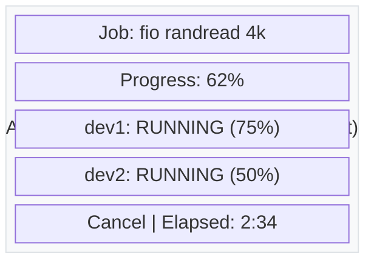

- `position: fixed; bottom: 1rem; right: 1rem`
- SSE `JobProgress` 이벤트로 실시간 업데이트
- 여러 Job 동시 표시 (스택)
- 완료 시 3초 후 자동 사라짐 + 토스트 알림

### 7.7 SSE/EventSource 패턴 (프론트엔드)

```typescript
// 벤치마크 진행 SSE 구독
function subscribeBenchmarkProgress(serverId: number, jobId: string) {
    const es = new EventSource(
        `/api/agent/servers/${serverId}/benchmark/progress/${jobId}`
    );

    es.onmessage = (event) => {
        const progress: JobProgress = JSON.parse(event.data);
        // activeJobs 상태 업데이트
        updateJobProgress(jobId, progress);
    };

    es.addEventListener('complete', () => {
        es.close();
        moveJobToHistory(jobId);
    });

    es.addEventListener('error', (event) => {
        // 재연결 또는 에러 처리
    });

    return es; // cleanup용 반환
}
```

### 7.8 localStorage Job 영속화

```typescript
// 저장
$effect(() => {
    localStorage.setItem('agent:jobHistory',
        JSON.stringify(jobHistory.slice(0, 100))  // 최대 100건
    );
});

// 복원
onMount(() => {
    const saved = localStorage.getItem('agent:jobHistory');
    if (saved) jobHistory = JSON.parse(saved);
});
```

---

## 8. 벤치마크 도구별 옵션

`benchmarkOptions.ts`에 정의된 도구별 파라미터:

### fio

| 구분 | 옵션 | 설명 |
|------|------|------|
| 기본 | bs, rw, size, runtime, numjobs, ioengine, direct, iodepth | 블록 크기, 패턴, 크기, 실행시간 등 |
| 고급 | rwmixread, rwmixwrite, bssplit, zone_size, zone_range, chunk_size, time_based, ramp_time, verify, verify_pattern, rate, rate_iops | 혼합 비율, 블록 분할, 검증 등 |

### iozone

| 구분 | 옵션 |
|------|------|
| 기본 | record_size, file_size, test_type, threads, auto |
| 고급 | min_record, max_record, cache_purge, include_close |

### tiotest

| 구분 | 옵션 |
|------|------|
| 기본 | file_size, block_size, threads, num_runs, directory |
| 고급 | sequential_only, random_only, write_sync, raw_drives |

### iotest (syscall I/O 테스트 엔진)

generic `RunBenchmark` gRPC 에 `BENCHMARK_TOOL_IOTEST` 로 기생하는 syscall DSL 엔진. 일반 벤치마크와 달리 **thread × commands 트리를 JSON configJson 으로 전달**하고, Go Agent 가 각 thread 에 goroutine 을 띄워 `open/pread/pwrite/fsync` 같은 실제 syscall 을 실행합니다.

- `RunBenchmarkRequest.params["config"]` 에 configJson 전체 문자열 주입
- Go Agent executor 가 파싱 → thread 별 goroutine 시작 → syscall 반복
- `SubscribeJobProgress` 스트림으로 thread 별 ThreadProgress 누적 (클라이언트 누적)
- 종료 조건: 모든 thread complete / failed / `duration_seconds` 만료

관리 UI 는 `IOTestEditor` (thread + commands 트리 편집) + `IOTestPreset` 엔티티(`configJson` MEDIUMTEXT) + 내장 18 프리셋. Portal 은 JSON 생성 + 서빙만 하고 실행 로직은 전부 Go Agent 쪽.

**상세**: [iotest L2 (엔진 축 3번째)](/learn/l2-iotest/) · [iotest 가이드](/guide/iotest/)

---

## 9. 화면 스트리밍 (WebSocket 프록시)

scrcpy로 캡처한 Android 화면을 브라우저까지 H.264 비디오로 릴레이합니다.

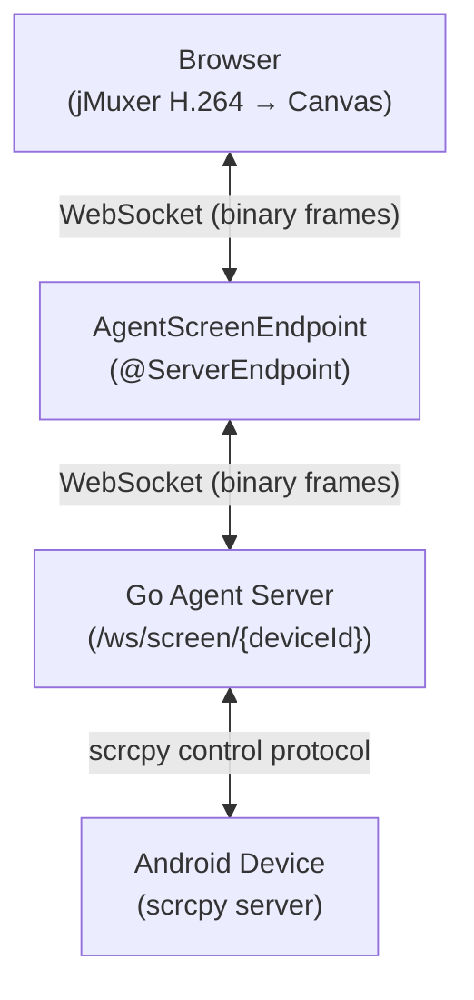

**키프레임 캐시 메커니즘**:

1. Go Agent가 SPS/PPS NAL + IDR 키프레임을 메모리에 캐시
2. 새 WebSocket 연결 시 `requestSync` text 메시지 수신
3. 캐시된 키프레임을 즉시 전송 → 디코더가 바로 첫 프레임 표시
4. 이후 P-frame만 실시간 스트리밍

**입력 릴레이**: 브라우저에서 JSON text 메시지로 터치/키 이벤트 전송 → Go Agent가 scrcpy control protocol로 변환하여 디바이스에 전달

```json
// touch 이벤트 예시
{"type": "touch", "action": "down", "x": 540, "y": 960}

// key 이벤트 예시
{"type": "key", "keycode": 4}  // KEYCODE_BACK
```

---

## 관련 문서

- [Agent 가이드](/guide/agent/) — 사용법, 벤치마크·시나리오·trace·매크로 실전
- [Agent L2](/learn/l2-scenario/) — Orchestration 축, ScenarioCanvas(@xyflow) + Kahn 위상 정렬 + has_branching DAG 실행
- [iotest L2](/learn/l2-iotest/) — 엔진 축 3번째, syscall DSL 엔진
- [L2 19종 비교](/learn/l2-compare/) — Agent 축별 위치 (기능 축, 벤치마크/모니터링/trace)
- [변경 이력](/reference/changelog/) — `2026-04-13 iotest` / `2026-03-30 ScenarioCanvas` 등 Agent 주요 갱신
