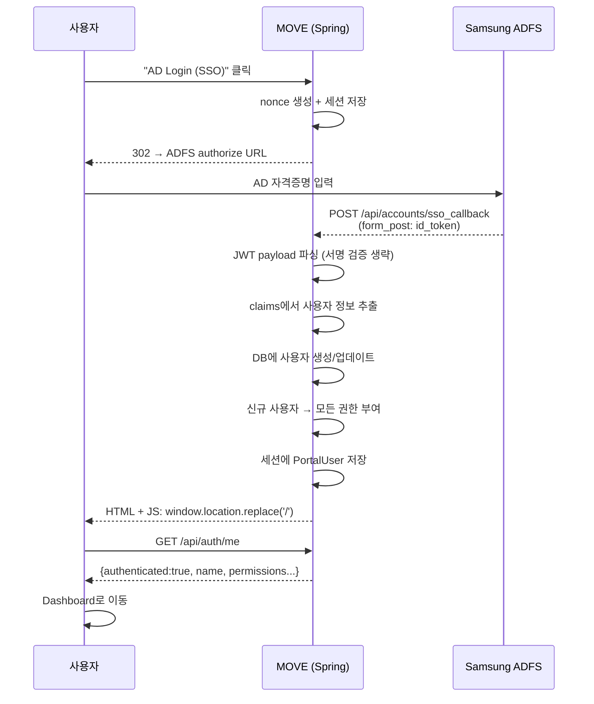
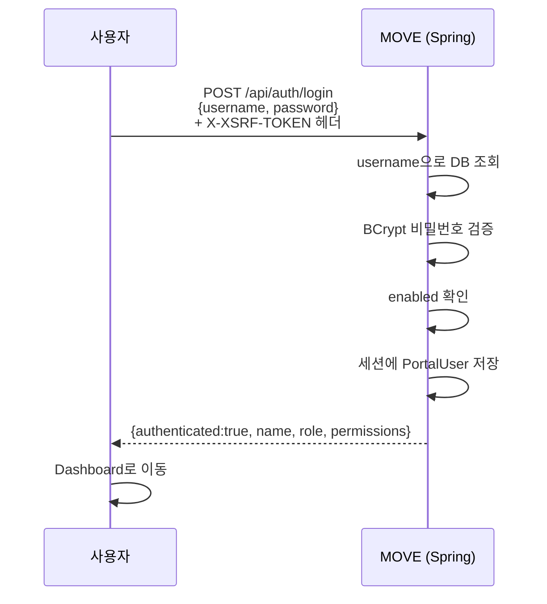
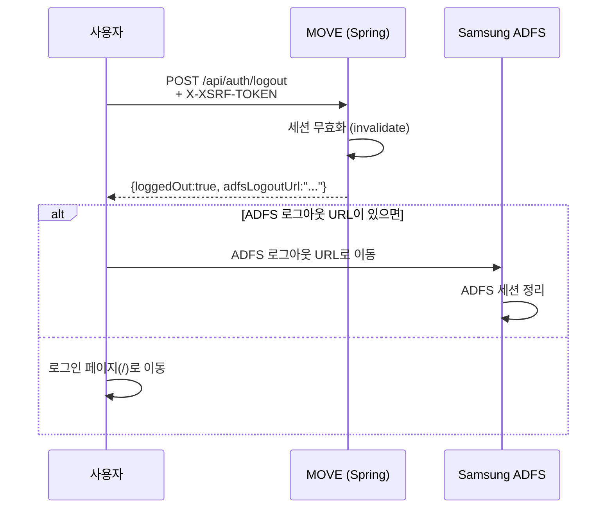

## 전체 구조

```
브라우저 (SvelteKit SPA)
    │   /api/auth/*, JSESSIONID 쿠키, XSRF-TOKEN
    │
Spring Security (CSRF만 활성)
    │
AuthController (세션 기반 인증)
    │
    ├── ADFS SSO (Hybrid Flow, form_post)
    │       Samsung ADFS (stsds.secsso.net/adfs)
    │
    ├── 로컬 로그인 (username + BCrypt password)
    │
    ├── 권한 시스템 (DB 기반, 17개 권한 키)
    │       ActionPermissionInterceptor (URL 패턴 매칭)
    │
    └── 세션 관리 (타임아웃 + 카운트다운 + 자동 로그아웃)
```

MOVE는 **세션 기반 인증**을 사용합니다. Spring Security의 OAuth2 모듈은 사용하지 않고, ADFS와 직접 통신하는 **수동 Hybrid Flow**를 구현했습니다.

---

## 왜 수동 구현인가?

| 고려사항 | Spring OAuth2 Client | 수동 ADFS Hybrid Flow |
|---------|---------------------|----------------------|
| ADFS 호환성 | claim 매핑 복잡 | form_post로 직접 수신 |
| JWT 서명 검증 | jwk-set-uri 필요 | 내부망 신뢰 (생략 가능) |
| 사용자 자동 등록 | 별도 구현 필요 | callback에서 직접 처리 |
| 유연성 | Spring 설정에 의존 | 완전한 제어 가능 |

내부망 환경에서 ADFS 서버를 신뢰할 수 있으므로, JWT 서명 검증을 생략하고 payload만 파싱하는 간결한 방식을 선택했습니다.

---

## 구성 요소

### 백엔드

| 파일 | 역할 |
|------|------|
| `AuthController.java` | 로그인/로그아웃, ADFS 콜백, 세션, 비밀번호 |
| `AdfsCallbackController.java` | ADFS 레거시 콜백 URL 포워딩 |
| `AdfsProperties.java` | ADFS 설정값 (yaml에서 주입) |
| `PortalUser.java` | 사용자 엔티티 |
| `PortalUserService.java` | 사용자 CRUD, 인증, ADFS 연동 |
| `UserPermission.java` | 사용자별 권한 엔티티 |
| `UserPermissionService.java` | 권한 CRUD, 17개 키 관리 |
| `ActionPermission.java` | URL → 권한 매핑 규칙 엔티티 |
| `ActionPermissionInterceptor.java` | 요청 시 URL 패턴으로 권한 검사 |
| `UserHeadAccess.java` | 사용자별 Head 탭 접근 제한 |
| `SessionConfigService.java` | 세션 타임아웃 설정 (인메모리) |
| `SecurityConfig.java` | CSRF 설정, 모든 요청 permitAll |
| `TestInstanceAccessInterceptor.java` | 테스트 인스턴스 접근 제어 |

### 프론트엔드

| 파일 | 역할 |
|------|------|
| `auth.svelte.ts` | 인증 상태 스토어 (로그인/로그아웃/권한) |
| `session.svelte.ts` | 세션 타이머 (카운트다운/경고/자동 로그아웃) |
| `menu.svelte.ts` | 메뉴 가시성 (글로벌 + 권한 기반 필터링) |
| `+layout.svelte` | 인증 게이트, 라우팅, 헤더 |
| `+page.svelte` | 로그인 페이지 (ADFS + 로컬) |

---

## 인증 모드

`portal.auth.disabled` 설정으로 두 가지 모드를 지원합니다.

### 개발 모드 (`portal.auth.disabled: true`)

```yaml
# application.yaml
portal:
  auth:
    disabled: true  # 기본값
```

- 모든 API에 인증 없이 접근 가능
- `/api/auth/me` → 항상 `{authenticated: true, name: "Developer", role: "USER"}` 반환
- 모든 권한 자동 부여
- Admin 페이지는 별도 로그인으로 보호

### 운영 모드 (`portal.auth.disabled: false`)

```yaml
# application-dev.yaml 또는 application-prod.yaml
portal:
  auth:
    disabled: false
```

- ADFS SSO 또는 로컬 로그인 필수
- DB 기반 권한 관리 활성화
- 세션 타임아웃 적용 (기본 120분)

---

## ADFS SSO 로그인

### 설정

```yaml
portal:
  adfs:
    enabled: true
    client-id: YOUR_CLIENT_ID
    authorize-url: https://stsds.secsso.net/adfsouth2/authorize
    redirect-url: https://memo.samsungds.net/api/accounts/sso_callback
    logout-url: https://stsds.secsso.net/adfs/ls/?wa=wsignoutcleanup1.0
    scope: openid profile
```

### 로그인 플로우



### Claims 매핑

ADFS의 JWT payload에서 다음 claims를 추출합니다:

| ADFS Claim | 대체 Claim | DB 컬럼 | 용도 |
|-----------|-----------|---------|------|
| `userid` | `sub` | `adfs_user_id` | **불변 고유 키** (사용자 식별) |
| `loginid` | `upn` | `username` | 로그인 ID (변경 가능) |
| `username` | `commonname` | `display_name` | 화면 표시명 |
| `mail` | `email` | `email` | 이메일 |

:::note[왜 adfsUserId를 별도로 저장하나?]
AD에서 사용자의 `loginid`(사번)가 변경될 수 있습니다. `userid`는 AD 내부 고유 ID로 절대 변경되지 않으므로 이를 기준으로 사용자를 식별합니다. `loginid`가 바뀌어도 같은 사용자로 인식합니다.
:::

### JWT 파싱

```java
// id_token: header.payload.signature
String[] parts = idToken.split("\\.");
String payload = parts[1];  // Base64 URL-safe 디코딩
Map<String, Object> claims = objectMapper.readValue(decoded, Map.class);

String adfsUserId = getStringClaim(claims, "userid");   // 필수
String loginId = getStringClaim(claims, "loginid");     // username
String displayName = getStringClaim(claims, "username");
String email = getStringClaim(claims, "mail");
```

:::caution[서명 검증 생략]
내부망에서 ADFS 서버를 신뢰하므로 JWT 서명 검증을 생략합니다. 외부 인터넷에 노출되는 환경에서는 `jwk-set-uri`를 사용한 서명 검증이 필요합니다.
:::

### 사용자 자동 등록

ADFS 로그인 시 `adfsUserId`로 DB를 조회합니다:

```java
public PortalUser createOrUpdateFromAdfs(String adfsUserId, String loginId,
                                          String displayName, String email) {
    PortalUser existing = repository.findByAdfsUserId(adfsUserId).orElse(null);

    if (existing != null) {
        // 기존 사용자: loginId/displayName/email 변경 시 업데이트
        existing.setUsername(loginId);
        existing.setDisplayName(displayName);
        existing.setEmail(email);
        return repository.save(existing);
    }

    // 신규 사용자: 자동 생성 (password=null, role="USER")
    return repository.save(PortalUser.builder()
            .adfsUserId(adfsUserId)
            .username(loginId)
            .displayName(displayName)
            .email(email)
            .build());
}
```

- **신규 사용자**: `permissionService.grantAllPermissions()` → 17개 권한 모두 부여
- **기존 사용자**: 권한 변경 없음 (관리자가 설정한 권한 유지)
- **password**: null (ADFS 사용자는 로컬 로그인 불가, 폐쇄망용 비밀번호 별도 설정 가능)

---

## 로컬 로그인

ADFS를 사용할 수 없는 환경(폐쇄망 등)을 위한 로컬 로그인입니다.



---

## 로그아웃



백엔드 세션을 먼저 무효화한 후 ADFS 로그아웃을 진행하므로, ADFS에서 돌아와도 자동 로그인이 되지 않습니다.

---

## 세션 관리

### 설정

```yaml
portal:
  session:
    timeout-minutes: 120      # 세션 타임아웃 (기본 120분)
    warn-before-minutes: 5    # 만료 전 경고 (기본 5분)
```

### 동작 방식

```
로그인 성공
    ↓
session.setMaxInactiveInterval(120 * 60)  // 7200초
    ↓
프론트엔드: GET /api/auth/session-info → expiresAt 수신
    ↓
1초마다 tick(): 남은 시간 계산
    ↓
┌─ 남은 시간 > 5분 → 헤더에 "MM:SS" 표시
├─ 남은 시간 ≤ 5분 → 경고 배너 + 연장 버튼
├─ 연장 클릭 → POST /api/auth/session-extend → 타이머 리셋
└─ 남은 시간 = 0 → 자동 로그아웃
```

### 헤더 카운트다운

로그인된 상태에서 헤더 우측에 세션 남은 시간이 표시됩니다:
- 정상: `user01 | 119:42`
- 5분 이하: amber 색상 경고 + 연장 버튼

### Admin에서 설정 변경

Admin → Session Config에서 타임아웃/경고 시간을 변경할 수 있습니다. 인메모리 설정으로, 서버 재시작 시 yaml 기본값으로 복원됩니다.

---

## 권한 시스템

### 개요

MOVE는 **DB 기반 권한 시스템**을 사용합니다. 코드 변경 없이 Admin UI에서 사용자별 권한을 관리할 수 있습니다.

### 권한 키 목록 (17개)

#### 메뉴 권한 (8개)

네비게이션 메뉴의 표시/숨김을 제어합니다.

| 권한 키 | 메뉴 | 설명 |
|--------|------|------|
| `menu:dashboard` | Dashboard | 대시보드 |
| `menu:compatibility` | Compatibility | 호환성 테스트 |
| `menu:performance` | Performance | 성능 테스트 |
| `menu:slots` | Slots | 슬롯 모니터링 |
| `menu:remote` | Remote | 원격 접속 |
| `menu:binMapper` | Bin Mapper | 바이너리 매퍼 |
| `menu:storage` | Storage | 스토리지 관리 |
| `menu:agent` | Agent | 디바이스 에이전트 |

#### 액션 권한 (9개)

특정 기능의 실행 권한을 제어합니다.

| 권한 키 | 기능 | 설명 |
|--------|------|------|
| `action:performance:excel_export` | Excel 내보내기 | 성능 결과 엑셀 다운로드 |
| `action:performance:compare` | 비교 | 성능 결과 비교 |
| `action:remote:connect` | 원격 접속 | RDP/SSH 연결 |
| `action:slots:initslot` | Slot 초기화 | 슬롯 initslot 명령 |
| `action:slots:pre_command` | Pre-Command | 사전 명령어 설정 |
| `action:agent:benchmark` | 벤치마크 | 벤치마크 실행 |
| `action:agent:scenario` | 시나리오 | 시나리오 실행 |
| `action:agent:trace` | Trace | I/O trace 수집 |
| `action:storage:run` | Storage 실행 | Storage 작업 실행 |

### ADMIN 역할의 특수 처리

ADMIN 역할은 **모든 권한이 자동으로 부여**됩니다. DB 조회 없이 코드에서 처리합니다:

```java
// AuthController.me()
if ("ADMIN".equals(user.getRole())) {
    return permissionService.getAllGranted();  // 모든 권한 true
}

// ActionPermissionInterceptor.preHandle()
if ("ADMIN".equals(user.getRole())) return true;  // 무조건 통과
```

### 권한 확인 흐름

```
HTTP 요청 (예: POST /api/agent/benchmark)
    ↓
TestInstanceAccessInterceptor
    ├── testInstance=false → 통과
    └── testInstance=true → "action:global:test-mode" 권한 확인
    ↓
ActionPermissionInterceptor
    ├── auth.disabled=true → 통과
    ├── DB에서 URL 패턴 매칭 규칙 검색
    │     AntPathMatcher: /api/agent/** + POST
    ├── 매칭 규칙 없음 → 통과 (기본 허용)
    ├── 매칭 규칙 있음:
    │     ├── 미로그인 → 403 "로그인이 필요합니다"
    │     ├── ADMIN → 통과
    │     ├── 권한 있음 → 통과
    │     └── 권한 없음 → 403 "권한이 없습니다"
    ↓
Controller 메서드 실행
```

---

## 액션 권한 인터셉터

컨트롤러 코드를 수정하지 않고 DB에서 URL 패턴 → 권한 매핑을 관리합니다.

### DB 테이블

```sql
-- portal_action_permissions
CREATE TABLE portal_action_permissions (
    id BIGINT AUTO_INCREMENT PRIMARY KEY,
    url_pattern VARCHAR(200) NOT NULL,      -- Ant 패턴 (/api/agent/**)
    http_method VARCHAR(10) NOT NULL,       -- GET, POST, PUT, DELETE, *
    permission_key VARCHAR(100) NOT NULL,   -- 필요 권한 키
    description VARCHAR(200),
    enabled BOOLEAN DEFAULT true
);
```

### URL 패턴 예시

| url_pattern | http_method | permission_key | 설명 |
|------------|------------|----------------|------|
| `/api/agent/benchmark` | `POST` | `action:agent:benchmark` | 벤치마크 실행 |
| `/api/agent/scenario` | `POST` | `action:agent:scenario` | 시나리오 실행 |
| `/api/performance-results/*/excel` | `GET` | `action:performance:excel_export` | Excel 다운로드 |

### 규칙 로드

```java
@PostConstruct
public void loadRules() {
    rules.clear();
    rules.addAll(actionPermissionRepository.findByEnabledTrue());
    // CopyOnWriteArrayList로 thread-safe
}

// Admin에서 규칙 변경 시
public void reloadRules() {
    loadRules();  // DB에서 다시 로드
}
```

---

## Head 탭 접근 제한

사용자별로 접근 가능한 Head(장비 연결)를 제한할 수 있습니다.

### 동작 규칙

| 상태 | 동작 |
|------|------|
| 매핑 없음 | 모든 Head 접근 가능 (기본) |
| 매핑 있음 | 등록된 Head만 표시 |
| ADMIN | 항상 모든 Head 접근 가능 |

### API

```
GET  /api/admin/users/{id}/head-access     → [1, 3, 5] (허용된 Head ID 목록)
PUT  /api/admin/users/{id}/head-access     ← [1, 3, 5] (업데이트)
```

---

## 비밀번호 설정

### 첫 비밀번호 설정 (needsPassword)

ADFS로 자동 생성된 사용자는 `password`가 null입니다. 폐쇄망에서 로컬 로그인이 필요한 경우 비밀번호를 설정해야 합니다.

```
fetchMe() 응답: {needsPassword: true}
    ↓
프론트엔드: PasswordChangeDialog 표시 (배너)
    ↓
사용자: 새 비밀번호 입력 (4자 이상)
    ↓
PUT /api/auth/password
    {currentPassword: null, newPassword: "****"}
    ↓
BCrypt 암호화 후 DB 저장
    ↓
needsPassword: false → 배너 숨김
```

### 비밀번호 변경

기존 비밀번호가 있는 경우 `currentPassword` 검증 후 변경합니다.

---

## 테스트 인스턴스

테스트 DB를 사용하는 별도 인스턴스의 접근을 제한합니다.

### 설정

```yaml
portal:
  test-instance: true     # 테스트 인스턴스 활성화
  auth:
    disabled: false        # 인증 활성화 (필수)
```

### 동작

- `test-instance: true` + `auth.disabled: false`일 때만 동작
- `action:global:test-mode` 권한이 있는 사용자만 접근 가능
- ADMIN은 항상 접근 가능
- UI에 주황색 "TEST MODE" 배너 표시

---

## CSRF 보호

SPA에서는 쿠키 기반 CSRF 보호 방식을 사용합니다.

### 동작 방식

```
1. Spring → 브라우저: XSRF-TOKEN 쿠키 설정 (httpOnly: false)
2. SPA: document.cookie에서 XSRF-TOKEN 값 읽기
3. POST/PUT/DELETE 요청 시: X-XSRF-TOKEN 헤더에 토큰 포함
4. Spring: 쿠키 값과 헤더 값 비교 → 일치하면 허용
```

### CSRF 예외

ADFS 콜백은 외부(ADFS 서버)에서 POST 요청이 오므로 CSRF 검사를 제외합니다:

```java
csrf.ignoringRequestMatchers(
    "/api/auth/adfs/callback",
    "/api/accounts/sso_callback"
)
```

### 프론트엔드 적용

```typescript
function getCsrfToken(): string {
    const match = document.cookie.match(/XSRF-TOKEN=([^;]+)/);
    return match ? decodeURIComponent(match[1]) : '';
}

// 모든 상태 변경 요청에 헤더 추가
fetch('/api/auth/login', {
    method: 'POST',
    headers: {
        'Content-Type': 'application/json',
        'X-XSRF-TOKEN': getCsrfToken()
    },
    body: JSON.stringify({ username, password })
});
```

---

## DB 스키마

### portal_users

| 컬럼 | 타입 | 설명 |
|------|------|------|
| `id` | BIGINT PK | |
| `username` | VARCHAR(100) UNIQUE | 로그인 ID |
| `adfs_user_id` | VARCHAR(100) UNIQUE | ADFS 고유 ID (불변) |
| `password` | VARCHAR(255) NULL | BCrypt (null이면 로컬 로그인 불가) |
| `display_name` | VARCHAR(100) | 화면 표시명 |
| `email` | VARCHAR(200) | |
| `role` | VARCHAR(20) | `USER` 또는 `ADMIN` |
| `enabled` | BOOLEAN | 활성화 여부 |
| `created_at` | TIMESTAMP | |
| `updated_at` | TIMESTAMP | |

### portal_user_permissions

| 컬럼 | 타입 | 설명 |
|------|------|------|
| `id` | BIGINT PK | |
| `user_id` | BIGINT | → portal_users.id |
| `permission_key` | VARCHAR(100) | 권한 키 |
| `granted` | BOOLEAN | 허용 여부 |
| `created_at` | TIMESTAMP | |
| `updated_at` | TIMESTAMP | |
| | **UNIQUE** | (user_id, permission_key) |

### portal_action_permissions

| 컬럼 | 타입 | 설명 |
|------|------|------|
| `id` | BIGINT PK | |
| `url_pattern` | VARCHAR(200) | Ant 패턴 |
| `http_method` | VARCHAR(10) | GET/POST/PUT/DELETE/* |
| `permission_key` | VARCHAR(100) | 필요 권한 키 |
| `description` | VARCHAR(200) | |
| `enabled` | BOOLEAN | |

### portal_user_head_access

| 컬럼 | 타입 | 설명 |
|------|------|------|
| `id` | BIGINT PK | |
| `user_id` | BIGINT | → portal_users.id |
| `head_connection_id` | BIGINT | → HeadConnection.id |
| | **UNIQUE** | (user_id, head_connection_id) |

---

## API 레퍼런스

### 인증

| 메서드 | 경로 | 설명 |
|--------|------|------|
| `GET` | `/api/auth/me` | 현재 사용자 정보 + 권한 |
| `POST` | `/api/auth/login` | 로컬 로그인 |
| `POST` | `/api/auth/logout` | 로그아웃 |
| `GET` | `/api/auth/adfs/login` | ADFS SSO 시작 |
| `POST` | `/api/auth/adfs/callback` | ADFS 콜백 (form_post) |
| `PUT` | `/api/auth/password` | 비밀번호 변경 |
| `GET` | `/api/auth/session-info` | 세션 정보 (만료 시간) |
| `POST` | `/api/auth/session-extend` | 세션 연장 |
| `GET` | `/api/auth/login-url` | ADFS 로그인 URL 조회 |

### 권한 관리 (Admin)

| 메서드 | 경로 | 설명 |
|--------|------|------|
| `GET` | `/api/admin/users` | 사용자 목록 |
| `POST` | `/api/admin/users` | 사용자 생성 |
| `PUT` | `/api/admin/users/{id}` | 사용자 수정 |
| `DELETE` | `/api/admin/users/{id}` | 사용자 삭제 |
| `PUT` | `/api/admin/users/{id}/password` | 비밀번호 설정 |
| `GET` | `/api/admin/users/{id}/permissions` | 사용자 권한 조회 |
| `PUT` | `/api/admin/users/{id}/permissions` | 사용자 권한 업데이트 |
| `GET` | `/api/admin/users/{id}/head-access` | Head 접근 권한 조회 |
| `PUT` | `/api/admin/users/{id}/head-access` | Head 접근 권한 업데이트 |
| `GET` | `/api/admin/permissions/defaults` | 전체 권한 키 목록 |
| `GET` | `/api/admin/session-config` | 세션 설정 조회 |
| `PUT` | `/api/admin/session-config` | 세션 설정 변경 |

### /api/auth/me 응답 예시

```json
{
  "authenticated": true,
  "name": "홍길동",
  "email": "hong@samsung.com",
  "role": "USER",
  "username": "honggd",
  "needsPassword": false,
  "testInstance": false,
  "permissions": {
    "menu:dashboard": true,
    "menu:compatibility": true,
    "menu:performance": true,
    "menu:slots": false,
    "menu:remote": true,
    "menu:binMapper": false,
    "menu:storage": true,
    "menu:agent": true,
    "action:performance:excel_export": true,
    "action:performance:compare": true,
    "action:remote:connect": true,
    "action:slots:initslot": false,
    "action:slots:pre_command": false,
    "action:agent:benchmark": true,
    "action:agent:scenario": true,
    "action:agent:trace": true,
    "action:storage:run": true
  }
}
```

---

## 프론트엔드 인증 상태

### auth store

```typescript
export const auth = {
    // 상태
    authenticated: boolean,    // 로그인 여부
    name: string,              // 표시명
    role: string,              // "USER" | "ADMIN"
    username: string,          // 로그인 ID
    loading: boolean,          // 초기 확인 중
    needsPassword: boolean,    // 비밀번호 설정 필요
    permissions: Record<string, boolean>,
    isTestInstance: boolean,

    // 권한 확인
    hasPermission(key): boolean,  // ADMIN이면 항상 true
    hasMenu(menuId): boolean,     // hasPermission('menu:' + menuId)
    hasAction(menu, action): boolean,  // hasPermission('action:menu:action')

    // 액션
    fetchMe(),           // GET /api/auth/me
    login(user, pass),   // POST /api/auth/login
    logout(),            // POST /api/auth/logout + ADFS 로그아웃
    redirectToLogin(),   // → /api/auth/adfs/login
};
```

### 라우팅 로직 (+layout.svelte)

```
onMount → auth.fetchMe()
    ↓
├── loading 중: 빈 화면
├── authenticated=false + pathname='/': 로그인 페이지
├── authenticated=false + pathname!='/': → '/'로 redirect
├── authenticated=true + pathname='/': → 첫 번째 visible 메뉴로 redirect
└── authenticated=true: 메인 레이아웃
    ├── visibleMenuItems = 권한 기반 필터링
    ├── 현재 경로가 비활성 메뉴 → 첫 visible 메뉴로 redirect
    └── visible 메뉴 없음 → "권한이 없습니다" 안내
```

### 메뉴 가시성 결정

```typescript
menuStore.isVisible(menuId) {
    if (auth.isAdmin) return true;              // ADMIN 항상 표시
    if (!items[menuId].visible) return false;    // 글로벌 숨김
    return auth.hasMenu(menuId);                 // 사용자 권한
}
```
