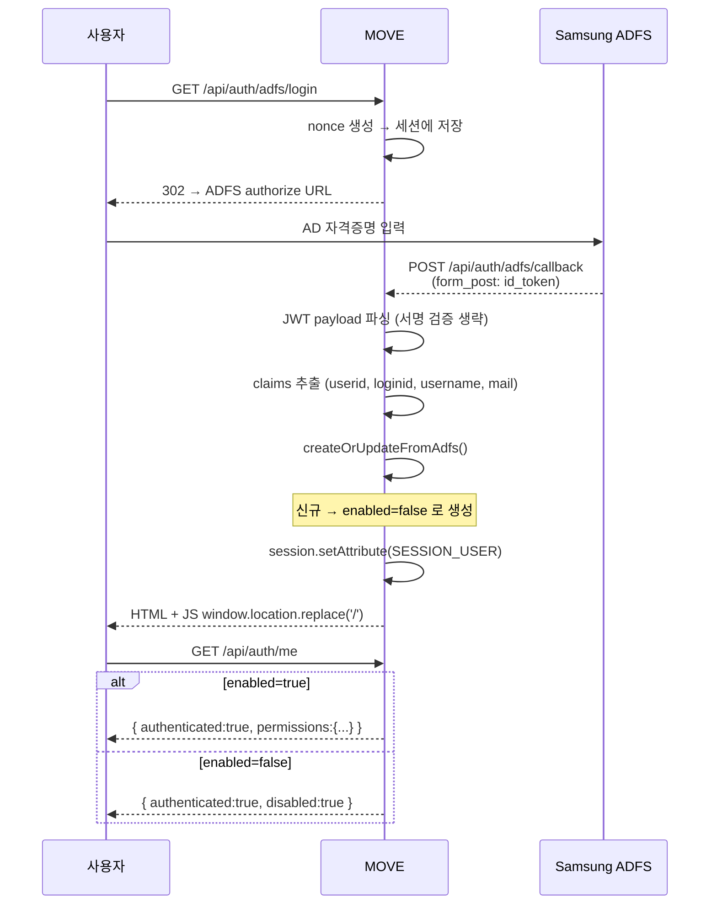
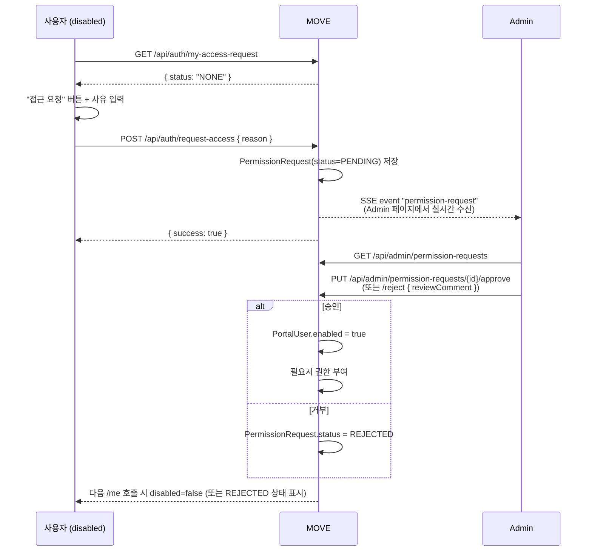

MOVE는 **세션 기반 인증** + **DB 기반 권한 관리**를 사용합니다. Spring Security의 OAuth2 Client는 사용하지 않고 ADFS와 직접 통신하는 **수동 Hybrid Flow**를 구현했습니다.

이 문서는 다섯 개의 축으로 정리되어 있습니다.

1. [인증 (로그인/세션)](#1-인증)
2. [승인 게이트 — 신규 사용자 disabled + 접근 요청](#2-승인-게이트)
3. [액션 권한 — URL 패턴 → 권한 키](#3-액션-권한)
4. [Row별 접근 제한 — Head](#4-row별-접근-제한--head)
5. [Admin 실시간 알림 (SSE)](#5-admin-실시간-알림)

---

## 전체 흐름

```
  브라우저 (SvelteKit SPA)
      │   JSESSIONID, XSRF-TOKEN 쿠키
      ▼
  Spring (CSRF on, permitAll)
      │
      ├── [1] ADFS Hybrid Flow / 로컬 로그인 → HttpSession 저장
      │         신규 사용자 → enabled=false (승인 대기)
      │
      ├── [2] /api/auth/me
      │         ├── enabled=true  → 권한 포함 사용자 정보 반환
      │         └── enabled=false → {authenticated:true, disabled:true}
      │
      ├── [3] ActionPermissionInterceptor (/api/**)
      │         ├── disabled 사용자     → 403 USER_DISABLED (접근 요청 API만 통과)
      │         ├── URL 매핑 있음 + 권한 X → 403 + Admin SSE 알림
      │         └── URL 매핑 없음       → 통과 (기본 허용)
      │
      └── [4] HeadSseController
                UserHeadAccess 매핑 있으면 허용된 Head만 노출
```

핵심 원칙:

- **disabled는 게이트**, 메뉴/액션 권한은 **세부 권한** — 계층이 다름. disabled 사용자는 권한 체크 이전에 차단.
- 신규 ADFS 사용자는 **기본 disabled** — 관리자가 "활성화"를 명시적으로 승인한 뒤에야 API 접근 가능.
- 권한 매핑에 없는 URL은 **기본 허용** — 인터셉터는 allow-list가 아닌 deny-by-pattern.

---

## 1. 인증

### 실행 모드

`portal.auth.disabled` 플래그로 세 모드가 분기됩니다.

```yaml
portal:
  auth:
    disabled: true   # 로컬 개발: 모든 /api 통과, 가상 Developer 사용자
    # disabled: false + adfs.enabled: false  → 로컬 로그인만
    # disabled: false + adfs.enabled: true   → 실 ADFS + 인터셉터 전면 가동
```

| 모드 | /api/auth/me | 권한 체크 |
|------|--------------|----------|
| `disabled: true` | 항상 `Developer` + 전체 권한 | 인터셉터 전체 통과 |
| `disabled: false` + adfs off | 세션 없으면 `authenticated:false` | 인터셉터 가동 |
| `disabled: false` + adfs on | 실 ADFS 플로우 | 인터셉터 가동 |

로컬 개발·CI·프로덕션이 **같은 코드로 세 모드**를 돈다.

### ADFS Hybrid Flow



#### Claims 매핑

| ADFS claim | 대체 claim | DB 컬럼 | 용도 |
|-----------|-----------|---------|------|
| `userid` | `sub` | `adfs_user_id` | **불변 고유 키** (사용자 식별) |
| `loginid` | `upn` | `username` | 로그인 ID (변경 가능) |
| `username` | `commonname` | `display_name` | 화면 표시명 |
| `mail` | `email` | `email` | 이메일 |

:::note[왜 adfsUserId를 별도로 저장하나?]
AD에서 사용자의 `loginid`(사번)가 변경될 수 있습니다. `userid`는 AD 내부 고유 ID로 절대 변경되지 않으므로 이를 기준으로 사용자를 식별하고, `loginid` 변경을 허용해도 같은 사용자로 인식합니다.
:::

:::caution[서명 검증 생략]
내부망에서 ADFS 서버를 신뢰하므로 JWT 서명 검증을 생략합니다. 외부망에 노출되는 환경에서는 `jwk-set-uri`를 사용한 서명 검증이 필요합니다.
:::

### 로컬 로그인

ADFS가 없는 폐쇄망을 위한 username/password 로그인. 내부적으로는 **ADFS에서 자동 생성된 사용자에게 관리자가 비밀번호를 부여**한 경우를 전제로 합니다(신규 생성 경로 없음).

```
POST /api/auth/login  { username, password }  + X-XSRF-TOKEN
  ↓
PortalUserService.authenticate()
  ├── user == null || !user.isEnabled() → null
  ├── password == null/blank            → null  (비밀번호 미설정 계정)
  └── BCrypt.matches(password, hash)    → user
  ↓
session.setAttribute(SESSION_USER, user)
  ↓
{ authenticated:true, name, role, permissions }
```

### 세션

```yaml
portal:
  session:
    timeout-minutes: 120      # 기본 120분
    warn-before-minutes: 5    # 만료 5분 전부터 경고
```

- `HttpSession.setMaxInactiveInterval()`로 Servlet 표준 타임아웃 사용.
- 프론트는 `GET /api/auth/session-info`로 `expiresAt`을 받아 1초마다 카운트다운.
- 5분 이하 남으면 경고 배너 + 연장 버튼 → `POST /api/auth/session-extend`.
- 0 도달 시 자동 로그아웃.

:::note[Admin 변경의 휘발성]
`SessionConfigService`는 **인메모리** 저장. Admin UI에서 바꾼 값은 서버 재시작 시 `application.yaml` 기본값으로 복원됩니다.
:::

### 로그아웃

```
POST /api/auth/logout  + X-XSRF-TOKEN
  ↓
session.invalidate()
  ↓
{ loggedOut:true, adfsLogoutUrl: "..." }    ← 설정되어 있으면
  ↓
프론트 → adfsLogoutUrl 로 이동 (ADFS 세션까지 정리)
```

백엔드 세션을 먼저 끊은 뒤 ADFS 로그아웃을 진행하므로 ADFS에서 돌아와도 자동 로그인이 되지 않습니다.

---

## 2. 승인 게이트

**신규 ADFS 사용자는 자동으로 `enabled=false`** 로 생성됩니다. 관리자가 승인할 때까지 모든 `/api/**` 호출이 차단됩니다.

### 신규 사용자 생성 (PortalUserService.createOrUpdateFromAdfs)

```java
// 기존 사용자: loginId/displayName/email만 업데이트 (enabled 건드리지 않음)
if (existing != null) {
    // ...
    return repository.save(existing);
}

// 신규 사용자: 무조건 disabled
return repository.save(PortalUser.builder()
        .username(loginId)
        .adfsUserId(adfsUserId)
        .password(null)
        .displayName(displayName)
        .email(email)
        .role("USER")
        .enabled(false)      // ← 핵심
        .build());
```

이전에는 신규 사용자에게 **모든 권한 자동 부여**했지만, 이 로직은 제거되었습니다(관리자 승인 플로우와 충돌). 관리자가 승인할 때만 권한이 부여됩니다.

### /api/auth/me 응답 분기

| 세션 사용자 상태 | 응답 |
|------------------|------|
| 없음 | `{ authenticated: false }` |
| DB에 없음 (삭제됨) | `{ authenticated: false }` + 세션 제거 |
| `enabled=false` | `{ authenticated: true, disabled: true, permissions: {} }` |
| `enabled=true` | `{ authenticated: true, name, role, permissions, ... }` |

:::caution[disabled 사용자도 세션은 유지]
과거에는 disabled 사용자의 세션을 제거해 `authenticated:false` 로 응답했으나, 이 경우 프론트가 로그인 페이지로 튕겨 **"접근 권한 없음" 화면이 보이지 않는** 버그가 있었습니다. 지금은 세션을 유지하고 `disabled:true` 플래그로 프론트에 전달해, 접근 요청 화면을 띄웁니다.
:::

### ActionPermissionInterceptor의 전면 차단

```java
// disabled 사용자는 권한 룰 매칭 이전에 전면 차단
HttpSession session = request.getSession(false);
PortalUser sessionUser = (session != null)
        ? (PortalUser) session.getAttribute("portalUser") : null;
if (sessionUser != null && !sessionUser.isEnabled()) {
    response.setStatus(403);
    response.getWriter().write(
        "{\"code\":\"USER_DISABLED\",\"error\":\"관리자 승인이 필요합니다\"}");
    return false;
}
```

**중요**: interceptor는 `/api/auth/**` 를 `excludePathPatterns` 로 제외하므로, disabled 사용자도 `/api/auth/me`, `/api/auth/logout`, `/api/auth/my-access-request`, `/api/auth/request-access`는 호출 가능. 이게 접근 요청 화면이 동작하는 근거.

### 프론트 라우팅

```ts
// +layout.svelte
$effect(() => {
    if (!auth.loading && auth.authenticated && auth.disabled) {
        noPermission = true;
        loadAccessRequestStatus();
    }
});
```

disabled인 경우 **경로와 무관하게** "접근 권한이 없습니다" 화면 + 접근 요청 UI로 고정.

### 접근 요청 플로우



### 접근 요청 상태 (GET /api/auth/my-access-request)

| 상태 | 응답 | 프론트 표시 |
|------|------|-------------|
| PENDING 요청 있음 | `{ status:"PENDING", reason, createdAt }` | "승인 대기 중" 화면 |
| REJECTED 요청이 최근에 있음 | `{ status:"REJECTED", reviewComment, reviewedAt }` | "거부됨" + 재요청 버튼 |
| 없음 | `{ status:"NONE" }` | "접근 요청" 버튼 |

중복 PENDING 요청은 백엔드에서 막음 (`"이미 접근 요청이 대기 중입니다"`).

---

## 3. 액션 권한

**메뉴 가시성**과 **액션 실행 권한**을 하나의 키 체계(`menu:*`, `action:*`)로 관리합니다.

### 권한 키 카탈로그

| 카테고리 | 대표 키 | 설명 |
|---------|---------|------|
| 메뉴 | `menu:dashboard`, `menu:compatibility`, `menu:performance`, `menu:slots`, `menu:remote`, `menu:binMapper`, `menu:storage`, `menu:agent` | 네비게이션 표시/숨김 |
| 액션 | `action:performance:excel_export`, `action:performance:compare`, `action:remote:connect`, `action:slots:initslot`, `action:slots:pre_command`, `action:agent:benchmark`, `action:agent:scenario`, `action:agent:trace`, `action:storage:run` | 기능 실행 |
| 글로벌 | `action:global:test-mode` | 테스트 인스턴스 접근 |

전체 키는 `GET /api/admin/permissions/defaults` 로 조회 가능.

### ADMIN의 특수 처리

ADMIN 역할은 DB 조회 없이 **코드에서 무조건 통과**:

```java
// AuthController.me()
if ("ADMIN".equals(user.getRole())) return permissionService.getAllGranted();

// ActionPermissionInterceptor.preHandle()
if ("ADMIN".equals(user.getRole())) return true;
```

### ActionPermission: URL → 권한 키 매핑

컨트롤러 코드를 바꾸지 않고 **DB 테이블**로 URL별 필요 권한을 선언합니다.

```sql
CREATE TABLE portal_action_permissions (
    id BIGINT AUTO_INCREMENT PRIMARY KEY,
    url_pattern VARCHAR(200) NOT NULL,      -- Ant 패턴
    http_method VARCHAR(10) NOT NULL,       -- GET/POST/PUT/DELETE/*
    permission_key VARCHAR(100) NOT NULL,
    description VARCHAR(200),
    enabled BOOLEAN DEFAULT true
);
```

예시:

| url_pattern | method | permission_key |
|-------------|--------|----------------|
| `/api/agent/benchmark` | POST | `action:agent:benchmark` |
| `/api/agent/scenario` | POST | `action:agent:scenario` |
| `/api/performance-results/*/excel` | GET | `action:performance:excel_export` |
| `/api/remote/connect/**` | POST | `action:remote:connect` |

### 체크 흐름

```
HTTP 요청
  ↓
TestInstanceAccessInterceptor (test-instance=true 일 때만)
  └── action:global:test-mode 체크
  ↓
ActionPermissionInterceptor
  ├── portal.auth.disabled=true      → 통과
  ├── 세션 사용자 disabled          → 403 USER_DISABLED
  ├── URL 패턴에 매칭되는 룰 없음   → 통과 (기본 허용)
  ├── 미로그인 (세션 없음)           → 403 "로그인이 필요합니다"
  ├── ADMIN                         → 통과
  ├── 권한 있음                     → 통과
  └── 권한 없음                     → 403 + notifyPermissionDenied() SSE
```

**기본 허용** 설계: 모든 URL을 테이블에 등록할 필요 없이, **제한이 필요한 것만** 등록. 점진적 권한 강화 가능.

### 룰 로드

```java
@PostConstruct
public void loadRules() {
    rules.clear();
    rules.addAll(actionPermissionRepository.findByEnabledTrue());
}

// Admin UI에서 룰 변경 시
public void reloadRules() { loadRules(); }
```

`rules`는 `CopyOnWriteArrayList` — thread-safe 런타임 교체.

### 프론트 권한 활용

```ts
// auth store
auth.hasPermission('menu:slots')            // boolean
auth.hasMenu('slots')                       // hasPermission('menu:slots')
auth.hasAction('agent', 'benchmark')        // hasPermission('action:agent:benchmark')

// ADMIN은 항상 true
if (auth.role === 'ADMIN') return true;
```

메뉴 필터링 (`menuStore.isVisible`):

```ts
if (auth.isAdmin) return true;              // ADMIN 우선
if (!items[menuId].visible) return false;   // 글로벌 숨김
return auth.hasMenu(menuId);                // 사용자 권한
```

### 비밀번호 재설정 (needsPassword)

ADFS 신규 사용자는 `password=null` 이라 로컬 로그인 불가. 폐쇄망용이 필요하면 `/me` 응답의 `needsPassword:true` 를 보고 프론트가 `PasswordChangeDialog` 배너를 띄우고 `PUT /api/auth/password` 호출.

---

## 4. Row별 접근 제한 — Head

Head TCP 연결(`HeadConnection`)은 **사용자별로 개별 row 허용/차단**이 가능합니다. 권한 키(`menu:*`, `action:*`)와는 별개의 **화이트리스트** 축.

### 테이블

```sql
CREATE TABLE portal_user_head_access (
    id BIGINT AUTO_INCREMENT PRIMARY KEY,
    user_id BIGINT NOT NULL,
    head_connection_id BIGINT NOT NULL,
    UNIQUE (user_id, head_connection_id)
);
```

### 판정 규칙

| 매핑 상태 | 결과 |
|----------|------|
| 레코드 **없음** | **전체 허용** (기본) |
| 레코드 **있음** | 등록된 Head만 노출 |
| `ADMIN` | 항상 전체 허용 (매핑 무시) |

```java
// HeadSseController — /api/head/connections
if (!admin) {
    List<UserHeadAccess> accessList =
        userHeadAccessRepository.findByUserId(user.getId());
    if (accessList.isEmpty()) return;   // 매핑 없으면 전체 허용
    Set<String> allowedNames = toHeadNames(accessList);
    statuses.removeIf(s -> !allowedNames.contains(s.get("name")));
}
```

### Admin UI

사용자 편집 다이얼로그에서:

- "전체 허용" 체크박스 — 체크 시 개별 Head 체크박스 비활성화 (표현: "제한 없음")
- 해제하면 **각 Head 개별 체크박스** 활성화 — row별 선택

저장 시 선택된 head_connection_id 배열이 `PUT /api/admin/users/{id}/head-access` 로 전송. **빈 배열 = 전체 허용**.

```ts
// admin/+page.svelte
let headAccessIds = $state<number[]>([]);
let headAccessAll = $derived(headAccessIds.length === 0);
```

### 접근 거부 알림

disabled 권한 거부와 별개로, `/api/head/connections` 외의 직접 TCP/SSE 경로에서 접근 차단이 발생하면 Admin에게 `head-access-denied` SSE 이벤트가 전송됩니다(§5 참조).

---

## 5. Admin 실시간 알림

관리자 페이지는 `/api/admin/notifications/stream` SSE에 구독하여 인증/권한 이벤트를 실시간 수신합니다.

### 이벤트 종류

| 이벤트 | 발생 시점 | 페이로드 |
|-------|----------|----------|
| `init` | 연결 직후 | `{ pendingCount }` |
| `permission-request` | 사용자가 접근 요청 제출 | `{ pendingCount, username, displayName, reason }` |
| `permission-request-resolved` | Admin이 요청 승인/거부 | `{ pendingCount }` |
| `permission-denied` | 권한 없는 URL 호출 시 | `{ username, displayName, permissionKey, uri, method }` |
| `head-access-denied` | Head 접근 차단 시 | `{ username, displayName, headName }` |

### 프론트 수신

```ts
// +layout.svelte (ADMIN만)
const es = new EventSource('/api/admin/notifications/stream');
es.addEventListener('permission-request', (e) => {
    const data = JSON.parse(e.data);
    pendingRequestCount = data.pendingCount;
    toast.info(`접근 요청: ${data.displayName ?? data.username}`, {
        description: data.reason ?? '사유 없음',
        action: { label: '확인', onClick: () => goto('/admin?tab=permission-requests') }
    });
});

es.onerror = () => {
    es.close();
    setTimeout(connectAdminNotifications, 5000);   // 자동 재연결
};
```

네비게이션 헤더의 Admin 메뉴에 **PENDING 건수 배지**가 실시간 갱신됩니다.

---

## CSRF

쿠키 기반 CSRF:

```
Spring → 브라우저: XSRF-TOKEN 쿠키 (httpOnly: false)
SPA: document.cookie에서 값 읽기
POST/PUT/DELETE: X-XSRF-TOKEN 헤더에 토큰 포함
Spring: 쿠키 값 ↔ 헤더 값 일치 시 허용
```

예외 경로(외부에서 POST가 들어오므로 검사 제외):

```java
csrf.ignoringRequestMatchers(
    "/api/auth/adfs/callback",
    "/api/accounts/sso_callback"
);
```

프론트 유틸:

```ts
function getCsrfToken(): string {
    const match = document.cookie.match(/XSRF-TOKEN=([^;]+)/);
    return match ? decodeURIComponent(match[1]) : '';
}
```

---

## 테스트 인스턴스

테스트 DB 인스턴스 접근을 추가로 제한하는 2차 게이트.

```yaml
portal:
  test-instance: true
  auth:
    disabled: false
```

- `test-instance: true` + `auth.disabled: false` 조합에서만 동작.
- `action:global:test-mode` 권한 보유자만 접근. ADMIN은 항상 통과.
- UI에 주황색 "TEST MODE" 배너 표시.

---

## DB 스키마

### portal_users

| 컬럼 | 타입 | 설명 |
|------|------|------|
| `id` | BIGINT PK | |
| `username` | VARCHAR(100) UNIQUE | 로그인 ID |
| `adfs_user_id` | VARCHAR(100) UNIQUE | ADFS 고유 ID (불변) |
| `password` | VARCHAR(255) NULL | BCrypt, null이면 로컬 로그인 불가 |
| `display_name` | VARCHAR(100) | 화면 표시명 |
| `email` | VARCHAR(200) | |
| `role` | VARCHAR(20) | `USER` or `ADMIN` |
| `enabled` | BOOLEAN | **신규 ADFS 사용자는 false로 생성** |
| `created_at`, `updated_at` | TIMESTAMP | |

### portal_user_permissions

(user_id, permission_key) UNIQUE. `granted` boolean.

### portal_action_permissions

url_pattern + http_method + permission_key.

### portal_user_head_access

(user_id, head_connection_id) UNIQUE. row 존재가 곧 허용.

### portal_permission_requests

| 컬럼 | 설명 |
|------|------|
| `id` | |
| `user_id` | 요청자 |
| `reason` | 사유 (nullable) |
| `status` | `PENDING` / `APPROVED` / `REJECTED` |
| `review_comment` | 관리자 코멘트 |
| `reviewed_at`, `reviewed_by` | 처리 메타 |
| `created_at` | |

---

## API 레퍼런스

### 사용자 자신

| 메서드 | 경로 | 설명 |
|--------|------|------|
| `GET` | `/api/auth/me` | 현재 사용자 + 권한 + `disabled` 플래그 |
| `POST` | `/api/auth/login` | 로컬 로그인 |
| `POST` | `/api/auth/logout` | 로그아웃 (+ ADFS 로그아웃 URL 반환) |
| `GET` | `/api/auth/adfs/login` | ADFS SSO 시작 |
| `POST` | `/api/auth/adfs/callback` | ADFS 콜백 (form_post) |
| `PUT` | `/api/auth/password` | 비밀번호 변경 |
| `GET` | `/api/auth/session-info` | 세션 만료 시각 |
| `POST` | `/api/auth/session-extend` | 세션 연장 |
| `GET` | `/api/auth/login-url` | ADFS 로그인 URL |
| `GET` | `/api/auth/my-access-request` | 내 접근 요청 상태 (PENDING/REJECTED/NONE) |
| `POST` | `/api/auth/request-access` | 접근 요청 제출 |

### Admin

| 메서드 | 경로 | 설명 |
|--------|------|------|
| `GET/POST/PUT/DELETE` | `/api/admin/users/**` | 사용자 CRUD |
| `PUT` | `/api/admin/users/{id}/password` | 비밀번호 설정 |
| `GET/PUT` | `/api/admin/users/{id}/permissions` | 사용자 권한 |
| `GET/PUT` | `/api/admin/users/{id}/head-access` | Head row별 접근 허용 |
| `GET` | `/api/admin/permissions/defaults` | 전체 권한 키 카탈로그 |
| `GET` | `/api/admin/permission-requests` | PENDING 접근 요청 목록 |
| `PUT` | `/api/admin/permission-requests/{id}/approve` | 승인 (enabled=true) |
| `PUT` | `/api/admin/permission-requests/{id}/reject` | 거부 (review_comment) |
| `GET` | `/api/admin/notifications/stream` | Admin SSE (§5) |
| `GET/PUT` | `/api/admin/session-config` | 세션 타임아웃 설정 (인메모리) |

### /api/auth/me 응답 예

**활성 사용자**

```json
{
  "authenticated": true,
  "name": "홍길동",
  "email": "hong@samsung.com",
  "role": "USER",
  "username": "honggd",
  "needsPassword": false,
  "testInstance": false,
  "permissions": {
    "menu:dashboard": true,
    "menu:performance": true,
    "action:agent:benchmark": true
  }
}
```

**Disabled 사용자 (신규 ADFS 사용자 기본 상태)**

```json
{
  "authenticated": true,
  "disabled": true,
  "name": "홍길동",
  "email": "hong@samsung.com",
  "role": "USER",
  "username": "honggd",
  "needsPassword": false,
  "testInstance": false,
  "permissions": {}
}
```

**미로그인**

```json
{ "authenticated": false, "testInstance": false }
```

---

## 코드 매핑 요약

### 백엔드

| 역할 | 파일 |
|------|------|
| 인증 엔드포인트 | `com.samsung.move.auth.controller.AuthController` |
| ADFS 레거시 URL | `AdfsCallbackController` |
| ADFS 설정 | `AdfsProperties` (application.yaml `portal.adfs`) |
| 사용자 엔티티/서비스 | `PortalUser`, `PortalUserService` |
| 권한 엔티티/서비스 | `UserPermission`, `UserPermissionService` |
| 액션 룰 | `ActionPermission`, `ActionPermissionInterceptor` |
| Head row 접근 | `UserHeadAccess`, `UserHeadAccessRepository`, `HeadSseController` |
| 접근 요청 | `PermissionRequest`, `PermissionRequestRepository` |
| Admin SSE | `AdminNotificationService` |
| 세션 | `SessionConfigService` |
| 보안 설정 | `SecurityConfig` |
| 테스트 인스턴스 | `TestInstanceAccessInterceptor` |

### 프론트엔드

| 역할 | 파일 |
|------|------|
| 인증 스토어 | `$lib/stores/auth.svelte.ts` |
| 세션 타이머 | `$lib/stores/session.svelte.ts` |
| 메뉴 가시성 | `$lib/stores/menu.svelte.ts` |
| 레이아웃/게이트 | `src/routes/+layout.svelte` |
| 로그인 페이지 | `src/routes/+page.svelte` |
| Admin | `src/routes/admin/+page.svelte` |

---

## 부록: 상태 전이 다이어그램

```
┌─────────────┐   ADFS 첫 로그인   ┌────────────────┐
│  (존재 X)   │ ──────────────────▶│ enabled=false  │
└─────────────┘                    │ (승인 대기)     │
                                   └───────┬────────┘
                                           │
                                           │ POST /request-access
                                           ▼
                                   ┌────────────────┐
                                   │ PENDING 요청    │
                                   └───────┬────────┘
                                           │
                     Admin approve         │         Admin reject
                   ┌───────────────────────┴───────────────────────┐
                   ▼                                               ▼
          ┌────────────────┐                              ┌────────────────┐
          │ enabled=true   │                              │ REJECTED       │
          │ (권한 개별 부여)│                              │ (재요청 가능)   │
          └────────────────┘                              └────────────────┘
```

**disabled 사용자의 허용 API 화이트리스트**:

- `/api/auth/me`
- `/api/auth/logout`
- `/api/auth/my-access-request`
- `/api/auth/request-access`
- `/api/auth/session-info` (프론트 카운트다운용)

---

## 관련 문서

- [L2 19종 비교 — 🔐 인증·권한 (크로스-컷)](/learn/l2-compare/) — 이 모듈이 "요청 축 크로스-컷" 으로 분류되는 이유
- [L2 인증·권한](/learn/l2-auth/) — 여정형 학습 문서
- [관리자 대시보드 가이드](/guide/admin/) — Admin UI 조작법
- [변경 이력](/reference/changelog/) — 2026-04-13 AD(ADFS) 도입 / 2026-04-14~16 권한 요청 플로우 / 2026-04-22 신규유저 disabled 게이트 등 관련 날짜 블록

이외의 모든 `/api/**` 는 403 `USER_DISABLED` 로 차단됩니다.
