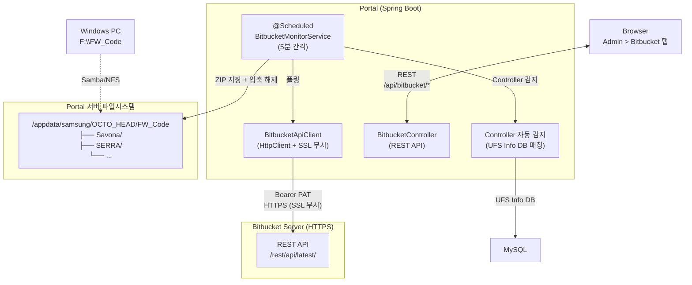
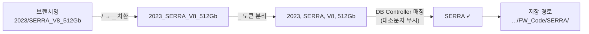

## 1. 시스템 아키텍처



---

## 2. Controller 자동 감지

브랜치명에서 UFS Info Controller DB와 매칭하여 저장 폴더를 자동 결정합니다.



**우선순위:**
1. repo에 Controller가 수동 설정되어 있으면 → 그대로 사용
2. 미설정 시 → 브랜치명에서 자동 감지
3. 매칭 안 되면 → 루트 경로에 저장

---

## 3. Bitbucket API 클라이언트

### SSL 무시

자체 Bitbucket Server의 자체 서명 인증서를 위해 `SSLContext`에 all-trust `TrustManager`를 설정:

```java
SSLContext sslContext = SSLContext.getInstance("TLS");
sslContext.init(null, new TrustManager[]{trustAllManager}, new SecureRandom());
httpClient = HttpClient.newBuilder()
    .sslContext(sslContext)
    .followRedirects(HttpClient.Redirect.ALWAYS)
    .build();
```

### API 버전

`/rest/api/latest/` 사용 (1.0이 아닌 latest).

### 아카이브 다운로드

브랜치명(displayId)을 URL 인코딩하여 `at=` 파라미터로 전달:
```
GET /rest/api/latest/projects/{proj}/repos/{repo}/archive?format=zip&at={encodedBranch}
```

---

## 4. DB 스키마

### portal_bitbucket_repos

```sql
CREATE TABLE portal_bitbucket_repos (
    id BIGINT AUTO_INCREMENT PRIMARY KEY,
    name VARCHAR(200) NOT NULL,
    serverUrl VARCHAR(500) NOT NULL,
    projectKey VARCHAR(100) NOT NULL,
    repoSlug VARCHAR(100) NOT NULL,
    pat VARCHAR(500) NOT NULL,
    controller VARCHAR(100),              -- UFS Controller (수동/자동)
    targetPath VARCHAR(500) NOT NULL
        DEFAULT '/appdata/samsung/OCTO_HEAD/FW_Code',
    enabled BOOLEAN NOT NULL DEFAULT TRUE,
    createdAt DATETIME,
    updatedAt DATETIME,
    lastPolledAt DATETIME
);
```

### portal_bitbucket_branches

```sql
CREATE TABLE portal_bitbucket_branches (
    id BIGINT AUTO_INCREMENT PRIMARY KEY,
    repoId BIGINT NOT NULL,
    branchName VARCHAR(500) NOT NULL,
    latestCommitId VARCHAR(100),
    status VARCHAR(20) NOT NULL DEFAULT 'DOWNLOADING',
    filePath VARCHAR(500),
    fileSizeBytes BIGINT DEFAULT 0,
    downloadedAt DATETIME,
    errorMessage TEXT,
    FOREIGN KEY (repoId) REFERENCES portal_bitbucket_repos(id) ON DELETE CASCADE
);
```

---

## 5. 보안

- **PAT**: DB에 평문 저장 (기존 패턴과 동일)
- **SSL**: 자체 서명 인증서 자동 무시
- **네트워크**: Portal → Bitbucket 단방향 통신만 필요
- **Zip Slip 방지**: 압축 해제 시 경로 정규화 + 대상 디렉토리 내 검증
