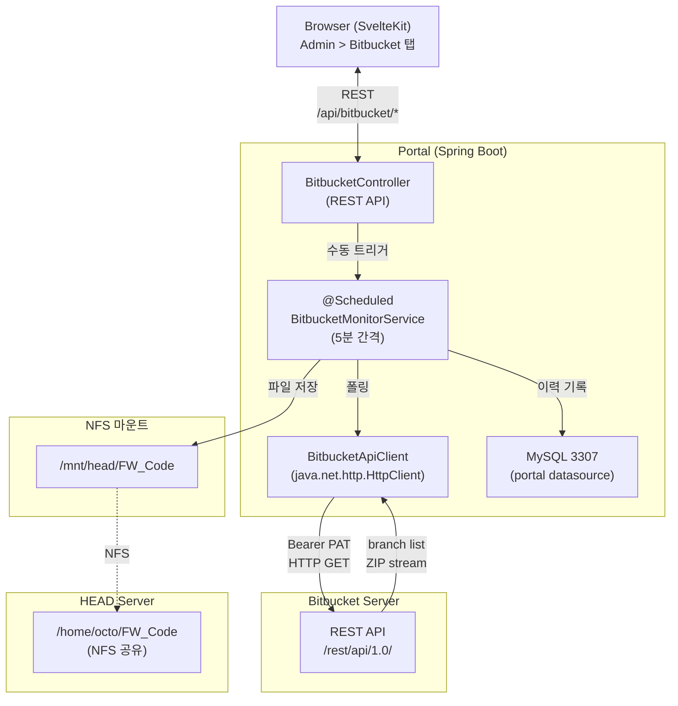
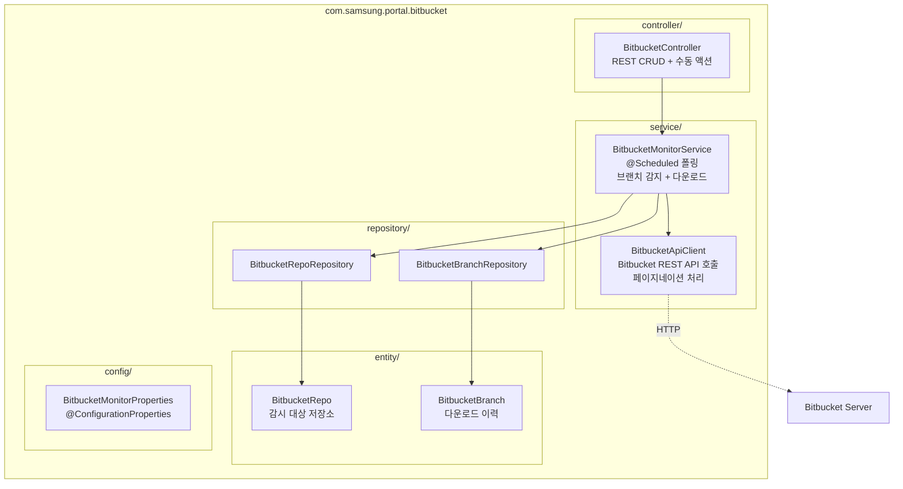
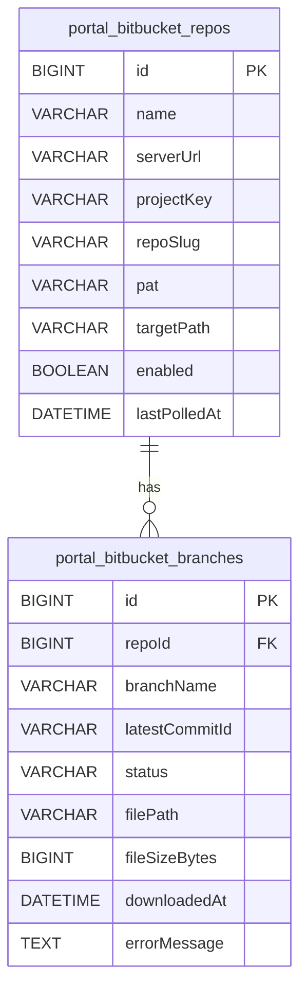
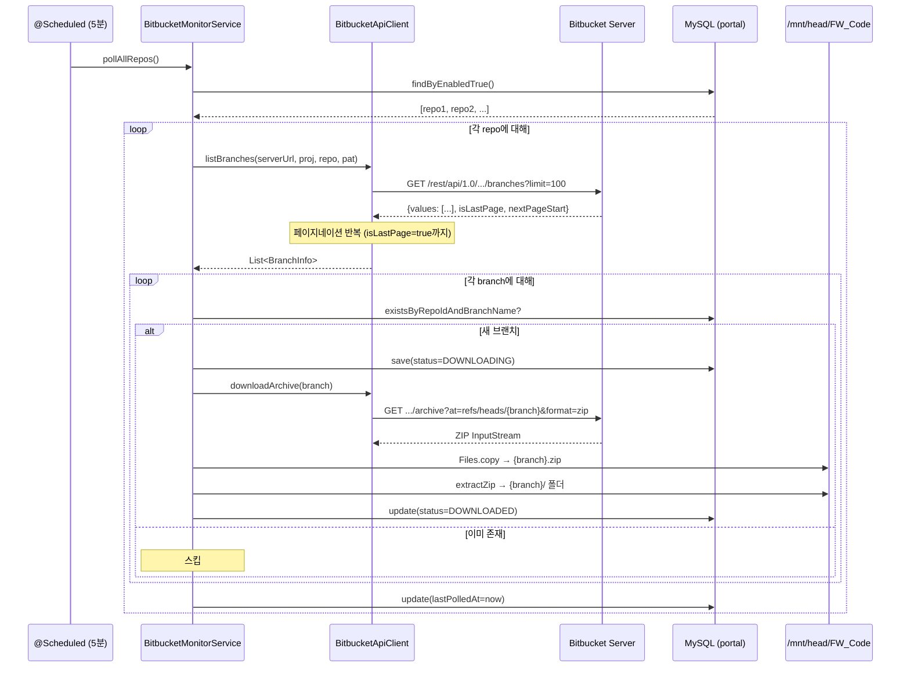

## 1. 시스템 아키텍처 개요

Bitbucket 브랜치 모니터는 Spring `@Scheduled` 기반의 폴링 시스템으로, Bitbucket Server REST API를 호출하여 새 브랜치를 감지하고 NFS 마운트 경로를 통해 HEAD 서버에 코드를 자동 배포합니다.



### 핵심 설계 결정

| 결정 | 선택 | 이유 |
|------|------|------|
| 감지 방식 | Polling | Bitbucket Server Webhook 미지원 |
| 인증 | PAT (Personal Access Token) | SSO 환경에서 API 접근 가능 |
| 파일 전송 | NFS 마운트 (로컬 파일 쓰기) | HEAD 서버가 NFS로 마운트되어 있음 |
| 저장 형태 | ZIP + 압축 해제 폴더 둘 다 | 원본 보존 + 즉시 사용 |
| 브랜치 추적 | DB 테이블 | 서버 재시작 시에도 상태 유지 |

---

## 2. 백엔드 패키지 구조



### 클래스별 역할

| 클래스 | 역할 |
|--------|------|
| `BitbucketMonitorService` | 핵심 서비스. `@Scheduled(fixedDelay=300000)`으로 5분 간격 폴링. 브랜치 감지 → ZIP 다운로드 → 압축 해제 → DB 이력 기록 |
| `BitbucketApiClient` | Bitbucket Server REST API HTTP 클라이언트. 브랜치 목록 조회(페이지네이션), ZIP 아카이브 다운로드 |
| `BitbucketController` | REST API 컨트롤러. 저장소 CRUD, 수동 폴링/다운로드/연결 테스트 |
| `BitbucketMonitorProperties` | `bitbucket.monitor.*` 설정 바인딩 (`enabled`, `defaultTargetPath`) |

---

## 3. 데이터베이스 스키마

Portal datasource (MySQL 3307)에 2개 테이블을 사용합니다.

### portal_bitbucket_repos

감시 대상 Bitbucket 저장소 설정.

```sql
CREATE TABLE portal_bitbucket_repos (
    id BIGINT AUTO_INCREMENT PRIMARY KEY,
    name VARCHAR(200) NOT NULL,           -- 표시 이름
    serverUrl VARCHAR(500) NOT NULL,      -- Bitbucket 서버 URL
    projectKey VARCHAR(100) NOT NULL,     -- 프로젝트 키
    repoSlug VARCHAR(100) NOT NULL,       -- 저장소 slug
    pat VARCHAR(500) NOT NULL,            -- Personal Access Token
    targetPath VARCHAR(500) NOT NULL      -- ZIP 저장 경로 (NFS 마운트)
        DEFAULT '/mnt/head/FW_Code',
    enabled BOOLEAN NOT NULL DEFAULT TRUE,-- 자동 폴링 활성화
    createdAt DATETIME,
    updatedAt DATETIME,
    lastPolledAt DATETIME                 -- 마지막 폴링 시각
);
```

### portal_bitbucket_branches

다운로드된 브랜치 이력.

```sql
CREATE TABLE portal_bitbucket_branches (
    id BIGINT AUTO_INCREMENT PRIMARY KEY,
    repoId BIGINT NOT NULL,               -- FK → portal_bitbucket_repos.id
    branchName VARCHAR(500) NOT NULL,     -- 브랜치 이름
    latestCommitId VARCHAR(100),          -- 커밋 해시
    status VARCHAR(20) NOT NULL           -- DOWNLOADING / DOWNLOADED / FAILED
        DEFAULT 'DOWNLOADING',
    filePath VARCHAR(500),                -- ZIP 파일 경로
    fileSizeBytes BIGINT DEFAULT 0,       -- ZIP 파일 크기
    downloadedAt DATETIME,                -- 다운로드 완료 시각
    errorMessage TEXT,                    -- 실패 시 에러 메시지
    FOREIGN KEY (repoId)
        REFERENCES portal_bitbucket_repos(id) ON DELETE CASCADE
);
```

:::note
컬럼명이 **camelCase**인 이유: portal datasource는 `PhysicalNamingStrategyStandardImpl`을 사용하여 JPA 엔티티 필드명을 그대로 컬럼명으로 매핑합니다.
:::

### ER 다이어그램



---

## 4. 폴링 메커니즘

### 폴링 플로우



### 주요 구현 포인트

**중복 실행 방지**: `@Scheduled(fixedDelay=300000)` — `fixedDelay`를 사용하여 이전 폴링이 완료된 후 5분 대기. `fixedRate`와 달리 동시 실행이 발생하지 않습니다.

**초기 지연**: `initialDelay=30000` (30초) — 애플리케이션 시작 직후 폴링을 피합니다.

**브랜치명 치환**: `feature/xxx` → 파일명 `feature_xxx.zip` (슬래시를 언더스코어로 치환하여 경로 충돌 방지).

**Zip Slip 방지**: 압축 해제 시 `resolvedPath.startsWith(targetDir)` 검증으로 Zip Slip 공격을 방지합니다.

**페이지네이션**: Bitbucket Server API는 기본 25개씩 반환합니다. `isLastPage`가 `true`가 될 때까지 `nextPageStart`로 반복 조회합니다 (limit=100으로 설정).

---

## 5. 프론트엔드 구조

### 컴포넌트

| 파일 | 역할 |
|------|------|
| `AdminBitbucketTab.svelte` | 메인 탭. DataTable(저장소) + DataTable(브랜치 이력) + Dialog(CRUD) |
| `AdminBitbucketActionCell.svelte` | 저장소 행 Actions 셀 (Test, Poll, Edit, Delete) |
| `AdminBitbucketStatusCell.svelte` | 브랜치 상태 표시 셀 (OK/FAIL/...) |
| `$lib/api/bitbucket.ts` | API 레이어 (TypeScript 인터페이스 + fetch 함수) |

### UI 패턴

기존 Admin 탭(AdminSetsTab 등)과 동일한 패턴을 사용합니다:

- **DataTable**: `@tanstack/table-core` 기반, 정렬/필터/페이지네이션
- **Dialog**: shadcn-svelte Dialog로 Create/Edit 폼
- **ConfirmDialog**: 삭제 확인
- **ActionCell**: `renderComponent`로 행별 액션 버튼 렌더링
- **toast**: svelte-sonner로 성공/실패 알림

---

## 6. 설정

### application.yaml

```yaml
bitbucket:
  monitor:
    enabled: true                          # 전체 모니터링 on/off
    default-target-path: /mnt/head/FW_Code # 기본 ZIP 저장 경로
```

### 등록 필요 파일

| 파일 | 변경 내용 |
|------|-----------|
| `PortalDataSourceConfig.java` | `bitbucket.entity`, `bitbucket.repository` 패키지 등록 |
| `PortalApplication.java` | `@EnableConfigurationProperties`에 `BitbucketMonitorProperties` 추가 |
| `application.yaml` | `bitbucket.monitor` 섹션 추가 |

---

## 7. 보안 고려사항

- **PAT 저장**: DB에 평문 저장 (기존 PortalServer 비밀번호와 동일 패턴). 향후 암호화 적용 가능.
- **네트워크**: Portal → Bitbucket 단방향 통신만 필요. Bitbucket → Portal 연결 불필요.
- **Zip Slip 방지**: 압축 해제 시 경로 정규화 + 대상 디렉토리 내 검증.
- **타임아웃**: Bitbucket API 연결 30초, ZIP 다운로드 10분 타임아웃 설정.
