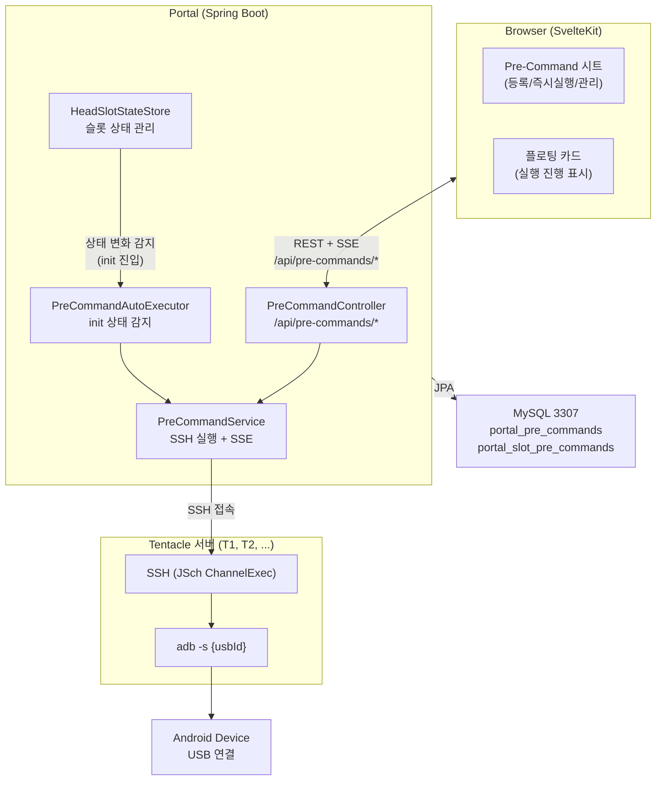
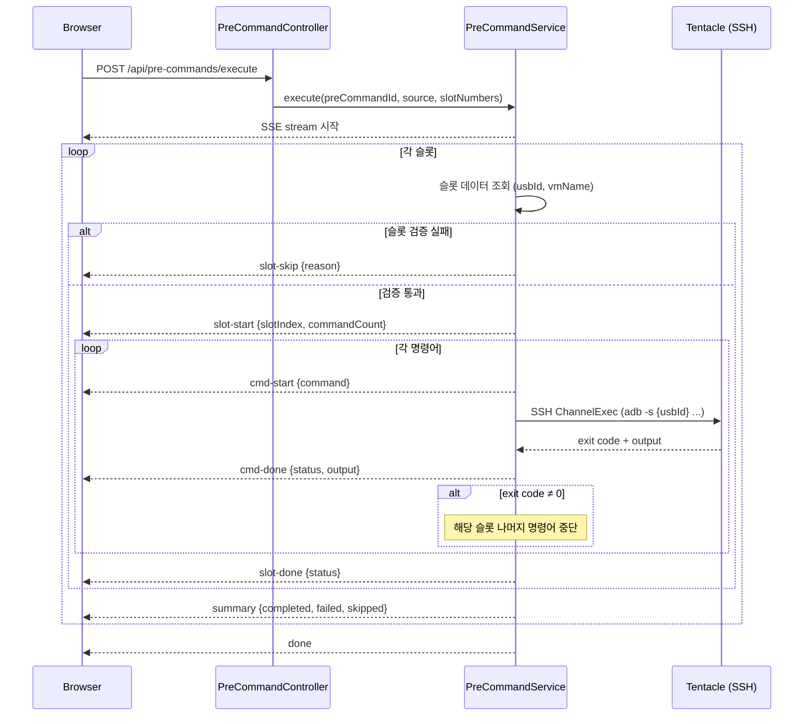
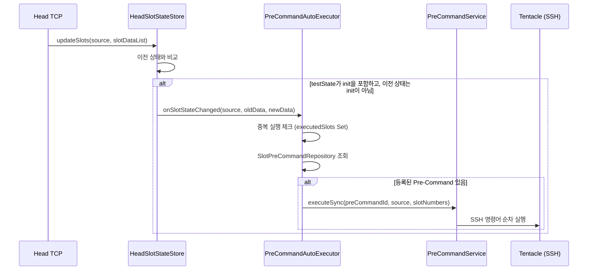

## 1. 시스템 개요

Pre-Command는 슬롯의 디바이스에 테스트 전 준비 명령어를 실행하는 시스템입니다. Portal 서버가 Tentacle 서버에 SSH 접속하여 adb/shell 명령어를 직접 실행합니다.



### 핵심 설계 결정

| 결정 | 이유 |
|------|------|
| **SSH 직접 실행** | Head TCP에 shell 명령어 전달 커맨드가 없음 |
| **ChannelExec** | 단발 명령어 실행. ChannelShell(터미널)과 분리 |
| **SSE 스트리밍** | 슬롯별/명령어별 실시간 진행 표시 |
| **자동 실행** | HeadSlotStateStore 상태 변화 감지 → init 진입 시 트리거 |
| **`-s usbId` 자동 삽입** | 사용자가 usbId를 직접 관리할 필요 없음 |

---

## 2. 패키지 구조

```
com.samsung.portal.head/
├── entity/
│   ├── PreCommand.java          # 명령어 템플릿 엔티티
│   └── SlotPreCommand.java      # 슬롯-템플릿 매핑 엔티티
├── repository/
│   ├── PreCommandRepository.java
│   └── SlotPreCommandRepository.java
├── service/
│   ├── PreCommandService.java        # CRUD + SSH 실행 + SSE
│   ├── PreCommandAutoExecutor.java   # init 상태 자동 실행
│   └── HeadSlotStateStore.java       # 상태 변화 → AutoExecutor 호출
└── controller/
    └── PreCommandController.java     # REST API
```

기존 `head/` 패키지의 역할별 구조(entity, repository, service, controller)를 따릅니다.

---

## 3. DB 스키마

### portal_pre_commands

명령어 템플릿 저장.

| 컬럼 | 타입 | 설명 |
|------|------|------|
| id | BIGINT PK AUTO | 고유 ID |
| name | VARCHAR(100) NOT NULL | 템플릿 이름 |
| description | VARCHAR(500) | 설명 (선택) |
| commands | TEXT NOT NULL | 명령어 JSON 배열 |
| created_at | DATETIME | 생성 시간 |
| updated_at | DATETIME | 수정 시간 |

**commands 예시:**
```json
["adb push tiotest-0.52 /dev", "adb shell chmod +x /dev/tiotest-0.52"]
```

### portal_slot_pre_commands

슬롯별 명령어 등록. init 상태 진입 시 자동 실행 대상.

| 컬럼 | 타입 | 설명 |
|------|------|------|
| id | BIGINT PK AUTO | 고유 ID |
| source | VARCHAR(50) NOT NULL | Head 소스 (compatibility, performance) |
| slot_index | INT NOT NULL | 슬롯 인덱스 |
| pre_command_id | BIGINT FK NOT NULL | → portal_pre_commands.id (CASCADE) |
| created_at | DATETIME | 등록 시간 |

- **UK**: `(source, slot_index)` — 동일 슬롯에 하나만 등록 가능
- 새로운 템플릿으로 교체하면 기존 등록이 업데이트됨

---

## 4. 명령어 실행 흐름

### 즉시 실행 (SSE)



### 자동 실행 (init 감지)



---

## 5. SSH 실행 상세

### 접속 대상 결정

슬롯의 `setLocation` (예: "T1-S03")에서 VM 이름을 추출하고, `portal_servers` 테이블에서 SSH 접속 정보를 조회합니다.

```java
// "T1-S03" → "T1"
Pattern.compile("^(T\\d+)").matcher(setLocation)
```

### adb 명령어 치환

```java
// "adb push file /dev" → "adb -s usb:9-1.4.1 push file /dev"
Pattern ADB_PREFIX = Pattern.compile("^(adb\\s)");
if (m.find()) {
    return "adb -s " + usbId + " " + command.substring(m.end());
}
```

`adb`로 시작하지 않는 명령어는 변환 없이 그대로 실행됩니다.

### 타임아웃

- 명령어당 **60초** 타임아웃
- stdout 읽기, stderr 읽기, exit status 대기 모두 deadline 체크
- 초과 시 채널 강제 종료, `[TIMEOUT]` 메시지 반환

### 에러 처리

| 상황 | 동작 |
|------|------|
| SSH 접속 실패 | 해당 명령어 에러, 슬롯 나머지 명령어 중단 |
| 명령어 exit code ≠ 0 | 해당 슬롯 나머지 명령어 중단 (다른 슬롯은 계속) |
| 타임아웃 | exit code -1, `[TIMEOUT]` 메시지 |
| SSE 연결 끊김 | 서버 측 실행은 계속됨 (fire-and-forget) |

---

## 6. 자동 실행 메커니즘 (PreCommandAutoExecutor)

### 상태 감지

`HeadSlotStateStore.updateSlots()`에서 `slots.put()` 호출 시 이전 값(`oldData`)을 보존하고, `PreCommandAutoExecutor.onSlotStateChanged()`를 호출합니다.

### 트리거 조건

```java
// 새 상태가 init을 포함
newState.toLowerCase().contains("init")

// 이전 상태는 init이 아님 (이미 init이면 무시)
oldState == null || !oldState.toLowerCase().contains("init")
```

### 중복 실행 방지

`ConcurrentHashMap.newKeySet()`으로 `"source:slotIndex"` 키를 관리합니다.

- init 진입: `executedSlots.add(slotKey)` — 이미 있으면 실행하지 않음
- init 이탈: `executedSlots.remove(slotKey)` — 다음 init 진입 시 다시 실행 가능

### 순환 의존 해결

`HeadSlotStateStore` → `PreCommandAutoExecutor` → `PreCommandService` → `HeadSlotStateStore` 순환이 발생하므로, `@Lazy` 어노테이션으로 해결합니다.

```java
public HeadSlotStateStore(@Lazy PreCommandAutoExecutor preCommandAutoExecutor) {
    this.preCommandAutoExecutor = preCommandAutoExecutor;
}
```

---

## 7. 프론트엔드 아키텍처

### 컴포넌트 구조

```
+page.svelte (slots)
├── PreCommandSheet.svelte        # 통합 시트 (등록/실행/관리)
│   ├── main 뷰: 슬롯 상태 + 템플릿 목록
│   ├── manage 뷰: 편집/삭제
│   └── edit 뷰: 생성/수정 폼
├── PreCommandFloatingCard.svelte # 실행 진행 표시 (순수 표시 컴포넌트)
└── SlotCard.svelte               # ⚡ 뱃지 (hasPreCommand prop)
```

### 상태 관리

플로팅 카드는 **부모(+page.svelte)에서 상태를 직접 관리**합니다. Svelte 5 runes 모드에서 `bind:this` + `export function` 패턴이 동작하지 않기 때문입니다.

```typescript
// 부모에서 progress 객체를 직접 업데이트
let preCommandProgress = $state<PreCommandProgress>({...});

function updatePreCommandProgress(type, data) {
    // 매번 새 객체 생성으로 Svelte 반응성 보장
    preCommandProgress = { ...preCommandProgress, ... };
}

// 플로팅 카드는 props로 수신 (순수 표시)
<PreCommandFloatingCard progress={preCommandProgress} />
```

### SSE 클라이언트

`preCommand.ts`의 `executePreCommand()` 함수가 SSE 스트림을 처리합니다.

- `fetch()` + `ReadableStream`으로 SSE 수신
- `\n\n` 블록 단위로 이벤트 파싱
- 멀티라인 `data:` 지원 (Spring이 JSON을 여러 줄로 분할할 수 있음)
- 스트림 종료 시 `done` 이벤트 강제 발행
