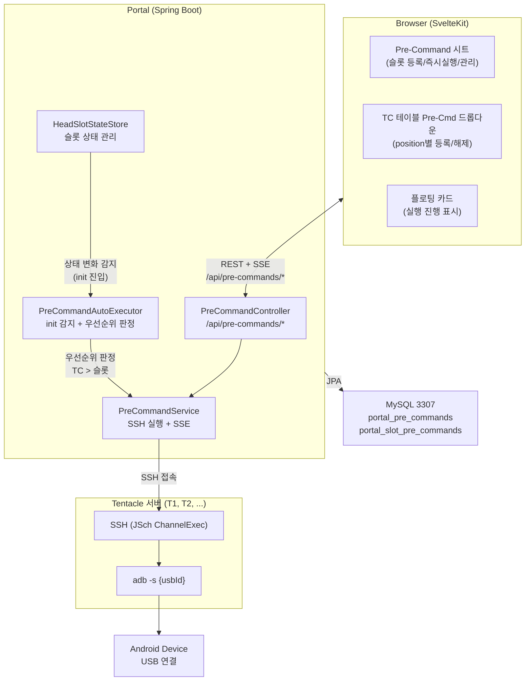
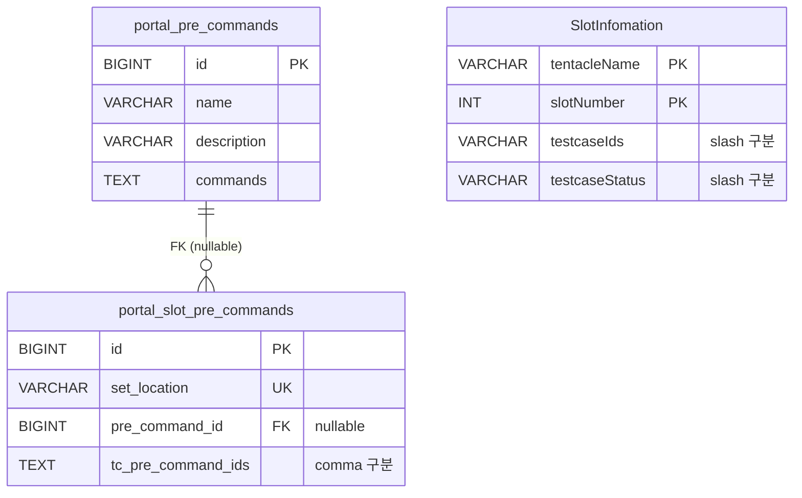
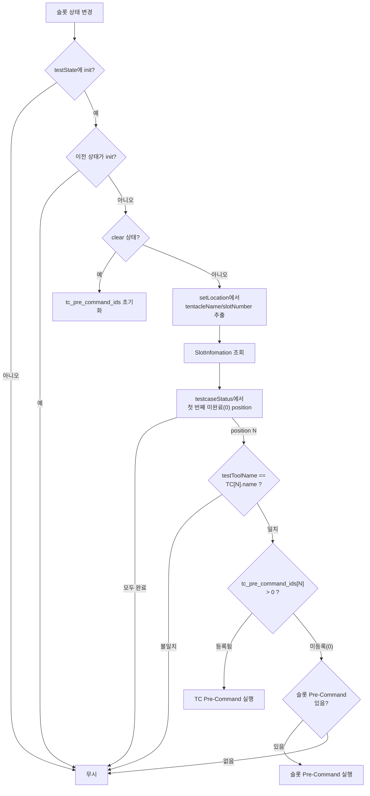

## 1. 시스템 개요

Pre-Command는 슬롯의 디바이스에 테스트 전 준비 명령어를 실행하는 시스템입니다. **슬롯 단위**와 **TC 단위** 두 레벨의 등록을 **한 테이블의 한 행**으로 관리합니다.



### 핵심 설계 결정

| 결정 | 이유 |
|------|------|
| **한 행 통합 관리** | `pre_command_id` + `tc_pre_command_ids`를 한 행에 저장하여 구조 단순화 |
| **comma 구분 문자열** | `testcaseIds`와 1:1 대응, TC 순서 변경 시 같이 재배열하면 끝 |
| **position 기반** | 같은 tcId가 여러 번 할당되어도 개별 설정 가능 |
| **testToolName 매칭** | TC name과 HEAD의 testToolName을 비교하여 엉뚱한 실행 방지 |
| **SSH 직접 실행** | Head TCP에 shell 명령어 전달 커맨드가 없음 |
| **SSE 스트리밍** | 슬롯별/명령어별 실시간 진행 표시 |

---

## 2. 데이터 모델

### portal_pre_commands

명령어 템플릿 저장.

| 컬럼 | 타입 | 설명 |
|------|------|------|
| id | BIGINT PK AUTO | 고유 ID |
| name | VARCHAR(100) NOT NULL | 템플릿 이름 |
| description | VARCHAR(500) | 설명 (선택) |
| commands | TEXT NOT NULL | 명령어 JSON 배열 |
| created_at | DATETIME | 생성 시간 |
| updated_at | DATETIME | 수정 시간 |

### portal_slot_pre_commands

슬롯/TC Pre-Command 통합 관리.

| 컬럼 | 타입 | 설명 |
|------|------|------|
| id | BIGINT PK AUTO | 고유 ID |
| set_location | VARCHAR(100) NOT NULL | 슬롯 위치 식별자 (예: "T3-0", "O1-2", "S5-3") |
| pre_command_id | BIGINT FK (nullable) | 슬롯 Pre-Command → portal_pre_commands.id |
| tc_pre_command_ids | TEXT | TC별 Pre-Command ID ("0,3,0,5,0" 형식) |
| created_at | DATETIME | 등록 시간 |

- **UK**: `(set_location)`
- `pre_command_id`가 NULL이면 슬롯 Pre-Command 없음
- `tc_pre_command_ids`의 각 값은 `portal_pre_commands.id` 또는 0(미등록)
- `tc_pre_command_ids`는 `SlotInfomation.testcaseIds`와 **position이 1:1 대응**

### ER 다이어그램



### 데이터 대응 예시

```
SlotInfomation (T3, 0):
  testcaseIds:    "12/12/35/35/12"    ← 5개 TC (같은 ID 반복 가능)
  testcaseStatus: "27/27/0/0/0"       ← position별 상태

portal_slot_pre_commands (set_location='T3-0'):
  pre_command_id: 7                   ← 슬롯 Pre-Command (fallback)
  tc_pre_command_ids: "3,3,0,5,0"    ← position별 TC Pre-Command
                       ↑ ↑ ↑ ↑ ↑
                   pos: 0 1 2 3 4
```

---

## 3. 우선순위 메커니즘

### 자동 실행 판정 흐름



### 키 매핑 관계

```
HeadSlotData                       SlotInfomation
  setLocation = "T3-0"                tentacleName = "T3"     ← setLocation "T3-0"에서 추출
                                      slotNumber = 0          ← setLocation "T3-0"에서 추출

portal_slot_pre_commands
  set_location = "T3-0"     ← HeadSlotData.setLocation
```

---

## 4. 패키지 구조

```
com.samsung.portal.head/
├── entity/
│   ├── PreCommand.java          # 명령어 템플릿
│   └── SlotPreCommand.java      # 슬롯+TC 통합 (pre_command_id + tc_pre_command_ids)
├── repository/
│   ├── PreCommandRepository.java
│   └── SlotPreCommandRepository.java
├── service/
│   ├── PreCommandService.java        # CRUD + SSH 실행 + SSE
│   ├── PreCommandAutoExecutor.java   # init 감지 + 우선순위 판정
│   └── HeadSlotStateStore.java       # 상태 변화 → AutoExecutor 호출
└── controller/
    └── PreCommandController.java     # REST API (슬롯 + TC + sync)
```

---

## 5. 프론트엔드 아키텍처

### 컴포넌트 구조

```
+page.svelte (slots)
├── PreCommandSheet.svelte          # 통합 시트 (슬롯 등록/실행/관리)
├── PreCommandFloatingCard.svelte   # 실행 진행 플로팅 카드
├── TcPreCommandCell.svelte         # TC 테이블 Pre-Cmd 드롭다운
│   ├── getTcAssignments() → tcPreCommandIds 문자열 파싱
│   ├── assignTc() / unassignTc() → position별 등록/해제
│   └── NOTSTART만 편집 가능
└── SlotCard.svelte                 # ⚡ 뱃지 + 툴팁
```

### TC 순서 변경 동기화

TC 순서가 변경되면 프론트에서 `tc_pre_command_ids`를 같은 순서로 재배열한 후 `POST /api/pre-commands/tc/sync`를 호출합니다.

```typescript
// TC 순서 변경 시
const oldIds = "3,0,5".split(",");        // 기존 tc_pre_command_ids
const newOrder = [2, 0, 1];               // 새 순서 (position 2 → 0, 0 → 1, 1 → 2)
const newIds = newOrder.map(i => oldIds[i] ?? "0").join(","); // "5,3,0"
await syncTcPreCommandIds(setLocation, newIds);
```
