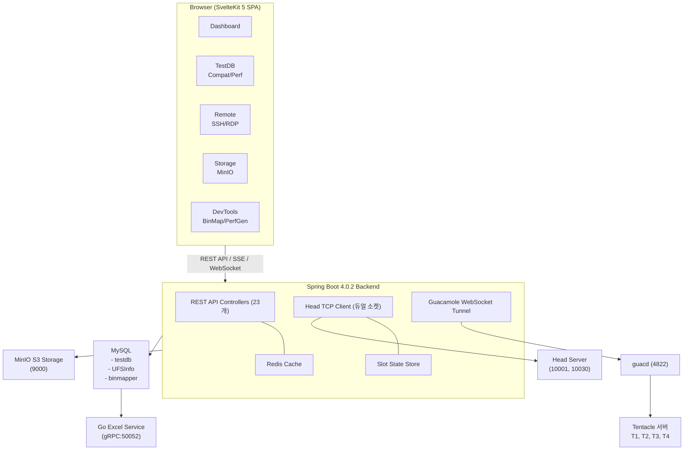
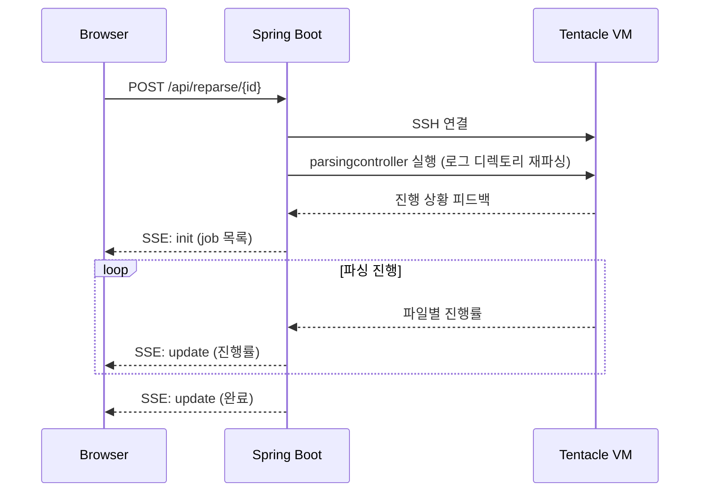

## 프로젝트 목적

Samsung Portal은 **UFS(Universal Flash Storage) 테스트 자동화 관리 시스템**입니다. 호환성/성능 테스트의 전체 생명주기를 관리하고, 실시간 슬롯 모니터링, 원격 접속, 로그 분석, 바이너리 디버깅 도구까지 통합 제공합니다.

## 핵심 기능

| 영역 | 기능 | 설명 |
|------|------|------|
| **테스트 관리** | 호환성/성능 테스트 | TestRequest → TestCase → History 3계층 CRUD |
| **성능 시각화** | 15종 파서별 차트 | ECharts 기반 동적 시각화 + Excel Export |
| **성능 비교** | Chart Overlay / Delta Table | Baseline 대비 수치 비교 |
| **실시간 모니터링** | 슬롯 상태 | HEAD TCP → SSE 실시간 푸시 |
| **원격 접속** | SSH/RDP 터미널 | Guacamole WebSocket 터널 + 다중 탭 |
| **로그 분석** | 로그 브라우저 | SSH/Local 모드 파일 탐색 + ripgrep 검색 |
| **파일 관리** | S3 스토리지 | MinIO 브라우저 (업로드/다운로드/폴더 관리) |
| **개발 도구** | Binary Struct Mapper | C/C++ 구조체 → 바이너리 매핑 |
| **TC 그룹** | TC 조합 관리 | 자주 사용하는 TC 조합 저장/빠른 적용 |

## 배포 모델

**단일 JAR 배포** — SvelteKit 프론트엔드 빌드 결과물을 Spring Boot `static/` 디렉토리에 포함하여 별도 웹서버 없이 하나의 JAR로 서빙합니다.

:::tip
Maven 빌드 시 프론트엔드 빌드가 자동으로 실행되며, 결과물이 `src/main/resources/static/`에 복사됩니다.
:::

## 전체 구성도



## 통신 프로토콜

| 경로 | 프로토콜 | 용도 |
|------|----------|------|
| Browser ↔ Backend | HTTP REST + SSE + WebSocket | API, 실시간 슬롯, 원격 터미널 |
| Backend ↔ Head Server | TCP (커스텀 프로토콜) | 하드웨어 테스트 제어 |
| Backend ↔ Go Excel Service | gRPC (protobuf) | Excel 파일 생성 |
| Backend ↔ guacd | Guacamole 프로토콜 (TCP) | SSH/RDP 중계 |
| Backend ↔ MinIO | S3 API (HTTP) | 오브젝트 스토리지 |
| Backend ↔ MySQL | JDBC | 데이터 영속화 |
| Backend ↔ Redis | Redis 프로토콜 | 캐시 |
| Backend ↔ Tentacle (SSH) | SSH (JSch) | 로그 파일 원격 접근 |

## 설계 결정 근거

주요 설계 결정의 배경, 대안, 트레이드오프를 상세히 기술합니다. 각 결정의 코드 흐름은 [내부 동작](/internals/request-lifecycle) 문서에서 확인할 수 있습니다.

### Multi-DataSource (3개 DB)

**문제**: 여러 팀이 공유하는 기존 DB(testdb, UFSInfo)에 Portal 전용 데이터를 섞을 수 없음

**대안 검토**:
- 단일 DB에 Portal 전용 스키마 추가 → testdb 관리팀의 승인 필요, 스키마 변경 리스크
- 모든 데이터를 Portal DB로 복제 → 동기화 비용, 데이터 불일치 위험

**선택한 방식**: 패키지 기반 DataSource 분리

| DataSource | 용도 | 제약 |
|------------|------|------|
| **testdb** (3306) | 레거시 테스트 데이터 (다른 팀과 공유) | 스키마 변경 불가 |
| **ufsinfo** (3306) | UFS 참조 코드 (읽기 위주, 공유) | 스키마 변경 불가 |
| **portal** (3307) | Portal 전용 데이터 (Agent, Admin 등) | 자유롭게 변경 가능 |

**트레이드오프**: DataSource별 독립 EntityManager/TransactionManager가 필요하여 설정이 복잡. 크로스 DB 조인 불가능 (애플리케이션 레벨에서 조합해야 함).

---

### SSE vs WebSocket 선택 기준

**문제**: 실시간 데이터 전달에 SSE와 WebSocket 중 어떤 것을 사용할지

**선택 기준**: 통신 방향에 따라 결정

| 유형 | 프로토콜 | 이유 |
|------|----------|------|
| 서버 → 클라이언트 **단방향** | **SSE** | 슬롯 상태, 벤치마크 진행률, reparse 진행률 |
| 클라이언트 ↔ 서버 **양방향** | **WebSocket** | 원격 터미널 (키 입력 + 화면 출력) |

**SSE의 장점** (단방향일 때):
- `EventSource` API가 자동 재연결 지원 (WebSocket은 수동 구현 필요)
- HTTP 기반이므로 프록시/방화벽 통과가 용이
- 구현이 단순 (`SseEmitter` 한 줄)

**WebSocket이 필요한 경우**:
- Guacamole 터널 — 키 입력을 즉시 전송해야 하므로 양방향 필수
- 바이너리 데이터 전송 — SSE는 텍스트만 지원

---

### Go Excel Service (gRPC)

**문제**: 성능 차트가 포함된 Excel 파일을 서버 사이드에서 생성해야 함

**대안 검토**:
- Java Apache POI → **네이티브 Excel 차트 생성 불가** (이미지 삽입만 가능)
- Java JExcelApi → 구버전 .xls만 지원
- 프론트엔드 ExcelJS → 차트가 이미지로 삽입됨 (편집 불가)

**선택한 방식**: Go `excelize/v2` — 네이티브 Excel 차트(.xlsx)를 프로그래밍으로 생성 가능. gRPC로 통신하여 구조화된 바이너리 스트리밍 가능.

**트레이드오프**: 별도 Go 서비스 운영 필요 (port 50052). Proto 동기화 비용.

---

### Redis 캐시에 JDK 직렬화 사용

**문제**: 자주 조회되는 Entity를 Redis에 캐시하고 싶으나, Jackson 직렬화가 실패

**실패 시나리오**:
1. Hibernate 지연 로딩 프록시 객체가 Jackson에서 직렬화 에러 발생
2. `activateDefaultTyping` 설정 시 null 결과 처리에서 예외 발생
3. 다형성 타입 처리가 엔티티 구조와 충돌

**선택한 방식**: `JdkSerializationRedisSerializer` — Hibernate 프록시를 문제없이 직렬화. 모든 Entity에 `implements Serializable` 필수.

**트레이드오프**: Redis에 저장된 데이터가 사람이 읽을 수 없는 바이너리 형태. Entity 클래스 구조가 변경되면 기존 캐시와 호환되지 않아 배포 후 캐시 플러시 필요.

자세한 내용은 [Redis 캐시 아키텍처](/architecture/caching) 참조.

---

### SSH 1:1 세션 vs RDP 공유 세션

**문제**: 원격 접속에서 동시 접속을 어떻게 관리할지

**SSH**: 각 연결이 독립적인 쉘 세션을 생성하며 리소스가 거의 들지 않음 → 1:1 모델. 10명이 동시에 같은 서버에 접속해도 문제 없음.

**RDP**: VM의 단일 GUI 디스플레이에 연결. 여러 RDP 세션이 동시에 열리면 기존 세션이 강제 로그아웃되거나 충돌 → `SessionLockManager`로 VM당 하나의 세션만 허용.

자세한 내용은 [원격 접속 흐름](/internals/remote-session-flow) 참조.

---

### Head TCP 듀얼 소켓

**문제**: HEAD 하드웨어 테스트 장비와 통신해야 하지만, 장비의 프로토콜이 단일 소켓으로 양방향 통신을 지원하지 않음

**레거시 프로토콜의 제약**: HEAD 서버는 명령 수신용 포트와 데이터 전송용 포트를 분리. Portal이 먼저 outbound 연결 후, HEAD가 Portal의 ServerSocket으로 역연결하여 데이터를 전송.

이 프로토콜은 변경할 수 없으므로 (다른 시스템도 사용 중), Portal이 이에 맞춰 듀얼 소켓 구조를 구현.

자세한 내용은 [슬롯 모니터링 흐름](/internals/slot-monitoring-flow) 참조.

## Performance Reparse 아키텍처

성능 TC의 로그 파일을 재파싱하여 결과 데이터를 새로 생성하는 시스템입니다. 파싱 로직이 업데이트되었거나 기존 파싱 결과에 오류가 있을 때 사용합니다.

### 전체 흐름



1. 프론트엔드에서 `POST /api/reparse/{historyId}` 요청
2. 백엔드가 SSH로 해당 Tentacle VM에 접속하여 `parsingcontroller` 명령 실행
3. 파싱 진행 상황을 SSE 스트림(`GET /api/reparse/stream`)으로 실시간 전달
4. 프론트엔드의 `reparseStore`가 SSE 이벤트를 수신하여 상태 관리

### ReparseJob 상태

| 상태 | 설명 |
|------|------|
| `preparing` | SSH 연결 및 파싱 명령 준비 중 |
| `running` | 파싱 진행 중 (파일별 진행률 추적) |
| `completed` | 파싱 완료 |
| `failed` | 파싱 실패 (에러 메시지 포함) |

### SSE 이벤트 구조

```
event: init
data: {"jobs": [{"jobId": "...", "historyId": 123, "state": "running", "totalFiles": 15, "currentIndex": 3, ...}]}

event: update
data: {"jobs": [...]}
```

- `init`: SSE 연결 시 현재 진행 중인 모든 reparse job 목록 전달
- `update`: job 상태 변경 시마다 전체 job 목록 전달

## 글로벌 Floating Card 아키텍처

장시간 실행되는 백그라운드 작업의 진행 상황을 화면 우하단의 **플로팅 카드**로 표시하는 패턴입니다. 사용자가 다른 페이지로 이동해도 진행 상황을 계속 확인할 수 있습니다.

### 구성 요소

| 컴포넌트 | 역할 |
|----------|------|
| `reparseStore` (Svelte 5 store) | 글로벌 상태 관리. SSE 연결, job 목록, localStorage 영속화 |
| `ReparseFloatingCard` | 화면 우하단 고정 UI. 진행 중/완료/실패 job 표시 |
| 루트 레이아웃 (`+layout.svelte`) | 앱 전역에서 Floating Card 렌더링 |

### 작동 방식

1. **앱 초기화**: `reparseStore.init()`이 localStorage를 확인하여 활성 job이 있으면 SSE 연결 자동 복원
2. **Reparse 시작**: `reparseStore.startReparse(historyId)` 호출 시 API 요청 + SSE 연결
3. **실시간 업데이트**: SSE `update` 이벤트 수신 시 job 목록 갱신 + localStorage 동기화
4. **자동 숨김**: 완료된 job은 60초 후, 실패한 job은 120초 후 자동으로 카드에서 사라짐
5. **수동 제거**: 사용자가 개별 job을 dismiss 가능
6. **접기/펼치기**: 카드 헤더를 클릭하여 축소/확장 전환 (축소 시에도 진행 바 표시)

### localStorage 영속화

활성 상태(`preparing`, `running`)의 job ID가 `reparse-active-jobs` 키로 localStorage에 저장됩니다. 브라우저를 새로고침하거나 탭을 닫았다가 다시 열어도, 활성 job이 있으면 SSE 연결이 자동 복원되어 진행 상황을 계속 추적합니다.

### SSE 재연결

SSE 연결이 끊어지면(네트워크 오류 등), localStorage에 활성 job이 남아 있는 경우 5초 후 자동 재연결을 시도합니다. 모든 job이 완료/실패하면 SSE 연결을 종료합니다.

## SSE 스트리밍 패턴

Portal에서는 여러 기능에 걸쳐 SSE(Server-Sent Events) 스트리밍 패턴이 사용됩니다. 각 용도별 특성을 정리합니다.

| 용도 | 엔드포인트 | 타임아웃 | 이벤트 타입 | 재연결 |
|------|-----------|----------|------------|--------|
| **슬롯 상태** | `/api/slots/stream` | 서버 설정 | `message` | EventSource 자동 |
| **Performance Reparse** | `/api/reparse/stream` | 없음 | `init`, `update` | 5초 후 수동 |
| **Agent 벤치마크 진행** | `/api/agent/benchmark/progress` | 없음 | `progress`, `complete`, `error` | 수동 |
| **Agent 디바이스 모니터링** | `/api/agent/monitoring/stream` | 없음 (0L) | `metrics` | 수동 |

### 공통 패턴

- 백엔드: `SseEmitter`로 이벤트 전송. 타임아웃 0L 설정 시 무제한 연결 유지
- 프론트엔드: `EventSource` API 또는 `fetch` + ReadableStream 사용
- 에러 처리: `onCompletion`, `onTimeout`, `onError` 콜백으로 정리 로직 실행
- 연결 관리: 페이지 이탈 시 `EventSource.close()` 또는 AbortController로 정리
