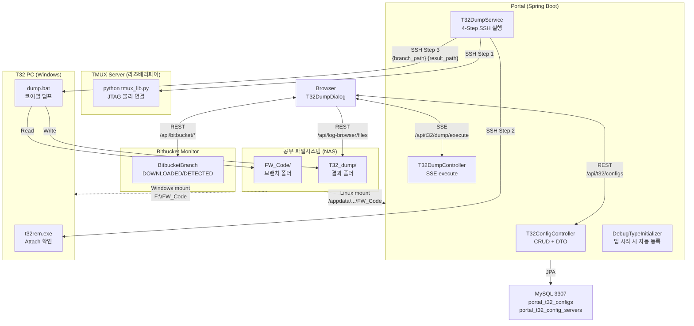
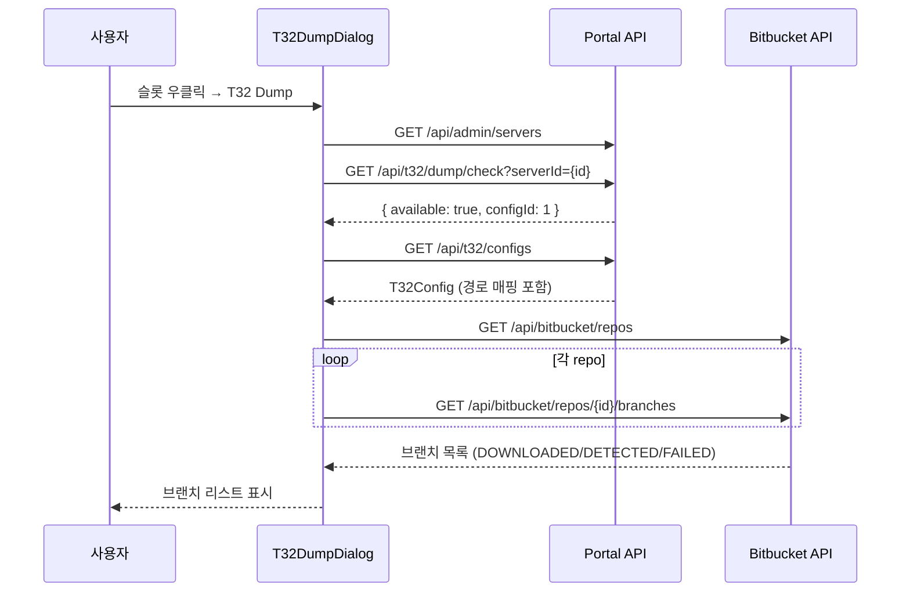
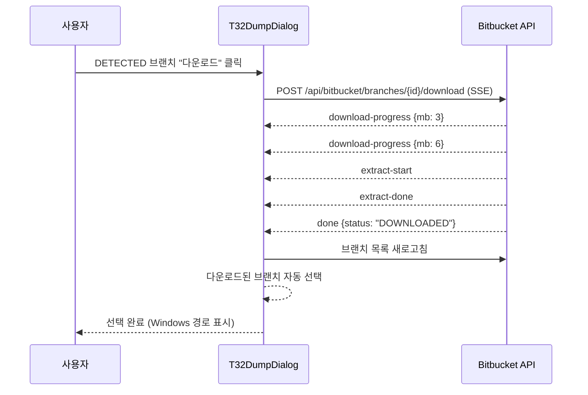
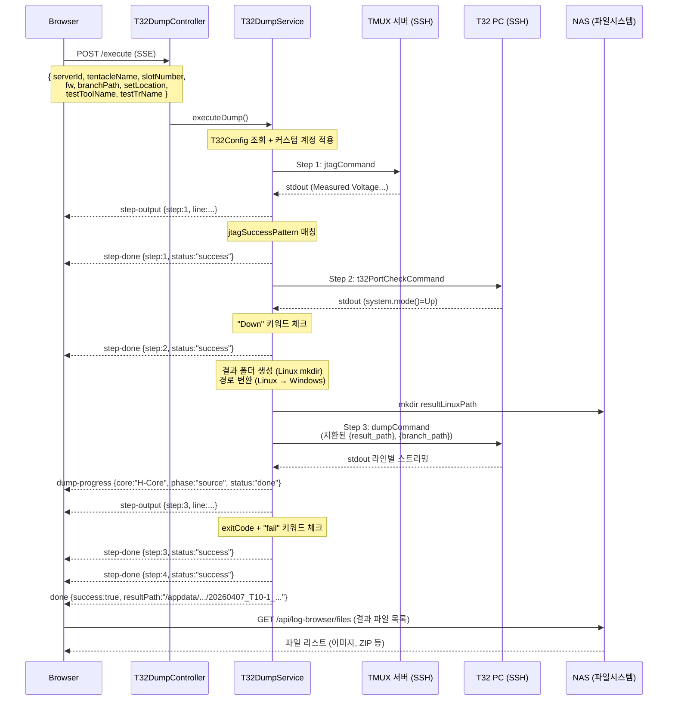

## 1. 시스템 아키텍처



---

## 2. 패키지 구조

```
com.samsung.move.t32
├── entity/
│   ├── T32Config.java           — Lab별 JTAG/T32 인프라 설정 (18개 컬럼)
│   └── T32ConfigServer.java     — Config ↔ 텐타클 매핑 (N:M)
├── repository/
│   ├── T32ConfigRepository.java
│   └── T32ConfigServerRepository.java
├── dto/
│   └── T32ConfigDto.java        — 서버 이름/IP 해석 + 담당 서버 목록
├── controller/
│   ├── T32ConfigController.java — CRUD + DTO 변환 + 비밀번호 보존
│   └── T32DumpController.java   — SSE execute + config check
└── service/
    └── T32DumpService.java      — 4-Step SSH 실행 + SSE 스트리밍 + 경로 변환
```

---

## 3. DB 스키마

### portal_t32_configs

```sql
CREATE TABLE portal_t32_configs (
    id BIGINT AUTO_INCREMENT PRIMARY KEY,

    -- 서버 그룹 & 장비
    serverGroupId BIGINT NOT NULL,         -- FK → portal_server_groups
    jtagServerId BIGINT NOT NULL,          -- FK → portal_servers (TMUX)
    jtagUsername VARCHAR(100),             -- 전용 계정 (null이면 서버 기본)
    jtagPassword VARCHAR(255),
    t32PcId BIGINT NOT NULL,              -- FK → portal_servers (Windows)
    t32PcUsername VARCHAR(100),
    t32PcPassword VARCHAR(255),

    -- 명령어 템플릿
    jtagCommand VARCHAR(500),             -- {tentacle}, {tentacle_num}, {slot}
    jtagSuccessPattern VARCHAR(500),      -- regex (Step 1 성공 판정)
    t32PortCheckCommand VARCHAR(500),     -- Step 2: attach 확인
    dumpCommand VARCHAR(500),             -- Step 3: {result_path}, {branch_path}

    -- 경로 매핑
    fwCodeLinuxBase VARCHAR(500),         -- Linux FW 코드 경로
    fwCodeWindowsBase VARCHAR(500),       -- Windows FW 코드 경로
    resultBasePath VARCHAR(500),          -- Linux 결과 저장 경로
    resultWindowsBasePath VARCHAR(500),   -- Windows 결과 저장 경로

    -- 기타
    description VARCHAR(500),
    enabled BOOLEAN NOT NULL DEFAULT TRUE,
    createdAt DATETIME,
    updatedAt DATETIME
);
```

### portal_t32_config_servers

Config와 텐타클의 N:M 매핑 테이블입니다. 하나의 Config에 여러 텐타클을 할당할 수 있습니다.

```sql
CREATE TABLE portal_t32_config_servers (
    id BIGINT AUTO_INCREMENT PRIMARY KEY,
    t32ConfigId BIGINT NOT NULL,           -- FK → portal_t32_configs (CASCADE)
    serverId BIGINT NOT NULL,              -- FK → portal_servers (텐타클)
    UNIQUE KEY uk_config_server (t32ConfigId, serverId)
);
```

---

## 4. 전체 실행 흐름

### 4-1. Dialog 초기화



### 4-2. 브랜치 선택 (DETECTED → 다운로드 → 자동 선택)



### 4-3. Dump 실행 (4-Step SSE)



---

## 5. 경로 변환 상세

### 브랜치 경로 (Linux → Windows)

```java
// T32DumpService 라인 120-136
String normalLinux = linuxBase.replaceAll("/$", "");  // 끝 / 제거
if (branchPath.startsWith(normalLinux)) {
    String relative = branchPath.substring(normalLinux.length());
    branchWindowsPath = winBase.replaceAll("[/\\\\]$", "")
                        + relative.replace("/", "\\");
} else {
    branchWindowsPath = branchPath;  // 매핑 실패 시 원본 사용
}
```

예시:
```
입력:    /appdata/samsung/OCTO_HEAD/FW_Code/Savona/Savona_V8_P00RC28
Linux:   /appdata/samsung/OCTO_HEAD/FW_Code  (fwCodeLinuxBase)
Windows: F:\FW_Code                           (fwCodeWindowsBase)
결과:    F:\FW_Code\Savona\Savona_V8_P00RC28
```

### 결과 경로 조합

```java
// T32DumpService 라인 102-118
String date = LocalDate.now().toString().replace("-", "");  // 20260407
StringBuilder dirName = new StringBuilder(date);
if (setLocation != null) dirName.append("_").append(setLocation);
if (testToolName != null) dirName.append("_").append(testToolName);
if (testTrName != null) dirName.append("_").append(testTrName);

resultLinuxPath = resultBasePath + "/" + dirName;          // /appdata/.../T32_dump/20260407_T10-1_...
resultWindowsPath = resultWindowsBasePath + "\\" + dirName; // F:\T32_dump\20260407_T10-1_...
```

### dumpCommand 치환

```java
// T32DumpService 라인 236-243
command = resolveTemplate(config.getDumpCommand(), tentacleName, slotNumber);
command = command.replace("{result_path}", "\"" + resultWindowsPath + "\"");
command = command.replace("{branch_path}", "\"" + branchWindowsPath + "\"");
```

최종 명령어 예시:
```
cmd /c C:\T32\dump.bat "F:\FW_Code\Savona\Savona_V8_P00RC28" "F:\T32_dump\20260407_T10-1_randwrite_Savona_V8_P00RC28"
```

---

## 6. Step별 성공/실패 판정

| Step | 성공 조건 | 실패 조건 |
|------|-----------|-----------|
| **Step 1 (JTAG)** | `jtagSuccessPattern` 정규식이 stdout에 매칭 | 패턴 불일치 또는 SSH 오류 |
| **Step 2 (Attach)** | exitCode=0 AND stdout에 "Down" 없음 | "Down" 감지 → Debug Port Fail |
| **Step 3 (Dump)** | exitCode=0 AND stdout에 "fail" 없음 (대소문자 무시) | exitCode≠0 또는 "fail" 감지 |
| **Step 4 (완료)** | Step 3 성공 시 자동 성공 | — |

타임아웃:
- Step 1 (JTAG): 30초
- Step 2 (Attach): 30초
- Step 3 (Dump): 5분 (300초)

---

## 7. SSE 스트리밍 프로토콜

### 엔드포인트

```
POST /api/t32/dump/execute
Content-Type: application/json → text/event-stream
```

### 요청 본문

```json
{
  "serverId": 5,
  "tentacleName": "T10",
  "slotNumber": 1,
  "fw": "Savona_V8",
  "branchPath": "/appdata/samsung/OCTO_HEAD/FW_Code/Savona/Savona_V8_P00RC28",
  "setLocation": "T10-1",
  "testToolName": "randwrite",
  "testTrName": "Savona_V8_TLC_512Gb_512GB_P00RC28"
}
```

### SSE 이벤트

| 이벤트 | 데이터 | 시점 |
|--------|--------|------|
| `step-start` | `{step, name}` | 각 Step 시작 |
| `step-output` | `{step, line}` | SSH stdout 라인 (실시간) |
| `step-done` | `{step, status, output}` | Step 완료 또는 실패 |
| `dump-progress` | `{step, core, phase, status}` | Step 3 Core별 진행 상태 |
| `done` | `{success, resultPath, resultWindowsPath}` | 전체 완료 |
| `error` | `{message}` | 예외 오류 |

### dump-progress 이벤트 상세

Step 3 실행 중 stdout에서 Core 이름 패턴을 자동 파싱합니다:

```
Core 패턴: H-Core, CM-Core, F-Core, N-Core, Canary (대소문자 무시)
Phase 감지: source, stack, register, dump, capture
Status 감지: done/complete/success → "done", fail/error → "failed"
```

예시 stdout → SSE 이벤트:
```
stdout: "Processing H-Core source... done"
→ dump-progress {step:3, core:"H-Core", phase:"source", status:"done"}
```

---

## 8. 전용 계정 메커니즘

T32Config에 커스텀 계정이 설정되면 SSH 접속 시 PortalServer 기본 계정 대신 사용합니다:

```java
private PortalServer applyCustomAccount(PortalServer server, String customUsername, String customPassword) {
    if (customUsername == null || customUsername.isBlank()) return server;
    return PortalServer.builder()
            .id(server.getId()).name(server.getName())
            .ip(server.getIp()).sshPort(server.getSshPort())
            .username(customUsername)
            .password(customPassword != null ? customPassword : server.getPassword())
            .build();
}
```

- 원본 PortalServer 엔티티는 변경하지 않음 (복사본 사용)
- JTAG 서버, T32 PC 모두 동일하게 적용
- 비밀번호 빈 문자열로 수정 시 기존 값 유지 (Controller에서 처리)

---

## 9. 프론트엔드 구조

### T32DumpDialog 상태 관리

```
phase: 'idle' | 'running' | 'done' | 'failed'

idle 상태:
├── configLoading → T32 설정 로드 중 (스피너)
├── !t32Available → "설정 없음" 안내
├── branchPath 미선택 → Bitbucket 브랜치 리스트 표시
│   ├── bbSearch → 실시간 필터링 (bbFiltered derived)
│   ├── DOWNLOADED 클릭 → selectBranch() → branchPath 설정
│   ├── DETECTED "다운로드" → handleDownloadBranch() → SSE → 완료 후 자동 선택
│   └── "직접 찾기" → LogBrowserDialog
└── branchPath 선택됨 → Windows 경로 표시 (toWindowsPath 변환)

running 상태:
└── 4-Step Stepper (step-start → step-output → step-done 반복)

done 상태:
├── 결과 경로 표시
├── loadResultFiles() → log-browser API로 파일 목록
├── 이미지 미리보기 (클릭 시 인라인)
└── 파일별 다운로드 버튼

failed 상태:
├── 실패한 Step 번호 + 안내
└── "다시 시도" 버튼 → retryDump() → idle로 리셋
```

### Bitbucket 연동

Dialog 열림 → `loadBitbucketBranches()`:
1. `fetchRepos()` → 모든 Bitbucket 저장소 조회
2. 각 저장소의 `fetchBranches()` → 브랜치 수집
3. 상태별 정렬: DOWNLOADED → DETECTED → DOWNLOADING → FAILED
4. `bbSearch`로 실시간 필터링 (derived)

---

## 10. Debug Type 자동 등록

`DebugTypeInitializer`가 앱 시작 시 `debug_types` DB 테이블과 코드의 `BUILT_IN_TYPES`를 동기화:

- DB에 없으면 → 자동 INSERT
- DB에서 비활성화 → WARN 로그
- DB에만 있고 코드에 없음 → WARN 로그
- 기존 DB 수정사항은 보존 (덮어쓰기 없음)

새 debug type 추가 시:
1. `DebugTypeInitializer.BUILT_IN_TYPES`에 추가
2. `debugRegistry.ts`에 컴포넌트 등록
3. 앱 재시작 → 자동 등록

---

## 11. 컨텍스트 메뉴 활성화 조건

```typescript
t32dump: selected.length === 1 && allConn1 && (() => {
    const vmName = selected[0].headData?.setLocation?.match(/^(T\d+)/)?.[1] ?? '';
    return t32AssignedServerNames.has(vmName);
})()
```

3가지 조건이 모두 충족되어야 T32 Dump 메뉴가 활성화됩니다:
1. **단일 슬롯 선택** (`selected.length === 1`)
2. **연결 상태** (`connection = 1`)
3. **해당 텐타클이 T32Config의 assignedServers에 포함**
