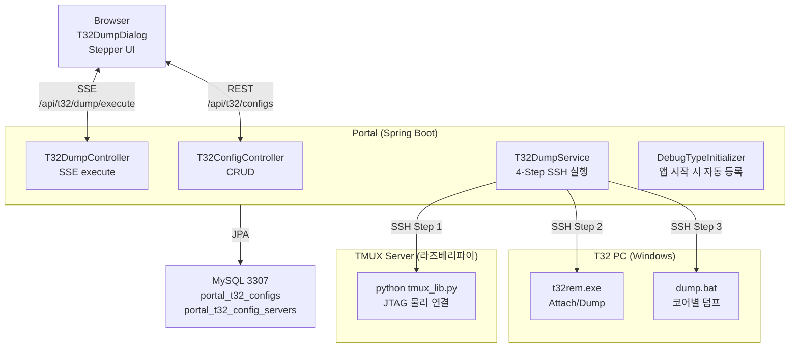
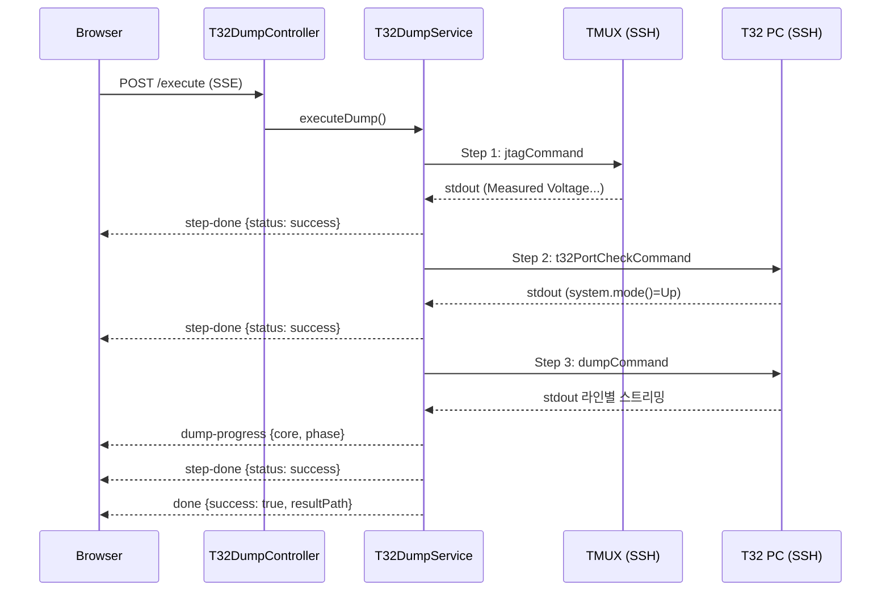

## 1. 시스템 아키텍처



---

## 2. 패키지 구조

```
com.samsung.portal.t32
├── entity/
│   ├── T32Config.java           — Lab별 JTAG/T32 인프라 설정
│   └── T32ConfigServer.java     — Config ↔ 텐타클 매핑
├── repository/
│   ├── T32ConfigRepository.java
│   └── T32ConfigServerRepository.java
├── dto/
│   └── T32ConfigDto.java        — 서버 이름 해석 + 담당 서버 목록
├── controller/
│   ├── T32ConfigController.java — CRUD + DTO 변환
│   └── T32DumpController.java   — SSE execute + config check
└── service/
    └── T32DumpService.java      — 4-Step SSH 실행 + SSE 스트리밍
```

---

## 3. DB 스키마

### portal_t32_configs

```sql
CREATE TABLE portal_t32_configs (
    id BIGINT AUTO_INCREMENT PRIMARY KEY,
    serverGroupId BIGINT NOT NULL,         -- FK → portal_server_groups
    jtagServerId BIGINT NOT NULL,          -- FK → portal_servers (TMUX)
    jtagUsername VARCHAR(100),             -- 전용 계정 (null이면 서버 기본)
    jtagPassword VARCHAR(255),
    t32PcId BIGINT NOT NULL,              -- FK → portal_servers (Windows)
    t32PcUsername VARCHAR(100),
    t32PcPassword VARCHAR(255),
    jtagCommand VARCHAR(500),             -- {tentacle}, {tentacle_num}, {slot}
    jtagSuccessPattern VARCHAR(500),      -- regex
    t32PortCheckCommand VARCHAR(500),
    dumpCommand VARCHAR(500),
    fwCodeLinuxBase VARCHAR(500),         -- Linux FW 코드 경로
    fwCodeWindowsBase VARCHAR(500),       -- Windows FW 코드 경로
    resultBasePath VARCHAR(500),          -- Linux 결과 저장 경로
    resultWindowsBasePath VARCHAR(500),   -- Windows 결과 저장 경로
    description VARCHAR(500),
    enabled BOOLEAN NOT NULL DEFAULT TRUE,
    createdAt DATETIME,
    updatedAt DATETIME
);
```

### portal_t32_config_servers

```sql
CREATE TABLE portal_t32_config_servers (
    id BIGINT AUTO_INCREMENT PRIMARY KEY,
    t32ConfigId BIGINT NOT NULL,           -- FK → portal_t32_configs (CASCADE)
    serverId BIGINT NOT NULL,              -- FK → portal_servers (텐타클)
    UNIQUE KEY uk_config_server (t32ConfigId, serverId)
);
```

---

## 4. SSE 스트리밍 프로토콜

### 엔드포인트

```
POST /api/t32/dump/execute
Content-Type: application/json
→ text/event-stream

{ "serverId": 5, "tentacleName": "T10", "slotNumber": 1 }
```

### 이벤트

| 이벤트 | 데이터 | 시점 |
|--------|--------|------|
| `step-start` | `{step, name}` | 각 Step 시작 |
| `step-output` | `{step, line}` | SSH stdout 라인 |
| `step-done` | `{step, status, output}` | Step 완료/실패 |
| `dump-progress` | `{step, core, phase, status}` | Step 3 Core별 진행 |
| `done` | `{success, resultPath}` | 전체 완료 |
| `error` | `{message}` | 오류 |

### Step 실행 흐름



---

## 5. 전용 계정 메커니즘

T32Config에 커스텀 계정이 설정되면 SSH 접속 시 PortalServer 기본 계정 대신 사용:

```java
private PortalServer applyCustomAccount(PortalServer server, String customUsername, String customPassword) {
    if (customUsername == null || customUsername.isBlank()) return server;
    return PortalServer.builder()
            .id(server.getId()).name(server.getName())
            .ip(server.getIp()).sshPort(server.getSshPort())
            .username(customUsername)
            .password(customPassword != null ? customPassword : server.getPassword())
            .build();
}
```

- 원본 PortalServer 엔티티는 변경하지 않음 (복사본 사용)
- 비밀번호 빈 문자열로 수정 시 기존 값 유지 (Controller에서 처리)

---

## 6. Debug Type 자동 등록

`DebugTypeInitializer`가 앱 시작 시 `debug_types` DB 테이블과 코드의 `BUILT_IN_TYPES`를 동기화:

- DB에 없으면 → 자동 INSERT
- DB에서 비활성화 → WARN 로그
- DB에만 있고 코드에 없음 → WARN 로그
- 기존 DB 수정사항은 보존 (덮어쓰기 없음)

새 debug type 추가 시:
1. `DebugTypeInitializer.BUILT_IN_TYPES`에 추가
2. `debugRegistry.ts`에 컴포넌트 등록
3. 앱 재시작 → 자동 등록

---

## 7. 컨텍스트 메뉴 활성화 조건

```typescript
t32dump: selected.length === 1 && allConn1 && (() => {
    const vmName = selected[0].headData?.setLocation?.match(/^(T\d+)/)?.[1] ?? '';
    return t32AssignedServerNames.has(vmName);
})()
```

- 단일 슬롯 선택
- 연결 상태 (connection = 1)
- 해당 텐타클이 T32Config의 assignedServers에 포함
