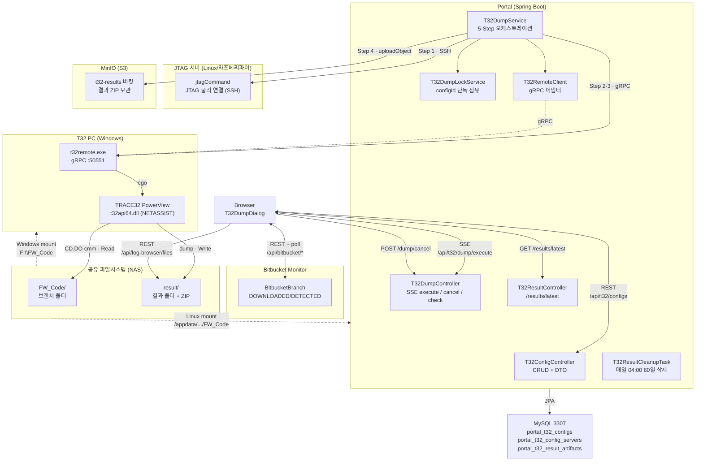
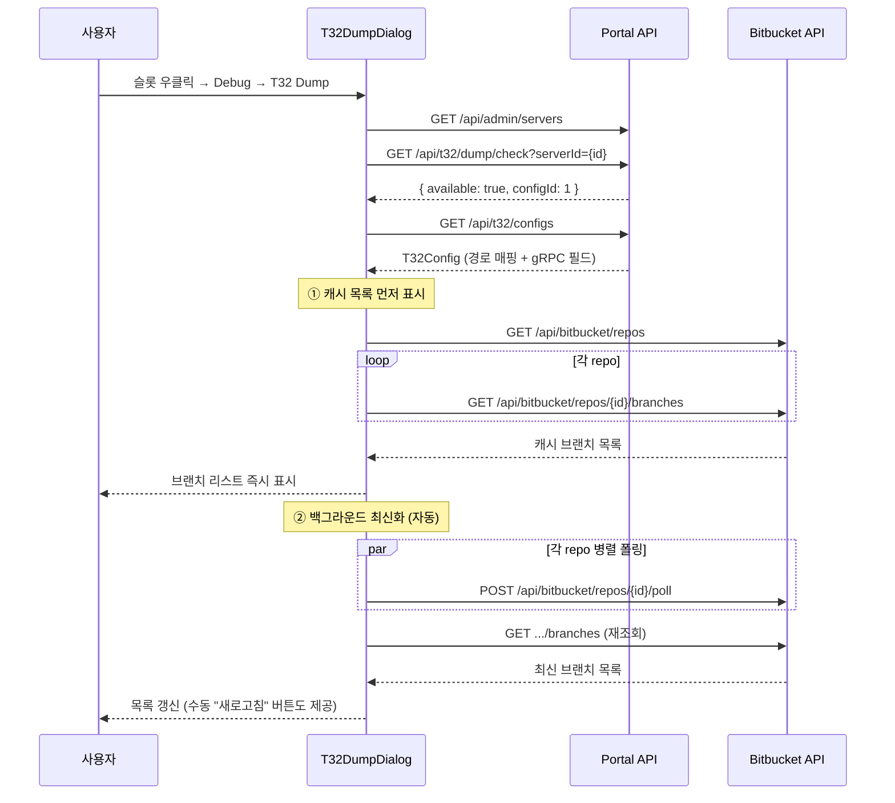
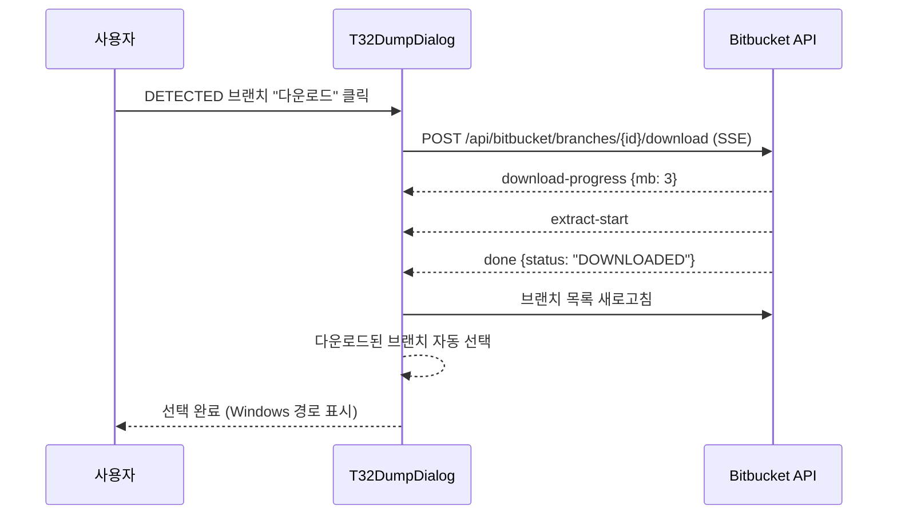
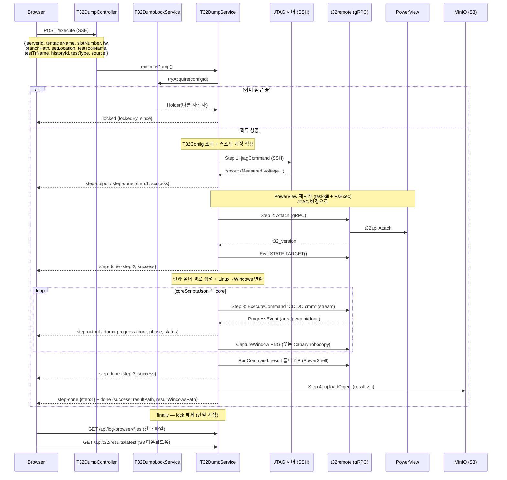

T32 Dump는 슬롯의 UFS 디바이스에 JTAG으로 연결해 코어별 메모리를 덤프하는 기능입니다. **JTAG 서버는 SSH로**, **T32 PowerView는 t32remote(gRPC)로** 제어하며, 결과 ZIP은 MinIO에 보관합니다.

:::note[gRPC 경로가 기본, SSH+bat은 legacy]
`T32Config.t32RemoteHost`/`t32RemotePort`가 채워져 있으면 Step 2·3을 **t32remote gRPC**로 수행합니다(권장). 비어 있으면 옛 **SSH + `.bat`** 경로(`executeStep2Attach`/`executeStep3Dump`)로 폴백합니다. 이 문서는 gRPC 경로 기준으로 설명합니다. t32remote 서비스 자체의 내부 구조는 [t32remote 학습 모듈](/learn/l2-t32remote/)을, 시각화 학습 자료는 [L2 T32 Dump](/learn/l2-t32/)를 참고하세요.
:::

## 1. 시스템 아키텍처



---

## 2. 패키지 구조

```
com.samsung.move.t32
├── entity/
│   ├── T32Config.java               — Lab별 JTAG/T32 인프라 설정 (gRPC 필드 포함)
│   ├── T32ConfigServer.java         — Config ↔ 텐타클 매핑 (N:M)
│   ├── T32ResultArtifact.java       — 업로드된 결과 ZIP 메타데이터
│   ├── T32TestType.java             — COMPATIBILITY / PERFORMANCE
│   ├── T32ResultSource.java         — INTERNAL / OUTSOURCED
│   └── T32ResultArtifactStatus.java — UPLOADING / COMPLETED / FAILED
├── repository/
│   ├── T32ConfigRepository.java
│   ├── T32ConfigServerRepository.java
│   └── T32ResultArtifactRepository.java
├── dto/
│   ├── T32ConfigDto.java            — 서버 이름/IP 해석 + 담당 서버 목록
│   └── T32ResultArtifactDto.java    — bucket/objectKey + 상태
├── grpc/
│   └── T32RemoteClient.java         — t32remote gRPC 어댑터 (Session RAII)
├── controller/
│   ├── T32ConfigController.java     — CRUD + DTO 변환 + 비밀번호 보존
│   ├── T32DumpController.java       — SSE execute + cancel + check
│   └── T32ResultController.java     — /results/latest 조회
└── service/
    ├── T32DumpService.java          — 5-Step 오케스트레이션 + SSE + 경로 변환 + 업로드
    ├── T32DumpLockService.java      — configId 단위 단독 점유 lock
    └── T32ResultCleanupTask.java    — 60일 지난 결과 자동 삭제
```

---

## 3. DB 스키마

### portal_t32_configs

```sql
CREATE TABLE portal_t32_configs (
    id BIGINT AUTO_INCREMENT PRIMARY KEY,

    -- 서버 그룹 & 장비
    serverGroupId BIGINT NOT NULL,         -- FK → portal_server_groups
    jtagServerId BIGINT NOT NULL,          -- FK → portal_servers (JTAG/Linux)
    jtagUsername VARCHAR(100),             -- 전용 계정 (null이면 서버 기본)
    jtagPassword VARCHAR(255),
    t32PcId BIGINT NOT NULL,              -- FK → portal_servers (Windows)
    t32PcUsername VARCHAR(100),
    t32PcPassword VARCHAR(255),

    -- 명령어 템플릿
    jtagCommand VARCHAR(500),             -- {tentacle}, {tentacle_num}, {slot}
    jtagSuccessPattern VARCHAR(500),      -- regex (Step 1 성공 판정, 선택)
    t32PortCheckCommand VARCHAR(500),     -- gRPC 경로: RCL 포트 번호로 재해석 / legacy: attach 확인 명령
    t32_start_command VARCHAR(500),       -- JTAG 변경 후 PowerView 재시작 명령 (PsExec)
    dumpCommand VARCHAR(500),             -- legacy(SSH+bat) 전용: {result_path}, {branch_path}

    -- 경로 매핑
    fwCodeLinuxBase VARCHAR(500),         -- Linux FW 코드 경로
    fwCodeWindowsBase VARCHAR(500),       -- Windows FW 코드 경로
    resultBasePath VARCHAR(500),          -- Linux 결과 저장 경로 (fallback)
    resultWindowsBasePath VARCHAR(500),   -- Windows 결과 저장 경로 (fallback)

    -- gRPC (t32remote) 경로
    t32_remote_host VARCHAR(255),         -- 채워지면 gRPC 경로 사용
    t32_remote_port INT,                  -- t32remote.exe 포트 (예: 50551)
    core_scripts_json TEXT,               -- [{core, cmmRelPath, optionalCommands}, ...]

    -- 기타
    description VARCHAR(500),
    enabled BOOLEAN NOT NULL DEFAULT TRUE,
    createdAt DATETIME,
    updatedAt DATETIME
);
```

:::caution[DDL 수동 적용]
모든 프로파일이 `ddl-auto: validate`라 신규 컬럼(`t32_remote_host`/`t32_remote_port`/`core_scripts_json`/`t32_start_command`)과 신규 테이블(`portal_t32_result_artifacts`)은 `sql/alter-*.sql`/`sql/add-*.sql`로 운영자가 직접 적용해야 합니다. 누락 시 validate가 부팅을 막습니다.
:::

### portal_t32_config_servers

Config와 텐타클의 N:M 매핑 테이블입니다. 하나의 Config에 여러 텐타클을 할당할 수 있습니다.

```sql
CREATE TABLE portal_t32_config_servers (
    id BIGINT AUTO_INCREMENT PRIMARY KEY,
    t32ConfigId BIGINT NOT NULL,           -- FK → portal_t32_configs
    serverId BIGINT NOT NULL,              -- FK → portal_servers (텐타클)
    UNIQUE KEY uk_config_server (t32ConfigId, serverId)
);
```

### portal_t32_result_artifacts

업로드된 결과 ZIP의 위치/상태를 기록합니다. 호환성/성능 history와 `(testType, source, historyId)` **튜플**로 매칭합니다(history 테이블이 `testdb` 데이터소스에 있어 하드 FK 불가).

```sql
CREATE TABLE portal_t32_result_artifacts (
    id BIGINT AUTO_INCREMENT PRIMARY KEY,
    testType VARCHAR(16) NOT NULL,         -- COMPATIBILITY / PERFORMANCE
    source VARCHAR(16) NOT NULL,           -- INTERNAL / OUTSOURCED
    historyId BIGINT,                      -- nullable (history 컨텍스트 없으면 NULL)
    bucket VARCHAR(64) NOT NULL,
    objectKey VARCHAR(1024) NOT NULL,      -- {testType}/{source}/{historyId|nohistory}/{dir}.zip
    sizeBytes BIGINT,
    resultDirName VARCHAR(512),
    setLocation VARCHAR(256),
    testToolName VARCHAR(256),
    testTrName VARCHAR(256),
    status VARCHAR(16) NOT NULL,           -- UPLOADING / COMPLETED / FAILED
    errorMessage TEXT,
    uploadedAt DATETIME,                   -- 60일 보관 기준
    createdAt DATETIME,
    INDEX idx_t32_artifact_history (testType, source, historyId),
    INDEX idx_t32_artifact_uploaded_at (uploadedAt)
);
```

---

## 4. 전체 실행 흐름

### 4-1. Dialog 초기화 (+ 브랜치 자동 최신화)

다이얼로그를 열면 캐시된 브랜치를 먼저 보여주고, 백그라운드로 Bitbucket을 폴링해 최신 브랜치를 받아와 목록을 갱신합니다(scheduled 5분 폴링을 기다리지 않음).



### 4-2. 브랜치 선택 (DETECTED → 다운로드 → 자동 선택)



### 4-3. Dump 실행 (5-Step SSE, gRPC 경로)



---

## 5. 단독 점유 lock

같은 T32 PC를 두 사람이 동시에 만지면 둘 다 깨지므로, **한 번에 한 명만** dump하도록 in-memory lock을 둡니다(RDP 단독 접속 방식).

- **lock 키는 `t32ConfigId`** — serverId가 아니다. 여러 slot이 한 T32 PC(=한 Config)를 공유하기 때문.
- **획득은 dump 시작 전** — 거부되면 `locked` 이벤트만 보내고 즉시 종료.
- **해제는 워커 finally 단일 지점** — 성공/실패/예외/중단 모두 한 곳에서. `release`는 점유자(`userKey`)가 일치할 때만.
- **중단**: `POST /api/t32/dump/cancel`이 워커 스레드를 interrupt → t32remote 세션 close → lock 해제. `emitter.onError`/`onTimeout`(브라우저 종료)도 동일 경로.
- **저장소는 `ConcurrentHashMap` 한 개** — 단일 인스턴스 전제. 재시작 시 lock 초기화(진행 중 dump도 같이 죽어 정합성 OK). 멀티 인스턴스로 확장 시 DB row lock / Redis로 승격.

`check` 단계(`checkAvailability`)가 현재 점유자를 함께 반환해 다이얼로그가 "{lockedBy} 님이 진행 중" 배너로 시작을 미리 차단합니다.

---

## 6. 경로 변환 상세

### 브랜치 경로 (Linux → Windows)

```java
String normalLinux = linuxBase.replaceAll("/$", "");  // 끝 / 제거
if (branchPath.startsWith(normalLinux)) {
    String relative = branchPath.substring(normalLinux.length());
    branchWindowsPath = winBase.replaceAll("[/\\\\]$", "")
                        + relative.replace("/", "\\");
} else {
    branchWindowsPath = branchPath;  // 매핑 실패 시 원본 사용
}
```

예시:
```
입력:    /appdata/samsung/OCTO_HEAD/FW_Code/Savona/Savona_V8_P00RC28
Linux:   /appdata/samsung/OCTO_HEAD/FW_Code  (fwCodeLinuxBase)
Windows: F:\FW_Code                           (fwCodeWindowsBase)
결과:    F:\FW_Code\Savona\Savona_V8_P00RC28
```

### 결과 경로 조합

```java
String datetime = now.format(ofPattern("yyyyMMdd_HH'h'mm'm'ss's'"));  // 20260623_14h05m22s
StringBuilder dirName = new StringBuilder(datetime);
if (setLocation != null)  dirName.append("_").append(setLocation);
if (testToolName != null) dirName.append("_").append(testToolName);
if (testTrName != null)   dirName.append("_").append(testTrName);

// 결과는 선택한 branch 폴더 안에 생성 (없으면 resultBasePath로 fallback)
resultLinuxPath   = branchPath + "/" + dirName;
resultWindowsPath = branchWindowsPath + "\\" + dirName;
```

폴더명에 날짜만이 아니라 **시·분·초**까지 들어가 같은 브랜치로 여러 번 dump해도 구분됩니다.

### Step 3 명령 조립 (gRPC 경로)

`coreScriptsJson`의 각 core마다 `CD.DO`로 cmm을 실행하고, `optionalCommands`의 각 줄을 개별 `ExecuteCommand`로 보냅니다(멀티라인을 한 번에 보내지 않음).

```
core: H-Core, cmmRelPath: scripts/h_core.cmm
→ ExecuteCommand: CD.DO "F:\FW_Code\Savona\...\scripts\h_core.cmm"
→ ExecuteCommand: <optionalCommands 각 줄>
```

---

## 7. Step별 성공/실패 판정 (gRPC 경로)

| Step | 성공 조건 | 실패 조건 |
|------|-----------|-----------|
| **1 · JTAG 연결 (SSH)** | `jtagSuccessPattern` 매칭 → "Measured Voltage" > 0 → exitCode=0 (우선순위) | 모두 불일치 또는 SSH 오류 |
| *(중간)* PowerView 재시작 | best-effort (`t32StartCommand` 있을 때만) | — (실패해도 진행) |
| **2 · T32 Attach (gRPC)** | `attach`의 `t32_version` ≠ 빈값 AND `STATE.TARGET()` 정상 | t32_version 없음(PowerView 미실행/RCL 미설정) 또는 타겟 error/down |
| **3 · Dump 실행 (gRPC)** | core별 `ExecuteCommand` 전부 성공 | 한 명령이라도 실패 |
| **4 · 결과 업로드** | (soft) ZIP을 MinIO에 업로드 | 업로드 실패해도 dump는 성공 — FAILED 기록만 |

타임아웃:
- Step 1 (JTAG): 30초
- Step 2 (Attach): 30초
- Step 3 (Dump): 300초 (명령당)
- SSE emitter 전체: 10분

:::note[legacy(SSH+bat) 판정]
gRPC 필드가 비어 있으면 Step 2는 `t32PortCheckCommand` SSH 실행 후 stdout "Down" 키워드, Step 3는 `dumpCommand` SSH 실행 후 stdout "fail" 키워드로 판정합니다.
:::

---

## 8. SSE 스트리밍 프로토콜

### 엔드포인트

```
POST /api/t32/dump/execute
Content-Type: application/json → text/event-stream;charset=UTF-8
```

`charset=UTF-8`을 명시하지 않으면 한글 실패 사유가 깨집니다.

### 요청 본문

```json
{
  "serverId": 5,
  "tentacleName": "T10",
  "slotNumber": 1,
  "fw": "Savona_V8",
  "branchPath": "/appdata/samsung/OCTO_HEAD/FW_Code/Savona/Savona_V8_P00RC28",
  "setLocation": "T10-1",
  "testToolName": "randwrite",
  "testTrName": "Savona_V8_TLC_512Gb_512GB_P00RC28",
  "historyId": 1234,
  "testType": "COMPATIBILITY",
  "source": "INTERNAL"
}
```

`historyId`/`testType`/`source`는 nullable — history 컨텍스트가 없으면 업로드는 하되 `historyId`를 NULL로 둡니다.

### SSE 이벤트

| 이벤트 | 데이터 | 시점 |
|--------|--------|------|
| `locked` | `{lockedBy, since}` | 다른 사용자가 이미 점유 중 (작업 없이 종료) |
| `step-start` | `{step, name}` | 각 Step 시작 |
| `step-output` | `{step, line}` | 실시간 출력 라인 (SSH stdout / ProgressEvent) |
| `dump-progress` | `{step, core, phase, status}` | Step 3 core별 진행 |
| `step-done` | `{step, status, output}` | Step 완료 또는 실패 |
| `done` | `{success, resultPath, resultWindowsPath, failedStep?}` | 전체 완료 |
| `cancelled` | `{message}` | 사용자 중단 |
| `error` | `{message}` | 예외 오류 |

### dump-progress 이벤트 상세

Step 3 실행 중 core별 진행을 보냅니다. gRPC 경로에서는 `coreScriptsJson`의 core마다 시작·완료를 명시적으로 emit하고, 출력은 t32remote의 `ProgressEvent`를 `formatEvent`로 한 줄로 변환해 `step-output`으로 전달합니다.

```
dump-progress {step:3, core:"H-Core", phase:"dump", status:"running"}
dump-progress {step:3, core:"H-Core", phase:"dump", status:"done"}
```

---

## 9. 결과 보관 (MinIO + cleanup)

Step 3에서 만든 result 폴더 ZIP을 Step 4가 MinIO에 업로드하고 `T32ResultArtifact` 행을 남깁니다.

- **objectKey**: `{testType}/{source}/{historyId|nohistory}/{resultDirName}.zip`
- **상태 전이**: 업로드 전 `UPLOADING` 행 선삽입 → 성공 시 `COMPLETED`(sizeBytes/uploadedAt 기록) / 실패 시 `FAILED`(errorMessage)
- **soft-fail**: 업로드가 실패해도 dump 자체는 성공으로 처리하고 **로컬 result 폴더/ZIP은 보존**(완료 직후 다이얼로그가 그 폴더를 listdir해 스크린샷·Canary report를 보여줌)
- **조회**: `GET /api/t32/results/latest?testType=&source=&historyId=` → 최신 `COMPLETED` 1건의 `bucket`+`objectKey` → 프론트가 기존 MinIO presigned 다운로드 사용
- **cleanup**: `T32ResultCleanupTask`가 매일 04:00 KST에 `uploadedAt` 60일 초과 아티팩트의 S3 객체 + DB row를 함께 삭제 (`t32.result.cleanup-enabled`, `t32.result.retention-days`)

---

## 10. 전용 계정 메커니즘

T32Config에 커스텀 계정이 설정되면 SSH 접속 시 PortalServer 기본 계정 대신 사용합니다:

```java
private PortalServer applyCustomAccount(PortalServer server, String customUsername, String customPassword) {
    if (customUsername == null || customUsername.isBlank()) return server;
    return PortalServer.builder()
            .id(server.getId()).name(server.getName())
            .ip(server.getIp()).sshPort(server.getSshPort())
            .username(customUsername)
            .password(customPassword != null ? customPassword : server.getPassword())
            .build();
}
```

- 원본 PortalServer 엔티티는 변경하지 않음 (복사본 사용)
- JTAG 서버, T32 PC 모두 동일하게 적용
- 비밀번호 빈 문자열로 수정 시 기존 값 유지 (Controller에서 처리)

---

## 11. 프론트엔드 구조

### T32DumpDialog 상태 관리

```
phase: 'idle' | 'running' | 'done' | 'failed'

idle 상태:
├── configLoading → T32 설정 로드 중 (스피너)
├── !t32Available → "설정 없음" 안내
├── busy → "{lockedBy} 님이 진행 중" amber 배너 (시작 차단)
├── branchPath 미선택 → Bitbucket 브랜치 리스트
│   ├── 열 때 캐시 표시 → 백그라운드 폴링으로 자동 최신화 + "새로고침" 버튼
│   ├── bbSearch → 실시간 필터링 (bbFiltered derived)
│   ├── DOWNLOADED 클릭 → selectBranch()
│   ├── DETECTED "다운로드" → SSE → 완료 후 자동 선택
│   └── "직접 찾기" → LogBrowserDialog
└── branchPath 선택됨 → Windows 경로 표시 (toWindowsPath)

running 상태:
├── 4-Step Stepper (step-start → step-output → step-done)
└── "중단" → POST /dump/cancel (lock 해제)

done 상태:
├── 결과 경로 + log-browser 파일 목록
├── 이미지 미리보기 / Canary report 보기
├── "전체 다운로드" (log-browser 폴더 ZIP)
└── "S3에서 다운로드" (/results/latest → MinIO presigned)

failed 상태:
└── 실패 Step + 힌트 + "다시 시도"
```

### Bitbucket 브랜치 자동 최신화

다이얼로그를 열 때(`loadConfig` → `loadBitbucketBranches` → `refreshBitbucketBranches`):

1. `fetchRepos()` + 각 repo `fetchBranches()` → **캐시 목록 즉시 표시**
2. 백그라운드로 각 repo `pollRepo()` 병렬 폴링 → Bitbucket에서 최신 브랜치 감지
3. `fetchBranches()` 재조회 → 목록 갱신 (상태별 정렬: DOWNLOADED → DETECTED → DOWNLOADING → FAILED)
4. 헤더의 **"새로고침"** 버튼으로 수동 재폴링 가능 (주기 polling은 없음)

---

## 12. Debug Type 자동 등록

`DebugTypeInitializer`가 앱 시작 시 `debug_types` DB 테이블과 코드의 `BUILT_IN_TYPES`를 동기화:

- DB에 없으면 → 자동 INSERT
- DB에서 비활성화 → WARN 로그
- 기존 DB 수정사항은 보존 (덮어쓰기 없음)

새 debug type 추가 시: `DebugTypeInitializer.BUILT_IN_TYPES` 추가 → `debugRegistry.ts`에 컴포넌트 등록 → 앱 재시작.

---

## 13. 컨텍스트 메뉴 활성화 조건

```typescript
t32dump: selected.length === 1 && allConn1 && (() => {
    const vmName = selected[0].headData?.setLocation?.match(/^(T\d+)/)?.[1] ?? '';
    return t32AssignedServerNames.has(vmName);
})()
```

3가지 조건이 모두 충족되어야 T32 Dump 메뉴가 활성화됩니다:
1. **단일 슬롯 선택** (`selected.length === 1`)
2. **연결 상태** (`connection = 1`)
3. **해당 텐타클이 T32Config의 assignedServers에 포함**
