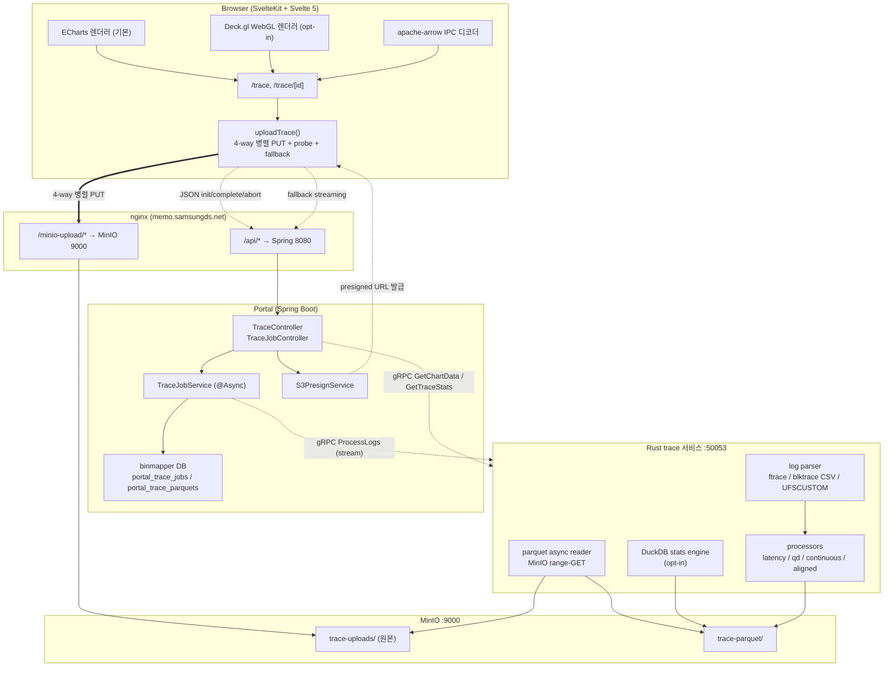
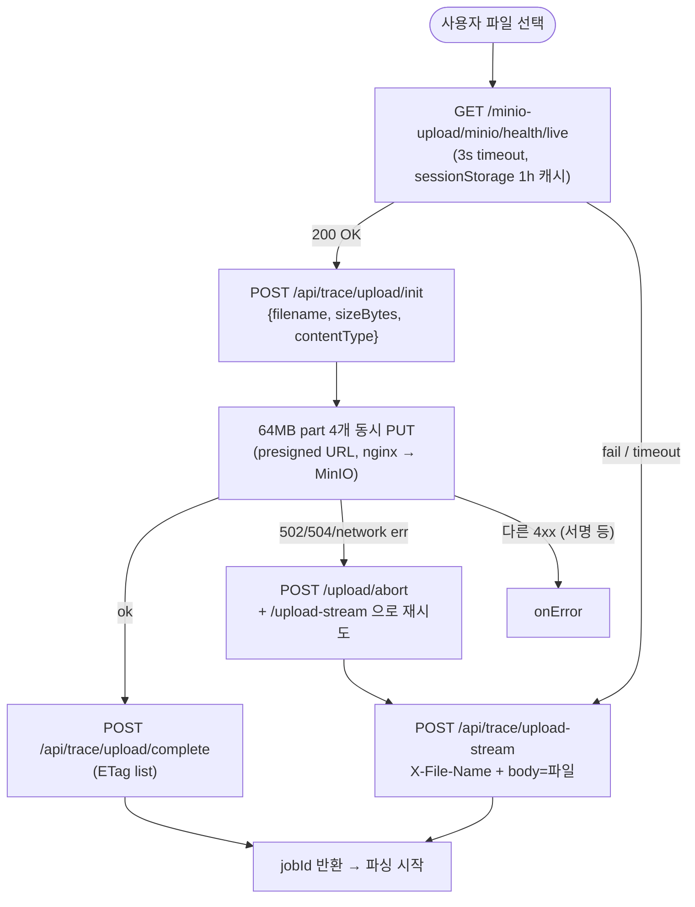
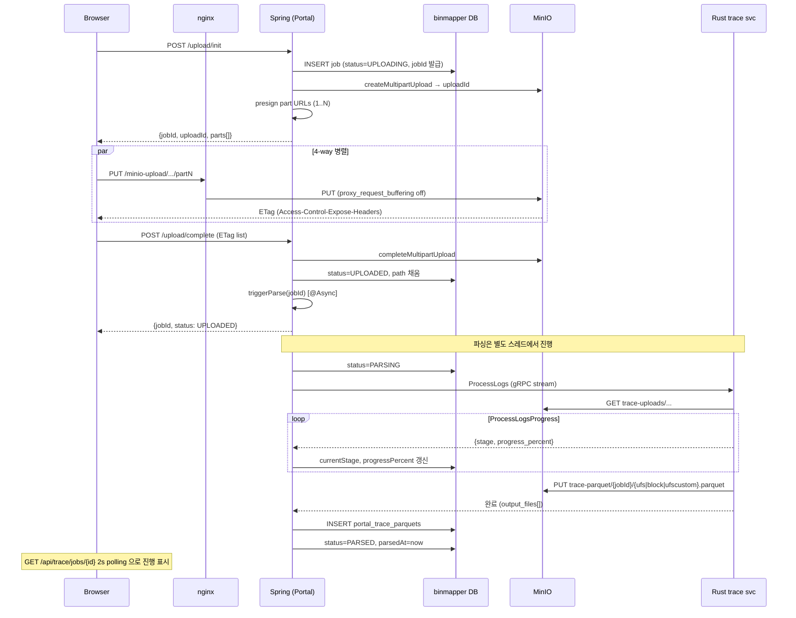
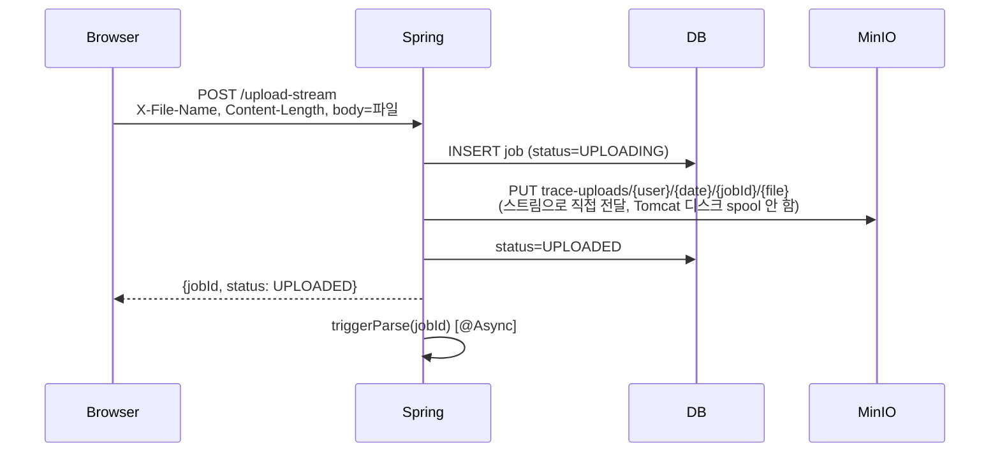
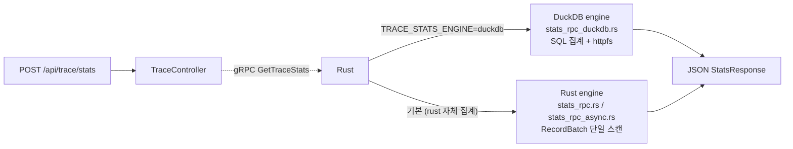

## 1. 시스템 개요

**Trace Analysis** 는 Android/서버에서 수집한 **대용량 I/O trace 로그 (ftrace UFS/block, blktrace CSV, UFSCUSTOM)** 를 업로드하여 parquet 으로 변환하고, 차트 시각화 + 상세 통계로 분석하는 모듈이다. 1M~수천만 이벤트 규모를 대상으로 설계됐다.

### 컴포넌트 구조



### 핵심 설계 결정

| 결정 | 이유 |
|---|---|
| **Rust trace 서비스 분리** | ftrace/blktrace 파싱은 CPU 집약적 (수 GB, 수억 라인). Rust rayon + memmap2 로 단일 바이너리가 GB 급 로그를 수십 초 안에 parquet 으로 변환 |
| **Arrow IPC wire format** | 차트 데이터(시계열 scatter) 는 **컬럼 기반 + 타이프드 배열**. JSON 대비 페이로드 50~80% 감소, 디코딩 1/10 속도 |
| **parquet columnar** | 다른 컬럼 조합으로 재질의(chart/stats/filter) 할 때 **필요한 컬럼만 projection** 으로 I/O 최소화 |
| **MinIO S3 호환** | parquet object 를 range-GET 으로 읽으면 5GB+ 파일도 /tmp 경유 없이 row group 단위 스트리밍 가능 |
| **Feature flag 렌더러** | ECharts (기본, 50k 내외) vs Deck.gl (opt-in, 500k~1M+ WebGL). 릴레이즈 없이 사용자가 env 로 전환 |

---

## 2. 엔드포인트 요약

### 2.1 업로드 4종 (현재 기본은 multipart, 환경에 따라 자동 선택)

| Method | Path | 용도 | 비고 |
|---|---|---|---|
| `POST` | `/api/trace/upload/init` | Presigned multipart 시작 — Job INSERT + S3 multipart 시작 + part 별 presigned URL 응답 | **현재 기본 경로 1단계** |
| `PUT` | `/minio-upload/...` (외부 nginx) | 각 part 를 64MB 단위로 4개 동시 PUT (브라우저 → nginx → MinIO 직행) | Spring JVM 우회 |
| `POST` | `/api/trace/upload/complete` | ETag 모아 S3 complete + 파싱 트리거 | **현재 기본 경로 마무리** |
| `POST` | `/api/trace/upload/abort` | 실패/취소 시 S3 abort + Job 삭제 | 자동 호출 |
| `POST` | `/api/trace/upload-stream` | Spring 경유 raw streaming (X-File-Name 헤더 + body=파일) | **MinIO 직접 PUT 차단 시 자동 fallback** |
| `POST` | `/api/trace/upload` | (legacy) Multipart form-data 전체 통과 | 호환용, 신규 사용 안 함 |

### 2.2 조회 / 분석

| Method | Path | 용도 | 응답 |
|---|---|---|---|
| `GET` | `/api/trace/jobs` | **모든 사용자** Job 목록 (owner 필드 포함) | `TraceJob[]` (with `ownerUsername` / `ownerDisplayName` / `mine` / `canModify`) |
| `GET` | `/api/trace/jobs/{id}` | Job 상세 (parquets 포함) | `TraceJob` |
| `DELETE` | `/api/trace/jobs/{id}` | Job + MinIO 파일 + parquet row 삭제 — **owner 또는 admin** | `{ success }` |
| `POST` | `/api/trace/jobs/{id}/reparse` | 기존 원본으로 재파싱 — **owner 또는 admin** | `{ success, jobId, status }` |
| `POST` | `/api/trace/chart` | Arrow IPC 차트 데이터 | `application/vnd.apache.arrow.stream` + `X-Trace-*` 헤더 |
| `POST` | `/api/trace/stats` | 상세 통계 (Latency/CMD/Histogram/SizeCount) | JSON |

---

## 3. 데이터 모델

### 3.1 DB 스키마 (binmapper@3307)

```sql
CREATE TABLE portal_trace_jobs (
    id BIGINT AUTO_INCREMENT PRIMARY KEY,
    userId VARCHAR(64) NOT NULL,
    originalFilename VARCHAR(512) NOT NULL,
    uploadBucket VARCHAR(64) NOT NULL,
    uploadPath VARCHAR(1024) NOT NULL,
    parquetBucket VARCHAR(64) NOT NULL,
    parquetPrefix VARCHAR(512) NOT NULL,
    sizeBytes BIGINT,
    status VARCHAR(16) NOT NULL,            -- UPLOADED / PARSING / PARSED / FAILED
    progressPercent INT,
    currentStage VARCHAR(32),               -- DOWNLOADING / PARSING / CONVERTING / UPLOADING / COMPLETED / FAILED
    errorMessage TEXT,
    createdAt DATETIME,
    parsedAt DATETIME,
    INDEX idx_trace_jobs_user_created (userId, createdAt)
);

CREATE TABLE portal_trace_parquets (
    id BIGINT AUTO_INCREMENT PRIMARY KEY,
    jobId BIGINT NOT NULL,
    traceType VARCHAR(16) NOT NULL,         -- ufs | block | ufscustom
    parquetPath VARCHAR(1024) NOT NULL,
    totalEvents BIGINT,
    schemaVersion VARCHAR(32),
    sizeBytes BIGINT,
    createdAt DATETIME,
    UNIQUE KEY uk_trace_parquet_job_type (jobId, traceType),
    FOREIGN KEY (jobId) REFERENCES portal_trace_jobs(id) ON DELETE CASCADE
);
```

### 3.2 Parquet 스키마

**UFS (ufs-v1)**:

| 컬럼 | 타입 | 설명 |
|---|---|---|
| `time` | Float64 | ms 단위 timestamp |
| `process` | Utf8 | 프로세스 이름 |
| `cpu` | UInt32 | CPU 코어 번호 |
| `action` | Utf8 | `send_req` / `complete_rsp` |
| `tag` | UInt32 | UFS command tag |
| `opcode` | Utf8 | SCSI opcode (0x28=READ_10, 0x2a=WRITE_10, …) — 차트에서 `cmd` 로 매핑 |
| `lba` | UInt64 | Logical Block Address |
| `size` | UInt32 | I/O 크기 (바이트) |
| `groupid` | UInt32 | CP group id |
| `hwqid` | UInt32 | MCQ HWQ ID (MCQ 미사용 시 0) |
| `qd` | UInt32 | Queue Depth (send +1 / complete -1) |
| `dtoc` | Float64 | Dispatch→Complete latency (ms, complete 이벤트) |
| `ctoc` | Float64 | Complete→Complete latency (ms) |
| `ctod` | Float64 | Complete→Dispatch latency (ms, send 이벤트) |
| `continuous` | Bool | 이전 complete 의 (lba + size) == 현재 lba |
| `aligned` | Bool | lba % 8 == 0 && size % 8 == 0 (UFS 4KB 정렬) |

**Block (block-v1)**:

- UFS 와 구조 동일, 단 `lba` → `sector` naming. `opcode` → `io_type` (RA/R/W/FF/D 등).
- `chart_rpc::build_chart_batch_block` 에서 **공용 스키마로 리네임** (sector→lba, io_type→cmd).
- Flush/size=0/sector=u64::MAX 케이스는 **파싱 단계에서 sector=0 정규화** (`log_common::normalize_sector`).

**UFSCUSTOM (ufscustom-v1)**:

| 컬럼 | 타입 | 비고 |
|---|---|---|
| `opcode` | Utf8 | cmd 매핑 |
| `lba` | UInt64 | |
| `size` | UInt32 | |
| `start_time` | Float64 | **time 으로 매핑** (chart/stats) |
| `end_time` | Float64 | |
| `dtoc` | Float64 | |
| `start_qd` | UInt32 | |
| `end_qd` | UInt32 | **qd 로 매핑** |
| `ctoc` | Float64 | |
| `ctod` | Float64 | |
| `continuous` | Bool | |

- **`action` 컬럼 없음** → chart/stats 변환 시 `action="complete"` 고정 (Action 탭 비활성)
- **`cpu` 컬럼 없음** → 차트 변환 시 `cpu=0` 채움, 프론트에서 CPU 차트 제외

---

## 4. 업로드 · 파싱 플로우

### 4.1 클라이언트 측 분기 (probe → multipart / fallback)

다이얼로그가 업로드를 시작하면 `lib/api/trace.ts::uploadTrace` 가 다음 순서로 동작:



**핵심 의도**:

- 정상 환경: presigned multipart **4-way 병렬** 으로 1GB 파일을 ~3-5배 빠르게 업로드
- `/minio-upload/` 차단 환경: probe 가 **3초 안에 감지** 하고 곧장 `/upload-stream` 으로 직행
- 정상이라 판단됐는데 첫 PUT 부터 502/504 인 경우: multipart abort + `/upload-stream` 으로 자동 폴백

UploadStage 는 `'probing' → 'init' → 'uploading' → 'finalizing'` 또는 `'probing' → 'fallback'` 으로 흐른다. 다이얼로그가 단계 라벨과 progress 를 그대로 받아 표시.

### 4.2 서버 측 — multipart 정상 경로



### 4.3 fallback (`/upload-stream`)



`/upload-stream` 은 multipart parser 를 우회해 `request.getInputStream()` 을 그대로 MinIO putObject 에 흘려보낸다. 4-way 병렬은 못 하지만 **Spring JVM heap 압박이 거의 없고** 모든 환경에서 동작.

### 4.4 주요 포인트

- **선 INSERT 후 업로드**: jobId 를 먼저 발급받아 MinIO 경로에 포함 → id 기반 고유성 보장
- **@Async 파싱**: upload 요청은 즉시 응답 반환, 파싱은 백그라운드 스레드. Portal 재시작 시 PARSING 중이던 job 은 그대로 남아있으며, 복구는 수동 `POST /reparse` 로
- **Rust ProcessLogs 스트리밍**: `stage` 값 (`DOWNLOADING` → `PARSING` → `CONVERTING` → `UPLOADING` → `COMPLETED`) 과 `progress_percent` (0~100) 를 DB 에 실시간 반영 → 프론트 2초 polling 으로 진행 단계 표시
- **Reparse**: 기존 원본은 `trace-uploads` 에 남아있으므로 파서 로직 변경 시 재파싱만으로 새 parquet 생성. `status=UPLOADED` 로 되돌리고 `triggerParse` 재호출 (owner / admin 만)
- **owner / admin 권한 분리**: 업로드한 본인 + admin 만 삭제/재파싱. 일반 사용자는 모든 Job 의 차트/통계 조회만 가능 (전체 공개)

### 4.5 nginx 의존 (multipart 경로)

`/minio-upload/` location 블록이 운영 nginx 에 추가되어 있어야 함:

```nginx
location /minio-upload/ {
    proxy_pass http://10.227.161.124:9000/;
    proxy_set_header Host $host;
    proxy_request_buffering off;     # 필수 — 64MB part 를 메모리/디스크에 쌓지 않음
    proxy_buffering off;
    client_max_body_size 0;
    proxy_read_timeout 3600s;
    add_header Access-Control-Expose-Headers ETag always;
}
```

자세한 운영 가이드: `portal/docs/nginx-trace-upload.md`

---

## 5. 차트 데이터 파이프라인 (Arrow IPC)

### 5.1 Wire Format

`POST /api/trace/chart` 요청 흐름:

```
요청(parquetId + filter + timeRange + targetPoints)
    ↓
Portal TraceController
    ↓ gRPC GetChartData
Rust chart_rpc
    ↓
parquet projection + row-filter (time)
    ↓
apply_filters (action / lba / qd / dtoc / ctoc / ctod)
    ↓
build_chart_batch_(ufs|block|ufscustom)   ← 공용 10컬럼 스키마
    ↓
time_bucket_decimate               ← target_points 만큼 샘플링
    ↓
compute_stats (dtoc, ctod, ctoc, qd × min/max/avg/p50/p95/p99)
    ↓
Arrow IPC StreamWriter (bytes)
    ↓
Portal 응답: application/vnd.apache.arrow.stream + X-Trace-* 헤더
    ↓
Browser: tableFromIPC (apache-arrow)
```

**응답 구조**:

- Body: `bytes arrow_ipc` — Arrow IPC stream (schema + 1개 RecordBatch)
- Headers:
  - `X-Trace-Total-Events`: 필터 후 다운샘플 전 총 이벤트 수
  - `X-Trace-Sampled-Events`: 다운샘플 후 실제 렌더 포인트 수
  - `X-Trace-Schema-Version`: `ufs-v1` / `block-v1` / `ufscustom-v1`
  - `X-Trace-Stats`: Base64(JSON) — `{dtoc, ctod, ctoc, qd}` 각각 min/max/avg/p50/p95/p99/count

### 5.2 Arrow Batch 컬럼 (공용 스키마)

모든 trace_type 이 동일 10개 컬럼으로 정규화되어 프론트 코드 재사용:

| 컬럼 | 타입 | 비고 |
|---|---|---|
| `time` | Float64 | ms |
| `action` | Utf8 | send/complete 구분 (UFSCUSTOM 은 모두 "complete") |
| `lba` | UInt64 | (Block 은 sector → lba 로 리네임) |
| `size` | UInt32 | |
| `qd` | UInt32 | |
| `dtoc` / `ctoc` / `ctod` | Float64 | ms |
| `cpu` | UInt32 | UFSCUSTOM 은 0 채움 |
| `cmd` | Utf8 | UFS=opcode, Block=io_type, UFSCUSTOM=opcode |

### 5.3 다운샘플링 (time-bucket decimation)

`src/utils/downsample.rs::time_bucket_decimate` — `target_points` 만큼 시간 버킷으로 나누고 각 버킷에서:

- 첫 인덱스 (bucket_first)
- 마지막 인덱스 (bucket_last)
- `qd` 최대 인덱스 (bucket_argmax) — QD spike 보존

→ 한 버킷당 최대 3개. 전체 응답은 `target_points × 3` 이내. `n ≤ target_points × 3` 이면 원본 그대로.

**시간 분포 편향이 큰 로그**에서는 많은 버킷이 비어 실제 반환이 `target_points` 보다 한참 적을 수 있음 (예: 160만 이벤트 → 3,869 샘플). 이 경우 프론트에서 `targetPoints` 를 올리거나 더 나은 알고리즘(LTTB 등) 필요.

### 5.4 gRPC Payload 크기 제한

- Rust 서버: `.max_decoding_message_size(256MB)` / `.max_encoding_message_size(256MB)`
- Portal 클라이언트: `spring.grpc.client.channels.trace-service.max-inbound-message-size: 256MB`
- 1M targetPoints + 10 컬럼 ≈ 80~120MB Arrow IPC → 256MB 상한은 약 2M 까지 안전

---

## 6. 상세 통계 파이프라인 (`/api/trace/stats`)

### 6.0 stats 엔진 분기

환경변수 `TRACE_STATS_ENGINE` 으로 두 구현체 중 선택:



| 엔진 | 강점 | 비고 |
|---|---|---|
| **rust (기본)** | 외부 의존 없음, async reader 와 통합 | UFS 600K 이벤트 cold 1.82s / warm 449ms |
| **duckdb (opt-in)** | SQL 집계 표현력, 향후 스키마 확장 용이 | `httpfs` extension 으로 MinIO 직접 read, 동일 응답 구조 유지 |

응답 proto 스키마는 두 엔진이 동일 — Portal/Frontend 무변경. 운영 전환은 Rust 서비스 환경변수만 토글.

### 6.1 계산 항목

`output/stats_rpc.rs::build_payload` 가 하나의 `RecordBatch` 스캔으로 다음을 동시에 산출:

- **Overview**: total / send_count / duration (초)
- **Ratio**: continuous / aligned (%)
- **I/O Amount**: read / write / discard total bytes
- **Latency 4종** (dtoc / ctod / ctoc / qd): min/max/avg/stddev/median/p99/p999/p9999/p99999/p999999
- **CMD 별 stats**: count / send / ratio / totalSize / continuous / 4 latency
- **Latency Histogram**: cmd × latency_type 별 버킷 카운트
- **CMD + Size count**: cmd × size 별 건수

정렬 기반 percentile (sort + linear interpolation). 별도 라이브러리 없음.

### 6.2 action_pair 결정

trace_type + 실제 리터럴 스캔으로 request/complete action 결정:

| trace_type | request | complete |
|---|---|---|
| `ufs` | `send_req` | `complete_rsp` |
| `block` (ftrace) | `block_rq_issue` | `block_rq_complete` |
| `block` (blktrace CSV) | `Q` | `C` |
| `ufscustom` | (없음, 빈 문자열) | `complete` 고정 |

### 6.3 연산 정의

- **continuous**: 이전 complete 이벤트의 `lba + size == 현재 이벤트 lba` (cmd 그룹 내). Parser/processor 단계에서 이미 계산된 `continuous` 컬럼이 있으면 재사용, 없으면 stats 계산 시 fallback
- **aligned**: `lba % 8 == 0 && size % 8 == 0` (UFS 4KB 정렬 기준)
- **sector_bytes**: UFS/UFSCUSTOM=4096, Block=512 (read/write/discard total 바이트 환산)

### 6.4 Latency Histogram

`latency_ranges_ms` 파라미터로 버킷 경계 지정 (기본 `[0.1, 0.5, 1, 5, 10, 50, 100, 500, 1000]`). cmd × latency_type (`dtoc`/`ctoc`/`ctod`) 별로 각 버킷 count. 0 값은 제외.

---

## 7. Async Streaming Parquet Reader (5GB+ 대응)

### 7.1 문제

기존 sync 경로 (`chart_rpc.rs`):

```
MinIO GET (전체 파일) → /tmp/chart_data_{uuid}.parquet
  → File::open → ParquetRecordBatchReaderBuilder (sync)
  → concat_batches
```

5GB 파일에서:
- **/tmp I/O 비용**: 5GB write + 5GB read = 10GB disk I/O
- **메모리 피크**: concat_batches 가 전체 프로젝션을 한 번에 materialize
- **응답 지연**: 다운로드 완료까지 첫 바이트 도착 시간 선형 증가

### 7.2 설계

**환경변수 `TRACE_PARQUET_READER`** 로 분기:

- `unset` 또는 `sync` (기본): 기존 sync 경로 유지 (회귀 0)
- `async`: MinIO range-GET 기반 streaming read (5GB+ parquet 최적)

**async 경로 흐름**:

```
head_object → 파일 크기 조회
    ↓
tail 64KB range-GET
    ↓
footer length 파싱 (마지막 4바이트 u32)
    ↓
필요 시 추가 range-GET (footer 가 64KB 초과)
    ↓
ParquetMetaData 로드 (S3 요청 1~2회)
    ↓
ParquetRecordBatchStream (row group 단위 async)
    ↓
projection + row-filter → chunk 별 range-GET
    ↓
stream.next().await → batch 하나씩 수신
    ↓
concat → ChartPayload
```

### 7.3 구현 모듈

| 파일 | 역할 |
|---|---|
| `storage/minio_client.rs` | `head_object(path) → content_length`, `get_object_range(path, start, end) → bytes` 추가 |
| `output/parquet_async.rs` | `MinioParquetReader` — `AsyncFileReader` trait 구현. `get_bytes(range)` 위임, `get_metadata()` 는 2-step fetch |
| `output/chart_rpc_async.rs` | UFS/Block/UFSCUSTOM chart payload async builder |
| `output/stats_rpc_async.rs` | Stats async builder. `continuous` 컬럼 optional 처리 (구 parquet 호환) |
| `grpc/server.rs` | `get_chart_data`/`get_trace_stats` 핸들러 양쪽에 sync/async 분기 |

### 7.4 검증

- async 모드 기동 후 `/tmp/chart_data_*.parquet` 생성 0건 확인
- 로그: `[GetChartData] reader=async (range-GET)` / `[GetTraceStats] reader=async (range-GET)`
- 체감 응답 시간 감소 (sync 대비 첫 바이트 도착 빨라짐)

### 7.5 활성화

`run_grpc.sh` 에서 환경변수로 제어:

```bash
export TRACE_PARQUET_READER=async   # 활성
# export TRACE_PARQUET_READER=       # 미설정 시 기본 sync
```

**회귀 방지**: 기본값은 sync. 운영 배포 시점에는 async 로 전환하되 문제 시 env 제거로 즉시 롤백 가능.

---

## 8. 프론트엔드 렌더러 (ECharts / Deck.gl)

### 8.1 Feature Flag

`import.meta.env.VITE_TRACE_RENDERER` 값에 따라 분기:

- `echarts` (기본, unset 포함) — 기존 ECharts 경로, `TraceChartView.svelte`
- `deckgl` (opt-in) — Deck.gl WebGL 경로, `TraceChartViewDeck.svelte` **dynamic import** (flag off 사용자는 deck.gl 번들 미다운로드)

### 8.2 공용 props 인터페이스

두 렌더러는 동일 props 받음 — 교체가 자유로움:

```typescript
interface Props {
    series: { time, lba, qd, cpu, dtoc, ctoc, ctod, action, cmd };
    meta: ChartMeta | null;
    traceType: 'ufs' | 'block' | 'ufscustom';
    zoomed: boolean;
    onZoomChange: (startMs, endMs) => void;
    onResetZoom: () => void;
    onBrushSelected?: (range) => void;
}
```

### 8.3 ECharts 경로 (`TraceChartView.svelte`)

- 6 scatter (LBA / Queue Depth / CPU / DtoC / CtoD / CtoC)
- 사이드바: Action 탭 (send / complete / all) + 차트 visible 토글
- cmd 색상: `cmdColors.ts::createCmdColorAssigner` — SCSI opcode + **prefix 우선 매칭**
  - 전체 단어 매칭이 우선 (`discard`/`trim`/`unmap` → 보라, `flush`/`sync` → 초록, `write`/`read`)
  - 그 외엔 첫 글자(prefix) 로 분류 — Rust block parser 가 `io_type` 첫 글자(R/W/D/F)로 분류하는 것과 동일 규칙
  - Read (0x28 / R / RA / RM …) → 파랑
  - Write (0x2a / W / WS / WSM / WSF …) → 주황·빨강
  - Flush (0x35 / F / FF / FUA …) → 초록
  - Discard (0x42 / D / DV …) → 보라
  - Other → 회색
- Legend (우측 세로) 토글 → 모든 차트 동기화
- Brush 드래그 (우클릭 → 영역선택 메뉴 → pointer drag → pixel→data 역변환) → `onBrushSelected` 상위 전파
- CPU 차트 2모드: `CMD`(Y=CPU 0~8 고정, 색상=cmd) / `LBA`(Y=LBA, 색상=CPU 0~7 고정 팔레트)
- 차트 높이 리사이즈 (`resize: vertical` + ResizeObserver, 모든 차트 동기화)

### 8.4 Deck.gl 경로 (`deckgl/`)

구성 파일:

- `DeckScatterChart.svelte` — 단일 차트 (canvas + Deck 인스턴스 + SVG overlay)
- `TraceChartViewDeck.svelte` — 6차트 wrapper (ECharts 경로와 동일 구조)
- `buildPointData.ts` — series → Float32Array / Uint8Array (binary attribute)
- `useScales.ts` — d3-scale 기반 tick 생성
- `viewState.ts` — OrthographicView target/zoom ↔ data domain
- `chartSync.svelte.ts` — 차트 간 xDomain / legend / cpuMode 공유 store
- `AxisOverlay.svelte` — SVG x/y 축
- `LegendOverlay.svelte` — 우측 세로 cmd 토글
- `BrushOverlay.svelte` — 우클릭 활성 → 사각형 drag

**성능**: `ScatterplotLayer` binary attribute mode — 1M 포인트 60fps, 10M 까지 확장 가능 (GPU 메모리 한계).

**차트 간 동기화**: `chartSync.xDomain` store 변경 시 모든 차트의 `initialViewState` 재계산. 자기가 zoom 한 차트는 `suppressViewStateReset` 플래그로 자기 view 유지.

### 8.5 Arrow IPC 디코딩

`lib/utils/arrow-decoder.ts`:

- `tableFromIPC(bytes)` — 응답 파싱
- `columnAsNumbers(table, name)` — BigInt(UInt64) → Number 다운캐스트
- `columnAsStrings(table, name)` — Utf8 → string[]

---

## 9. Filter 시스템

### 9.1 공용 DTO

`TraceFilterDto` (Portal) / `TraceFilter` (프론트) — Chart + Stats 공용 12개 필드:

```java
record TraceFilterDto(
    Double timeStartMs, Double timeEndMs,
    Double minDtoc, Double maxDtoc,
    Double minCtoc, Double maxCtoc,
    Double minCtod, Double maxCtod,
    Long startLba, Long endLba,
    Integer minQd, Integer maxQd
) {}
```

### 9.2 Brush → Filter 매핑

차트 우클릭 → "영역 선택" → drag 완료 시 `{timeMin, timeMax, yMin, yMax, chartKey}` → `+page.svelte::handleBrushSelected` 에서 `chartKey` 기준으로 filter 필드 자동 채움:

| chartKey | Y 범위 매핑 |
|---|---|
| `lba` | `startLba` / `endLba` |
| `qd` | `minQd` / `maxQd` |
| `dtoc` | `minDtoc` / `maxDtoc` |
| `ctod` | `minCtod` / `maxCtod` |
| `ctoc` | `minCtoc` / `maxCtoc` |
| `cpu` | Y 스킵 (CPU 필터 필드 없음, X 만) |

X 범위는 모든 차트 공통 — `timeStartMs` / `timeEndMs` 저장. Filter bar 자동 펼침 + Chart + Stats 자동 재조회.

### 9.3 Proto 매핑

Portal `buildFilterOptions(TraceFilterDto)` 가 `FilterOptions` proto 로 변환. Rust `apply_filters` 가 time range (row-filter 와 별도 안전장치) / LBA range / QD / 3개 latency 범위를 Arrow `BooleanArray` mask 로 조합해 `filter_record_batch`.

---

## 10. UI/UX 패턴

### 10.1 레이아웃 (paneforge)

3-pane:

1. 좌측 Jobs 리스트 (기본 20%, 14~40% resize, collapse/완전숨김 3단계)
2. 메인: 툴바 + Filter bar + Raw Chart / Statistics 탭
3. localStorage 에 크기 자동 저장 (`autoSaveId="trace-layout"`)

**Job 선택 시**: 좌측 패널 자동 `collapse()` — 분석 공간 확보 (사용자가 이미 접었으면 유지).

### 10.2 자동 polling

`jobs` 중 `PARSING` 또는 `UPLOADED` 상태가 있으면 2초 주기로 `listJobs()` 호출. 모두 `PARSED`/`FAILED` 가 되면 interval 자동 정리. 선택 Job 의 status/progress 도 리스트에 싱크.

### 10.3 에러 인간화

`friendlyError.ts::toFriendlyError(err)` — 9가지 패턴 매칭으로 `{ title, hint, detail }` 변환. `FriendlyErrorBox.svelte` 가 다시 시도 버튼 + 접힌 detail 노출.

예: `OUT_OF_RANGE` → "차트 데이터가 너무 커요 · Samples 값을 줄이거나 시간 범위를 좁혀서 다시 시도해 주세요"

### 10.4 Stats 탭 자동 로드 (병렬)

Job 선택 시 차트(`/api/trace/chart`) + 통계(`/api/trace/stats`) 를 **동시에 시작** 한다. 사용자가 곧장 Statistics 탭을 클릭해도 이미 fetch in-flight → 즉시 표시. 차트 탭만 보면 stats 결과는 백그라운드에 캐시. Brush / Filter 변경 시에도 동일하게 두 요청이 동시에 나간다.

### 10.5 단계 표시 (업로드 + 파싱 양쪽)

| 영역 | 표시 |
|---|---|
| **업로드 다이얼로그** | `probing` → `init` → `uploading (XX%)` → `finalizing` → 닫힘. fallback 시 `fallback (XX%)` |
| **Job 리스트** | `다운로드 45%` / `파싱 80%` 등 `currentStage` + `progressPercent` |
| **상단 툴바** | 선택 Job 이 진행 중이면 스피너 + 단계. 진행 중 재파싱/삭제 비활성 |

### 10.6 Owner 필터

Job 리스트 상단에 owner 필터 (전체 / 내 Job / 사용자별 dropdown). `ownerOptions` 는 현재 jobs 목록의 username + displayName 으로 자동 구성. `auth.username` 이 있을 때만 "내 Job" 활성. 필터 적용 시 카운트 표시는 `filtered / total` 형태.

---

## 11. 성능 가이드

### 11.1 파일 크기별 권장 설정

| 파일 크기 | 권장 설정 | 메모 |
|---|---|---|
| ~500MB | 기본 sync reader | /tmp 충분 |
| 500MB~2GB | sync 또는 async 선택 | sync 가 체감 큰 차이 없음 |
| 2GB~5GB | async 권장 | /tmp 여유 부족 가능 |
| 5GB+ | **async 필수** | sync 경로는 실용 불가 |

### 11.2 Samples 선택

- 50k (ECharts 기본) — 10M 이벤트에서 시각 품질 OK
- 500k~1M (Deck.gl) — 시계열 밀도 표현 정확

---

## 12. 제약 / 주의

- **schema_version 잠금**: `chart_rpc.rs` 의 batch 컬럼 순서/타입이 변경되면 프론트 decoder 호환성 깨짐. 변경 시 `SCHEMA_VERSION_*` 상수 업데이트 + 프론트 버전 체크 추가
- **cancel 전파**: 프론트 `AbortController` 로 요청 취소해도 Rust `spawn_blocking`/`spawn` 은 계속 돎 (당장 수용)
- **UFS MCQ QD 해석**: 현재 processor 는 단일 카운터 (send +1 / complete -1). MCQ 환경에서 hwqid 별 분리하고 싶으면 `processors/ufs.rs` 수정 필요 (현 시점엔 전체 outstanding 으로 표시)
- **MinIO endpoint 일치**: Portal dev 프로파일과 Rust `run_grpc.sh` 의 `MINIO_ENDPOINT` 가 서로 다르면 Portal 이 업로드한 파일을 Rust 가 못 읽음. 운영/개발 같은 MinIO 인스턴스를 가리키도록 설정

---

## 13. Critical Files

### Portal (Spring Boot)

- `com.samsung.move.trace.controller.TraceController` — Chart / Stats REST
- `com.samsung.move.trace.controller.TraceJobController` — Upload (4종) / List / Reparse / Abort
- `com.samsung.move.trace.service.TraceJobService` — 파싱 오케스트레이션 (`uploadAndParse`, `uploadAndParseStream`, `initMultipartUpload`, `completeMultipartUpload`, `abortMultipartUpload`)
- `com.samsung.move.minio.service.S3PresignService` — presigned URL 발급
- `com.samsung.move.minio.config.MinioProperties` — `public-endpoint` (브라우저용 presigned URL host)
- `com.samsung.move.trace.TraceGrpcClient` — Rust 래퍼
- `com.samsung.move.trace.entity.{TraceJob, TraceParquet}` — JPA
- `com.samsung.move.trace.dto.{ChartRequestDto, StatsRequestDto, TraceFilterDto, TraceUploadDtos}` — API 입력
- `src/main/proto/trace_service.proto` — Rust proto 미러
- `sql/add-trace-jobs.sql` — DDL
- `docs/nginx-trace-upload.md` — 운영팀 nginx 설정 가이드

### Frontend (SvelteKit)

- `routes/trace/+page.svelte` — 목록 페이지 (DataTable + 업로드 다이얼로그 + owner 필터)
- `routes/trace/[jobId]/+page.svelte` — 분석 페이지 (차트 + 통계 + filter)
- `routes/trace/TraceJobsTable.svelte` — Job 목록 테이블
- `routes/trace/TraceChartView.svelte` — ECharts 렌더러
- `routes/trace/TraceStatsView.svelte` — 통계 탭
- `routes/trace/cmdColors.ts` — cmd 색상 매핑 (공용, prefix 우선 매칭)
- `routes/trace/friendlyError.ts` + `FriendlyErrorBox.svelte` — 에러 인간화
- `routes/trace/deckgl/*` — Deck.gl 렌더러
- `lib/api/trace.ts` — 업로드 (probe + multipart + fallback) + Chart/Stats API 클라이언트
- `lib/utils/arrow-decoder.ts` — Arrow IPC 디코더

### Rust trace 서비스

- `proto/log_processor.proto` — gRPC 스키마
- `src/grpc/server.rs` — gRPC 핸들러 (ProcessLogs / GetChartData / GetTraceStats)
- `src/output/chart_rpc.rs` / `chart_rpc_async.rs` — 차트 payload builder
- `src/output/stats_rpc.rs` / `stats_rpc_async.rs` — Rust 자체 통계 builder (기본 엔진)
- `src/output/stats_rpc_duckdb.rs` — DuckDB 기반 통계 builder (`TRACE_STATS_ENGINE=duckdb`)
- `src/output/parquet_async.rs` — MinIO range-GET AsyncFileReader
- `src/utils/downsample.rs` — time-bucket decimation
- `src/parsers/log_common.rs` — ftrace / blktrace CSV 파서 (`normalize_sector` 포함)
- `src/processors/{ufs, block, ufscustom}.rs` — latency / continuous / aligned 계산
- `src/storage/minio_client.rs` — `head_object`, `get_object_range`
