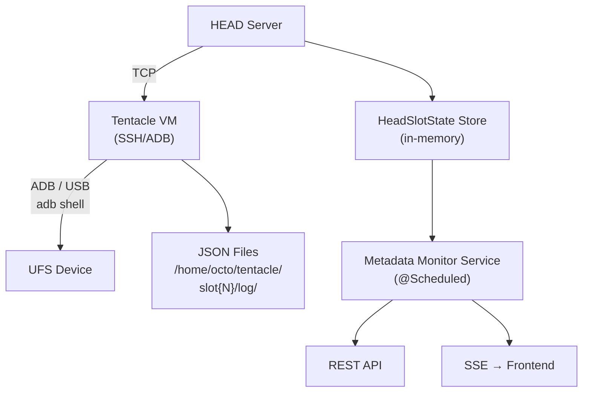
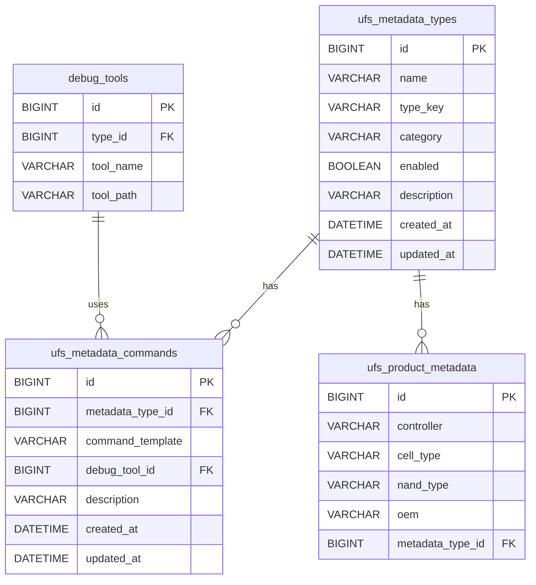
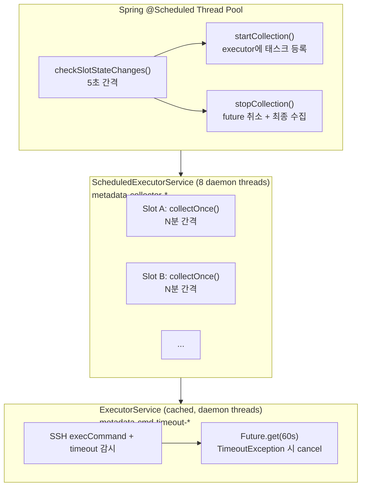

## 시스템 구성



## 백엔드 패키지 구조

```
com.samsung.portal.metadata
├── config/
│   └── MetadataCollectionProperties.java    # 수집 설정 (간격, 활성화 등)
├── entity/
│   ├── UfsMetadataType.java                 # 메타데이터 타입 (SSR, Telemetry 등)
│   ├── UfsMetadataCommand.java              # 타입별 실행 명령어
│   └── UfsProductMetadata.java              # 제품-타입 매핑
├── repository/
│   ├── UfsMetadataTypeRepository.java
│   ├── UfsMetadataCommandRepository.java
│   └── UfsProductMetadataRepository.java
├── service/
│   ├── MetadataMonitorService.java          # 핵심: 상태 감지 + 수집 스케줄링
│   ├── MetadataCommandExecutor.java         # SSH/ADB 명령 실행 (timeout 포함)
│   └── MetadataTypeService.java             # Admin CRUD
└── controller/
    ├── MetadataController.java              # 데이터 조회 + 슬롯 토글 API
    └── MetadataAdminController.java         # 타입/명령어/매핑 Admin CRUD
```

## 데이터베이스 설계

Portal 데이터소스 (MySQL 3307, `binmapper` DB)에 3개 테이블을 추가합니다.

### ERD



### 제품 매핑 쿼리 로직

`UfsProductMetadataRepository.findByProduct()` 쿼리:

```sql
SELECT pm FROM UfsProductMetadata pm WHERE
  (pm.controller = :controller OR pm.controller IS NULL) AND
  (pm.cellType   = :cellType   OR pm.cellType IS NULL)   AND
  (pm.nandType   = :nandType   OR pm.nandType IS NULL)
```

NULL 필드는 **와일드카드**로 동작하여, 특정 필드만 지정하면 나머지는 모든 값에 매칭됩니다.

## 핵심 서비스: MetadataMonitorService

### 상태 감지 루프

`@Scheduled(fixedDelay = 5000ms)` 로 5초마다 실행됩니다.

```
checkSlotStateChanges()
  ├── HeadSlotStateStore.getAllSlots() 순회
  │   ├── previousStates Map에서 이전 testState + testToolName 비교
  │   │
  │   ├── Case 1: !wasRunning && isRunning
  │   │   → startCollection() — 새 수집 시작
  │   │
  │   ├── Case 2: wasRunning && !isRunning
  │   │   → stopCollection() — 수집 중지 + 최종 저장
  │   │
  │   └── Case 3: wasRunning && isRunning && testToolName 변경
  │       → TC 전환 감지
  │       → stopCollection(이전 TC)
  │       → startCollection(새 TC, time=0 리셋)
  │
  └── previousStates 업데이트
```

### 슬롯 활성화 관리 (기본값 OFF)

```
enabledSlots: Set<String>  // key = "tentacleName:slotNumber"
```

- `startCollection()` 진입 시 `enabledSlots.contains(key)` 체크
- 포함되지 않으면 수집 시작하지 않음 (기본값 OFF)
- 사용자가 UI에서 ON으로 전환해야만 수집 활성화
- OFF 전환 시 진행 중 수집도 즉시 중지

### 수집 시작 (startCollection)

```
startCollection(slotKey, HeadSlotData)
  1. enabledSlots 체크 → 비활성이면 return
  2. UfsProductMetadataRepository.findByProduct() → 지원 타입 조회
  3. UfsMetadataCommandRepository.findByMetadataTypeId() → 명령어 수집
  4. SlotCollectionContext 생성
  5. Debug tool push (중복 방지: pushedToolIds Set)
  6. ScheduledExecutorService.scheduleAtFixedRate(collectOnce, 0, interval)
  7. activeCollections에 등록
```

### 수집 실행 (collectOnce)

```
collectOnce(SlotCollectionContext)
  ├── ReentrantLock.tryLock() — 동시 실행 방지
  │
  ├── 각 UfsMetadataCommand에 대해:
  │   ├── adb shell로 명령어 실행 (60초 timeout)
  │   ├── 응답이 JSON인지 검증 ({ 또는 [ 로 시작)
  │   ├── ObjectMapper로 파싱 → Map<String, Object>
  │   ├── "time" 필드 추가 (elapsedMinutes)
  │   ├── CopyOnWriteArrayList에 누적
  │   └── VM에 JSON 파일 저장 (SFTP)
  │
  └── elapsedMinutes += collectionIntervalMin
```

### 수집 중지 (stopCollection)

```
stopCollection(slotKey, HeadSlotData)
  1. activeCollections에서 제거
  2. ScheduledFuture.cancel(true) — 실행 중 태스크 인터럽트
  3. collectOnce() 최종 1회 실행 (lock으로 race 방지)
  4. 결과 로그 출력
```

## 스레드 모델



### Thread Safety 보장

| 컴포넌트 | 전략 |
|----------|------|
| `activeCollections` | `ConcurrentHashMap` |
| `enabledSlots` | `ConcurrentHashMap.newKeySet()` |
| `previousStates` | `ConcurrentHashMap` |
| `elapsedMinutes` | `AtomicInteger` |
| `collectedData` values | `CopyOnWriteArrayList` (읽기 빈번, 쓰기 드문 패턴) |
| `collectOnce()` | `ReentrantLock.tryLock()` (동시 실행 방지) |
| `ScheduledFuture` | `volatile` 필드 |

### Timeout 처리

```
MetadataCommandExecutor.execCommandWithTimeout()
  ├── SSH ChannelExec 열기
  ├── timeoutExecutor.submit(읽기 태스크)
  ├── future.get(timeoutSeconds, SECONDS)
  │   ├── 정상 완료 → 결과 반환
  │   └── TimeoutException → future.cancel(true) + channel.disconnect()
  └── finally: channel.disconnect()
```

| 명령 유형 | Timeout |
|-----------|---------|
| adb shell (메타데이터 수집) | 60초 |
| adb push (tool 전송) | 120초 |

## 프론트엔드 구조

### 컴포넌트

```
MetadataDialog.svelte
├── Props: open, tentacleName, slotNumber, controller, nandType, cellType, fwVer, logPath
├── State: metadataTypes[], entries[], selectedTypeKey, viewTab, deltaKeys, yAxisName
├── 타입 선택 → fetchSlotMetadata() 또는 fetchMetadataFile()
├── Data pipeline:
│   entries → flattenObject() → flatEntries → applyDelta(deltaKeys) → displayEntries
│                                                                      ↓
│                                                               chartOption / tableColumns
├── Tabs:
│   ├── Chart — PerfChart (ECharts) + 키 멀티 선택 + 키별 Δ(delta) 토글 + Y축 이름 입력
│   ├── Table — DataTable (TanStack) + 컬럼 토글 (delta 반영)
│   └── Tree View — JsonView (bin-mapper 재사용, 원본 데이터)
└── Polling: 30초 간격으로 인메모리 데이터 새로고침 (수집 중일 때)

MetadataBrowseCell.svelte
├── Props: tcState, logPath, onBrowse
└── 조건: tcState === 'RUNNING' || logPath 존재 → Meta 버튼 표시

AdminMetadataTab.svelte
├── 3개 섹션: Types, Commands, Product Mappings
└── 각 섹션: Table + 인라인 Form CRUD
```

### 중첩 JSON 처리

`flattenJson.ts` 유틸:

```typescript
flattenObject({ gc: { nMinEc: 1, nMaxEc: 2 } })
// → { "gc.nMinEc": 1, "gc.nMaxEc": 2 }

classifyKeys(flatEntries)
// → { numberKeys: ["gc.nMinEc", "gc.nMaxEc"], stringKeys: [...], objectKeys: [...] }

applyDelta(flatEntries, deltaKeys)
// deltaKeys에 포함된 키만 이전 값과의 차이로 변환 (첫 값=0)
// [100, 105, 112] → [0, 5, 7]
```

- **numberKeys** → Chart 탭에서 선택 가능 + 키별 Δ(delta) 토글
- **stringKeys** → Table 탭에서만 표시
- **objectKeys** (배열 등 flatten 불가) → Tree View로 표시

### Delta 모드 데이터 파이프라인

```
entries (원본 JSON 배열)
  → flattenObject() per entry  →  flatEntries (dot notation)
  → applyDelta(deltaKeys)      →  displayEntries (delta 적용)
  → chartOption / tableColumns      (Chart + Table에서 사용)
```

`displayEntries`는 `$derived`로 `flatEntries`와 `deltaKeys` 변경 시 자동 재계산됩니다.
delta가 없으면 (`deltaKeys.size === 0`) `flatEntries`를 그대로 반환하여 불필요한 복사를 방지합니다.

### 데이터 소스 분기

```
MetadataDialog.selectType(typeKey)
  ├── 수집 중? (slotStatus.collecting && types.includes(typeKey))
  │   └── fetchSlotMetadata() → 인메모리 activeCollections에서 조회
  │
  ├── logPath 있음? (History 페이지에서 접근)
  │   └── fetchMetadataFile(logPath/debug_{typeKey}.json)
  │
  └── 기본 (Slots 페이지에서 접근, 수집 완료 후)
      └── fetchMetadataFile(/home/octo/tentacle/slot{N}/log/debug_{typeKey}.json)
```

## 설정

### application.yaml

```yaml
metadata:
  monitor:
    enabled: true              # 전체 모니터링 활성화
    poll-interval-ms: 5000     # 상태 체크 간격 (ms)
    collection-interval-min: 5 # 수집 간격 (분)
```

### PortalDataSourceConfig 등록

```java
// basePackages에 추가
"com.samsung.portal.metadata.repository"

// ENTITY_PACKAGES에 추가
"com.samsung.portal.metadata.entity"
```

### PortalApplication.java

```java
@EnableConfigurationProperties({
    ...,
    MetadataCollectionProperties.class
})
```

## Lifecycle

### 앱 시작

- `MetadataMonitorService` Bean 생성
- `ScheduledExecutorService` (8 threads) 생성
- `@Scheduled checkSlotStateChanges()` 자동 시작

### 수집 중

- `activeCollections`에 슬롯별 `SlotCollectionContext` 유지
- 각 context에 `ScheduledFuture`, `CopyOnWriteArrayList`, `AtomicInteger` 포함
- VM에 주기적으로 JSON 파일 덮어쓰기

### 앱 종료

- `@PreDestroy shutdown()` 호출
- 모든 active future 취소 (`cancel(true)`)
- `activeCollections` 클리어
- `executor.shutdownNow()`
