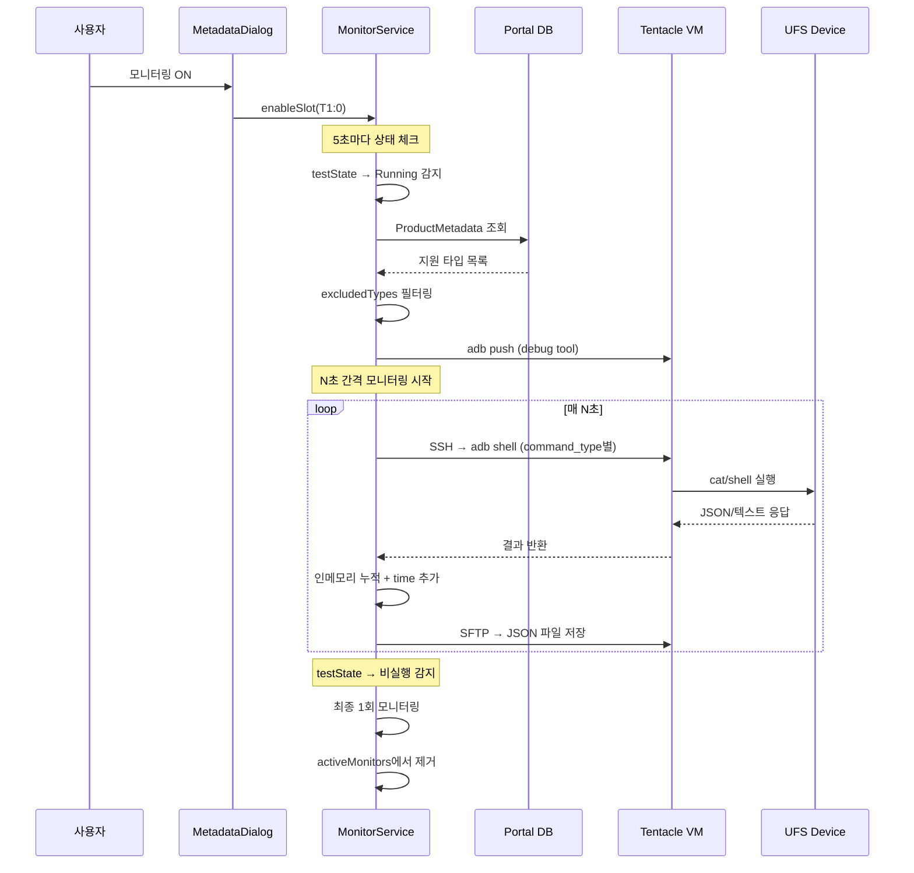
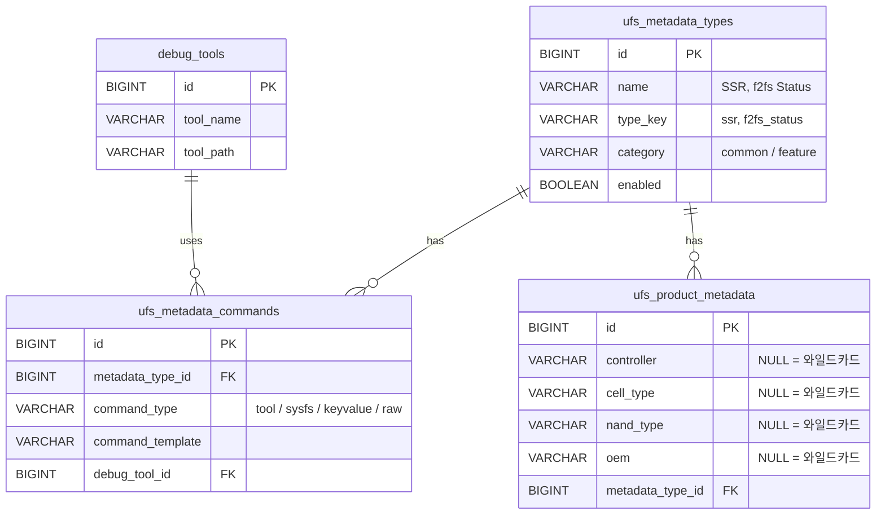
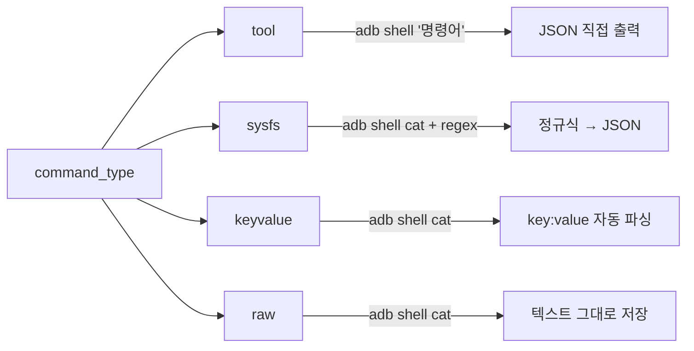
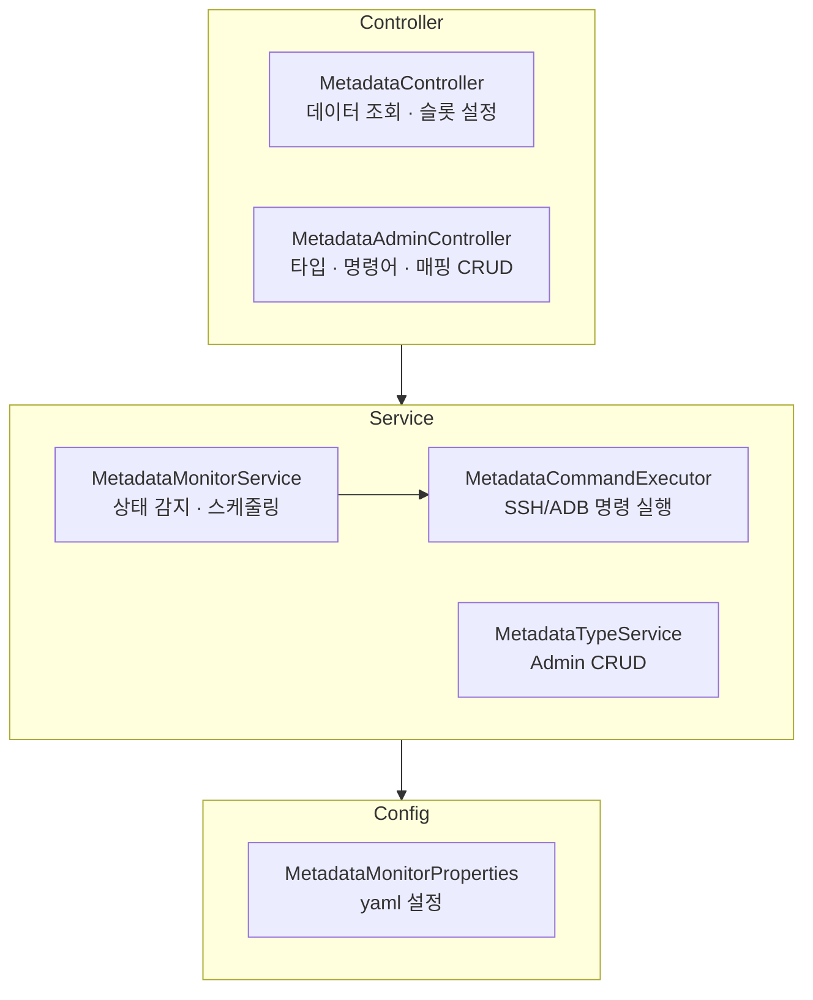
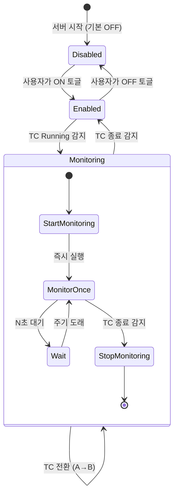
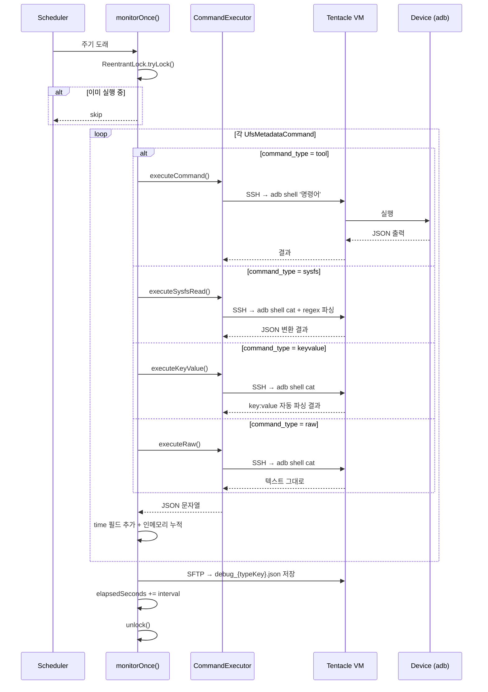
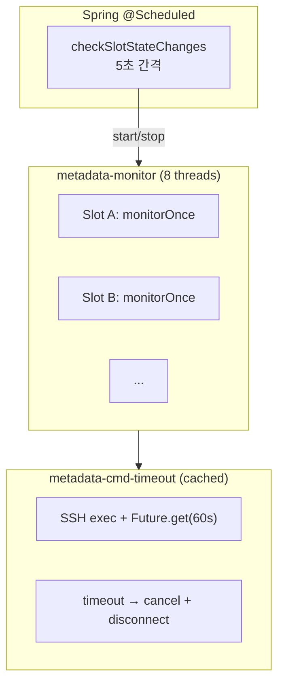
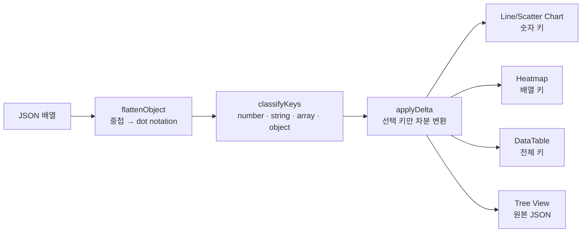
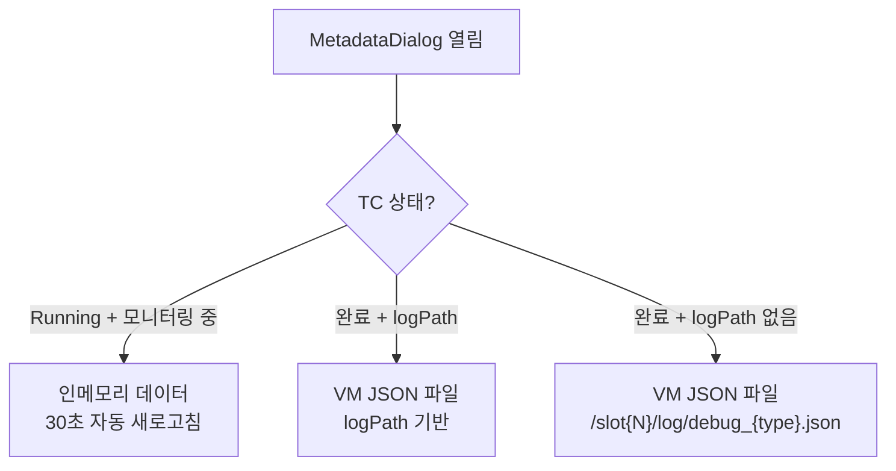
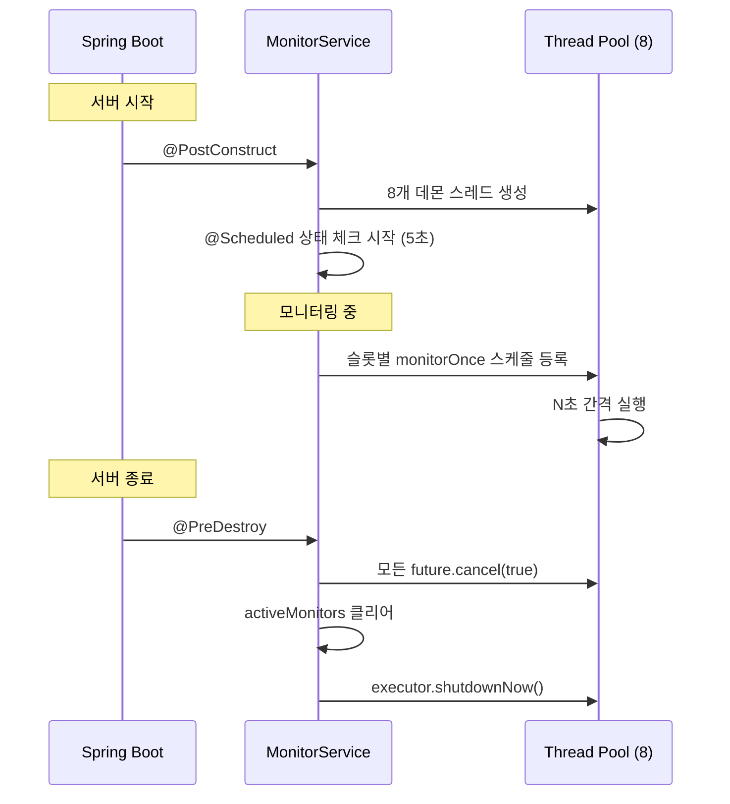

## 한줄 요약

**TC 평가 중** UFS 디바이스/파일시스템의 상태(SSR, Telemetry, ext4/f2fs stats, meminfo 등)를 **N초 간격으로 자동 모니터링**하여 JSON 파일로 저장하고, 시간별 변화를 차트/히트맵/테이블로 보여주는 시스템입니다.

---

## 전체 흐름



---

## 데이터 모델



- NULL 필드 = **모든 값에 매칭** (와일드카드)
- Admin UI에서 체크박스로 여러 타입 한번에 등록, UFS Info DB에서 select
- 같은 product 조건의 매핑은 그룹으로 표시

---

## Command Type (4가지)



| Command Type | 용도 | Debug Tool |
|---|---|---|
| **tool** | UFS 전용 tool (JSON 출력) | 필요 |
| **sysfs** | sysfs/proc 경로 + 정규식 | 불필요 |
| **keyvalue** | meminfo, ext4/f2fs stats 등 key:value 형태 | 불필요 |
| **raw** | 테이블/비트맵 등 파싱 어려운 출력 | 불필요 |

### tool

```
/data/local/tmp/ufs-utils /dev/block/sda ssr --json
```

### sysfs

```
/sys/block/sda/size
/sys/block/sda/stat | regex:(\d+)\s+\d+\s+(\d+) | keys:read_ios,read_sectors
```

### keyvalue

```
/proc/meminfo
/proc/fs/f2fs/sda1/status
```

자동 파싱: 들여쓰기 → dot notation, 숫자 추출, 단위 제거, 괄호 내 값 추출

**예시:**
```
MemTotal: 16384532 kB   →  {"MemTotal": 16384532}
mballoc:
    reqs: 15234         →  {"mballoc.reqs": 15234}
GC calls: 234 (BG: 189) →  {"GC_calls": 234, "GC_calls_BG": 189}
```

### raw

```
/proc/fs/ext4/sda1/mb_groups
/proc/fs/f2fs/sda1/segment_info
```

텍스트 그대로 저장, Tree View에서 확인.

---

## 백엔드 구조



---

## 모니터링 라이프사이클



### 슬롯별 설정 (3가지)

| 설정 | 기본값 | 설명 |
|------|--------|------|
| **모니터링 ON/OFF** | OFF | MetadataDialog에서 토글 |
| **모니터링 주기** | 전역 기본값 (초) | 슬롯별 개별 설정 가능, 최소 10초 |
| **제외 타입** | 없음 (전부 ON) | 타입별 ON/OFF 토글 |

---

## 모니터링 실행 흐름 (monitorOnce)



---

## 스레드 모델



### Thread Safety

| 데이터 | 동시성 전략 |
|--------|------------|
| activeMonitors | `ConcurrentHashMap` |
| enabledSlots | `ConcurrentHashMap.newKeySet()` |
| excludedTypes | `ConcurrentHashMap<String, Set>` |
| slotIntervalSeconds | `ConcurrentHashMap<String, Integer>` |
| monitoredData | `CopyOnWriteArrayList` |
| 경과 시간 | `AtomicInteger` (초 단위) |
| monitorOnce() | `ReentrantLock.tryLock()` |

---

## 프론트엔드 데이터 파이프라인



### MetadataDialog

슬롯 카드 Context Menu 또는 TC 테이블의 Meta 버튼에서 열립니다.

**멀티 슬롯 지원:**
- 단일 슬롯: 탭 없이 직접 표시
- 여러 슬롯 선택: 상단 슬롯 탭으로 전환, 각 탭별 독립 데이터

**모니터링 컨트롤 바:**
```
모니터링: [ON]    주기: [60] 초  [적용]  (기본: 300초)  ● 4m 55s
```

**타입 선택기:**
```
[Health ON●] [Write Booster ON●] [EC Count OFF] [f2fs Status ON●]
```

**Export:**
- **Excel**: 선택된 키 + delta 적용 상태로 `.xlsx` 다운로드
- **JSON**: 원본 JSON 그대로 `.json` 다운로드

**데이터 소스 분기:**



### Admin — Metadata 관리

3개 섹션 (모두 DataTable):
- **Types**: 메타데이터 종류 CRUD
- **Commands**: 타입별 명령어 CRUD (4가지 command_type)
- **Product Mappings**: 제품-타입 매핑 (UFS Info DB에서 select, 체크박스 다중 선택, 그룹 표시, 수정/삭제)

---

## API

### 모니터링 데이터

| 메서드 | 경로 | 설명 |
|--------|------|------|
| GET | `/api/metadata/types/for-product` | 제품별 지원 타입 조회 |
| GET | `/api/metadata/slot/{t}/{s}/status` | 슬롯 모니터링 상태 |
| GET | `/api/metadata/slot/{t}/{s}/data` | 슬롯 모니터링 데이터 |
| GET | `/api/metadata/file` | 저장된 JSON 파일 조회 |

### 슬롯 설정

| 메서드 | 경로 | 설명 |
|--------|------|------|
| GET/PUT | `/api/metadata/slot/{t}/{s}/enabled` | 모니터링 ON/OFF |
| GET/PUT | `/api/metadata/slot/{t}/{s}/interval` | 모니터링 주기 (초) |
| GET/PUT | `/api/metadata/slot/{t}/{s}/excluded-types` | 제외 타입 목록 |

### 전역 설정

| 메서드 | 경로 | 설명 |
|--------|------|------|
| GET/PUT | `/api/metadata/config` | 전역 모니터링 설정 |

---

## 설정

```yaml
metadata:
  monitor:
    enabled: true              # 모니터링 활성화
    poll-interval-ms: 5000     # 상태 체크 간격 (5초)
    collection-interval-min: 5 # 기본 모니터링 간격 (5분 = 300초)
```

- 전역 기본값: yaml에서 설정 (분 단위, 내부에서 ×60 변환)
- 슬롯별 개별 설정: API로 초 단위 설정 (최소 10초)
- 슬롯별 설정이 있으면 전역보다 우선

---

## Lifecycle



- 슬롯별 설정 (ON/OFF, 주기, 제외 타입)은 인메모리 → 서버 재시작 시 초기화
