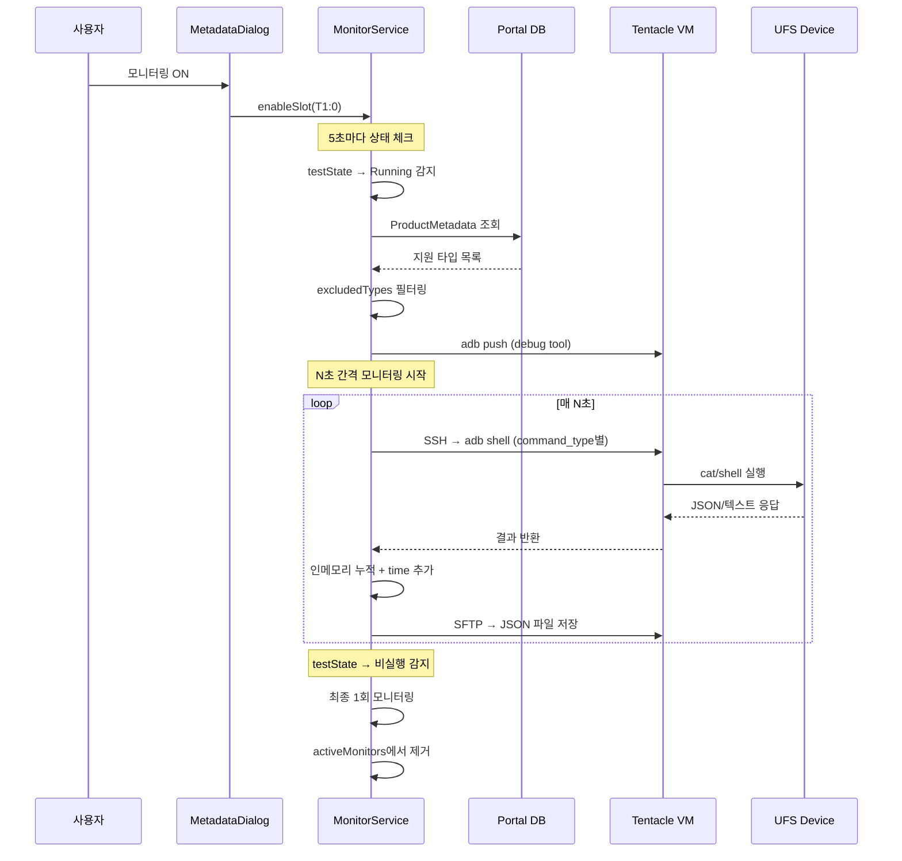
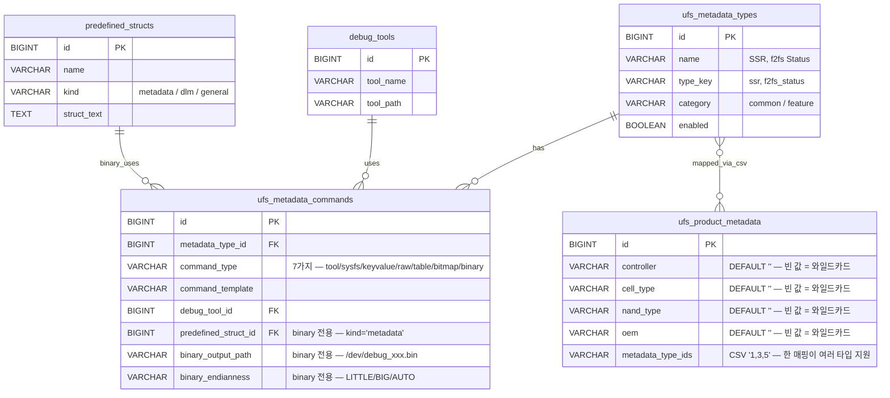
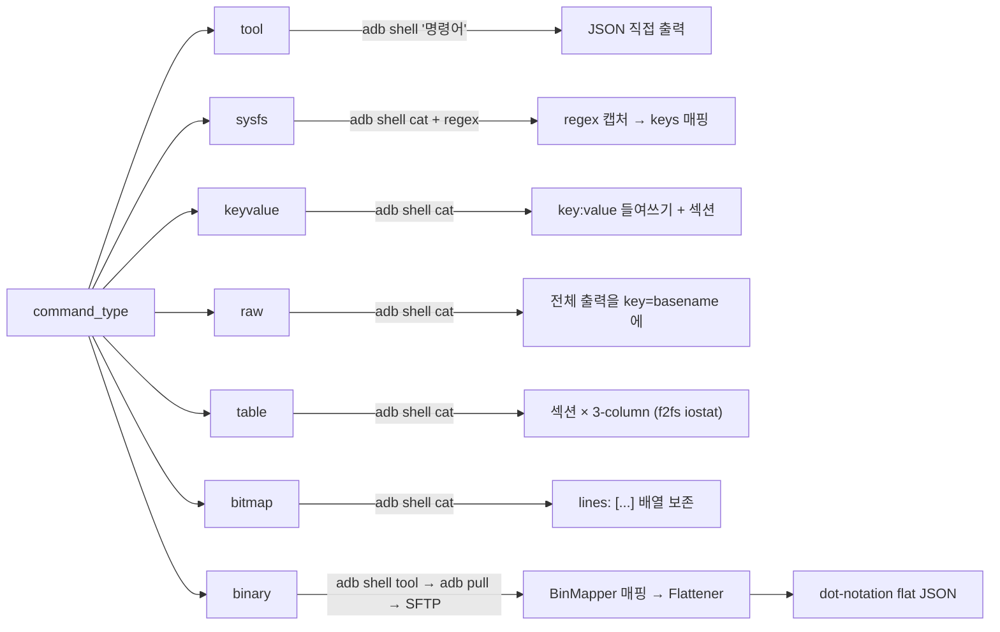
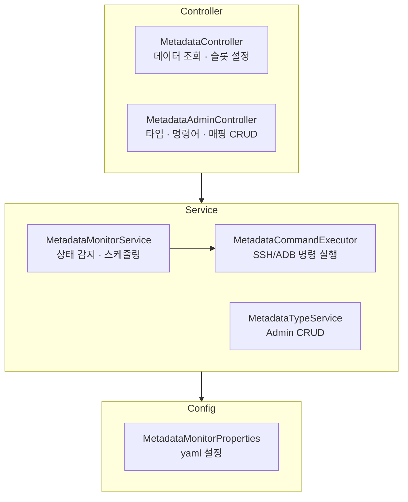
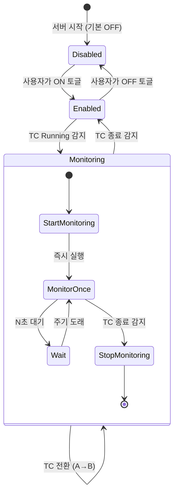
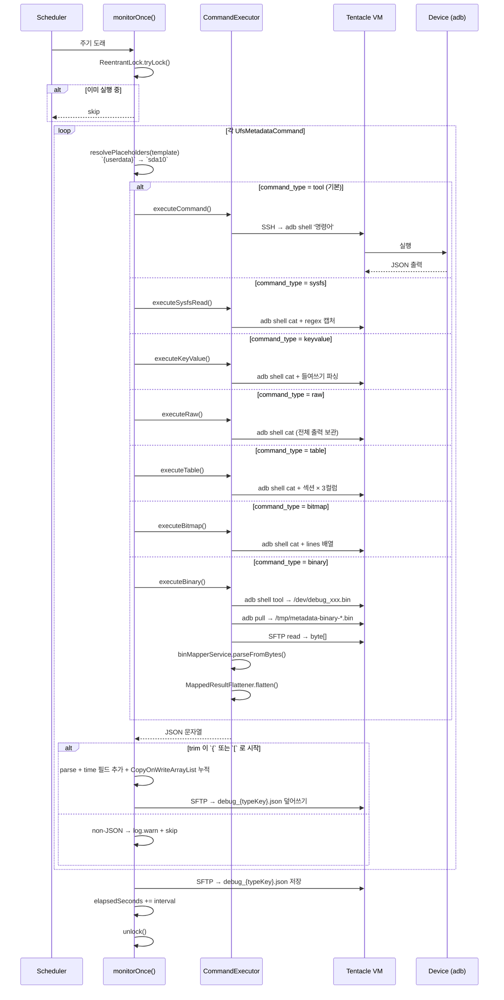
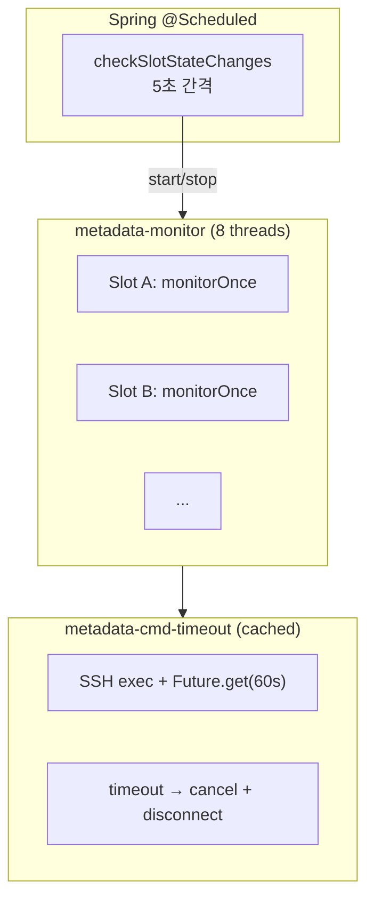
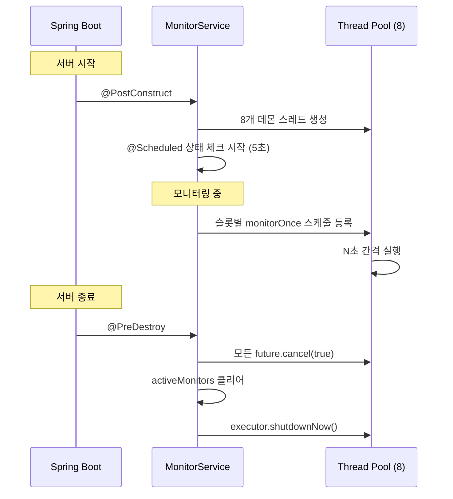

## 한줄 요약

**TC 평가 중** UFS 디바이스/파일시스템의 상태(SSR, Telemetry, ext4/f2fs stats, meminfo, 바이너리 덤프 등)를 **초 단위로 자동 모니터링**하여 **7가지 `command_type`** 으로 분기 파싱하고 JSON 으로 저장, 시간별 변화를 **차트 / 테이블 / 트리 + f2fs 전용 뷰 3종(Iostat / Heatmap / Bitmap)** 으로 시각화하는 시스템입니다.

> 학습 문서 ([L2 20호](/learn/l2-metadata/)) — 스토리텔링·코드 투어.  
> 이 문서는 **정본 설계** — 스키마, API, 스레드 모델, 명확한 경계.

---

## 전체 흐름



---

## 데이터 모델



- **빈 문자열 `''`** = 모든 값에 매칭 (wildcard). DB NULL 대신 `''` 사용 — MySQL UNIQUE 가 NULL 을 중복으로 판정하지 않기 때문
- **`metadataTypeIds` 는 CSV** — 한 제품 매핑이 여러 타입을 동시 커버 (`"1,3,5"`)
- **UNIQUE `(controller, cell_type, nand_type, oem)`** — 같은 조합 중복 등록 방지
- `predefined_structs.kind='metadata'` 사전만 binary `command_type` 에서 선택 가능 — dlm/general 분리로 사용자 실수 방지

---

## Command Type (7가지)

`UfsMetadataCommand.command_type` 이 파싱 경로를 결정합니다. `MetadataMonitorService.monitorOnce()` 가 이 필드로 분기해 `MetadataCommandExecutor` 의 7개 메서드 중 하나를 호출.



| Command Type | 용도 | 핵심 파싱 | Debug Tool | binary 필드 |
|---|---|---|---|---|
| **tool** (기본) | 전용 도구가 JSON 을 바로 뱉을 때 | 출력 그대로 파싱 | 선택 (push 필요 시) | — |
| **sysfs** | sysfs/proc 라인에서 여러 숫자 추출 | `regex:` + `keys:` | 불필요 | — |
| **keyvalue** | human-readable (들여쓰기 + "key: value") | 스택 기반 depth + dot-notation | 불필요 | — |
| **raw** | 파싱 불가능한 큰 덩어리 | 전체 출력을 value 에 | 불필요 | — |
| **table** | f2fs `iostat_info` 3-column 섹션표 | 섹션(WRITE/READ) + 3컬럼 파싱 | 불필요 | — |
| **bitmap** | f2fs `segment_info`/`victim_bits` 대용량 | `lines: [...]` 배열 보존 | 불필요 | — |
| **binary** | UFS 컨트롤러의 바이너리 덤프 | BinMapper struct 매핑 + flatten | 선택 | **필수** |

새 UFS 세대가 나와도 **새 `command_type` 을 추가하면 확장됨** — DB 필드 `VARCHAR(20)` + Executor 메서드 + monitorOnce switch 세 곳만 수정.

### tool

```
/data/local/tmp/ufs-utils /dev/block/sda ssr --json
```

### sysfs

```
/sys/block/sda/size
/sys/block/sda/stat | regex:(\d+)\s+\d+\s+(\d+) | keys:read_ios,read_sectors
```

결과: `{"size": "...", "read_ios": "...", "read_sectors": "..."}`

### keyvalue

```
/proc/meminfo
/proc/fs/f2fs/{userdata}/status
```

자동 파싱: 들여쓰기 → dot notation, 섹션 헤더(`partition info(sda21)`) → prefix, 숫자 추출, 단위 제거, 괄호 내 값 추출.

```
MemTotal: 16384532 kB           →  {"MemTotal": 16384532}
=====[ partition info(sda21) ]=====
  GC calls: 234 (BG: 189)       →  {"sda21.gc_calls": 234, "sda21.gc_calls_BG": 189}
  Hot data:
      segment: 5                 →  {"sda21.hot_data.segment": 5}
```

### raw

```
/proc/fs/ext4/sda1/mb_groups
```

출력 전체를 `{basename: "..."}` 에 저장. 프론트에서 후처리하거나 디버깅 용도.

### table (f2fs iostat_info)

```
WRITE
             app_buffered_data     12345  30    411
             app_direct_data           0   0      0
READ
             app_buffered_data    678901 120   5657
```

→

```json
{
  "WRITE": { "app_buffered_data": { "io_bytes": 12345, "count": 30, "avg_bytes": 411 } },
  "READ":  { "app_buffered_data": { "io_bytes": 678901, "count": 120, "avg_bytes": 5657 } }
}
```

섹션 헤더(`WRITE`/`READ`/`OTHER`) 로 그룹핑, 각 라인은 공백 4-token (name + 3 숫자). 프론트 `IostatTableView` 에서 섹션 × 3 컬럼 축을 그대로 활용.

### bitmap (f2fs segment_info / victim_bits)

수만 라인의 비트맵을 파싱하지 않고 **라인 배열** 로 보존:

```json
{
  "segment_info": {
    "format": "segment_info",
    "path": "/sys/fs/f2fs/sda10/segment_info",
    "lines": ["row0 3|512 4|256 ...", "row1 0|512 1|256 ...", "..."]
  }
}
```

프론트 `SegmentHeatmap` / `BitmapGridView` 가 Canvas 로 렌더.

### binary (BinMapper 재사용)

UFS 컨트롤러가 상태 덤프를 **C struct 바이너리** 로 제공하는 경우:

```
1. adb shell '{tool_command}'              → 디바이스 /dev/debug_xxx.bin 생성
2. adb pull /dev/debug_xxx.bin /tmp/...    → tentacle VM 임시 파일
3. SFTP read                                → Portal byte[]
4. binMapperService.parseFromBytes(...)     → MappedResult (중첩 struct 트리)
5. MappedResultFlattener.flatten(...)      → dot-notation Map<String, Object>
6. Jackson serialize                        → JSON 문자열
```

binary 전용 3 필드:
- `predefinedStructId` — `predefined_structs.kind='metadata'` 사전의 FK
- `binaryOutputPath` — 디바이스 내 덤프 파일 경로 (예: `/dev/debug_ssr.bin`). `{userdata}` placeholder 지원
- `binaryEndianness` — `LITTLE` / `BIG` / `AUTO` (기본 `LITTLE`)

**BinMapper 를 서비스 계층에서 호출하는 첫 사례** — 기존 devtool 파이프라인을 재사용해 별도 바이너리 파서 코드 없이 UFS 덤프를 JSON 화.

---

## `{userdata}` Placeholder

f2fs 파티션 블록 이름(`sda10`, `sdc77`, `mmcblk0p13` 등)은 **디바이스마다 다릅니다**. commandTemplate 에 하드코딩하면 제품별 매핑이 폭발적으로 증가 → placeholder 로 흡수.

### 조회 (startMonitoring 시 1회)

```
1차: adb shell 'readlink -f /dev/block/by-name/userdata'
     → /dev/block/sda10

2차 fallback: adb shell 'ls -al /dev/block/by-name/userdata'
     → "... -> /dev/block/sda10" 에서 arrow 이후 추출

basename: /dev/block/sda10 → sda10
```

결과는 `SlotMonitorContext.placeholders.put("userdata", "sda10")` 에 저장. **TC running 동안 재조회 안 함** — 디바이스가 같으면 불변.

### 치환 (monitorOnce 매 tick)

```java
String template = "/sys/fs/f2fs/{userdata}/iostat_info";
// → "/sys/fs/f2fs/sda10/iostat_info"
```

commandTemplate 외에도 `binaryOutputPath` 에도 동일하게 적용됩니다. 미해결 `{userdata}` 가 남아 있으면 경고 로그 — 해당 command 는 **해당 tick 에서 skip** 되어 다른 command 진행을 막지 않음.

### 확장 가능성

현재는 `{userdata}` 만 사용되지만, `SlotMonitorContext.placeholders` 맵이 범용이라 새 placeholder 추가 시:

1. `startMonitoring` 에서 `placeholders.put("newkey", value)` populate
2. commandTemplate 에 `{newkey}` 사용

`{ufs_partition}`, `{kernel_version}` 등이 후보.

---

## 백엔드 구조



---

## 모니터링 라이프사이클



### 슬롯별 설정 (3가지)

| 설정 | 기본값 | 설명 |
|------|--------|------|
| **모니터링 ON/OFF** | OFF | MetadataDialog에서 토글 |
| **모니터링 주기** | 전역 기본값 (초) | 슬롯별 개별 설정 가능, 최소 10초 |
| **제외 타입** | 없음 (전부 ON) | 타입별 ON/OFF 토글 |

---

## 모니터링 실행 흐름 (monitorOnce)



---

## 스레드 모델



### Thread Safety

| 데이터 | 동시성 전략 |
|--------|------------|
| activeMonitors | `ConcurrentHashMap` |
| enabledSlots | `ConcurrentHashMap.newKeySet()` |
| excludedTypes | `ConcurrentHashMap<String, Set>` |
| slotIntervalSeconds | `ConcurrentHashMap<String, Integer>` |
| monitoredData | `CopyOnWriteArrayList` |
| 경과 시간 | `AtomicInteger` (초 단위) |
| monitorOnce() | `ReentrantLock.tryLock()` |

---

## 프론트엔드 데이터 파이프라인

```mermaid
flowchart LR
    A[JSON 배열] --> B[flattenObject<br/>중첩 → dot notation]
    B --> C[classifyKeys<br/>number · string · array · object]
    C --> D[applyDelta<br/>선택 키만 차분 변환]
    D --> E1[PerfChart<br/>숫자 키 Line/Scatter]
    D --> E2[DataTable<br/>전체 키]
    D --> E3[JsonView<br/>원본 JSON 트리]

    A -.->|typeKey contains<br/>"iostat_info"| F1[IostatTableView<br/>섹션×metric×3컬럼 차트]
    A -.->|typeKey contains<br/>"segment_info"| F2[SegmentHeatmap<br/>Canvas 6색 타입맵]
    A -.->|typeKey contains<br/>"victim_bits/segment_bits"| F3[BitmapGridView<br/>Canvas 비트 그리드 + 지속성]
```

공통 3 뷰(Chart/Table/Tree) 는 모든 타입에 적용, f2fs 전용 3 뷰(Iostat/Heatmap/Bitmap) 는 `typeKey` 패턴 매칭으로 자동 탭 노출.

### MetadataDialog (6 뷰 탭 · 1 초 polling)

슬롯 카드 Context Menu 또는 TC 테이블의 Meta 버튼에서 sheet 로 열립니다.

**멀티 슬롯 지원:**
- 단일 슬롯: 탭 없이 직접 표시
- 여러 슬롯 선택: 상단 슬롯 탭으로 전환, 각 탭별 독립 데이터
- `applyToAllSlots` 체크박스 — 토글/주기 변경을 모든 슬롯에 일괄 적용 (`Promise.allSettled`)

**모니터링 컨트롤 바:**
```
모니터링: [ON]    주기: [60] 초  [적용]   ● 4m 55s   [Stop]
```

**6 뷰 탭:**

| 탭 | 컴포넌트 | 입력 해석 | 활성 조건 |
|---|---|---|---|
| `chart` | `PerfChart` | `time` X축 + 선택 숫자 key 라인/Scatter | 항상 |
| `table` | `DataTable` | flattenObject 결과 row 나열 | 항상 |
| `tree` | `JsonView` | 원본 JSON 트리 | 항상 |
| `iostat` | `IostatTableView` | 섹션 × metric × 3컬럼 차트 | `typeKey` 에 `iostat_info` 포함 |
| `heatmap` | `SegmentHeatmap` | Canvas 6색 segment type 맵 | `typeKey` 에 `segment_info` 포함 |
| `bitmap` | `BitmapGridView` | Canvas 비트 그리드 + 지속성 그라디언트 | `typeKey` 에 `victim_bits`/`segment_bits` 포함 |

**실시간 갱신 (1 초 polling):**

```javascript
let pollTimer = setInterval(async () => {
  if (selectedTypeKey && slotStatus?.monitoring) {
    entries = await fetchSlotMetadata(tent, slot, selectedTypeKey);
  }
}, 1000);

$effect(() => {
  if (open && activeSlot) startPolling();
  return () => stopPolling();   // sheet 닫히면 자동 해제
});
```

SSE 대신 polling 을 택한 이유 — 사용자가 sheet 를 **가끔 열어 보는** 구조라 연결 상주 비용 > 짧은 polling. sheet 닫으면 `clearInterval` 로 자원 즉시 해제.

**Export:**
- **Excel**: 선택된 키 + delta 적용 상태로 `.xlsx` 다운로드
- **JSON**: 원본 JSON 그대로 `.json` 다운로드 (파일명 `{tentacle}-{slot}-{typeKey}-{timestamp}.json`)

**데이터 소스 분기:**


### Admin — Metadata 관리

3개 섹션 (모두 DataTable):
- **Types**: 메타데이터 종류 CRUD (typeKey 변경 시 파일명·API 경로 이력 단절 주의)
- **Commands**: 타입별 명령어 CRUD — **`command_type` 은 런타임 변경 가능**. binary 선택 시 3 추가 필드 자동 노출 (predefinedStruct 드롭다운 — `kind='metadata'` subset / binaryOutputPath / binaryEndianness)
- **Product Mappings**: 제품-타입 매핑 (UFS Info DB 에서 select, 체크박스 다중 선택, 그룹 표시, 수정/삭제). UNIQUE `(controller, cell, nand, oem)` 중복 시 **409 Conflict** → "이미 등록된 제품 조합입니다"

---

## API

### 사용자 API (`/api/metadata/*`)

| 메서드 | 경로 | 설명 |
|--------|------|------|
| GET | `/api/metadata/types` | 활성 타입 목록 |
| GET | `/api/metadata/types/for-product` | 제품 조건(controller/nandType/cellType) 으로 필터링된 타입 |
| GET | `/api/metadata/types/for-tr` | TR id + headType(0=compat,1=perf) 로 제품 조회 → 지원 타입 |
| GET | `/api/metadata/slot/{tentacleName}/{slotNumber}` | 슬롯 모니터링 상태 (monitoring/elapsedSeconds/types/entryCounts) |
| GET | `/api/metadata/slot/{tentacleName}/{slotNumber}/{typeKey}` | in-memory 시계열 배열 — 프론트 1초 polling 대상 |
| GET | `/api/metadata/slot/{tentacleName}/{slotNumber}/files` | 저장된 `debug_*.json` 파일 목록 |
| GET | `/api/metadata/file` | VM 의 JSON 파일 직접 조회 (tentacleIp 옵션으로 다른 세트도 가능) |
| GET | `/api/metadata/status` | 전체 활성 모니터링 상태 |

### 슬롯 제어

| 메서드 | 경로 | 설명 |
|--------|------|------|
| GET/PUT | `/api/metadata/slot/{tentacleName}/{slotNumber}/enabled` | 모니터링 ON/OFF |
| GET/PUT | `/api/metadata/slot/{tentacleName}/{slotNumber}/interval` | 슬롯별 주기 (초, **최소 10초 clamp**) |
| GET/PUT | `/api/metadata/slot/{tentacleName}/{slotNumber}/excluded-types` | 제외 타입 목록 |
| PUT | `/api/metadata/config` | 전역 설정 (collectionIntervalMin, enabled) |

### Admin API (`/api/admin/metadata/*`)

| 리소스 | Method | 설명 |
|---|---|---|
| `/types` | GET/POST/PUT/DELETE | 타입 CRUD. DELETE 시 연관 command/mapping 자동 정리 |
| `/commands` | GET/POST/PUT/DELETE + `/by-type/{typeId}` | 명령 CRUD. **`command_type` 런타임 변경 가능** |
| `/product-mappings` | GET/POST/PUT/DELETE + `/by-type/{typeId}` | 제품 매핑. UNIQUE 위반 시 409 |

---

## 설정

```yaml
metadata:
  monitor:
    enabled: true              # 모니터링 활성화
    poll-interval-ms: 5000     # 상태 체크 간격 (5초)
    collection-interval-min: 5 # 기본 모니터링 간격 (5분 = 300초)
```

- 전역 기본값: yaml에서 설정 (분 단위, 내부에서 ×60 변환)
- 슬롯별 개별 설정: API로 초 단위 설정 (최소 10초)
- 슬롯별 설정이 있으면 전역보다 우선

---

## Lifecycle



- 슬롯별 설정 (ON/OFF, 주기, 제외 타입)은 인메모리 → 서버 재시작 시 초기화
- HEAD `initslot` 명령이 도착하면 `clearSlot(tentacleName, slotNumber)` 호출 — enabled/excludedTypes/interval 3 맵 + activeMonitors 모두 청소 (**VM 의 `debug_*.json` 은 이력 보존 목적으로 유지**)

---

## 관련 문서

- [L2 20호 — UFS Metadata 모니터링](/learn/l2-metadata/) — 6 장 여정형 학습 (index + 엔티티 + 스케줄러 + 6 파싱 + binary/BinMapper + REST/placeholder + 프론트)
- [BinMapper L2](/learn/l2-binmapper/) — binary `command_type` 이 재사용하는 엔진
- [UFS Metadata 사용 가이드](/guide/ufs-metadata/) — UI 사용법, 타입 관리, 주기 설정, 트러블슈팅
- [L2 19종 비교](/learn/l2-compare/) — 축별 대조 표에서 Metadata 의 위치
