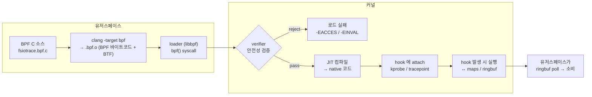
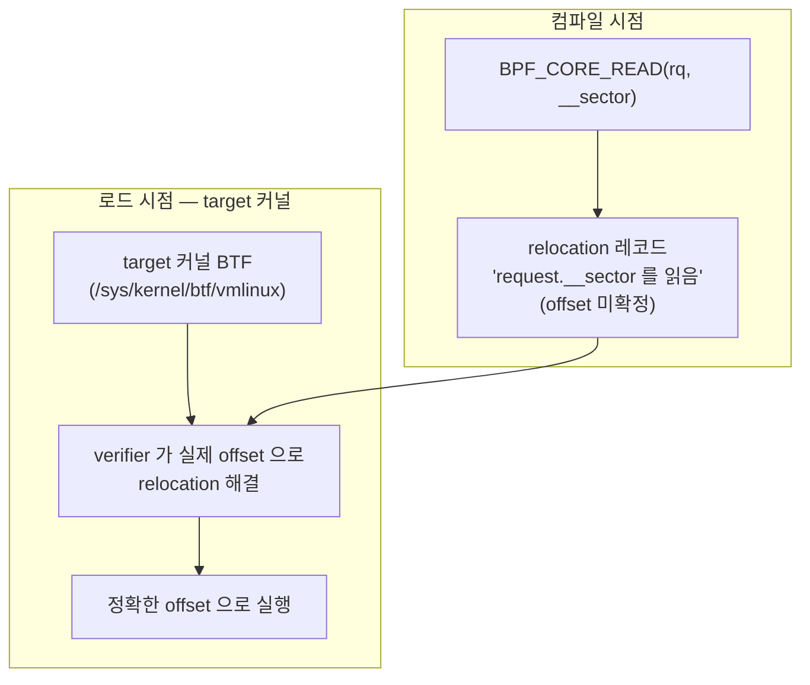
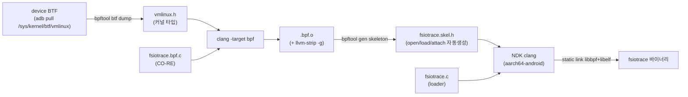
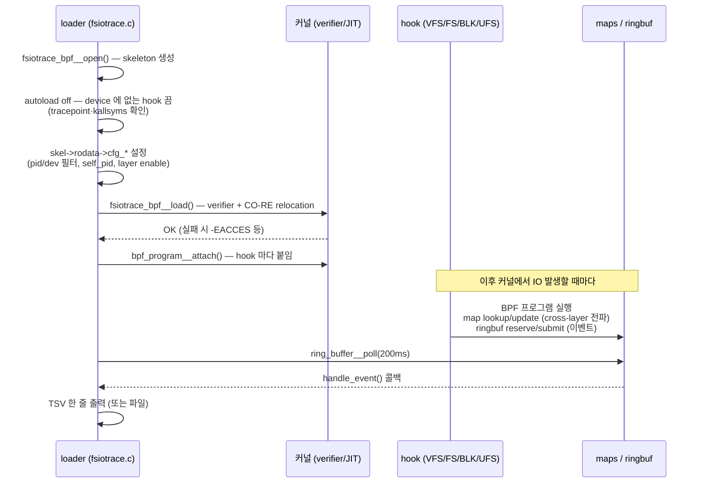

> **최종 수정**: 2026-05-28 · **대상**: 내부 팀 발표/온보딩용. eBPF 기초 + fsiotrace 가
> 그 위에서 어떻게 동작하는지. 우리 구현 상세는 [설계 문서](/fsiotrace/design/) 로 분담.

## 1. eBPF 란?

**eBPF**(extended Berkeley Packet Filter)는 **커널을 수정하거나 모듈을 올리지 않고**,
커널 안에서 안전하게 실행되는 작은 프로그램을 끼워 넣는 기술이다. 커널 안의
**샌드박스 가상 머신(VM)** 이라고 보면 된다.

- 커널 소스 수정 ✗, 커널 재빌드 ✗, 커널 모듈(KO) 로드 ✗
- 대신: 사용자가 작성한 BPF 프로그램을 **검증(verifier)** 후 **JIT 컴파일**해서 커널의
  특정 지점(hook)에 붙인다.
- 안전성 보장: verifier 가 "무한 루프 없음 / 잘못된 메모리 접근 없음 / 종료 보장" 을
  로드 시점에 정적 검증한다. 통과 못 하면 아예 안 붙는다 → 커널 패닉 위험 없음.

fsiotrace 는 이걸로 Android device 의 IO 경로(VFS→FS→Block→UFS)를 **커널 수정 없이**
추적한다. (이게 가능한 게 eBPF 의 핵심 가치.)

> 더 읽기: [eBPF.io — What is eBPF?](https://ebpf.io/what-is-ebpf/),
> [kernel.org BPF 문서](https://docs.kernel.org/bpf/)

## 2. 핵심 구성요소

| 요소 | 설명 | fsiotrace 에서 |
|---|---|---|
| **BPF program** | hook 에 붙어 실행되는 코드 (C → BPF 바이트코드) | `fsiotrace.bpf.c` 의 각 `SEC(...)` 함수 (VFS/FS/BLK/UFS hook) |
| **hook (attach point)** | 프로그램이 붙는 커널 지점 | kprobe(`vfs_read`), tracepoint(`f2fs_*`), tp_btf(`block_rq_issue`) |
| **maps** | 커널↔유저 / 호출 간 데이터를 공유하는 key-value 저장소 | task_ctx, rq_ctx, ringbuf 등 9개 |
| **verifier** | 로드 시 안전성 정적 검증 (루프/메모리/종료) | 통과 못 하면 `-EACCES`/`-EINVAL` (→ [DESIGN §5](/fsiotrace/design/)) |
| **JIT** | 검증된 바이트코드를 native 명령으로 변환 | 커널이 자동 처리 |
| **helper 함수** | BPF 가 호출 가능한 커널 제공 API | `bpf_get_current_pid_tgid`, `bpf_ringbuf_reserve`, `bpf_probe_read_kernel` 등 |
| **CO-RE** | "한 번 컴파일, 여러 커널"용 재배치 | vmlinux.h + `BPF_CORE_READ` (§4) |

## 3. eBPF 생애주기 (컴파일 → 로드 → 실행)

핵심: **verifier 가 문지기**다. 통과해야만 JIT·attach 된다. fsiotrace 개발에서 마주친
거부 사례(trampoline 불가, stack 512B 초과, R3 pointer 등)는 모두 이 단계에서 일어난다
([DESIGN §5](/fsiotrace/design/)).

## 4. CO-RE — "한 번 컴파일, 여러 커널에서 실행"

**문제**: BPF 프로그램이 커널 struct(예: `struct file`, `struct request`) 의 필드를
읽는데, **커널 버전·vendor 마다 struct 레이아웃(필드 offset)이 다르다.** 빌드한 커널과
실행하는 커널이 다르면 엉뚱한 offset 을 읽는다.

**해결 (CO-RE, Compile Once - Run Everywhere)**:
- 커널의 타입 정보를 **BTF**(BPF Type Format)로 표현. `vmlinux.h` 는 device BTF 에서
  생성한 "그 커널의 모든 타입 정의".
- 컴파일 시 `BPF_CORE_READ(f, f_path.dentry)` 같은 접근은 "이 필드를 읽고 싶다"는
  **relocation 정보**로 기록된다(실제 offset 박지 않음).
- **로드 시** loader/커널이 target 커널의 BTF 를 보고 **실제 offset 으로 재배치**한다.

fsiotrace 의 CO-RE 도구: `BPF_CORE_READ`, `bpf_core_field_exists`(필드 있나?),
`bpf_core_enum_value`(enum 값 lookup), `bpf_core_type_size`(타입 크기). vendor BTF 에
타입이 없거나 layout 이 달라 relocation 실패(-606)하면 **tracepoint format offset 직접
읽기**로 우회한다(예: `f2fs_dataread_start`). 상세 → [DESIGN §15](/fsiotrace/design/).

## 5. fsiotrace 는 BPF 로 어떻게 동작하나

### 5-1. 빌드 파이프라인

`bpftool gen skeleton` 이 `.bpf.o` 를 감싸 `fsiotrace_bpf__open/load/attach` 같은
C 함수를 자동 생성해 주므로, loader(`fsiotrace.c`)는 그 함수만 호출하면 된다.
(소스: `Makefile` 의 vmlinux.h → .bpf.o → skel.h → 바이너리 타겟.)

### 5-2. 런타임 — 로드부터 출력까지

- **rodata 로 설정 전달**: loader 가 `skel->rodata->cfg_*` 에 필터·옵션을 쓰면, BPF
  프로그램이 const 처럼 읽는다 (자기 PID 제외, dev 필터 등).
- **autoload**: device 에 없는 tracepoint/심볼은 `bpf_program__set_autoload(false)` 로
  꺼서 attach 실패를 피한다.
- **ringbuf**: 커널 BPF 가 `bpf_ringbuf_reserve→submit` 으로 이벤트를 넣으면, 유저가
  `ring_buffer__poll` 로 꺼내 `handle_event()` 에서 TSV 로 출력.

전체 IO 경로에서 각 hook 이 정보를 어떻게 이어받는지(cross-layer 전파)는
→ [DESIGN §4 cross-layer 정보 전파](/fsiotrace/design/).

## 6. maps & ringbuf

BPF 프로그램은 stack 이 512B 로 작고 호출 간 상태가 없다. **map** 이 그 한계를 메운다 —
호출 사이, 그리고 커널↔유저 사이 데이터를 나른다.

| map | 종류 | 역할 |
|---|---|---|
| `events` | RINGBUF (1MB) | 커널 → 유저 **이벤트 스트림** |
| `task_ctx` | HASH | VFS→FS→BLK 같은 task 의 IO 컨텍스트 (key=pid_tgid) |
| `rq_ctx` | HASH | BLK→SCSI (key=request*) |
| `ufs_tag_ctx` / `upiu_hdr_ctx` | HASH | SCSI→UFS pairing |
| `inode_ctx` | LRU_HASH | writeback fallback |
| `io_ctx_zero` | PERCPU_ARRAY | stack 512B 회피용 zero 버퍼 |

상세 역할·라이프사이클 → [DESIGN §4·§13](/fsiotrace/design/).

## 7. attach 타입 — kprobe vs tracepoint vs tp_btf

| 타입 | 붙는 곳 | 특징 | fsiotrace 예 |
|---|---|---|---|
| **kprobe / kretprobe** | 임의 커널 함수 진입/리턴 | 유연하나 함수 시그니처 의존 | `vfs_read`, `vfs_write`, `vfs_fsync_range` |
| **tracepoint** | 커널이 정의한 안정적 trace 지점 | 안정적, 낮은 오버헤드 | `f2fs_*`, `ext4_*`, `jbd2_*`, `ufs:*` |
| **tp_btf** | tracepoint + BTF 타입으로 인자 자동 파싱 | 인자 접근 편리 | `block_rq_issue`, `scsi_dispatch_cmd_start` |

이 Android GKI 6.6 device 에서는 **fentry/fexit/lsm 같은 trampoline 기반 attach 가
전부 막혀**(-EACCES) kprobe/tracepoint 만 쓴다. 그 외 verifier 제약과 우회는
→ [DESIGN §5·§15](/fsiotrace/design/).

## 8. 더 보기

- [eBPF.io — What is eBPF?](https://ebpf.io/what-is-ebpf/) — 전반 개념·다이어그램
- [kernel.org BPF 문서](https://docs.kernel.org/bpf/) — verifier, maps, helpers 레퍼런스
- [libbpf-bootstrap](https://github.com/libbpf/libbpf-bootstrap) — skeleton/CO-RE 예제 (우리가 vendoring)
- [BPF CO-RE 가이드 (Andrii Nakryiko)](https://nakryiko.com/posts/bpf-portability-and-co-re/)
- 우리 구현: [설계](/fsiotrace/design/) · [사용법](/fsiotrace/usage/) · [TSV 출력 형식](/fsiotrace/output-format/) · [빌드](/fsiotrace/build/)
