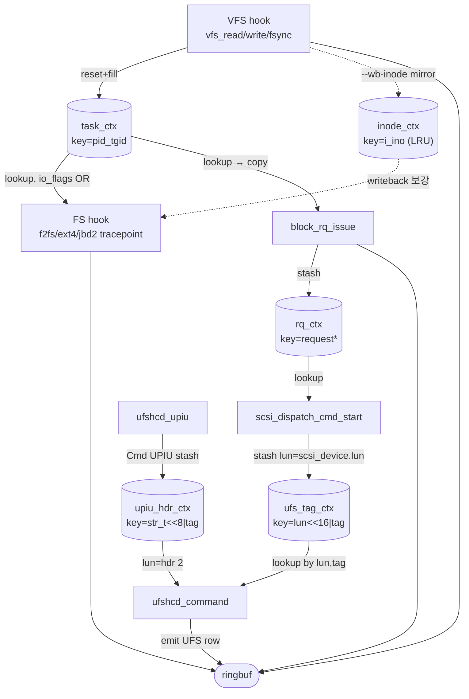
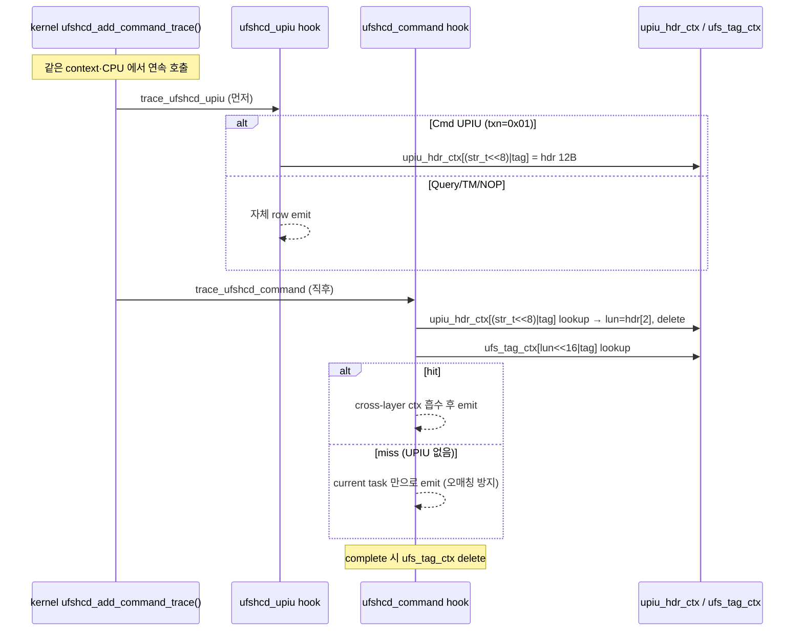

> **최종 수정**: 2026-05-27 · **대상 커널**: Android 15 GKI 6.6 (userdebug+root+Permissive)
> · **정본**: 이 문서의 source of truth 는 bpftrace repo 의 `docs/`. 이 사이트는 렌더 사본이며
> 변경은 항상 repo 먼저. 동작 서술은 `src/fsiotrace.bpf.c` / `.h` / `.c` 기준.
> · 최근 갱신 반영: task_ctx pid_tgid key, dev=rq->part->bd_dev, UFS lun=UPIU hdr[2],
> rwbs revert, f2fs_dataread_start offset 교정 (commit 2185f1b‥1e12563).

## 0. 한눈에 (먼저 읽기)

fsiotrace 는 **하나의 IO 가 앱(syscall)에서 디스크(UFS)까지 내려가는 길을 층(layer)마다
한 줄씩 찍는** 도구다. eBPF 가 처음이라면 먼저 [eBPF 동작 원리](/fsiotrace/bpf/) 를 보면 이 문서가 훨씬 쉽다.

- **무엇을**: VFS(syscall) → FS(ext4/f2fs) → Block → UFS(저장장치) 4개 층의 IO 이벤트.
- **어떻게 한 줄에 다 보이나**: 위층에서 알아낸 정보(파일명·PID·sync 여부)를 아래층 row 가
  **이어받는다**(cross-layer 전파, §4). 그래서 맨 아래 UFS row 만 봐도 "어느 파일의,
  누가 낸, 어떤 IO 인가"를 알 수 있다.
- **출력 한 줄**: `층 | 누가(pid/comm) | 무슨 syscall | 어떤 파일 | 얼마나(size) | 어디(sector)
  | IO 성격(io_flags 비트)`. 자세한 컬럼은 §3, 전체 형식은 [TSV 출력 형식](/fsiotrace/output-format/).
- **원칙**: 커널은 안 건드린다(eBPF). 짝짓기(요청↔완료) 같은 후처리는 tracer 가 아니라
  바깥 도구가 한다.

> 이 문서를 읽는 순서: **§0 한눈에 → §1~2 왜/원칙 → §3 한 줄의 구성 → §4 층 사이 전파(핵심 그림)**
> → 나머지는 필요할 때 참조(§5 verifier 제약, §7 hook 목록, §13 라이프사이클 등).

## 1. 목표

Android device 에서 IO 하나가 **VFS → FS(f2fs/ext4) → block → UFS(SCSI)** 로 내려가는
전 경로를, 층마다 **한 줄(row)** 로 추적한다. 한 화면에서 다음을 답하는 게 목표다:

- **누가** — pid / tid / comm (프로세스)
- **어떤 파일을** — filename / inode
- **어떤 syscall 로** — vfs_read / vfs_write / vfs_fsync
- **어떤 성격의 IO 인가** — read/write, sync, direct, metadata, GC, discard, ...
- **어디까지 내려갔나** — VFS 에서 멈췄나, block 까지 갔나, UFS 까지 갔나

이를 **커널 수정 없이** libbpf + CO-RE eBPF 로 한다 (왜 eBPF 로 가능한지는 [eBPF 동작 원리](/fsiotrace/bpf/)).

타겟: **Android 15 GKI kernel 6.6** (userdebug + root + Permissive 가정).

## 2. 설계 원칙

아래 6가지가 "출력 한 줄을 어떻게 구성하고, tracer 가 어디까지 할지"를 정한다.

- **identifier (pid/comm/syscall/filename) 는 명시 컬럼**. 비트 안에 묻지 않는다.
- **"IO 형태" (sync/dio/meta/journal/gc/discard/flush/writeback/readahead/...) 는
  `io_flags` u64 비트마스크**로 한 컬럼에 압축.
- **layer 는 별도 컬럼** (enum). row 한 줄 = 한 layer 의 한 이벤트.
- **cross-layer 정보 전파**:
  하위 layer row 가 상위 layer 의 정보 (filename, pid, O_SYNC 같은 flag) 를
  흡수해서 한 줄에 다 보인다. 그래야 BLK row 만 봐도 "어떤 파일이 어떤 모드로
  진입한 IO 인가"를 알 수 있다.
- **tracer 는 raw event 만 emit**. Q↔C pairing, send↔complete 매칭은 후처리.
- **자기 자신은 trace 에서 제외**. fsiotrace 가 만드는 stdout/file write 같은
  noise 자동 차단.

## 3. Record 구조

> **요약**: 출력 한 줄 = "고정 컬럼들" + "io_flags 비트마스크 하나". 식별 정보(누가/무슨 파일)는
> 고정 컬럼으로 또렷하게, IO 의 성격(sync/meta/gc/...)은 비트 하나에 모아 컴팩트하게.

한 IO 이벤트는 아래 컬럼들로 한 줄이 된다. 어떤 컬럼은 특정 layer 에만 의미가 있고
(예: `sec` 는 BLK/UFS 만), 없는 칸은 `-` 또는 `0` 으로 채워 **모든 줄의 컬럼 수를 맞춘다**
(파싱하기 쉽게).

### 명시 컬럼 (출력 한 줄에 항상 포함; 해당 layer 에 없으면 `-` 또는 0)

```
ts  layer  pid  tid  cpu  comm  syscall  action  fs  dev  ino  size  sec  name
io_flags  [decoded bits]  ufs={...}  req=0x...
```

각 컬럼 의미:

| 컬럼 | 출처 | 비고 |
|---|---|---|
| `ts` | `bpf_ktime_get_ns()` → `sec.us` (ftrace style) | 단조 시계, boot 이후 시간 |
| `layer` | enum (VFS/FS/BLK/UFS) | 이 row 가 잡힌 곳 |
| `pid/tid/cpu/comm` | `bpf_get_current_pid_tgid/comm` | task context. writeback 은 kworker |
| `syscall` | VFS 진입 op (`entry_op`) | VFS 안 거친 row 는 `-` |
| `action` | 현재 hook (`op`) | 예: `block_rq_issue`, `f2fs_gc_begin` |
| `fs` | `sb->s_type->name` 또는 FS hook 의 hardcoded | "ext4" / "f2fs" / "tmpfs" / "-" |
| `dev` | `MKDEV(major, minor)` = `major<<20\|minor` | VFS=`sb->s_dev`, BLK=`rq->part->bd_dev`(파티션 minor 정확). `rq->part` 없거나 0 이면 `(major<<20)\|gendisk->first_minor` fallback |
| `ino` | inode 번호 | writeback FS-only 도 채워짐 |
| `size` | bytes — VFS=count/retval, BLK=`__data_len`, UFS=`transfer_len` | flush/discard 는 0 |
| `sec` | BLK=sector(512B), UFS=LBA | flush 의 `u64=-1` 은 0 으로 정규화 |
| `name` | dentry 마지막 component | 풀패스는 verifier 가 거부 (§5) |
| `io_flags` | u64 bitmask | hex 출력. `-x` 로 비트 이름 풀이 |
| `ufs={...}` | UFS row only | lun/tag/hwq/opcode/grp |
| `req=` | BLK + UFS row | request 포인터, BLK↔UFS pairing key |

> `rwbs=` 는 현재 **미emit**. block layer 의 rwbs 문자열 구성을 시도했으나 이 device
> verifier 가 거부해 revert 됨 (§5 참조). BLK row 의 `extra` 는 현재 비어 있다.

### io_flags u64 비트

자세한 정의는 `src/fsiotrace.h`. 요약:

- **0-7 access**: READ / WRITE / DISCARD / FLUSH / TRIM
- **8-15 open mode**: O_SYNC / O_DIRECT / O_APPEND / O_DSYNC / SYNC_PATH /
  REQ_SYNC / REQ_PRIO / REQ_RAHEAD
- **16-27 FS kind**: DATA / METADATA / INODE / JOURNAL / CHECKPOINT / GC
- **32-36 path/context**: BUFFERED / DIRECT_IO / WRITEBACK_KWORKER / FSYNC_TRIGGERED
- **40-43 layer hop**: SAW_VFS / SAW_FS / SAW_BLK / SAW_UFS
- **48-55 f2fs segment**: F2FS_NODE_WRITE / F2FS_DATA_WRITE / F2FS_META_WRITE /
  F2FS_NODE_GC / F2FS_DATA_GC / F2FS_HOT_DATA / F2FS_WARM_DATA / F2FS_COLD_DATA

> **정의만 되고 현재 set 되지 않는 예약 비트** (set 하는 hook 미구현):
> `IO_BITMAP`(19) / `IO_DIRENT`(20) / `IO_XATTR`(21) / `IO_EXTENT_ALLOC`(25) /
> `IO_EXTENT_FREE`(26) / `IO_BMAP`(27) / `IO_MMAP_WRITEBACK`(34). 비트 번호 자체는
> `src/fsiotrace.h` 에 보존 — 해당 hook 추가 시 그대로 사용.

`-x` (`--decode`) 옵션을 켜면 줄 끝에 **18번째 컬럼**으로 사람이 읽는 비트 이름
(`[WRITE|O_SYNC|DATA|SAW_VFS|...]`)이 덧붙는다. 17컬럼 뒤에 추가되므로 TSV 파서
(trace/ 분석기)는 영향받지 않는다.

### `entry_op` (syscall) vs `op` (action)

> **요약**: `syscall` 컬럼 = "이 IO 가 처음 시작된 syscall"(entry_op), `action` 컬럼 = "이 줄을
> 찍은 hook 자체"(op). 예) 앱이 `vfs_write` 한 IO 가 block 까지 내려가면 그 BLK row 는
> `syscall=vfs_write action=block_rq_issue`. 둘을 나눠야 "원래 무슨 작업이었나 + 지금 어느 단계냐"가
> 한 줄에 같이 보인다.

- VFS hook 진입 시 `c->entry_op = OP_VFS_*` 박음.
- BLK / FS / UFS hook 이 task_ctx 또는 rq_ctx 흡수 시 `entry_op` 같이 가져옴.
- userspace 출력: `syscall=vfs_write action=block_rq_issue` 같이 둘 다 표시.
- VFS 안 거친 row (writeback, FS-only) → `syscall=-`, action 만 의미.

## 4. cross-layer 정보 전파 (전파 map 구조)

> **요약**: 이 문서에서 제일 중요한 섹션. 아래층 hook 은 "파일명·PID" 를 모른다(block layer 는
> sector 만 안다). 그래서 **위층에서 알아낸 정보를 map 에 저장해 두고 아래층이 꺼내 쓴다.**
> 이게 "한 줄에 다 보이게" 하는 메커니즘이다.

**왜 필요한가**: `block_rq_issue`(디스크 요청) hook 은 sector·크기만 받지, "이게 어느 파일의
IO 인지" 모른다. 반대로 `vfs_write`(syscall) hook 은 파일·PID 를 알지만 sector 는 모른다.
그래서 **VFS 에서 알아낸 걸 task 별 저장소(map)에 넣어두고**, 같은 IO 가 아래로 내려갈 때
각 층이 그 저장소에서 정보를 **이어받아(흡수)** 자기 row 에 채운다.

전파를 잇는 "키(key)"가 층마다 다르다: task 단위(pid_tgid) → 요청 포인터(request*) →
UFS 태그(lun+tag). 아래 흐름도가 그 연결이다. (그림으로 먼저 보려면 ↓ "전파 다이어그램".)

용어:
- **task_ctx / rq_ctx / ufs_tag_ctx / upiu_hdr_ctx / inode_ctx**: 정보를 나르는 5개 저장소(BPF map). 표는 ↓ "사용 map".
- **흡수(absorb/inherit)**: 아래층이 위층이 저장해 둔 ctx 를 lookup 해 자기 row 에 채우는 것.
- **SAW_VFS/FS/BLK/UFS**: "이 IO 가 어느 층까지 거쳤나" 표시 비트(layer-hop marker).
- **lun/tag**: UFS 장치의 논리 유닛 번호 / 명령 태그. **txn**: UPIU transaction code(명령 종류).
- **Q↔C**: block 의 issue(Queue)↔complete pairing. tracer 는 raw 만 찍고 짝짓기는 후처리.

```
[VFS hook: vfs_read/write/fsync_range]
   ↓ reset_task_ctx() → task_ctx[pid_tgid] 전체 0 리셋 (새 IO 시작)
   ↓ fill → {io_flags, filename, comm, fs, ...}, entry_op = OP_VFS_*
   ↓ dev_passes 실패 시 즉시 drop (partial 슬롯 오염 방지)
   ↓ emit VFS row  (read/write 는 kretprobe 에서, fsync 는 emit 직후 drop)

[FS hook: f2fs_gc_begin, f2fs_submit_page_write, ext4_*, jbd2_* 등]
   ↓ lookup task_ctx[pid_tgid] (writeback 도 일단 lookup)
   ↓ io_flags 에 GC/DATA/META/JOURNAL/F2FS_* 비트 OR
   ↓ fs 컬럼 강제 set ("f2fs"/"ext4") — VFS 안 거친 writeback 대비
   ↓ submit_page_write 는 fio->page→mapping→inode→i_dentry 로 filename 복원
   ↓ emit FS row

[BLK hook: block_rq_issue / complete]
   ↓ lookup task_ctx[pid_tgid] → tmp 로 복사 (miss 면 current comm/pid 만)
   ↓ dev = rq->part->bd_dev (파티션), tmp.req_ptr = (u64)rq
   ↓ rq_ctx[rq] = tmp     ← 다음 layer 가 받음
   ↓ cmd_flags REQ_OP → READ/WRITE/DISCARD/FLUSH 비트
   ↓ emit BLK row  (complete 에서 rq_ctx delete)

[SCSI dispatch hook: scsi_dispatch_cmd_start]
   ↓ rq = scsi_cmnd_to_request(cmd)   (bpf_core_type_size(request) 로 복원)
   ↓ lookup rq_ctx[rq]
   ↓ ufs_tag_ctx[lun<<16|tag] = io_ctx   (lun = scsi_device->lun)
   (별도 emit 없음 — pairing 만)

[UPIU hook: ufshcd_upiu]  ← ufshcd_command 직전에 동기 호출됨
   ↓ Cmd UPIU(txn=0x01) 면 upiu_hdr_ctx[(str_t<<8)|tag] = UPIU hdr 12B 로 stash
   ↓ 그 외(Query/TM/NOP 등)는 자체 row emit

[UFS hook: ufshcd_command (legacy tracepoint)]
   ↓ upiu_hdr_ctx 에서 UPIU hdr 꺼내 lun = hdr[2] 로 확정 (lun 순회 추측 없음)
   ↓ lookup ufs_tag_ctx[lun<<16|tag]
   ↓ hit 시 io_ctx 흡수 → comm/filename/inode/syscall/io_flags 모두 보존
   ↓ UPIU miss 면 lun 모름 → cross-layer 포기, current task 정보만 emit (오매칭 방지)
   ↓ opcode 로 READ/WRITE/DISCARD/FLUSH 비트 추가
   ↓ emit UFS row (req_ptr 포함 → BLK row 와 매칭 가능)
```

> `ufshcd_upiu` 와 `ufshcd_command` 는 커널 `ufshcd_add_command_trace()` 안에서
> 같은 context·CPU 로 연속 호출된다. 그래서 tag 기반 stash→lookup 이 신뢰 가능하다.
> lun 은 SCSI `scsi_device->lun` 이 아니라 **UPIU hdr[2]** 가 진실 — 드라이버가
> W-LUN 등으로 재매핑할 수 있기 때문.

### cross-layer 전파 다이어그램



### UFS send/complete + UPIU pairing



### 사용 map

전파에 쓰이는 저장소(BPF map) 목록. 앞 3개(task_ctx/rq_ctx/ufs_tag_ctx)가 층을 잇는
핵심 체인이고, 나머지는 보조(UPIU 헤더 전달·writeback 보강·내부 버퍼).

| map | type | key | value | 용도 |
|---|---|---|---|---|
| `task_ctx` | HASH (16K) | `pid_tgid` (u64, `tgid<<32\|tid`) | `io_ctx` | VFS → FS → BLK 같은 task 구간. **스레드 단위** key |
| `rq_ctx` | HASH (8K) | `request *` (u64) | `io_ctx` | BLK → SCSI dispatch |
| `ufs_tag_ctx` | HASH (256) | `(lun<<16)\|tag` (u32) | `io_ctx` | SCSI → UFS |
| `upiu_hdr_ctx` | HASH (256) | `(str_t<<8)\|tag` (u32) | UPIU hdr 12B | ufshcd_upiu → ufshcd_command (lun·UPIU 전달) |
| `inode_ctx` | LRU_HASH (4K) | `i_ino` (u64) | `io_ctx` | writeback fallback. `--wb-inode` 시 vfs_write 가 mirror → f2fs_submit_write 가 lookup |
| `ufs_hba_slot` | ARRAY[1] | 0 | `(u64)hba` | ufshcd_send_command 가 stash. 현재 hba→lrb fallback 비활성 |
| `io_ctx_zero` | PERCPU_ARRAY[1] | 0 | `io_ctx` | task_ctx 초기 zero buffer (stack 512B 회피) |
| `events` | RINGBUF (1MB) | — | `fsio_event` | userspace 로 전달 |
| `diag_count` | PERCPU_ARRAY[16] | idx | counter | hook 호출/hit 진단 |

**TASK_STORAGE 안 씀**: kprobe context 에서 verifier reject 흔함. 일반 HASH 가 호환성 좋음.

**task_ctx key 가 pid_tgid 64bit 전체인 이유**: tgid(프로세스)만 쓰면 멀티스레드 앱의
여러 스레드가 한 슬롯을 공유해 `io_flags`/`filename`/`offset` 이 섞인다(context 오염).
64bit 전체(tgid<<32|tid)로 스레드 단위 분리. 출력 컬럼 `pid`(=tgid)/`tid` 의미는 불변.

## 5. 이 device verifier 가 거부한 패턴 (실측 기록)

Android 15 GKI 6.6 device 의 BPF verifier 가 거부한 것들. 다른 device 에서는
받을 수도 있는데 우리는 안전 경로 선택:

| 거부된 것 | 원인 | 우회 |
|---|---|---|
| `bpf_d_path()` | kprobe context cannot use helper | 코드에서 제거. `d_name.name` 만 |
| `BPF_MAP_TYPE_TASK_STORAGE` + `bpf_task_storage_get(F_CREATE)` | kprobe 일부에서 reject | HASH(pid) 로 교체 |
| fentry/vfs_read 등 | -ENOTSUPP (trampoline 미지원) | kprobe 유지 |
| manual `d_parent` walk (depth 4~8) | -EACCES (instruction/loop 제한) | 마지막 컴포넌트만 |
| `__builtin_memset(io_ctx, 0, 332)` | stack-size warning | 필드별 zero |
| `tp_btf/ufshcd_command` | enum/int BTF type mismatch | legacy tracepoint + struct |
| ufshcd_command 안의 hba→lrb 깊은 chain | instruction limit | fallback 제거 |
| FNAME_LEN 256 + io_ctx + fname[256] | stack 512B 초과 | FNAME_LEN = 64 |
| `block_rq_issue` 에 inline helper(`fill_rwbs`) 추가 | `R3 bitwise operator \|= on pointer prohibited` (-EACCES). 함수 인라인이 레지스터/명령어 배치를 바꿔 verifier 가 `tmp.io_flags \|= ...` 스칼라 OR 을 포인터 연산으로 오인. 호출 주석 처리해도 동일 | rwbs 수집 revert (block extra 빈 값). **block tp_btf hook 에는 inline helper·복잡 분기 추가 금지** |

배운 점:
- **stack 512B 한계**가 가장 자주 걸린다. struct io_ctx 자체 크기 조심.
- **`tp_btf` 는 vendor BTF 매칭에 까다롭다**. legacy `tracepoint/` + 자체 struct
  CO-RE 가 더 호환성 좋다.
- **`bpf_d_path` 같이 "helper context 제약" 있는 헬퍼는 kprobe 에서 거의 안 받음.**
  fentry 가 받지만 trampoline 없으면 ENOTSUPP.

## 6. Android GKI 제약 vs eBPF

> eBPF 자체(verifier/CO-RE/maps/ringbuf/attach)의 기초는 [eBPF 동작 원리](/fsiotrace/bpf/) 참조.

GKI vendor module 은 `page→mapping->host` 같은 mm/fs 내부 struct 접근이 KMI
위반. 우리 eBPF 는 vendor module 이 아니라 verifier 런타임 검사. BTF 에 해당
field 가 있으면 CO-RE 로 접근 가능 → vendor 제약 해당 없음.

다만 driver context (예: ufshcd_command) 에서 `bio→page→mapping->host->i_ino` 같은
chain 은 다음 이유로 비추:
1. N:1 머지 — 한 request 안에 여러 bio, 각자 다른 inode
2. race — writeback 도중 truncate / unlink
3. instruction 한계 — `bpf_loop` 같은 helper 필요

우리는 **VFS / FS 단계에서 ctx 박아 두고 BLK 의 request* 또는 UFS 의 tag 로 끌고
내려오는** 구조. driver context 에서 직접 inode 추출 안 함.

writeback path 는 task_ctx 가 비어 있을 가능성 큼 → BLK row 의 comm 이 kworker.
대신 inode 는 `f2fs_submit_page_write` 의 `fio->ino` 와 page→mapping→host 로
복원. filename 은 inode 의 `i_dentry.first` → dentry → `d_name.name` 으로.

## 7. 적용된 hook (실측)

기본 ON, device 의 tracepoint 가용성에 따라 userspace 가 autoload 자동 ON/OFF:

| Hook | Type | 채우는 io_flags | 비고 |
|---|---|---|---|
| `vfs_read` (k/kret) | kprobe | READ, BUFFERED/DIRECT_IO, O_* | entry_op = OP_VFS_READ. kret 에서 size 보정 후 task_ctx drop |
| `vfs_write` (k/kret) | kprobe | WRITE, BUFFERED/DIRECT_IO, O_* | entry_op = OP_VFS_WRITE. `--wb-inode` 시 inode_ctx mirror. kret 에서 drop |
| `vfs_fsync_range` | kprobe | FLUSH, FSYNC_TRIGGERED, SYNC_PATH | entry_op = OP_VFS_FSYNC. kret 없어 emit 직후 drop |
| `f2fs_gc_begin/end` | tracepoint | GC (begin set / end clear) | fs="f2fs" 강제 |
| `f2fs_issue_discard` | tracepoint | DISCARD | fs="f2fs" 강제 |
| `f2fs_write_checkpoint` | tracepoint | CHECKPOINT, METADATA | fs="f2fs" 강제 |
| `f2fs_submit_page_write` | tp_btf | DATA/METADATA + F2FS_{DATA,NODE,META}_WRITE + HOT/WARM/COLD | fio->ino, page→inode→i_dentry→d_name 으로 filename. writeback 시 inode_ctx fallback |
| `f2fs_submit_folio_write` | tp_btf | 동일 | v6.13+ folio alias (양쪽 SEC 선언) |
| `f2fs_submit_write_bio` | tp_btf | DATA/META/NODE 거친 분류 (emit 안 함, enrich 만) | sb/type/bio 인자 |
| `f2fs_readpage` / `f2fs_readpages` | tp_btf | READ, DATA, (readpages 는 REQ_RAHEAD) | page/inode→i_ino |
| `f2fs_submit_read_bio` | tp_btf | READ, DATA/METADATA | bio 단위 read |
| `f2fs_dataread_start` | tracepoint (offset 직접읽기) | READ, DATA | format offset 직접 읽기(@16 offset, @24 bytes, @48 ino) + partbuf `__data_loc` 디코드로 경로. **device tracefs format 종속** |
| `f2fs_dataread_end` | tp_btf | READ, DATA | inode/offset/bytes |
| `ext4_mark_inode_dirty` | tracepoint (`___local` struct) | INODE, METADATA | fs="ext4" 강제 |
| `ext4_da_write_begin/end` | tracepoint (`___local` struct) | WRITE, DATA | pos/len(또는 copied) |
| `ext4_sync_file_enter/exit` | tracepoint (`___local` struct) | FLUSH, FSYNC_TRIGGERED, (enter 는 SYNC_PATH) | |
| `ext4_discard_blocks` | tracepoint | DISCARD | fs="ext4" 강제 |
| `ext4_read_folio` | tp_btf | READ, DATA | inode→i_ino |
| `jbd2_commit_logging` / `start_commit` / `end_commit` / `run_stats` | tracepoint | JOURNAL, METADATA | fs="ext4" 강제 |
| `block_rq_issue` | tp_btf | READ/WRITE/DISCARD/FLUSH/TRIM + SAW_BLK | dev=`rq->part->bd_dev`(파티션). rq_ctx 에 stash. **rwbs 미emit (§5 revert)** |
| `block_rq_complete` | tp_btf | SAW_BLK | rq_ctx 정리 |
| `scsi_dispatch_cmd_start` | tp_btf | (직접 emit 안 함) | rq → ufs_tag_ctx 옮김. lun=`scsi_device->lun` |
| `ufshcd_command` | tracepoint (legacy, `___local` struct) | SAW_UFS, READ(0x28/0x88)/WRITE(0x2A/0x8A)/DISCARD(0x42)/FLUSH(0x35/0x91) | enum str_t 로 send/complete 구분. lun=UPIU hdr[2] 로 확정 |
| `ufshcd_upiu` | tracepoint (`___local` struct) | (Cmd 면 stash, 그 외 row) | Cmd UPIU(0x01)는 upiu_hdr_ctx stash; Query/TM/NOP 등은 OP_UFS_UPIU row |
| `ufshcd_uic_command` | tracepoint (`___local` struct) | (UIC row) | link-layer DME (hibern8 등), extra 에 cmd/arg 4-tuple |
| `ufshcd_exception_event` | tracepoint (`___local` struct) | (exception row) | bkops/over-temp 등 status |
| `ufshcd_send_command` | kprobe | (직접 emit 안 함) | hba 저장 (vendor fallback, 현재 hba→lrb deref 비활성) |

device 에 없는 hook 은 userspace 가 시작 시 `autoload_off`. attach 실패는 경고만.

## 8. tool 자체 IO 제외

`fsiotrace` 가 자기 자신의 stdout / file write / mmap 같은 IO 가 trace 에 잡혀
noise 발생. 해결:
- userspace 가 `getpid()` 로 자기 PID 받음 → BPF rodata `cfg_self_pid` 에 set.
- VFS hook 의 `pid_passes()` 가 그 PID 면 즉시 return.
- 사용자 옵션 없이 자동. BLK/UFS hook 은 (kworker 가 발행이라 self 가 아님)
  검사 안 함.

## 9. 사용자 옵션

> **요약**: 무엇을 / 얼마나 / 어느 것만 추적할지 거르는 커맨드라인 옵션. 필터(pid·dev·io_flags),
> 종료 조건(시간·이벤트 수), 출력·layer 토글.

| 옵션 | 의미 |
|---|---|
| `-o PREFIX` | events 를 `PREFIX.events` 로 |
| `-d SEC` | SEC 초 후 자동 종료 (콜백 안에서도 즉시 체크) |
| `-m N` | N 이벤트 후 종료 |
| `-p PID` | 특정 PID 만 |
| `-D MAJ[:MIN]` | 특정 block device. `-D 8` = sd*, `-D 8:32` = sda partition |
| `-I HEX` | `io_flags & MASK != 0` 만 |
| `-x, --decode` | 줄 끝에 18번째 컬럼으로 비트 이름 풀이 `[WRITE\|O_SYNC\|...]` 추가 (17컬럼 TSV 뒤라 파서 호환) |
| `--only=LAYER` | print 필터 (vfs/fs/blk/ufs, 콤마 다중). BPF 는 다 동작 |
| `--no-vfs / --no-fs / --no-blk / --no-ufs` | layer 단위 BPF 끄기 (cross-layer 정보 손실) |
| `--wb-inode` | writeback inode_ctx fallback (실험) |
| `--rb-size=MB` | ringbuf 크기 (기본 8MB, 2의 거듭제곱). 종료 시 `diag[9] ringbuf_reserve DROP` 값이 크면 ↑ |
| `--poll-ms=MS` | ring_buffer 폴링 주기 (기본 50ms). 짧을수록 burst 흡수 ↑, CPU ↑ |
| `-v` | libbpf verbose + verifier log + diag dump |

`-v` 로 종료 시 stderr 에 cross-layer pairing 진단 카운터 출력:
```
diag[0] scsi_dispatch_cmd_start calls = N
diag[1]   rq_ctx hits = N
diag[2] ufshcd_command calls = N
diag[3]   ufs_tag_ctx hits = N
diag[4] ufshcd_send_command kprobe calls = N
```

## 10. 출력 예

> 아래는 가독성을 위한 의사표현. 실제 출력은 TAB 구분 17컬럼 TSV (→ `OUTPUT_FORMAT.md`).

```
ts=12345.678901  L=VFS  pid=4521  tid=4521  cpu=3  comm=mysqld
   syscall=vfs_write  action=vfs_write  fs=ext4  dev=8:32  ino=983241
   size=16384  sec=0  name=ibdata1
   io=0x0000010000000102  [WRITE|O_SYNC|DATA|SAW_VFS]

ts=12345.678920  L=BLK  pid=4521  tid=4521  cpu=3  comm=mysqld
   syscall=vfs_write  action=block_rq_issue  fs=ext4  dev=8:32  ino=983241
   size=16384  sec=8192000  name=ibdata1
   io=0x0000010000000102  [WRITE|O_SYNC|DATA|SAW_VFS|SAW_BLK]
   req=0xffff8b1234567890

ts=12345.678935  L=UFS  pid=4521  tid=4521  cpu=3  comm=mysqld
   syscall=vfs_write  action=ufshcd_command:send_req  fs=ext4  dev=8:32  ino=983241
   size=16384  sec=1024000  name=ibdata1
   io=0x0000080000000102  [WRITE|O_SYNC|DATA|SAW_VFS|SAW_UFS]
   ufs={lun=0 tag=7 hwq=0 op=0x2a grp=0x1}  req=0xffff8b1234567890

ts=12345.999100  L=FS   pid=11    tid=11    cpu=0  comm=kworker/u8:1
   syscall=-  action=f2fs_submit_page_write  fs=f2fs  dev=8:80  ino=42
   size=4096  sec=0  name=foo.db
   io=0x0001000000020000  [DATA|F2FS_DATA_WRITE]
```

- VFS row 의 `name` 과 BLK row 의 `name` 이 같다 (task_ctx 흡수).
- BLK row 와 UFS row 의 `req=` 가 같다 (같은 IO 임).
- writeback FS row (kworker) 는 `syscall=-`, comm=kworker, name 은 inode 의
  d_name 으로 복원.

## 11. 후처리

> **요약**: tracer 는 raw 이벤트만 찍는다(설계 원칙 §2). 짝짓기·지연 계산 같은 분석은
> 일부러 바깥 도구(Rust 분석기 / awk·python)에 맡긴다 — tracer 를 단순·가볍게 유지하려고.

tracer 는 raw event 만 emit. 다음 분석은 host 도구 (별도 Rust 분석기
[Trace Analysis](/guide/trace-analysis/), 또는 awk/python 스크립트):

- BLK Q→C pairing → latency
- UFS send→complete pairing (tag)
- BLK row ↔ UFS row pairing → `req=` 값 같으면 동일 IO
- VFS row ↔ BLK row pairing → 같은 pid+ts 인접도
- writeback row 의 inode → host 의 `debugfs -R "ncheck <ino>"` 로 풀패스 복원

## 12. 현재 한계

> **요약**: 지금 못 하거나 환경에 묶인 것들 — 풀패스 불가(마지막 컴포넌트만), UFS lun 은
> UPIU 의존, dataread offset 은 device 커널 format 종속. 새 hook 추가/디버깅 전에 훑어둘 것.

- 풀패스 BPF 안에서 구성 불가 (이 device verifier). `name` 은 항상 dentry 마지막
  component (≤64B). `bpf_d_path()` / manual d_parent walk 모두 거부돼 revert 됨.
  풀패스 필요 시 host 에서 inode → `debugfs ncheck` 또는 `/proc/<pid>/fd` 로 후처리.
- UFS row 의 `lun` 은 UPIU hdr[2] 로 확정 (SCSI lun 재매핑 회피). Cmd UPIU 가
  ufshcd_command 직전 동기 stash 되므로 데이터 IO 는 거의 항상 hit. UPIU(또는
  `ufs_tag_ctx`) miss 시에만 UFS row 의 comm/filename/io_flags 가 빔 (드뭄).
  `hba->lrb[tag]` fallback 은 verifier instruction limit 로 비활성.
- `f2fs_dataread_start` 의 offset 은 **device tracefs format 종속** (CO-RE -606 로
  struct relocation 불가 → 고정 offset 직접 읽기). 다른 커널/config 면
  `cat /sys/kernel/tracing/events/f2fs/f2fs_dataread_start/format` 으로 재확인 필요.
  경로 필드(partbuf)는 `__data_loc` 디스크립터 `(len<<16)|off` 라 디코드해서 읽음.
- block_rq_issue 의 dev 와 VFS row 의 dev 가 dm-* 일 때 다를 수 있음 (DM 통과).
- `f2fs_submit_page_write` 등 6.13+ 에서 folio 이름으로 바뀐 hook 은 양쪽 SEC
  선언으로 자동 대응.

## 13. task_ctx 라이프사이클

> **요약**: §4 전파의 출발점인 task_ctx 슬롯이 언제 만들어지고(reset) 언제 지워지나(drop).
> 이걸 어기면 멀티스레드 오염·슬롯 누수가 생긴다. 새 VFS hook 추가 시 reset/drop 짝을 꼭 맞출 것.

cross-layer 전파의 출발점인 `task_ctx` (key=`pid_tgid` 64bit, 스레드 단위)는
"VFS 진입 → FS/BLK 흡수 → 종료 시 정리" 생명주기를 따른다. 슬롯 오염·누수를
막는 규칙이 핵심.

```
[reset]  VFS 진입(vfs_read/write/fsync) — reset_task_ctx()
          슬롯을 io_ctx_zero 로 전체 0 리셋 (= 이번 IO 의 시작, 잔여 제거)
   │
[fill]   같은 hook 에서 fill_comm_pid + fill_file_ctx → pid/comm/inode/filename/fs/O_*
          entry_op = OP_VFS_*
   │
[accumulate]  FS hook — get_or_init_task_ctx() 로 같은 슬롯 lookup, io_flags 비트 OR
              (writeback kworker 는 자기 pid_tgid 로 새 슬롯, inode_ctx fallback 으로 보강)
   │
[absorb]  BLK hook — lookup 해서 rq_ctx 로 복사 (이후 SCSI/UFS 로 전파)
   │
[drop]   슬롯 제거 — 4가지 시점:
          ① vfs_read/write kretprobe (size 보정 후)
          ② vfs_fsync_range emit 직후 (kretprobe 없음)
          ③ dev_passes 실패 시 즉시 (partial 슬롯이 FS hook 에 흡수돼 오염되는 것 방지)
          ④ (간접) 16384 슬롯 한계 — drop 으로 누수 막아 -E2BIG 회피
```

**다른 map 의 정리 시점**:
- `rq_ctx` : `block_rq_complete` 에서 delete (request 종료)
- `ufs_tag_ctx` : `ufshcd_command` complete + hit_key 일 때 delete
- `upiu_hdr_ctx` : `ufshcd_command` 가 lookup 한 직후 delete (1회용)
- `inode_ctx` : LRU 자동 eviction (수동 정리 없음)

**dev_passes 실패 시 왜 drop 하나**: reset→fill 로 슬롯에 filename/inode 가 채워진
뒤 dev 필터에서 떨어지면, 그 슬롯이 남아 있다가 FS-only hook 의 `get_or_init_task_ctx()`
가 집어 **필터링됐어야 할 파일 정보가 FS row 에 오염**된다. 그래서 즉시 drop.

## 14. writeback 경로

> **요약**: buffered write 의 까다로운 점 — 실제 디스크 IO 를 낸 게 원래 앱이 아니라 한참 뒤의
> kworker 라 task_ctx 가 비어 있다. 그래서 inode 로 원 task 정보를 되살린다(`--wb-inode`).

buffered write 는 `vfs_write` 가 page cache 에만 쓰고 리턴하며, 실제 block IO 는
한참 뒤 **writeback kworker**(원래 task 와 다른 pid_tgid)가 수행한다. 그래서
kworker 의 `task_ctx` 에는 VFS 정보가 없다(IO_SAW_VFS 안 붙음). 보강 경로:

1. **inode/filename 복원** — `f2fs_submit_page_write` 에서 `fio->ino`, 그리고
   `fio->page → mapping → host(inode) → i_dentry.first → dentry → d_name` 으로 복원.
2. **원 task 정보 보강** (`--wb-inode` 시) — `vfs_write` 가 `inode_ctx[i_ino]` 에 원
   task 의 io_ctx 를 mirror 해 두고, `handle_f2fs_submit_write` 가 IO_SAW_VFS 없을 때
   그걸 lookup 해 pid/comm/filename/entry_op 와 io_flags(layer-hop 마커 제외)를 보강.
   `IO_WRITEBACK_KWORKER` 비트 set.
3. **식별** — 출력에서 `syscall=-`, comm=kworker, `IO_WRITEBACK_KWORKER`,
   `IO_SAW_VFS` 꺼짐으로 writeback row 를 구분.

한계: inode_ctx 는 LRU(4K)라 오래된 entry 유실 가능, 같은 inode 를 여러 task 가
쓰면 마지막 writer 로 덮임.

## 15. 커널/디바이스 호환성

> **요약**: "한 번 컴파일해서 여러 커널" 을 가능케 하는 장치들 — CO-RE relocation, enum/필드
> 존재 확인, struct 크기 보정, 안 되면 offset 직접 읽기. 커널/벤더가 바뀌어도 안 깨지게 하는 방어.

| 사안 | 대응 |
|---|---|
| f2fs page→folio 전환 (v6.6/6.12 `f2fs_submit_page_write` vs v6.13+ `f2fs_submit_folio_write`) | 양쪽 SEC 동시 선언, attach 자동 선택 |
| enum 값 재배치 (`page_type` DATA/NODE/META) | `bpf_core_enum_value()` 로 target BTF 에서 lookup |
| `struct request` 크기 vendor 차이 (scsi_cmnd→request) | `bpf_core_type_size(struct request)` (컴파일 상수 아님) |
| tracepoint struct CO-RE relocation -606 (vendor BTF 에 base type 없음/layout 차이) | `___local` struct + `preserve_access_index`, 안 되면 **format offset 직접 읽기** (f2fs_dataread_start) |
| tracefs format offset 종속 (f2fs_dataread_start) | 고정 offset — 다른 커널 시 `events/.../format` 재확인 필수 |
| `tp_btf` vendor BTF signature mismatch (ufshcd_command 등) | legacy `tracepoint/` + 자체 `___local` struct |
| trampoline 미지원 (fentry/fexit/lsm -EACCES) | kprobe / tracepoint 만 사용 |

### map max_entries 근거

| map | size | 근거 |
|---|---|---|
| `task_ctx` | 16384 | 동시 활성 IO 스레드 상한 여유 |
| `rq_ctx` | 8192 | in-flight request 상한 |
| `ufs_tag_ctx` | 256 | UFS queue depth(32~64) + 여유 |
| `upiu_hdr_ctx` | 256 | 동일 |
| `inode_ctx` | 4096 (LRU) | writeback 대상 inode working set |
| `events` (ringbuf) | 1 MiB | 고속 워크로드 버퍼. 넘치면 silent drop |
