> **최종 수정**: 2026-08-13 · **대상 커널**: GKI 6.6 / 6.12 (Android)
> · **읽는 사람**: 커널 내부를 몰라도 IO 흐름을 이해하고 싶은 사람.
> · **왜 이 문서인가**: fsiotrace 는 IO 를 4개 층으로 나눠 찍는다. 그 층이 실제로
> 커널 어디에 있고 무슨 일을 하는지 알아야 출력을 해석할 수 있다.
> 도구 사용법은 [사용법](/fsiotrace/usage/), 출력 컬럼은 [TSV 출력 형식](/fsiotrace/output-format/).

## 0. 한눈에 — 파일 한 번 쓰면 무슨 일이 일어나나

`write(fd, buf, 4096)` 한 줄이 실제로는 이렇게 내려간다.

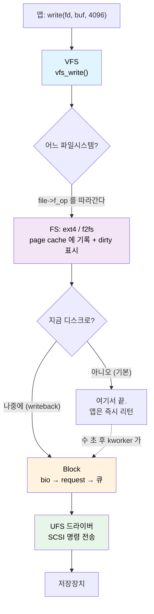

여기서 가장 중요한 사실 두 가지를 먼저 못 박는다.

1. **보통의 `write()` 는 디스크에 안 쓴다.** 메모리(page cache)에 쓰고 "더럽다(dirty)"고
   표시만 하고 즉시 돌아온다. 실제 디스크 쓰기는 **한참 뒤에 다른 스레드**가 한다.
   그래서 fsiotrace 에서 VFS row 와 BLK row 의 **시간이 크게 벌어지고**, comm 도 앱이 아니라
   `kworker` 로 나온다.
2. **각 층은 아래 층의 구현을 모른다.** VFS 는 ext4 든 f2fs 든 상관없이 같은 함수를 부르고,
   그 함수 포인터가 실제 파일시스템 코드를 가리킨다. 이 "함수 포인터로 연결하는" 구조가
   §1 의 주제다.

| 층 | 무슨 일을 하나 | 단위 | 대표 함수 |
|---|---|---|---|
| **VFS** | syscall 을 받아 파일시스템에 넘긴다 | 파일 + 바이트 오프셋 | `vfs_read` / `vfs_write` |
| **FS** | 파일 오프셋 → 디스크 블록 번호 변환, 캐시 관리 | 페이지(4KB) | `write_begin` / `map_blocks` |
| **Block** | 여러 요청을 모으고 정렬해서 큐에 넣는다 | bio / request (섹터) | `submit_bio` |
| **UFS** | SCSI 명령으로 만들어 장치에 전송 | UPIU 명령 (tag) | `ufshcd_command` |

---

## 1. VFS — file 과 inode 의 operations 는 어떻게 파일시스템에 "붙는가"

### 1.1 문제: 커널은 어떻게 ext4 와 f2fs 를 똑같이 다루나

앱이 `write()` 를 부르면 커널은 그 파일이 ext4 위에 있는지 f2fs 위에 있는지 **알 필요가 없어야**
한다. 그래야 파일시스템을 새로 추가해도 VFS 를 안 고친다.

C 에는 상속이나 인터페이스가 없다. 대신 **함수 포인터를 모아둔 구조체**를 쓴다.
이게 `operations` 구조체다. 객체지향의 vtable 과 정확히 같은 개념이다.

```c
// include/linux/fs.h — 커널이 정의한 "규격"
struct file_operations {
    ssize_t (*read_iter)(struct kiocb *, struct iov_iter *);
    ssize_t (*write_iter)(struct kiocb *, struct iov_iter *);
    int     (*fsync)(struct file *, loff_t, loff_t, int datasync);
    // ...
};
```

ext4 와 f2fs 는 각자 이 규격을 채운 **자기 구조체를 하나씩 만들어 둔다.** 그리고 파일을 열 때
`file->f_op` 가 그중 하나를 가리키게 한다.

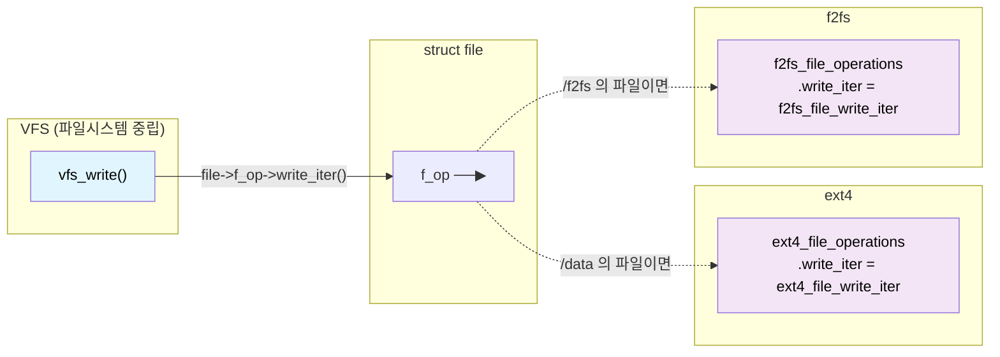

`vfs_write()` 안의 실제 코드는 이런 모습이다.

```c
// fs/read_write.c (요약)
ssize_t vfs_write(struct file *file, const char __user *buf, ...)
{
    if (file->f_op->write)
        ret = file->f_op->write(file, buf, count, pos);
    else if (file->f_op->write_iter)
        ret = new_sync_write(file, buf, count, pos);   // → write_iter 호출
    // ...
}
```

**`file->f_op->write_iter(...)` — 이 한 줄이 "붙는다"의 정체다.** VFS 는 그저 포인터를 따라갈 뿐,
그 끝이 ext4 인지 f2fs 인지 모른다.

### 1.2 그럼 그 포인터는 언제 채워지나

`open()` 할 때다. 순서는 이렇다.

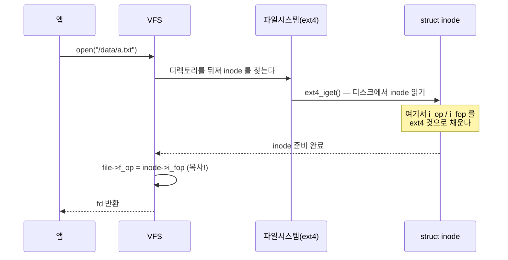

핵심은 **`inode->i_fop` 를 `file->f_op` 로 복사**하는 부분이다. 그래서 파일을 열 때 한 번만
연결해 두면, 이후 모든 `read`/`write` 는 포인터만 따라가면 된다.

inode 를 만들 때 파일시스템이 하는 일은 이렇다. 파일 종류에 따라 다른 세트를 붙인다.

```c
// fs/ext4/inode.c — ext4_iget() 안 (요약)
if (S_ISREG(inode->i_mode)) {          // 일반 파일
    inode->i_op  = &ext4_file_inode_operations;
    inode->i_fop = &ext4_file_operations;
} else if (S_ISDIR(inode->i_mode)) {   // 디렉토리
    inode->i_op  = &ext4_dir_inode_operations;
    inode->i_fop = &ext4_dir_operations;
} else if (S_ISLNK(inode->i_mode)) {   // 심볼릭 링크
    inode->i_op  = &ext4_symlink_inode_operations;
}
```

### 1.3 세 가지 operations 의 역할 분담

헷갈리기 쉬운 부분이다. **세 개가 서로 다른 일을 한다.**

| 구조체 | 어디에 붙나 | 무엇을 하나 | 대표 멤버 |
|---|---|---|---|
| `file_operations` | `file->f_op` | **열린 파일**에 대한 동작 | `read_iter`, `write_iter`, `fsync`, `mmap` |
| `inode_operations` | `inode->i_op` | **이름·메타데이터** 동작 | `create`, `lookup`, `unlink`, `rename`, `setattr` |
| `address_space_operations` | `inode->i_mapping->a_ops` | **페이지 캐시 ↔ 디스크** 동작 | `write_begin`, `write_end`, `writepages`, `read_folio`, `readahead` |

기억법:

- **file_operations** = "파일을 **읽고 쓴다**" (fd 가 있어야 함)
- **inode_operations** = "파일을 **만들고 지우고 이름 바꾼다**" (경로 조작)
- **address_space_operations** = "메모리와 디스크 사이를 **오간다**" ← **IO 추적의 핵심**

세 번째가 우리에게 가장 중요하다. 실제 디스크 IO 는 전부 여기를 지나간다.

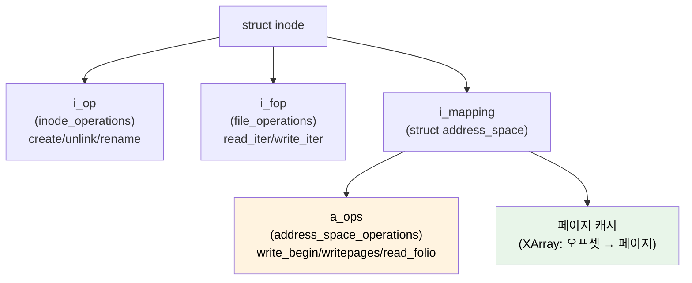

### 1.4 실제 커널 소스 — ext4 와 f2fs 의 a_ops

아래는 GKI 6.12 실물이다(요약 아님).

```c
// fs/ext4/inode.c:3575
static const struct address_space_operations ext4_aops = {
    .read_folio     = ext4_read_folio,
    .readahead      = ext4_readahead,
    .writepages     = ext4_writepages,
    .write_begin    = ext4_write_begin,
    .write_end      = ext4_write_end,
    .dirty_folio    = ext4_dirty_folio,
    // ...
};

// fs/f2fs/data.c:4307
const struct address_space_operations f2fs_dblock_aops = {
    .read_folio     = f2fs_read_data_folio,
    .readahead      = f2fs_readahead,
    .writepages     = f2fs_write_data_pages,
    .write_begin    = f2fs_write_begin,
    .write_end      = f2fs_write_end,
    .dirty_folio    = f2fs_dirty_data_folio,
    // ...
};
```

**멤버 이름이 똑같고 함수만 다르다.** 이게 VFS 가 둘을 구분하지 않고 다룰 수 있는 이유다.

ext4 는 흥미롭게도 a_ops 를 **네 종류**나 갖고 있고 마운트 옵션에 따라 다른 걸 붙인다.

| a_ops | 언제 쓰나 | write_begin |
|---|---|---|
| `ext4_aops` | 기본(`data=ordered`) | `ext4_write_begin` |
| `ext4_da_aops` | delayed allocation (기본 ON) | `ext4_da_write_begin` |
| `ext4_journalled_aops` | `data=journal` | `ext4_write_begin` |
| `ext4_dax_aops` | DAX (persistent memory) | — |

**delayed allocation(지연 할당)** 이 기본이라는 게 §2 에서 중요해진다.

---

## 2. FS 계층 — write 는 begin → map_blocks → end 로 진행된다

### 2.1 buffered write 의 3단계

앱이 `write()` 하면 파일시스템은 페이지 단위로 이 3단계를 반복한다.

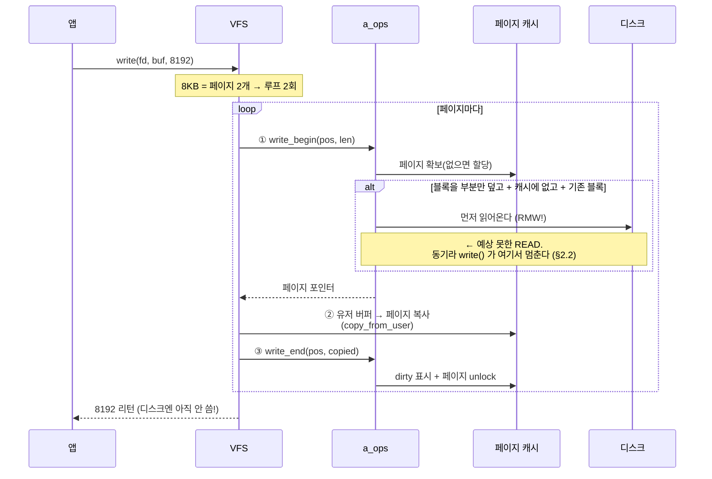

각 단계가 하는 일:

| 단계 | 함수 | 하는 일 | 실패하면 |
|---|---|---|---|
| ① | `write_begin` | 페이지 확보 + lock, 필요시 디스크에서 읽기, 트랜잭션 시작 | 여기서 ENOSPC/EIO |
| ② | (VFS) | `copy_from_user` 로 유저 데이터 복사 | EFAULT |
| ③ | `write_end` | dirty 표시, 파일 크기 갱신, 트랜잭션 종료, unlock | — |

### 2.2 ①에서 왜 READ 가 생기나 — RMW

**직관에 반하는 부분이라 따로 짚는다.** "쓰기만 했는데 왜 읽기가 보이지?"

#### 왜 필요한가 — 디스크는 부분 수정을 못 한다

디스크는 **블록 단위로만** 읽고 쓴다. 바이트 하나만 바꿀 방법이 없다. 그래서 블록의
일부만 수정하려면 이렇게 해야 한다.


이 세 단계가 **RMW(Read-Modify-Write)** 다. 앱은 100바이트만 썼는데 디스크에는
읽기 4KB + 쓰기 4KB 가 오간다.

#### 단위는 페이지가 아니라 "블록"이다

흔한 오해를 먼저 정리한다. 페이지 캐시는 4KB 단위지만, **RMW 판정은 파일시스템
블록 단위(`s_blocksize`, 보통 4KB, 1KB·2KB 도 가능)로 이뤄진다.**

ext4 는 페이지 안의 블록들을 `buffer_head` 로 하나씩 순회하며 **블록마다 따로**
"읽어야 하나" 를 판정한다. 블록 크기가 1KB 라면 4KB 페이지 안에 4개의 독립 판정이 있다.

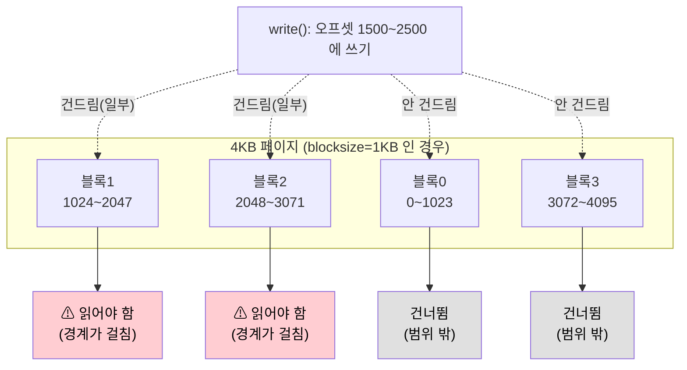

#### 실제 판정 조건 — 커널 코드 그대로

`ext4_block_write_begin()` (`fs/ext4/inode.c:1090`) 의 조건문이 판정의 전부다.

```c
if (!buffer_uptodate(bh) && !buffer_delay(bh) &&
    !buffer_unwritten(bh) &&
    (block_start < from || block_end > to)) {
        ext4_read_bh_lock(bh, 0, false);   // ← 여기서 READ 발생
        wait[nr_wait++] = bh;
}
```

네 조건이 **모두** 참이어야 읽는다. 하나라도 거짓이면 읽지 않는다.

| 조건 | 뜻 | 거짓이면 왜 안 읽나 |
|---|---|---|
| `!buffer_uptodate(bh)` | 이 블록 내용이 메모리에 없다 | 이미 있으면 읽을 이유가 없다 |
| `!buffer_delay(bh)` | delayed allocation 대기 중이 아니다 | 아직 디스크 위치가 없다 = 읽을 곳이 없다 |
| `!buffer_unwritten(bh)` | 미기록 extent(`fallocate`)가 아니다 | 내용이 정의상 0 이다 |
| `block_start < from \|\| block_end > to` | **쓰기 범위가 블록을 부분만 덮는다** | 블록 전체를 덮어쓰면 원본이 필요 없다 |

마지막 조건이 핵심이다. 위 그림의 블록0·블록3 은 `block_end <= from` 이라 루프
앞부분에서 `continue` 로 아예 건너뛴다.

#### 읽지 않는 경우 — 새 블록은 0 으로 채운다

파일 끝에 이어 쓰거나 hole 에 쓰면 **디스크에 원본이 없다.** 이때는 읽지 않고 0 으로
채운다(`folio_zero_segments`). 같은 함수의 `buffer_new(bh)` 분기다.

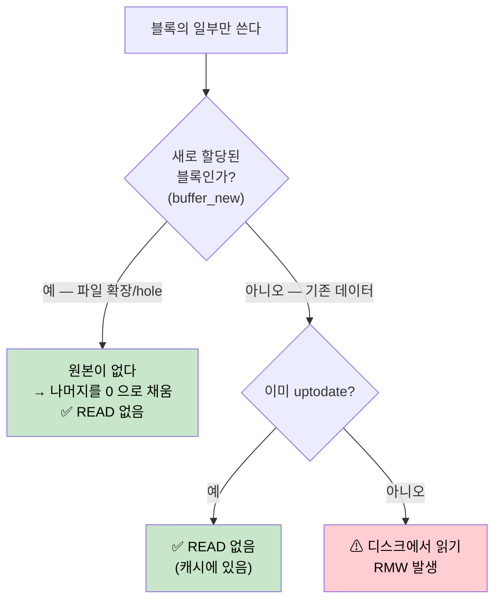

#### 정리 — 언제 READ 가 생기나

| 상황 | READ 발생? | 이유 |
|---|---|---|
| 4KB 정렬 + 4KB 크기 쓰기 | ❌ | 블록 전체를 덮어씀 |
| 파일 끝에 append | ❌ | 새 블록 → 0 으로 채움 |
| `fallocate` 영역에 쓰기 | ❌ | unwritten extent |
| 이미 읽은 적 있는 위치 | ❌ | 캐시에 uptodate |
| **기존 파일 중간에 비정렬 쓰기** | ✅ | **부분 덮어쓰기 + 원본 필요** |
| **랜덤 위치에 작은 크기 쓰기** | ✅ | 대부분 비정렬 |

#### 실무 함의

**증상**: write 만 하는 워크로드인데 fsiotrace BLK/UFS 계층에 READ row 가 잔뜩 보인다.
`ufs_op=0x28`(READ_10)이 write 워크로드에서 나온다.

**비용**: 100바이트 쓰기가 디스크에서는 4KB 읽기 + 4KB 쓰기 = **80배 증폭**된다.
게다가 읽기는 **동기**다 — `write_begin` 안에서 `wait_on_buffer()` 로 완료를 기다리므로
(위 코드의 두 번째 루프), 앱의 `write()` 가 그만큼 늦어진다. "버퍼드 쓰기는 빠르다"는
통념이 깨지는 지점이다.

**해결**:
- 쓰기를 **블록 크기에 정렬**하고 블록 단위로 쓴다 (보통 4KB)
- 작은 쓰기가 불가피하면 앱에서 모아서(buffering) 한 번에 쓴다
- 파일을 처음부터 순차로 채우면 새 블록이라 RMW 가 안 생긴다

#### f2fs 는 LFS 인데 왜 RMW 가 필요한가

**가장 헷갈리는 부분이라 따로 다룬다.** "덮어쓰기를 안 하는데 왜 원본을 읽지?"

핵심은 이것이다.

> **LFS 는 "어디에 쓰는가"를 바꾼다. "얼마나 작게 쓸 수 있는가"는 안 바꾼다.**

새 위치에 쓰더라도 **쓰기 단위는 여전히 블록(4KB)** 이다. 100바이트만 쓸 방법은 없다.
그러면 나머지 3996 바이트에 무엇을 넣을 것인가? **원래 파일 내용이어야 한다.**

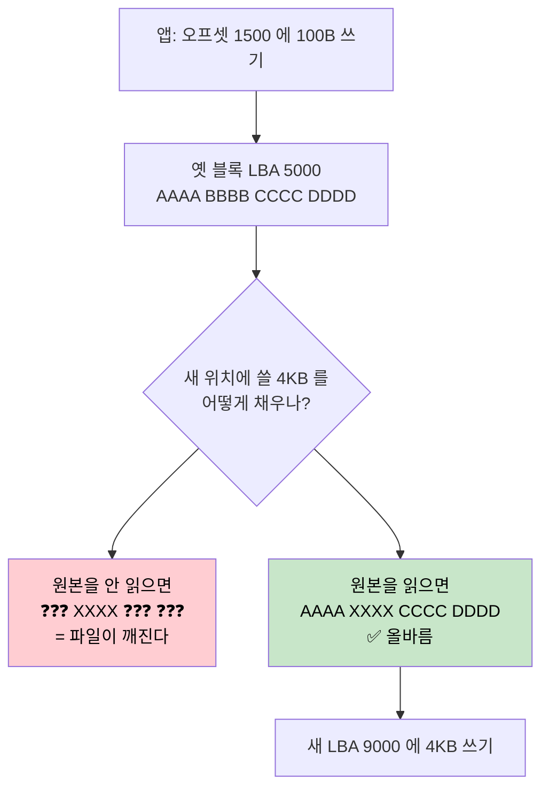

오히려 **f2fs 가 더 곤란하다.** ext4 는 제자리라 "안 건드린 부분은 디스크에 그대로 있다"는
여지가 개념적으로라도 있지만, f2fs 는 **새 위치에 쓰므로 안 채우면 그 3996 바이트가
확정적으로 쓰레기값**이 된다.

#### 실제 코드 — ext4 와 같은 분기

`f2fs_write_begin()` (`fs/f2fs/data.c:3855`):

```c
if (blkaddr == NEW_ADDR) {                    // 새 블록 = 원본 없음
    folio_zero_segment(folio, 0, folio_size(folio));   // 0 으로 채움
    folio_mark_uptodate(folio);
} else {                                      // 기존 블록 = 원본 필요
    err = f2fs_submit_page_read(...);         // ⚠ READ 발생
}
```

`NEW_ADDR` 은 f2fs 특유의 값으로 "블록이 예약됐지만 아직 실제 위치가 없음"을 뜻한다.
ext4 의 `buffer_new` 와 같은 역할이다.

읽기를 건너뛰는 최적화도 동일하게 있다(`data.c:3846`):

```c
if (len == folio_size(folio) || folio_test_uptodate(folio))
    return 0;                    // 블록 전체를 덮어쓰면 원본 불필요
```

f2fs 만의 것도 하나 있다(`data.c:3849`) — **파일 끝을 넘어서 쓰면** 그 뒤는 원래 아무것도
없으므로 0 으로 채우고 끝낸다:

```c
if (!(pos & (PAGE_SIZE - 1)) && (pos + len) >= i_size_read(inode) && ...) {
    folio_zero_segment(folio, len, folio_size(folio));
    return 0;
}
```

#### LFS 가 실제로 없애는 것

| | ext4 (in-place) | f2fs (LFS) |
|---|---|---|
| 부분 블록 쓰기 시 원본 읽기 | 필요 | **똑같이 필요** |
| 쓰기 **위치** | 랜덤 (원래 자리) | **순차** (로그 끝) |
| 플래시 GC 부담 | 높음 | 낮음 |
| 매핑 갱신 | 대개 불필요 | 필요 (node 갱신) |

**읽기 증폭은 그대로고, 쓰기 패턴만 순차로 바뀐다.** 플래시에서 순차 쓰기가 유리하니 그것만
으로도 큰 이득이지만, RMW 는 별개 문제다.

RMW 를 정말 없애려면 쓰기 단위가 바이트여야 하는데, 저장장치가 블록 단위로만 읽고 쓰므로
불가능하다. 굳이 하려면 "쓴 내용만 기록하고 읽을 때 재구성"하는 방식(DB 의 WAL 에 가깝다)이
있지만 읽기가 느려져 파일시스템에서는 쓰지 않는다.

#### f2fs 는 조회가 한 번 더 있다

ext4 는 extent tree 가 **inode 안에** 있어 대개 바로 찾지만, f2fs 는 매핑이 **별도 node
블록**에 있어 두 단계를 거친다.

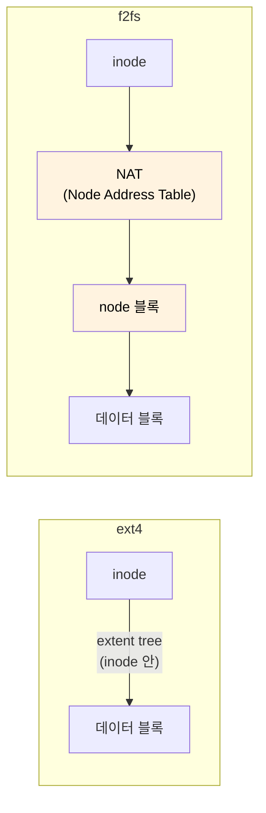

**왜 간접층이 있나**: LFS 는 데이터가 이동할 때마다 매핑이 바뀐다. 매핑이 inode 안에 있으면
데이터 하나 쓸 때마다 inode 도 새로 써야 하고, inode 도 log 구조라 또 새 위치로 가고…
연쇄가 위로 전파된다(**wandering tree** 문제). NAT 라는 간접층이 이 연쇄를 끊는다 — node 가
어디로 이동하든 NAT 항목만 고치면 되고 inode 는 안 건드린다.

**RMW 때의 실제 IO**:

| 단계 | 하는 일 | 디스크 IO |
|---|---|---|
| ⓪ | extent 캐시 조회 | 없음 (메모리) |
| ① | 캐시 미스면 `f2fs_get_dnode_of_data()` | **NAT + node 블록 읽기** ← 메타 |
| ② | node 에서 `data_blkaddr` 획득 | — |
| ③ | `blkaddr != NEW_ADDR` 이면 그 위치를 읽기 | **데이터 블록 읽기** ← RMW 의 R |

**①이 ext4 대비 추가되는 부분**이다. fsiotrace 에서 f2fs write 워크로드에 **파일명이 안
붙는 메타 IO 가 더 많이 보이는 이유**가 이것이다(②의 데이터 읽기에는 파일명이 붙는다).

다만 `f2fs_lookup_read_extent_cache_block()` 이 먼저 메모리 캐시를 보므로, 연속 접근이면
①을 건너뛴다. f2fs 도 extent 캐시를 쓴다 — ext4 처럼 디스크 구조가 아니라 **메모리 전용**
캐시라는 점만 다르다.

---

RMW 는 파일시스템 설계가 아니라 **"디스크는 블록 단위로만 읽고 쓴다"** 는 물리적 제약에서
오는 것이라, 어느 파일시스템에서도 사라지지 않는다.

### 2.3 map_blocks — 파일 오프셋을 디스크 블록으로

파일시스템의 본질적 임무다. **"이 파일의 4096번째 바이트는 디스크 어디인가?"**

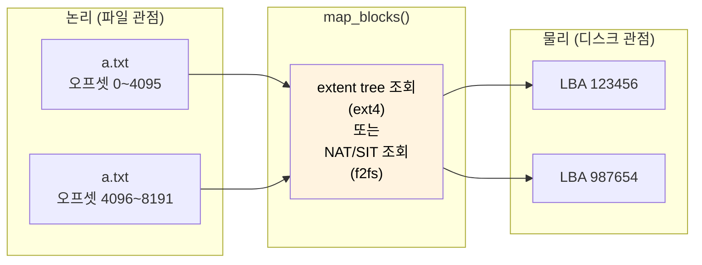

두 파일시스템의 함수:

- **ext4**: `ext4_map_blocks()` — `fs/ext4/inode.c:596`
- **f2fs**: `f2fs_map_blocks()` — `fs/f2fs/data.c:1594`

호출 시점이 **write 방식에 따라 다르다.** 이게 핵심이다.

| 방식 | 실제 주소 확정 시점 | 이유 |
|---|---|---|
| **delayed allocation** (ext4 기본) | **writeback 때** | 모아서 할당하면 연속 배치가 쉬워 단편화가 준다 |
| `data=journal`, DIO | **write_begin 때** | 즉시 디스크 위치가 필요 |

**delayed allocation 이 기본**이라는 건, `write()` 시점엔 디스크 위치가 **아직 안 정해졌다**는
뜻이다. `write_begin` 은 "나중에 쓸 블록 개수"만 예약(reserve)해 두고 실제 할당은 미룬다.

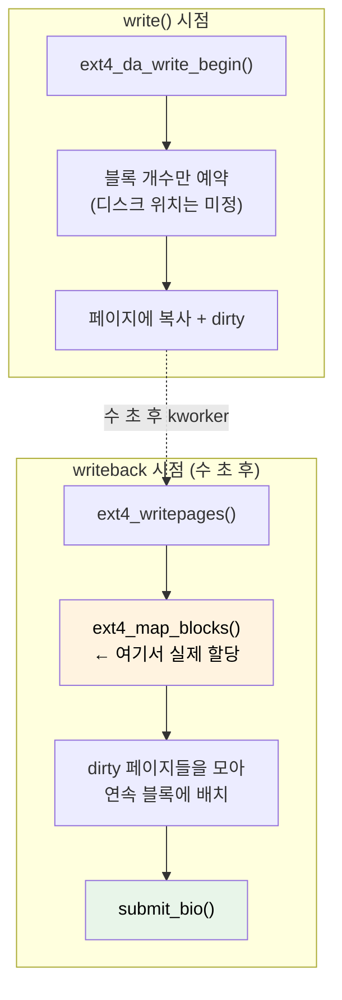

#### ⚠ f2fs 의 buffered write 는 `map_blocks` 를 안 거친다

위 그림은 **ext4 기준**이다. f2fs 도 "쓰기 시점엔 주소 미정, writeback 때 확정" 이라는 큰
그림은 같지만, **경로가 다르다.**

`f2fs_map_blocks()` 는 buffered write 의 writeback 경로에 쓰이지 않는다. 주 용도는 따로 있다:

- DIO(direct IO)
- `fiemap` (파일의 블록 배치 조회)
- 미리 할당(preallocation)

buffered write 의 writeback 은 이 경로로 간다:

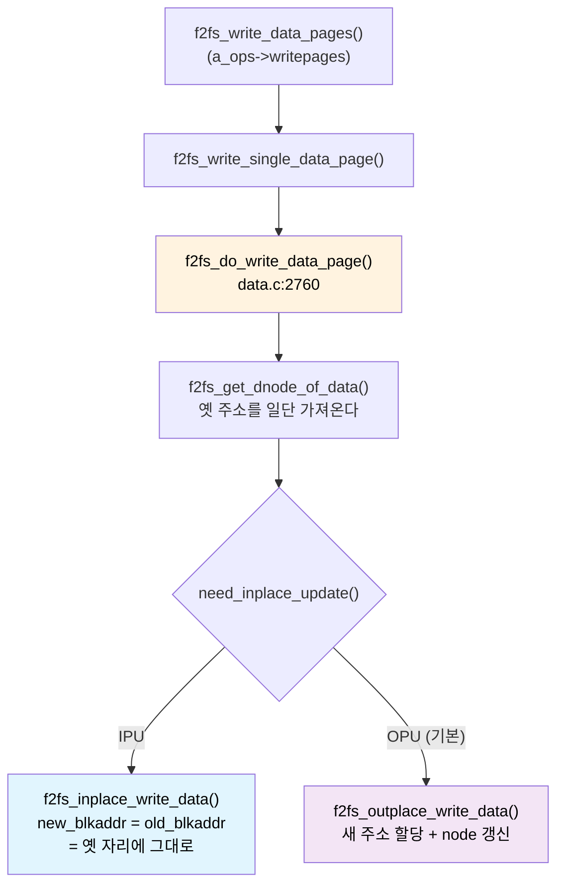

**주소를 "가져오는" 것과 "결정하는" 것이 분리돼 있다**는 게 요점이다.
`f2fs_do_write_data_page()` 는 먼저 `fio->old_blkaddr` 에 옛 주소를 담아두고, 그 다음에
IPU 로 갈지 OPU 로 갈지 정한다. 옛 주소는 어느 쪽이든 필요하다 — IPU 면 **쓸 자리**로,
OPU 면 **무효화할 자리**로.

IPU 가 확실하면 node 조회 자체를 건너뛰는 최적화도 있다(`data.c:2778`). IPU 는 매핑이
안 바뀌므로 node 를 갱신할 필요가 없기 때문이다. 반대로 **OPU 는 매핑이 바뀌므로 반드시
dnode 를 잡아야 한다.**

#### f2fs 는 항상 새 위치에 쓰지 않는다 — IPU

f2fs 를 "LFS 니까 무조건 새 위치" 로 알기 쉬운데, **실제로는 조건에 따라 제자리 갱신
(IPU, In-Place Update)을 한다.** `f2fs_inplace_write_data()` 의 첫 줄이 그 증거다:

```c
// fs/f2fs/segment.c:4184
fio->new_blkaddr = fio->old_blkaddr;   // 옛 주소를 그대로 쓴다
```

IPU 판정 조건(`check_inplace_update_policy`, `data.c:2653`)에 **쓰기 크기는 없다.**
파일시스템 상태와 파일 속성이 기준이다:

| 조건 | 언제 IPU 로 가나 |
|---|---|
| `IPU_UTIL` | **디스크 사용률**이 임계치(`min_ipu_util`) 초과 |
| `IPU_SSR` | 여유 세그먼트 부족으로 SSR 필요 |
| `IPU_ASYNC` | 비동기 rewrite (`REQ_SYNC` 아님) |
| `IPU_FSYNC` | fdatasync 중 |
| `IPU_FORCE` | 마운트 옵션으로 강제 |
| pinned / cold file | 파일 속성 |

> **흔한 오해: "4KB 미만이면 IPU 아닌가?"** — 아니다. 위 조건 어디에도 크기 비교가 없다.
> RMW 와 IPU 는 **층위가 다르다**:
>
> | | RMW | IPU |
> |---|---|---|
> | **언제** | `write()` 시점 (write_begin) | **writeback** 시점 |
> | **무엇을 정하나** | 원본을 읽어올까? | 어디에 쓸까? |
> | **기준** | 블록을 부분만 덮나 (**크기 영향 있음**) | 사용률·파일속성 (**크기 무관**) |
>
> 100바이트 쓰기여도 여유가 넉넉하면 OPU 로 가고, 4KB 를 꽉 채워 써도 사용률이 높으면
> IPU 로 간다. **RMW 는 이미 끝난 뒤에** IPU 판정이 일어나므로, 어느 쪽으로 가든
> write_begin 에서 읽어온 것은 되돌릴 수 없다.

**왜 있나**: 디스크가 차면 새 위치에 쓰려고 빈 세그먼트를 만드는 데 GC 가 필요하고, GC
자체가 IO 다. 그래서 사용률이 높아지면 **LFS 원칙을 부분적으로 포기하고** 제자리 갱신으로
전환해 GC 부담을 피한다.

`mode=lfs` 로 마운트하면 이 타협 없이 **항상 OPU** 다(`f2fs_should_update_outplace()` 에서
`f2fs_lfs_mode(sbi)` → `return true`). 존(zoned) 장치처럼 제자리 갱신이 물리적으로 불가능한
경우에 쓴다.

> **fsiotrace 로 보면**: f2fs 파티션인데 같은 LBA 에 반복해서 쓰이는 게 보이면 IPU 다.
> LFS 라고 다 순차 쓰기일 거라 단정하면 안 된다.

### 2.4 ext4 vs f2fs — 같은 3단계, 다른 철학


| 항목 | ext4 | f2fs |
|---|---|---|
| 갱신 방식 | 제자리(in-place) | 새 위치에 기록(OPU) — **단 IPU 예외 있음**(§2.3) |
| 매핑 자료구조 | extent tree (inode 안) | NAT(노드 주소 테이블) + SIT |
| 매핑 조회 | 대개 1단계 | **2단계** (NAT → node) |
| 일관성 보장 | jbd2 저널 | checkpoint + 로그 |
| 블록 할당 시점 | delayed allocation | writeback 때 확정 (경로는 다름) |
| **부분 블록 쓰기 시 RMW** | 필요 | **똑같이 필요** |
| 랜덤 write 특성 | 제자리라 단편화 적음 | 순차로 바뀌어 **플래시에 유리** |
| 대가 | **저널 이중 쓰기** → §2.6 | **GC 필요** (유효 블록 이동) → §2.5 |

f2fs 는 데이터를 성격별로 다른 영역(hot/warm/cold)에 나눠 쓴다. fsiotrace 의 f2fs 세분
플래그가 이걸 보여준다. GC 가 도는 IO 는 앱이 낸 게 아니라 파일시스템이 스스로 낸 것이라,
`comm` 이 앱 이름이 아니다.

### 2.5 f2fs GC — 왜 필요하고 어떻게 도는가

#### 왜 필요한가

f2fs 는 새 위치에 쓰고(OPU) 옛 블록을 **무효(invalid)** 로 표시한다. 무효 블록은 공간을
차지하지만 쓸 수는 없다. 그대로 두면 디스크가 무효 블록으로 가득 차서 **쓸 곳이 없어진다.**

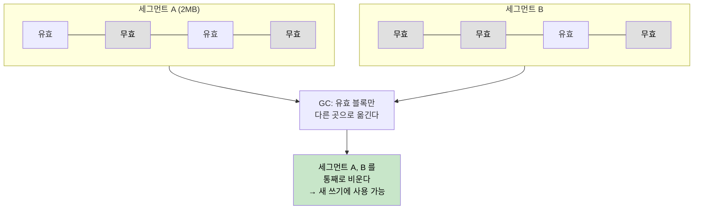

**핵심**: f2fs 는 **세그먼트(기본 2MB) 단위로만** 공간을 회수한다. 세그먼트 안에 유효
블록이 하나라도 있으면 못 비운다. 그래서 그 유효 블록을 다른 곳으로 옮겨야(migration)
하고, **그 이동 자체가 읽기 + 쓰기 IO** 다. 이게 GC 비용이다.

#### 두 가지 GC — BG 와 FG

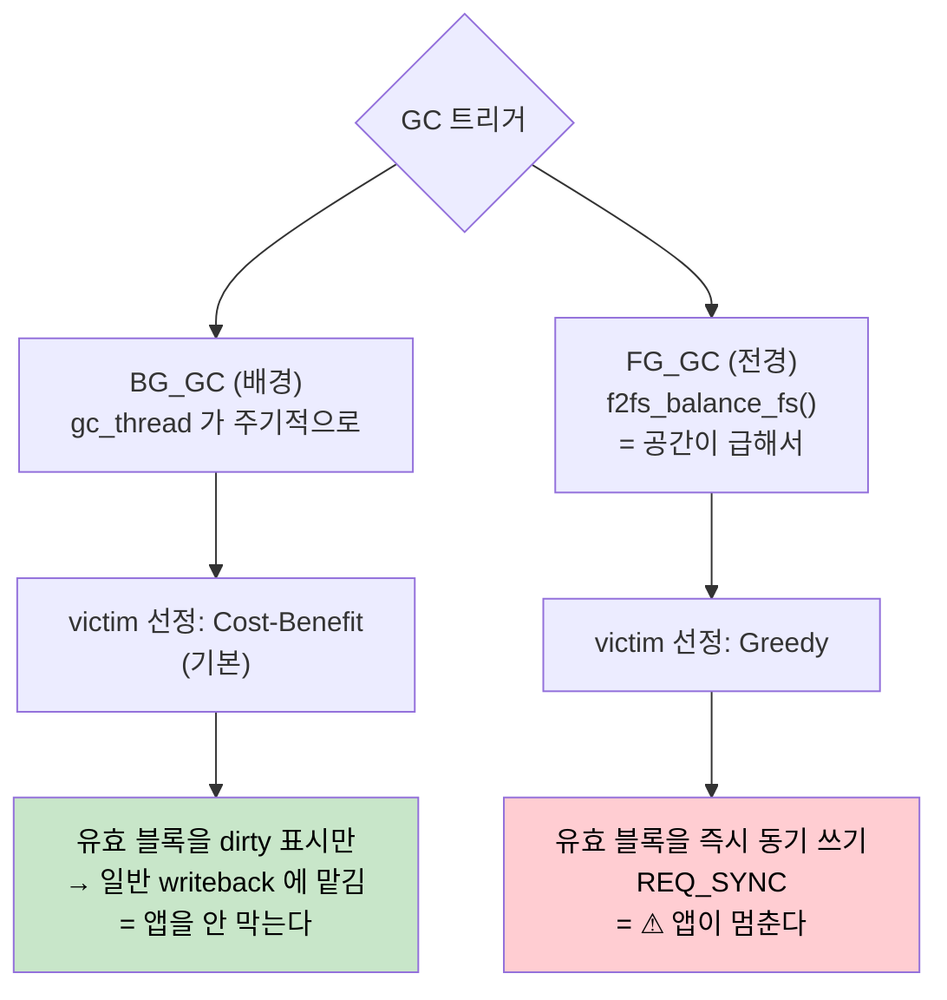

이 차이가 **성능 체감의 핵심**이다. 소스로 확인하면(`fs/f2fs/gc.c:1499`, `move_data_page`):

```c
if (gc_type == BG_GC) {
    folio_mark_dirty(folio);              // dirty 만 찍고 끝 — 나중에 writeback
    set_page_private_gcing(&folio->page);
} else {                                   // FG_GC
    struct f2fs_io_info fio = {
        .op_flags = REQ_SYNC,              // ⚠ 동기 쓰기
        .temp = COLD,
        .io_type = FS_GC_DATA_IO,
        ...
    };
    // 여기서 바로 써버린다
}
```

| | BG_GC | FG_GC |
|---|---|---|
| 언제 | gc_thread 가 주기적으로 | 공간 부족으로 **급할 때** |
| 누가 유발 | 커널 스레드 | **앱의 write() 가 유발** |
| 데이터 이동 | dirty 표시 → writeback 위임 | **즉시 동기 쓰기** |
| 앱 영향 | 거의 없음 | **write() 가 멈춘다** |
| victim 정책 | Cost-Benefit (기본) | Greedy |

**FG_GC 가 앱 지연의 주범이다.** `f2fs_balance_fs()` 가 "여유 섹션이 부족하다"고 판단하면
앱의 write 경로 한복판에서 GC 를 돌린다. 앞서 §2.3 에서 본 `f2fs_write_begin()` 의
`need_balance` 분기가 바로 그 지점이다.

#### victim 선정 — 어느 세그먼트를 비울까

`get_gc_cost()` (`fs/f2fs/gc.c:392`) 가 비용을 계산하고 **가장 싼 것**을 고른다.

**Greedy** — 유효 블록이 가장 적은 세그먼트:

```c
if (p->gc_mode == GC_GREEDY)
    return get_valid_blocks(sbi, segno, true);   // 유효 블록 수 = 비용
```

옮길 게 적으니 **당장 가장 싸다.** 급할 때(FG_GC) 쓴다.

**Cost-Benefit** — 유효 블록 수 + **나이(age)** 를 함께 본다(`get_cb_cost()`, `gc.c:364`):

```c
return UINT_MAX - ((100 * (100 - u) * age) / (100 + u));
//                              ↑ u = 사용률   ↑ age = 오래됨 정도
```

오래 안 바뀐(age 큰) 세그먼트를 선호한다. **왜?** 최근에 쓰인 데이터는 곧 또 바뀔 가능성이
높아서, 지금 옮겨봐야 금방 다시 무효가 된다. 오래된 데이터를 옮겨야 **한 번 옮기고 오래
간다.** 장기적으로 총 이동량이 줄어든다.

| 정책 | 기준 | 언제 | 장단점 |
|---|---|---|---|
| **Greedy** | 유효 블록 수만 | FG_GC (급할 때) | 당장 싸지만, 옮긴 게 금방 또 무효될 수 있음 |
| **Cost-Benefit** | 유효 블록 수 + 나이 | BG_GC (기본) | 장기적으로 총 이동량 감소 |
| **ATGC** | 나이 기반 확장 | `atgc` 옵션 | 더 정교한 age 활용 |

#### 전체 흐름

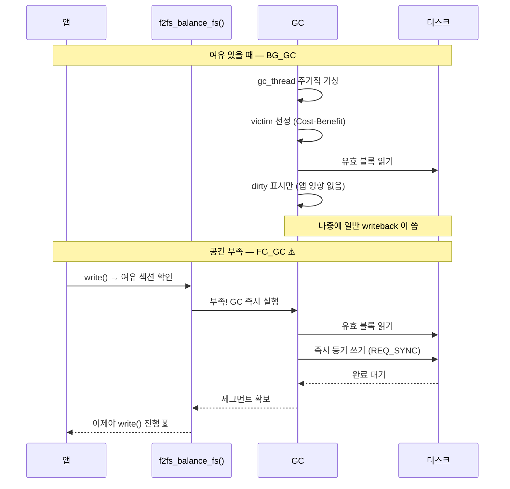

#### fsiotrace 에서 GC 를 알아보는 법

GC IO 는 **앱이 낸 게 아니라 파일시스템이 스스로 낸 것**이라 특징이 있다:

- `comm` 이 앱 이름이 아니다 — BG_GC 는 `f2fs_gc-<major>:<minor>` 커널 스레드
  (`gc.c:222`, 예: `f2fs_gc-254:61`)
- **FG_GC 는 앱 comm 으로 나온다** — 앱의 write 경로에서 실행되기 때문. 앱이 안 낸 IO 가
  앱 이름으로 찍히는 셈이라 오해하기 쉽다
- 읽기와 쓰기가 **쌍으로** 나타난다 (유효 블록을 읽어서 다시 씀)
- 앱이 요청한 적 없는 LBA 에 접근한다

> **성능 조사 시**: write 지연이 튀는데 앱 IO 량은 그대로라면 FG_GC 를 의심한다.
> `/sys/fs/f2fs/<dev>/` 의 `gc_urgent`, 그리고 `/proc/fs/f2fs/<dev>/status` 의 GC 통계
> (`GC calls`, `BG_GC`)로 대조할 수 있다.

#### ext4 에는 왜 GC 가 없나

ext4 는 제자리 갱신이라 **옛 블록이 곧 새 블록**이다. 무효 블록이 안 생기니 회수할 것도
없다. 대신 다른 대가를 치른다:

| | ext4 | f2fs |
|---|---|---|
| 무효 블록 | 안 생김 | 생김 → **GC 필요** |
| 대신 치르는 비용 | 저널 이중 쓰기, 랜덤 쓰기 | GC 이동 IO |
| 공간 부족 시 | 단편화 (성능 저하) | **FG_GC (지연 급증)** |

플래시 저장장치 안에도 **FTL 의 GC** 가 따로 있다는 점도 알아둘 만하다. f2fs 의 순차 쓰기는
그 FTL GC 부담을 줄이려는 것이라, **파일시스템 GC 를 감수하고 장치 GC 를 줄이는** 트레이드
오프다.

### 2.6 ext4 저널링 (jbd2) — 왜 두 번 쓰는가

#### 해결하려는 문제 — 중간에 전원이 나가면

파일 하나를 쓰려면 디스크의 **여러 곳**을 고쳐야 한다. 데이터 블록, inode(크기·시각),
블록 비트맵… 이걸 순서대로 쓰는 도중 전원이 나가면 **일부만 반영된 상태**가 된다.

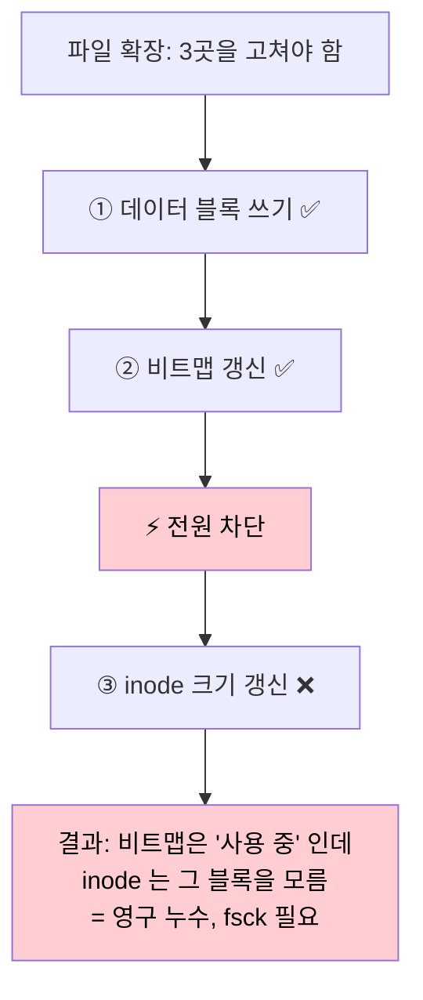

**저널링의 아이디어**: 실제 위치를 고치기 **전에**, "무엇을 고칠 것인지"를 별도 영역
(저널)에 먼저 적어 둔다. 그리고 그 기록이 **완결됐다는 표시**까지 안전하게 쓴 뒤에야 실제
위치를 고친다.

- 저널 기록 중에 전원이 나가면 → 완결 표시가 없으니 **통째로 무시**(원래 상태 유지)
- 실제 반영 중에 전원이 나가면 → 저널에 다 있으니 **재부팅 때 다시 반영**(replay)

어느 쪽이든 **"전부 반영" 또는 "전혀 반영 안 됨"** 둘 중 하나만 남는다. 이게 원자성이다.

> **용어: "제자리"(in-place)**
> 이 문서에서 **제자리 = 그 블록이 원래 있던 디스크 주소**를 뜻한다. 저널 영역
> (디스크의 별도 구역)과 대비되는 말이다.
>
> 그래서 **"저널에 먼저 쓰고 나중에 제자리"** 는 같은 내용을 **두 번** 쓴다는
> 뜻이다 — 먼저 저널 영역에, 나중에 원래 자리에. 이게 저널링의 이중 쓰기다.
>
> ⚠ 헷갈리기 쉬운 지점: `data=ordered`(기본)에서 **이 이중 쓰기를 겪는 건
> 메타데이터뿐이다.** 데이터는 저널을 타지 않고 제자리로 한 번만 간다.
> 아래 시퀀스에서 ①(데이터)과 ④(메타)의 목적지가 똑같이 "제자리" 인 이유가
> 이것 — 같은 곳으로 가지만 데이터는 한 번, 메타는 저널을 거쳐 두 번째다.

#### 세 가지 모드 — 무엇을 저널에 넣느냐

여기가 핵심이고, 사람들이 가장 헷갈리는 부분이다. **저널에 메타데이터만 넣느냐,
데이터까지 넣느냐**의 차이다.


| 모드 | 저널에 들어가는 것 | 쓰기 증폭 | 크래시 후 데이터 | 속도 |
|---|---|---|---|---|
| `data=journal` | **데이터 + 메타** | 데이터도 2배 | 가장 안전 | 느림 |
| **`data=ordered`** (기본) | 메타만 (**단 데이터를 먼저 씀**) | 메타만 2배 | 안전 | 보통 |
| `data=writeback` | 메타만 (순서 보장 없음) | 메타만 2배 | ⚠ 옛 데이터 노출 가능 | 빠름 |

**`ordered` 의 "순서"가 무슨 뜻인가**: 메타데이터를 커밋하기 **전에** 그 트랜잭션에 딸린
데이터를 먼저 디스크에 내려보낸다. 소스가 그대로 보여준다
(`fs/jbd2/commit.c:211`, `journal_submit_data_buffers`):

```c
list_for_each_entry(jinode, &commit_transaction->t_inode_list, i_list) {
    if (!(jinode->i_flags & JI_WRITE_DATA))
        continue;
    // 커밋 전에 이 inode 의 데이터 버퍼를 먼저 submit
    err = journal->j_submit_inode_data_buffers(jinode);
}
```

**왜 이 순서가 중요한가**: 메타(inode 크기 = 4KB)가 먼저 반영되고 데이터가 안 갔는데
크래시가 나면, 그 4KB 자리에는 **이전에 삭제된 다른 파일의 내용**이 남아 있다. 남의 데이터가
보이는 보안 문제다. `writeback` 모드가 빠른 대신 감수하는 위험이 이것이다.

#### 커밋 절차 — 트랜잭션의 일생

jbd2 는 여러 변경을 **하나의 트랜잭션으로 묶어** 한꺼번에 커밋한다. 기본 간격은 **5초**
(`JBD2_DEFAULT_MAX_COMMIT_AGE`, `include/linux/jbd2.h:48`).

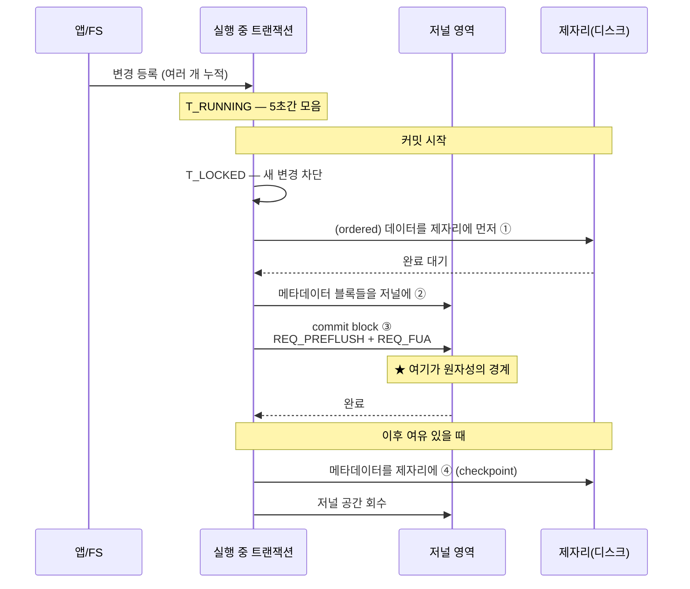

| 단계 | 상태 | 하는 일 |
|---|---|---|
| ① | `T_RUNNING`→`T_LOCKED` | 변경 누적 → 새 진입 차단 |
| ② | `T_FLUSH` | (ordered) **데이터**를 제자리에 — 저널 안 탐, 이걸로 끝 |
| ③ | `T_COMMIT` | **메타데이터**를 **저널에** 기록 ← 메타의 1번째 쓰기 |
| ④ | `T_COMMIT_JFLUSH` | **commit block** — 이게 쓰이면 트랜잭션 확정 |
| ⑤ | checkpoint | **메타데이터**를 **제자리에** 반영 ← 메타의 2번째 쓰기, 저널 회수 |

②와 ⑤ 둘 다 목적지가 "제자리" 지만 **대상이 다르다** — ②는 데이터(한 번으로 끝),
⑤는 메타데이터(저널을 거쳐 온 두 번째). 여기가 이중 쓰기의 실체다.

**commit block 이 원자성의 경계다.** 이게 디스크에 안전히 안착하기 전에 전원이 나가면
트랜잭션 전체가 무효, 안착한 뒤면 전체가 유효다. 그래서 여기에만 배리어를 건다
(`fs/jbd2/commit.c:154`):

```c
if (journal->j_flags & JBD2_BARRIER &&
    !jbd2_has_feature_async_commit(journal))
        write_flags |= REQ_PREFLUSH | REQ_FUA;
```

- `REQ_PREFLUSH` — 앞서 보낸 것들을 **먼저 다 굽고** 나서 이걸 쓰라
- `REQ_FUA` — 이 블록은 장치 캐시에 두지 말고 **매체에 직접** 써라

UFS 계층에서 `SYNCHRONIZE_CACHE`(0x35) 가 보이면 대개 이 배리어다.

#### fsiotrace 에서 저널 IO 를 알아보는 법

- **`jbd2/<dev>-<ino>`** 커널 스레드가 커밋을 수행한다 → `comm` 이 이것이면 저널 IO.
  내부 저널이면 이름 뒤에 **저널 inode 번호**가 붙는다(`journal.c:1698`, `"%pg-%lu"`).
  ext4 의 저널 inode 는 보통 8번이라 `jbd2/sda1-8` 처럼 보인다
- 저널은 디스크의 **연속된 특정 영역**이라 LBA 가 좁은 범위에 반복해서 몰린다
- **파일명이 안 붙는다** — 저널 블록은 특정 파일의 데이터가 아니다
- 5초 주기로 규칙적인 쓰기 묶음이 보인다
- `fsync()` 를 부르면 그 자리에서 즉시 커밋이 일어난다

> **쓰기 증폭 계산**: `data=ordered` 에서 4KB 데이터 한 번 쓰면 실제로는
> **데이터** 4KB(제자리, 한 번) + **메타**를 저널에 + commit block + 나중에 **메타**를
> 제자리에. 즉 데이터는 1회, 메타는 2회 쓰인다. 작은 파일을 많이 만들수록
> **메타 비중이 커져** 증폭이 심해진다.

#### f2fs 와의 비교 — 같은 문제, 다른 해법

| | ext4 (jbd2 저널) | f2fs (checkpoint + LFS) |
|---|---|---|
| 일관성 방식 | **메타를** 저널에 먼저 → 나중에 제자리 | 데이터·메타 모두 **새 위치**에 쓴다 |
| **데이터** 경로 | 제자리로 **한 번**(`ordered` 기준, 저널 안 탐) | 새 위치(OPU) — 단 IPU 예외(§2.3) |
| **메타** 쓰기 증폭 | **2배** (저널 + 제자리) | checkpoint 시점에만 |
| 크래시 복구 | 저널 replay | 마지막 checkpoint 로 롤백 + roll-forward |
| 대가 | **메타 이중 쓰기** | **GC** (§2.5) |

**둘은 같은 문제를 반대 방향으로 푼다.** ext4 는 "제자리를 고치되, 고치기 전에 저널에
적어 둔다", f2fs 는 "제자리를 아예 안 고치니 되돌릴 것도 없다 — 대신 버려진 옛 공간을
GC 로 회수한다".

### 2.7 fsync — ext4 와 f2fs 는 어떻게 다른가

같은 `fsync()` 인데 두 파일시스템이 하는 일이 꽤 다르다. **f2fs 에는 ext4 에 없는 최적화가
있다.**

#### 공통 목표

fsync 는 세 가지를 보장해야 한다.

1. 데이터가 디스크에 도달
2. **그 데이터를 찾아갈 수 있는 메타데이터**도 도달
3. 장치 캐시가 아니라 **매체에** 안착 (FLUSH)

2번이 어려운 지점이다. 데이터만 써봐야 inode 가 그 위치를 모르면 재부팅 후 못 찾는다.

#### ext4 — 트랜잭션 커밋을 기다린다

```mermaid
sequenceDiagram
    participant App as 앱
    participant E as ext4_sync_file
    participant J as jbd2
    participant D as 디스크

    App->>E: fsync(fd)
    E->>D: ① file_write_and_wait_range()<br/>데이터 페이지 전송 + 완료 대기
    D-->>E: 데이터 완료
    E->>J: ② ext4_fsync_journal()<br/>이 inode 가 속한 트랜잭션 커밋 요청
    J->>D: 메타데이터를 저널에 + commit block
    D-->>J: 커밋 완료
    J-->>E: 완료
    E->>D: ③ blkdev_issue_flush()<br/>장치 캐시 배출
    D-->>E: FLUSH 완료
    E-->>App: 리턴
```

`ext4_sync_file()` (`fs/ext4/fsync.c:129`) 의 구조가 그대로 이 순서다:

```c
ret = file_write_and_wait_range(file, start, end);   // ① 데이터
...
ret = ext4_fsync_journal(inode, datasync, &needs_barrier);  // ② 저널 커밋
issue_flush:
if (needs_barrier) {
    err = blkdev_issue_flush(inode->i_sb->s_bdev);   // ③ FLUSH
}
```

**핵심**: ext4 의 fsync 는 **jbd2 트랜잭션 커밋에 올라탄다.** 내 파일 하나만 fsync 해도
그 트랜잭션에 묶인 **다른 파일의 메타데이터까지 함께** 커밋된다. 그래서 관계없는 IO 가
같이 나가는 것처럼 보인다.

#### f2fs — 가능하면 checkpoint 를 피한다

f2fs 에서 **checkpoint 는 매우 비싸다.** 파일시스템 전체의 일관성 지점을 만드는 작업이라
NAT/SIT/모든 dirty node 를 다 내려보내야 한다. 파일 하나 fsync 하자고 이걸 매번 하면
성능이 무너진다.

그래서 f2fs 는 **roll-forward recovery** 라는 우회로를 쓴다.

```mermaid
flowchart TD
    A["fsync(fd)"] --> B["need_do_checkpoint()<br/>file.c:201"]
    B --> C{"checkpoint 가<br/>꼭 필요한가?"}
    C -->|"필요 (cp_reason != 0)"| D["f2fs_sync_fs()<br/>= 전체 checkpoint<br/>⚠ 비싸다"]
    C -->|"불필요 (대부분)"| E["node 페이지만 기록<br/>+ fsync 마크"]
    E --> F["f2fs_issue_flush()"]
    F --> G["✅ 빠른 fsync"]
    D --> H["느린 fsync"]

    style G fill:#c8e6c9,color:#000
    style D fill:#ffcdd2,color:#000
```

**roll-forward 의 아이디어**: checkpoint 를 안 만들고, 대신 fsync 된 node 블록에 **표시**를
남긴다. 재부팅하면 마지막 checkpoint 부터 시작해서 그 표시된 node 들을 **앞으로 훑으며
(roll forward)** 복구한다. checkpoint 는 가끔만 만들고, 그 사이는 node chain 으로 메운다.

**언제 checkpoint 가 강제되나** (`need_do_checkpoint()`, `fs/f2fs/file.c:201`):

| `cp_reason` | 조건 |
|---|---|
| `CP_NON_REGULAR` | 일반 파일이 아님 (디렉토리 등) |
| `CP_HARDLINK` | `i_nlink != 1` — 하드링크가 있음 |
| `CP_WRONG_PINO` | 부모 inode 번호가 불확실 |
| `CP_NO_SPC_ROLL` | roll-forward 할 **공간이 부족** |
| `CP_NODE_NEED_CP` | 부모 node 가 아직 checkpoint 안 됨 |
| `CP_COMPRESSED` | 압축 파일 |
| `CP_RECOVER_DIR` | `fsync_mode=strict` 이고 디렉토리 복구 필요 |

**대부분의 일반 파일 쓰기는 여기에 안 걸린다** → checkpoint 없이 빠르게 끝난다.

#### 비교

| | ext4 | f2fs |
|---|---|---|
| 메타 보장 방식 | jbd2 **트랜잭션 커밋** | **node 블록 + fsync 마크** |
| 다른 파일 영향 | 같은 트랜잭션이면 **함께 커밋** | 해당 inode 의 node 만 |
| 전체 동기화 | 저널 커밋 (비교적 가벼움) | **checkpoint (비쌈)** — 피하려 함 |
| 복구 방식 | 저널 replay | **roll-forward** (마지막 CP + node chain) |
| 최악의 경우 | 큰 트랜잭션 커밋 대기 | checkpoint 강제 (위 표 조건) |

#### 튜닝 — `fsync_mode`

f2fs 는 fsync 강도를 옵션으로 조절할 수 있다.

| `fsync_mode` | 동작 (`f2fs.h:1477`) |
|---|---|
| `posix` (기본) | POSIX 준수. 필요할 때만 checkpoint |
| `strict` | 커널 주석 그대로 *"fsync behaves in line with ext4"* — 디렉토리 항목까지 보장(`CP_RECOVER_DIR` 조건이 이 모드에서만 켜진다) → checkpoint 더 자주 |
| `nobarrier` | posix 기반이되 FLUSH 생략 → **빠르지만 전원 손실에 취약** |

Android 에서 `nobarrier` 를 쓰는 경우가 있는데, 장치가 자체 전원 보호(PLP)를 갖췄다는
전제가 필요하다.

#### fsiotrace 에서 보이는 차이

**ext4 fsync**:
- `jbd2/<dev>-<ino>` 스레드의 저널 쓰기가 **함께** 나타난다
- 내가 만지지 않은 파일의 메타데이터 IO 가 섞여 보인다 (같은 트랜잭션)
- 끝에 `SYNCHRONIZE_CACHE`(0x35)

**f2fs fsync**:
- 앱 comm 그대로, node 블록 쓰기가 보인다
- checkpoint 가 안 걸리면 **IO 량이 훨씬 적다**
- checkpoint 가 걸리면 갑자기 NAT/SIT 등 대량 메타 IO 가 터진다 → **지연 급증**
- 끝에 `SYNCHRONIZE_CACHE`(0x35)

> **성능 조사 시**: f2fs 에서 fsync 지연이 간헐적으로 크게 튀면 checkpoint 가 걸린
> 경우다. `/sys/kernel/debug/f2fs/status` 의 `CP calls` 나 `cp_reason` 통계로 확인한다.
> 하드링크 있는 파일, 디렉토리 fsync 가 흔한 원인이다.

---

## 3. writeback — dirty 페이지는 언제 디스크로 가나

### 3.1 트리거 4가지

`write()` 는 dirty 표시만 하고 끝났다. 실제로 디스크에 쓰는 계기는 넷이다.

```mermaid
flowchart TD
    D["dirty 페이지 쌓임"] --> T1["① 주기적<br/>dirty_writeback_centisecs<br/>(기본 5초)"]
    D --> T2["② 양 초과<br/>dirty_background_ratio<br/>(기본 10%)"]
    D --> T3["③ 앱이 명시<br/>fsync() / sync()"]
    D --> T4["④ 메모리 압박<br/>회수 필요"]

    T1 --> WB["writeback 시작"]
    T2 --> WB
    T3 --> WB
    T4 --> WB
    WB --> AOPS["a_ops->writepages()"]
    AOPS --> BIO["submit_bio()"]

    style T3 fill:#c8e6c9,color:#000
    style WB fill:#fff3e0,color:#000
```

| 트리거 | 누가 실행 | fsiotrace 의 comm | 지연 |
|---|---|---|---|
| ① 주기적 | `kworker` (flusher) | `kworker/u16:3` 등 | 아래 참고 |
| ② 양 초과 | `kworker` | `kworker` | 즉시~ |
| ③ `fsync()` | **앱 자신** | 앱 이름 | 없음(동기) |
| ④ 메모리 압박 | `kswapd` / 앱 | 다양 | 즉시 |

**①②④ 는 앱과 무관한 스레드가 실행한다.** 그래서 BLK row 의 `comm` 이 `kworker` 로 나온다.
"누가 이 IO 를 냈는지" 를 알려면 원래 앱을 되찾아야 하는데, fsiotrace 가 `inode_ctx` 로
그걸 복원한다([설계 문서](/fsiotrace/design/) 참고).

#### 5초? 30초? — 두 값은 다른 것이다

흔히 "5초 후 디스크에 쓰인다"고 하는데 부정확하다. **두 개의 독립된 값**이 있다
(`mm/page-writeback.c:104`, `111`):

```c
/* The interval between `kupdate'-style writebacks */
unsigned int dirty_writeback_interval = 5 * 100;   /* 5초 — 깨어나는 주기 */

/* The longest time for which data is allowed to remain dirty */
unsigned int dirty_expire_interval = 30 * 100;     /* 30초 — dirty 허용 시간 */
```

```mermaid
flowchart LR
    A["페이지가<br/>dirty 됨"] --> B["flusher 가 5초마다 깨어남<br/>dirty_writeback_interval"]
    B --> C{"이 페이지가<br/>30초 이상<br/>dirty 였나?<br/>dirty_expire_interval"}
    C -->|"아니오"| D["아직 안 씀<br/>→ 다음 기회에"]
    C -->|"예"| E["디스크로 전송"]
    D -.->|"5초 후 다시 확인"| B

    style E fill:#e8f5e9,color:#000
```

- **5초** = flusher 스레드가 **일어나서 확인하는 주기**
- **30초** = 페이지가 dirty 상태로 **버틸 수 있는 최대 시간**

그래서 방금 쓴 페이지는 5초 뒤에 바로 안 나간다. **최대 30초까지 메모리에만 있을 수
있다.** 다만 ②(양 초과)나 ③(fsync)이 먼저 걸리면 그 전에 나간다.

| 파라미터 | 기본값 | 위치 |
|---|---|---|
| `dirty_writeback_centisecs` | 500 (5초) | flusher 기상 주기 |
| `dirty_expire_centisecs` | 3000 (30초) | dirty 최대 유지 시간 |
| `dirty_background_ratio` | 10% | 이 비율 넘으면 **배경** writeback 시작 |
| `dirty_ratio` | 20% | 이 비율 넘으면 **앱을 멈춰서** 강제 writeback |

전부 `/proc/sys/vm/` 에서 조절 가능하다.

#### ⚠ dirty_ratio 초과 — 앱이 강제로 멈춘다

가장 아픈 지점이다. dirty 페이지가 `dirty_ratio`(20%)를 넘으면 커널은
`balance_dirty_pages()` 에서 **쓰기를 시도한 앱 자신을 재운다.**

```mermaid
flowchart TD
    A["앱이 계속 write()"] --> B{"dirty 비율"}
    B -->|"< 10%"| C["✅ 즉시 리턴<br/>writeback 없음"]
    B -->|"10~20%"| D["배경 writeback 시작<br/>앱은 여전히 즉시 리턴"]
    B -->|"> 20%"| E["⚠ balance_dirty_pages()<br/>앱을 sleep 시킴<br/>= write() 가 멈춘다"]

    style C fill:#c8e6c9,color:#000
    style D fill:#fff3e0,color:#000
    style E fill:#ffcdd2,color:#000
```

**증상**: 평소 빠르던 `write()` 가 갑자기 수백 ms 씩 걸린다. 앱 코드는 그대로인데
"가끔 느려진다"는 전형적인 원인이다. 저장장치가 느릴수록 이 구간에 빨리 도달한다.

**fsiotrace 에서**: VFS write row 의 간격이 갑자기 벌어지고, 동시에 BLK 계층에 대량
writeback IO 가 보인다. 앱 comm 그대로 나오므로 앱이 자발적으로 느려진 것처럼 보이지만
실제로는 커널이 재운 것이다.

#### WB_SYNC_NONE vs WB_SYNC_ALL

writeback 은 **기다리느냐 마느냐**로 두 종류다 (`include/linux/writeback.h:34`):

| 모드 | 뜻 | 쓰이는 곳 |
|---|---|---|
| `WB_SYNC_NONE` | 제출만 하고 **안 기다림** | 주기적/배경 writeback |
| `WB_SYNC_ALL` | 완료까지 **기다림** | `fsync()`, `sync()` |

같은 `writepages()` 를 부르지만 이 플래그에 따라 동작이 다르다. `for_kupdate`,
`for_background`, `for_sync` 같은 플래그도 함께 전달되어 파일시스템이 판단에 쓴다.

### 3.2 ext4 와 f2fs 의 writeback 은 어떻게 다른가

트리거는 공통(VFS/MM 계층)이지만, **실제로 무엇을 쓰느냐**는 파일시스템마다 다르다.

#### ext4 — delayed allocation 이 여기서 풀린다

앞서 §2.3 에서 본 것처럼, ext4 는 `write()` 시점에 블록을 **예약만** 하고 실제 할당을
미룬다. 그 미뤄둔 일이 writeback 에서 한꺼번에 처리된다.

```mermaid
flowchart TD
    A["ext4_writepages()"] --> B["dirty 페이지들을 모은다"]
    B --> C["ext4_map_blocks()<br/>← 여기서 실제 블록 할당"]
    C --> D["연속된 블록에 배치<br/>= 단편화 감소"]
    D --> E["submit_bio()"]
    E --> F["메타 변경은 jbd2<br/>트랜잭션에 등록"]
    F --> G["5초 후 저널 커밋(§2.6)"]

    style C fill:#fff3e0,color:#000
    style G fill:#e1f5fe,color:#000
```

**포인트**: 데이터 writeback 과 **저널 커밋이 별개 타이밍**이다. 데이터가 나간 뒤에도
메타데이터는 트랜잭션에 남아 있다가 나중에 커밋된다. 그래서 fsiotrace 에서 데이터 IO 와
`jbd2/*` 저널 IO 가 **시간차를 두고** 보인다.

#### f2fs — writeback 이 곧 OPU/IPU 결정 지점

f2fs 는 §2.3 에서 본 대로 writeback 에서 `f2fs_do_write_data_page()` 가 돌며 **어디에 쓸지**
를 정한다.

```mermaid
flowchart TD
    A["f2fs_write_data_pages()"] --> B{"f2fs_balance_fs()<br/>여유 섹션 충분?"}
    B -->|"부족"| C["⚠ FG_GC 발동 (§2.5)<br/>writeback 이 GC 를 유발"]
    B -->|"충분"| D["f2fs_do_write_data_page()"]
    C --> D
    D --> E{"IPU or OPU?"}
    E -->|"IPU"| F["옛 자리에 그대로"]
    E -->|"OPU"| G["새 자리 + node 갱신"]
    G --> H["node 블록도 써야 함<br/>= 메타 IO 추가"]

    style C fill:#ffcdd2,color:#000
    style H fill:#fff3e0,color:#000
```

**f2fs 만의 특징**:
- **writeback 이 GC 를 유발할 수 있다** — 쓸 공간이 부족하면 `f2fs_balance_fs()` 가
  FG_GC 를 돌린다. writeback 중에 갑자기 대량 IO 가 터지는 원인
- **OPU 면 node 블록도 써야 한다** — 매핑이 바뀌므로. 데이터 1개 쓰는데 메타가 따라온다
- **hot/warm/cold 로 나눠 쓴다** — 성격이 다른 데이터를 다른 로그에 배치해 GC 효율을 높인다

#### 비교

| | ext4 | f2fs |
|---|---|---|
| writeback 에서 하는 일 | **블록 할당**(delayed alloc 해소) | **IPU/OPU 결정** + 배치 |
| 메타 처리 | jbd2 트랜잭션 → 나중에 커밋 | node 블록을 즉시 함께 씀 |
| 추가 IO 유발 | 저널 (시간차) | **GC 가능** (즉시) |
| 최악의 경우 | 큰 트랜잭션 커밋 | **FG_GC 로 지연 급증** |

> **fsiotrace 로 구분하기**: writeback 구간에서 `jbd2/*` comm 이 보이면 ext4 저널,
> `f2fs_gc-*` 가 보이거나 앱 comm 으로 대량 IO 가 나오면 f2fs 의 GC 다.

### 3.3 fsync 는 무엇이 다른가

```mermaid
sequenceDiagram
    participant App as 앱
    participant PC as 페이지 캐시
    participant FS as 파일시스템
    participant Disk as 디스크

    Note over App,Disk: 일반 write — 앱은 안 기다린다
    App->>PC: write() → dirty 표시
    PC-->>App: 즉시 리턴 ✅

    Note over App,Disk: fsync — 앱이 끝까지 기다린다
    App->>FS: fsync(fd)
    FS->>Disk: dirty 페이지 전부 전송
    FS->>Disk: 메타데이터(저널) 전송
    FS->>Disk: FLUSH 명령 (캐시 강제 배출)
    Disk-->>FS: 완료
    FS-->>App: 이제야 리턴 ⏳
```

fsync 는 **데이터 + 메타데이터 + FLUSH** 세 가지를 모두 보장한다. UFS 계층에서
`SYNCHRONIZE_CACHE`(opcode 0x35) 가 보이면 이것이다.

> 여기까지는 두 파일시스템 공통이다. **ext4 와 f2fs 가 이 셋을 각각 어떻게 달성하는지**는
> 상당히 다르다 — ext4 는 jbd2 트랜잭션 커밋에 올라타고, f2fs 는 checkpoint 를 피하려
> roll-forward 를 쓴다. [§2.7](#27-fsync--ext4-와-f2fs-는-어떻게-다른가) 참고.

---

## 4. read — page cache hit 는 어떤 기준인가

### 4.1 hit 판정의 실제 조건

"캐시에 있으면 hit" 는 절반만 맞다. 커널의 실제 판정은 **두 단계**다.

```mermaid
flowchart TD
    A["read(fd, buf, 4096)"] --> B["filemap_get_pages()"]
    B --> C{"① 페이지가<br/>캐시에 존재?"}
    C -->|"없다"| MISS1["MISS<br/>→ readahead 시작"]
    C -->|"있다"| D{"② uptodate<br/>플래그가 켜져 있나?"}
    D -->|"아니오"| MISS2["MISS<br/>→ 내용이 아직 안 채워짐<br/>filemap_update_page()<br/>= 디스크 읽기를 기다림"]
    D -->|"예"| HIT["✅ HIT<br/>메모리에서 바로 복사<br/>디스크 IO 없음"]

    style HIT fill:#c8e6c9,color:#000
    style MISS1 fill:#ffcdd2,color:#000
    style MISS2 fill:#ffe0b2,color:#000
```

**②가 핵심이다.** 페이지가 캐시에 "있어도" `uptodate` 가 아니면 hit 이 아니다.
다른 스레드가 방금 페이지만 할당하고 아직 디스크에서 읽어오는 중일 수 있기 때문이다.

실제 커널 코드(`mm/filemap.c:2575` `filemap_get_pages()`)가 정확히 이 순서다:

```c
filemap_get_read_batch(mapping, index, last_index - 1, fbatch);
if (!folio_batch_count(fbatch)) {           // ① 캐시에 없음
    page_cache_sync_readahead(...);          //    → readahead 로 읽어온다
    filemap_get_read_batch(...);             //    → 다시 조회
}
// ...
if (!folio_test_uptodate(folio)) {           // ② 있지만 내용이 아직
    err = filemap_update_page(...);          //    → 채워질 때까지 대기
}
```

| 상태 | 캐시에 존재 | uptodate | 결과 | 디스크 IO |
|---|---|---|---|---|
| 완전 hit | ✅ | ✅ | 즉시 복사 | 없음 |
| 준비 중 | ✅ | ❌ | 대기 후 복사 | (다른 스레드가 이미 요청) |
| 완전 miss | ❌ | — | readahead 후 복사 | **발생** |

### 4.2 miss 면 무슨 일이 일어나나 — readahead

miss 라고 4KB 만 읽지 않는다. **커널은 앞으로 더 읽을 거라고 예측해서 미리 당겨온다.**

```mermaid
flowchart TD
    A["read() 오프셋 0, 4KB 요청"] --> B["MISS"]
    B --> C["page_cache_sync_readahead()"]
    C --> D["요청은 4KB 지만<br/>128KB 를 읽어온다"]
    D --> E["a_ops->readahead()<br/>= ext4_readahead / f2fs_readahead"]
    E --> F["submit_bio() — 큰 IO 하나"]

    G["다음 read() 오프셋 4KB"] --> H["✅ HIT<br/>(이미 당겨와 있음)"]

    F -.->|"캐시에 채워짐"| H

    style H fill:#c8e6c9,color:#000
    style D fill:#fff3e0,color:#000
```

readahead 는 **순차 읽기를 감지하면 창(window)을 키우고, 랜덤이면 줄인다.**

| 패턴 | readahead 동작 | 결과 |
|---|---|---|
| 순차 읽기 | 창을 키움 (최대 128KB 등) | 첫 read 만 miss, 나머지 hit |
| 랜덤 읽기 | 창을 줄이거나 끔 | 매번 miss → 매번 디스크 IO |
| `posix_fadvise(RANDOM)` | 명시적으로 끔 | 불필요한 선반입 방지 |

**fsiotrace 에서 보이는 모습**: 앱이 4KB 씩 순차로 100번 읽으면 VFS row 는 100개인데
BLK row 는 몇 개뿐이다. readahead 가 크게 묶어서 가져왔기 때문이다. **VFS 요청 수와
실제 디스크 IO 수가 다른 게 정상**이다.

### 4.3 O_DIRECT — 캐시를 건너뛴다

```mermaid
flowchart LR
    subgraph N["일반 read"]
        A1["앱 버퍼"] <-- "복사" --> A2["페이지 캐시"] <-- "DMA" --> A3["디스크"]
    end
    subgraph D["O_DIRECT read"]
        B1["앱 버퍼"] <-- "DMA (직접)" --> B3["디스크"]
    end

    style A2 fill:#e8f5e9,color:#000
```

O_DIRECT 는 페이지 캐시를 거치지 않고 앱 버퍼로 바로 DMA 한다. 캐시 hit 개념 자체가 없고,
**항상 디스크 IO 가 발생**한다. 그래서 fsiotrace 에서 VFS row 와 BLK row 가 1:1 로 대응된다.

---

## 5. Block 계층 — bio 에서 request 로

FS 가 `submit_bio()` 를 부르면 여기부터다.

```mermaid
flowchart TD
    A["submit_bio(bio)"] --> B["bio: 페이지들 + 시작 섹터"]
    B --> C{"인접한 기존<br/>request 있나?"}
    C -->|"있다"| D["병합(merge)<br/>IO 개수를 줄인다"]
    C -->|"없다"| E["새 request 생성"]
    D --> F["큐에 넣기"]
    E --> F
    F --> G["스케줄러<br/>(mq-deadline / bfq / none)"]
    G --> H["드라이버로 dispatch"]

    style D fill:#c8e6c9,color:#000
```

| 개념 | 설명 |
|---|---|
| **bio** | "이 페이지들을 이 섹터에 읽고/써라" — FS 가 만드는 요청 단위 |
| **request** | bio 여러 개를 병합한 것. 드라이버에 전달되는 단위 |
| **병합** | 인접 섹터면 합친다. **IO 개수가 줄어드는 주된 이유** |
| **plugging** | 잠깐 모았다가 한꺼번에 내보내 병합 기회를 늘린다 |

fsiotrace 에서 **FS row 수 > BLK row 수** 인 것이 정상인 이유가 병합이다.

---

## 6. UFS 계층 — SCSI 명령으로

```mermaid
sequenceDiagram
    participant B as Block
    participant S as SCSI
    participant U as UFS 드라이버
    participant D as 저장장치

    B->>S: request dispatch
    S->>U: SCSI 명령 (READ_10 / WRITE_10 …)
    U->>U: tag 배정 (0~31)
    U->>D: UPIU 전송<br/>trace: ufshcd_command(SEND)
    Note over U,D: 명령이 여러 개 동시에 떠 있다<br/>(Queue Depth)
    D-->>U: 완료 인터럽트<br/>trace: ufshcd_command(COMP)
    U->>U: tag 반납
    U-->>S: 완료 통보
```

| 용어 | 뜻 |
|---|---|
| **tag** | 명령 식별 번호(0~31). 완료 시 반납되고 **재사용**된다 |
| **LUN** | 논리 장치 번호. `/data` 와 `/f2fs` 가 다른 LUN 일 수 있다 |
| **QD** | 동시에 떠 있는 명령 수 = send 했지만 complete 안 된 것 |
| **UPIU** | UFS 의 명령 패킷 형식 |

주요 opcode:

| opcode | 이름 | 뜻 |
|---|---|---|
| `0x28` / `0x88` | READ_10 / READ_16 | 읽기 |
| `0x2A` / `0x8A` | WRITE_10 / WRITE_16 | 쓰기 |
| `0x35` / `0x91` | SYNCHRONIZE_CACHE | 캐시 배출 (fsync 가 유발) |
| `0x42` | UNMAP | discard / trim |

---

## 7. 전체 흐름 다시 보기 — 층별 개수가 왜 다른가

```mermaid
flowchart TD
    A["앱: write() × 100회<br/>(4KB씩)"] --> B["VFS row 100개"]
    B --> C["FS: 페이지 캐시에 100페이지 dirty"]
    C -.->|"수 초 후 writeback"| D["FS: writepages<br/>연속 페이지를 묶음"]
    D --> E["BLK: bio 몇 개<br/>+ 병합 → request 더 적게"]
    E --> F["UFS: SCSI 명령<br/>≈ request 수"]

    style B fill:#e1f5fe,color:#000
    style D fill:#f3e5f5,color:#000
    style E fill:#fff3e0,color:#000
    style F fill:#e8f5e9,color:#000
```

| 층 | row 수 | 왜 |
|---|---|---|
| VFS | **많다** (syscall 수) | 앱이 부른 횟수 그대로 |
| FS | 중간 | 페이지 단위로 묶임, writeback 때 한꺼번에 |
| BLK | 적다 | **병합**으로 크게 줄어듦 |
| UFS | ≈ BLK | request 하나 = 명령 하나 (대체로) |

**층마다 개수가 다른 게 정상이다.** 같아야 한다고 보면 오해한다.

시간축도 어긋난다:

```mermaid
gantt
    title 시간축 — write() 와 실제 디스크 쓰기는 멀리 떨어져 있다
    dateFormat X
    axisFormat %s

    section 앱
    write() 100회 (즉시 끝남)  :0, 1
    section 커널
    dirty 페이지 대기          :1, 5
    section writeback
    kworker 가 디스크로 전송   :5, 7
```

---

## 8. 요약 — 네 문장으로

1. **VFS 는 함수 포인터(`f_op`, `i_op`, `a_ops`)로 파일시스템에 연결된다.** 그래서 VFS 코드는
   ext4 든 f2fs 든 몰라도 된다. 연결은 `open()` 때 `inode->i_fop` → `file->f_op` 복사로 이뤄진다.
2. **write 는 `write_begin` → 복사 → `write_end` 3단계로 캐시에만 쓰고 끝난다.** 디스크 주소
   확정은 **writeback 때로 미뤄지고**(ext4 는 `map_blocks`, f2fs 는 `do_write_data_page`),
   그 writeback 은 앱이 아니라 `kworker` 가 수 초 뒤에 실행한다.
3. **블록을 부분만 덮어쓰면 원본을 먼저 읽어야 한다(RMW).** 저장장치가 블록 단위로만
   읽고 쓰기 때문이며, **LFS 인 f2fs 에서도 사라지지 않는다.** 이 읽기는 동기라
   `write()` 자체가 느려진다.
4. **read 의 hit 은 "캐시에 있고 + uptodate 인" 두 조건을 다 만족해야 한다.** miss 면
   readahead 가 요청보다 훨씬 크게 당겨오므로, VFS 요청 수와 디스크 IO 수는 원래 다르다.

## 9. 더 읽기

- [설계 (cross-layer · io_flags)](/fsiotrace/design/) — 이 4개 층을 fsiotrace 가 어떻게 한 줄로 잇는지
- [TSV 출력 형식](/fsiotrace/output-format/) — 각 컬럼의 의미
- [eBPF 동작 원리](/fsiotrace/bpf/) — 훅을 어떻게 거는지
- [사용법](/fsiotrace/usage/) — 실제 실행과 옵션

### 커널 소스 위치 (GKI 6.12 기준)

| 내용 | 파일 · 위치 |
|---|---|
| `vfs_write` / `vfs_read` | `fs/read_write.c` |
| ext4 a_ops | `fs/ext4/inode.c:3575` |
| ext4 map_blocks | `fs/ext4/inode.c:596` |
| **ext4 RMW 판정** | `fs/ext4/inode.c:1090` (`ext4_block_write_begin`) |
| f2fs a_ops | `fs/f2fs/data.c:4307` |
| f2fs map_blocks (DIO·fiemap 용) | `fs/f2fs/data.c:1594` |
| **f2fs RMW 판정** | `fs/f2fs/data.c:3855` (`f2fs_write_begin`) |
| **f2fs IPU/OPU 결정** | `fs/f2fs/data.c:2760` (`f2fs_do_write_data_page`) |
| **f2fs IPU 정책** | `fs/f2fs/data.c:2653` (`check_inplace_update_policy`) |
| **f2fs 제자리 쓰기** | `fs/f2fs/segment.c:4178` (`f2fs_inplace_write_data`) |
| **f2fs GC 스레드** | `fs/f2fs/gc.c:221` (`gc_thread_func` 기동) |
| **f2fs GC victim 비용** | `fs/f2fs/gc.c:392` (`get_gc_cost`), `364` (`get_cb_cost`) |
| **f2fs GC 정책 선택** | `fs/f2fs/gc.c:246` (`select_gc_type`) |
| **f2fs GC 데이터 이동** | `fs/f2fs/gc.c:1475` (`move_data_page` — BG/FG 분기) |
| **jbd2 커밋 절차** | `fs/jbd2/commit.c:348` (`jbd2_journal_commit_transaction`) |
| **jbd2 ordered 데이터 우선** | `fs/jbd2/commit.c:211` (`journal_submit_data_buffers`) |
| **jbd2 commit block 배리어** | `fs/jbd2/commit.c:154` (`REQ_PREFLUSH \| REQ_FUA`) |
| **jbd2 커밋 간격(5초)** | `include/linux/jbd2.h:48` (`JBD2_DEFAULT_MAX_COMMIT_AGE`) |
| **ext4 저널 모드 플래그** | `fs/ext4/ext4.h:1206` |
| **ext4 fsync** | `fs/ext4/fsync.c:129` (`ext4_sync_file`) |
| **f2fs fsync** | `fs/f2fs/file.c:353` (`f2fs_do_sync_file`) |
| **f2fs checkpoint 강제 조건** | `fs/f2fs/file.c:201` (`need_do_checkpoint`) |
| **f2fs fsync_mode** | `fs/f2fs/f2fs.h:1477` |
| page cache hit 판정 | `mm/filemap.c:2575` (`filemap_get_pages`) |
| UFS 명령 전송 | `drivers/ufs/core/ufshcd.c` (`ufshcd_send_command`) |
