> **최종 수정**: 2026-08-13 · **대상 커널**: GKI 6.6 / 6.12 (Android)
> · **읽는 사람**: 커널 내부를 몰라도 IO 흐름을 이해하고 싶은 사람.
> · **왜 이 문서인가**: fsiotrace 는 IO 를 4개 층으로 나눠 찍는다. 그 층이 실제로
> 커널 어디에 있고 무슨 일을 하는지 알아야 출력을 해석할 수 있다.
> 도구 사용법은 [사용법](/fsiotrace/usage/), 출력 컬럼은 [TSV 출력 형식](/fsiotrace/output-format/).

## 0. 한눈에 — 파일 한 번 쓰면 무슨 일이 일어나나

`write(fd, buf, 4096)` 한 줄이 실제로는 이렇게 내려간다.

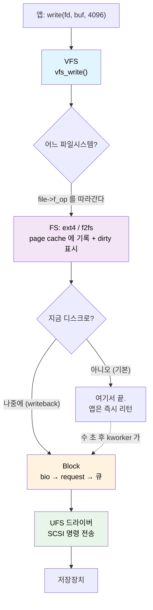

여기서 가장 중요한 사실 두 가지를 먼저 못 박는다.

1. **보통의 `write()` 는 디스크에 안 쓴다.** 메모리(page cache)에 쓰고 "더럽다(dirty)"고
   표시만 하고 즉시 돌아온다. 실제 디스크 쓰기는 **한참 뒤에 다른 스레드**가 한다.
   그래서 fsiotrace 에서 VFS row 와 BLK row 의 **시간이 크게 벌어지고**, comm 도 앱이 아니라
   `kworker` 로 나온다.
2. **각 층은 아래 층의 구현을 모른다.** VFS 는 ext4 든 f2fs 든 상관없이 같은 함수를 부르고,
   그 함수 포인터가 실제 파일시스템 코드를 가리킨다. 이 "함수 포인터로 연결하는" 구조가
   §1 의 주제다.

| 층 | 무슨 일을 하나 | 단위 | 대표 함수 |
|---|---|---|---|
| **VFS** | syscall 을 받아 파일시스템에 넘긴다 | 파일 + 바이트 오프셋 | `vfs_read` / `vfs_write` |
| **FS** | 파일 오프셋 → 디스크 블록 번호 변환, 캐시 관리 | 페이지(4KB) | `write_begin` / `map_blocks` |
| **Block** | 여러 요청을 모으고 정렬해서 큐에 넣는다 | bio / request (섹터) | `submit_bio` |
| **UFS** | SCSI 명령으로 만들어 장치에 전송 | UPIU 명령 (tag) | `ufshcd_command` |

---

## 1. VFS — file 과 inode 의 operations 는 어떻게 파일시스템에 "붙는가"

### 1.1 문제: 커널은 어떻게 ext4 와 f2fs 를 똑같이 다루나

앱이 `write()` 를 부르면 커널은 그 파일이 ext4 위에 있는지 f2fs 위에 있는지 **알 필요가 없어야**
한다. 그래야 파일시스템을 새로 추가해도 VFS 를 안 고친다.

C 에는 상속이나 인터페이스가 없다. 대신 **함수 포인터를 모아둔 구조체**를 쓴다.
이게 `operations` 구조체다. 객체지향의 vtable 과 정확히 같은 개념이다.

```c
// include/linux/fs.h — 커널이 정의한 "규격"
struct file_operations {
    ssize_t (*read_iter)(struct kiocb *, struct iov_iter *);
    ssize_t (*write_iter)(struct kiocb *, struct iov_iter *);
    int     (*fsync)(struct file *, loff_t, loff_t, int datasync);
    // ...
};
```

ext4 와 f2fs 는 각자 이 규격을 채운 **자기 구조체를 하나씩 만들어 둔다.** 그리고 파일을 열 때
`file->f_op` 가 그중 하나를 가리키게 한다.

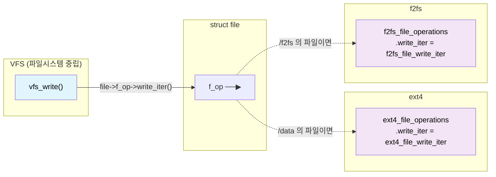

`vfs_write()` 안의 실제 코드는 이런 모습이다.

```c
// fs/read_write.c (요약)
ssize_t vfs_write(struct file *file, const char __user *buf, ...)
{
    if (file->f_op->write)
        ret = file->f_op->write(file, buf, count, pos);
    else if (file->f_op->write_iter)
        ret = new_sync_write(file, buf, count, pos);   // → write_iter 호출
    // ...
}
```

**`file->f_op->write_iter(...)` — 이 한 줄이 "붙는다"의 정체다.** VFS 는 그저 포인터를 따라갈 뿐,
그 끝이 ext4 인지 f2fs 인지 모른다.

### 1.2 그럼 그 포인터는 언제 채워지나

`open()` 할 때다. 순서는 이렇다.

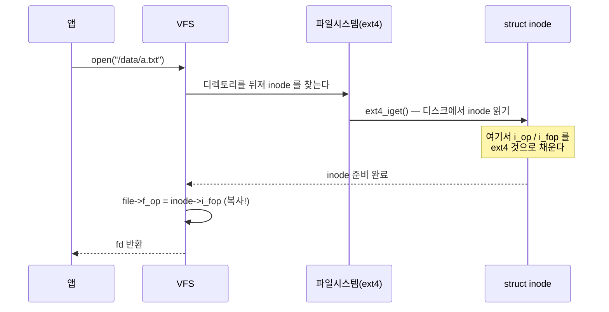

핵심은 **`inode->i_fop` 를 `file->f_op` 로 복사**하는 부분이다. 그래서 파일을 열 때 한 번만
연결해 두면, 이후 모든 `read`/`write` 는 포인터만 따라가면 된다.

inode 를 만들 때 파일시스템이 하는 일은 이렇다. 파일 종류에 따라 다른 세트를 붙인다.

```c
// fs/ext4/inode.c — ext4_iget() 안 (요약)
if (S_ISREG(inode->i_mode)) {          // 일반 파일
    inode->i_op  = &ext4_file_inode_operations;
    inode->i_fop = &ext4_file_operations;
} else if (S_ISDIR(inode->i_mode)) {   // 디렉토리
    inode->i_op  = &ext4_dir_inode_operations;
    inode->i_fop = &ext4_dir_operations;
} else if (S_ISLNK(inode->i_mode)) {   // 심볼릭 링크
    inode->i_op  = &ext4_symlink_inode_operations;
}
```

### 1.3 세 가지 operations 의 역할 분담

헷갈리기 쉬운 부분이다. **세 개가 서로 다른 일을 한다.**

| 구조체 | 어디에 붙나 | 무엇을 하나 | 대표 멤버 |
|---|---|---|---|
| `file_operations` | `file->f_op` | **열린 파일**에 대한 동작 | `read_iter`, `write_iter`, `fsync`, `mmap` |
| `inode_operations` | `inode->i_op` | **이름·메타데이터** 동작 | `create`, `lookup`, `unlink`, `rename`, `setattr` |
| `address_space_operations` | `inode->i_mapping->a_ops` | **페이지 캐시 ↔ 디스크** 동작 | `write_begin`, `write_end`, `writepages`, `read_folio`, `readahead` |

기억법:

- **file_operations** = "파일을 **읽고 쓴다**" (fd 가 있어야 함)
- **inode_operations** = "파일을 **만들고 지우고 이름 바꾼다**" (경로 조작)
- **address_space_operations** = "메모리와 디스크 사이를 **오간다**" ← **IO 추적의 핵심**

세 번째가 우리에게 가장 중요하다. 실제 디스크 IO 는 전부 여기를 지나간다.

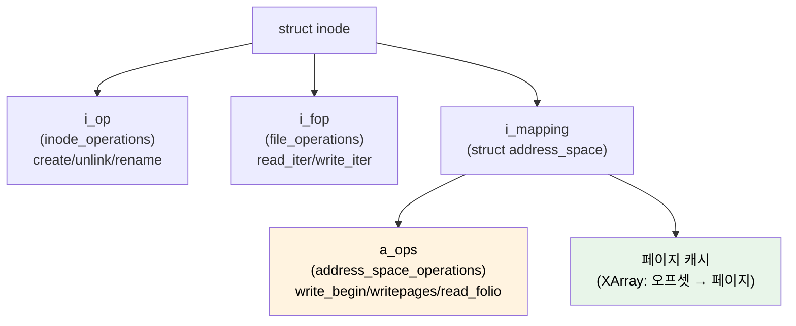

### 1.4 실제 커널 소스 — ext4 와 f2fs 의 a_ops

아래는 GKI 6.12 실물이다(요약 아님).

```c
// fs/ext4/inode.c:3575
static const struct address_space_operations ext4_aops = {
    .read_folio     = ext4_read_folio,
    .readahead      = ext4_readahead,
    .writepages     = ext4_writepages,
    .write_begin    = ext4_write_begin,
    .write_end      = ext4_write_end,
    .dirty_folio    = ext4_dirty_folio,
    // ...
};

// fs/f2fs/data.c:4307
const struct address_space_operations f2fs_dblock_aops = {
    .read_folio     = f2fs_read_data_folio,
    .readahead      = f2fs_readahead,
    .writepages     = f2fs_write_data_pages,
    .write_begin    = f2fs_write_begin,
    .write_end      = f2fs_write_end,
    .dirty_folio    = f2fs_dirty_data_folio,
    // ...
};
```

**멤버 이름이 똑같고 함수만 다르다.** 이게 VFS 가 둘을 구분하지 않고 다룰 수 있는 이유다.

ext4 는 흥미롭게도 a_ops 를 **네 종류**나 갖고 있고 마운트 옵션에 따라 다른 걸 붙인다.

| a_ops | 언제 쓰나 | write_begin |
|---|---|---|
| `ext4_aops` | 기본(`data=ordered`) | `ext4_write_begin` |
| `ext4_da_aops` | delayed allocation (기본 ON) | `ext4_da_write_begin` |
| `ext4_journalled_aops` | `data=journal` | `ext4_write_begin` |
| `ext4_dax_aops` | DAX (persistent memory) | — |

**delayed allocation(지연 할당)** 이 기본이라는 게 §2 에서 중요해진다.

---

## 2. FS 계층 — write 는 begin → map_blocks → end 로 진행된다

### 2.1 buffered write 의 3단계

앱이 `write()` 하면 파일시스템은 페이지 단위로 이 3단계를 반복한다.

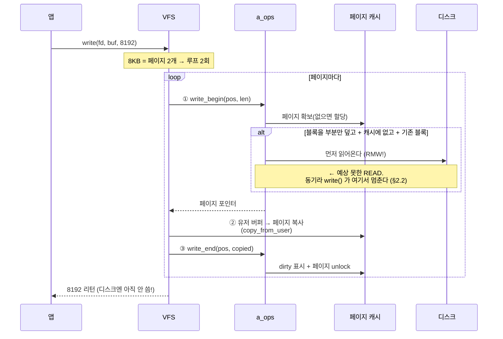

각 단계가 하는 일:

| 단계 | 함수 | 하는 일 | 실패하면 |
|---|---|---|---|
| ① | `write_begin` | 페이지 확보 + lock, 필요시 디스크에서 읽기, 트랜잭션 시작 | 여기서 ENOSPC/EIO |
| ② | (VFS) | `copy_from_user` 로 유저 데이터 복사 | EFAULT |
| ③ | `write_end` | dirty 표시, 파일 크기 갱신, 트랜잭션 종료, unlock | — |

### 2.2 ①에서 왜 READ 가 생기나 — RMW

**직관에 반하는 부분이라 따로 짚는다.** "쓰기만 했는데 왜 읽기가 보이지?"

#### 왜 필요한가 — 디스크는 부분 수정을 못 한다

디스크는 **블록 단위로만** 읽고 쓴다. 바이트 하나만 바꿀 방법이 없다. 그래서 블록의
일부만 수정하려면 이렇게 해야 한다.


이 세 단계가 **RMW(Read-Modify-Write)** 다. 앱은 100바이트만 썼는데 디스크에는
읽기 4KB + 쓰기 4KB 가 오간다.

#### 단위는 페이지가 아니라 "블록"이다

흔한 오해를 먼저 정리한다. 페이지 캐시는 4KB 단위지만, **RMW 판정은 파일시스템
블록 단위(`s_blocksize`, 보통 4KB, 1KB·2KB 도 가능)로 이뤄진다.**

ext4 는 페이지 안의 블록들을 `buffer_head` 로 하나씩 순회하며 **블록마다 따로**
"읽어야 하나" 를 판정한다. 블록 크기가 1KB 라면 4KB 페이지 안에 4개의 독립 판정이 있다.

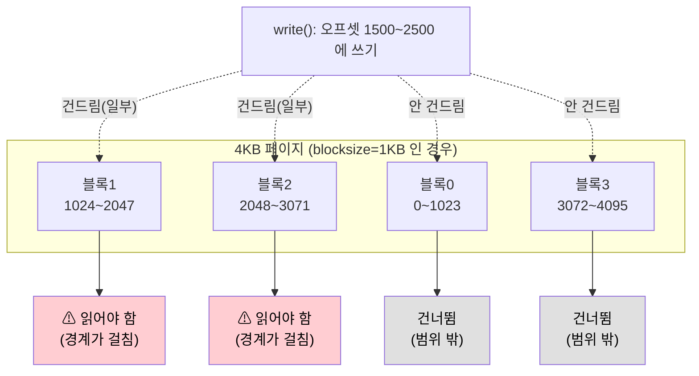

#### 실제 판정 조건 — 커널 코드 그대로

`ext4_block_write_begin()` (`fs/ext4/inode.c:1090`) 의 조건문이 판정의 전부다.

```c
if (!buffer_uptodate(bh) && !buffer_delay(bh) &&
    !buffer_unwritten(bh) &&
    (block_start < from || block_end > to)) {
        ext4_read_bh_lock(bh, 0, false);   // ← 여기서 READ 발생
        wait[nr_wait++] = bh;
}
```

네 조건이 **모두** 참이어야 읽는다. 하나라도 거짓이면 읽지 않는다.

| 조건 | 뜻 | 거짓이면 왜 안 읽나 |
|---|---|---|
| `!buffer_uptodate(bh)` | 이 블록 내용이 메모리에 없다 | 이미 있으면 읽을 이유가 없다 |
| `!buffer_delay(bh)` | delayed allocation 대기 중이 아니다 | 아직 디스크 위치가 없다 = 읽을 곳이 없다 |
| `!buffer_unwritten(bh)` | 미기록 extent(`fallocate`)가 아니다 | 내용이 정의상 0 이다 |
| `block_start < from \|\| block_end > to` | **쓰기 범위가 블록을 부분만 덮는다** | 블록 전체를 덮어쓰면 원본이 필요 없다 |

마지막 조건이 핵심이다. 위 그림의 블록0·블록3 은 `block_end <= from` 이라 루프
앞부분에서 `continue` 로 아예 건너뛴다.

#### 읽지 않는 경우 — 새 블록은 0 으로 채운다

파일 끝에 이어 쓰거나 hole 에 쓰면 **디스크에 원본이 없다.** 이때는 읽지 않고 0 으로
채운다(`folio_zero_segments`). 같은 함수의 `buffer_new(bh)` 분기다.

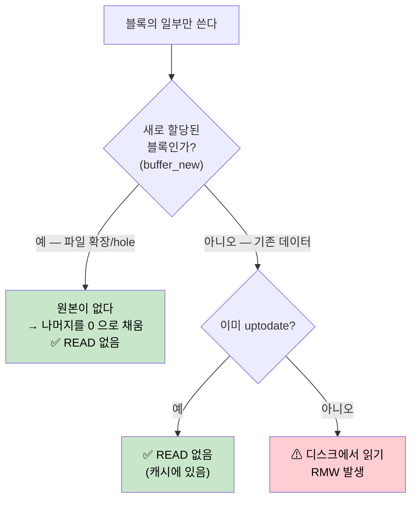

#### 정리 — 언제 READ 가 생기나

| 상황 | READ 발생? | 이유 |
|---|---|---|
| 4KB 정렬 + 4KB 크기 쓰기 | ❌ | 블록 전체를 덮어씀 |
| 파일 끝에 append | ❌ | 새 블록 → 0 으로 채움 |
| `fallocate` 영역에 쓰기 | ❌ | unwritten extent |
| 이미 읽은 적 있는 위치 | ❌ | 캐시에 uptodate |
| **기존 파일 중간에 비정렬 쓰기** | ✅ | **부분 덮어쓰기 + 원본 필요** |
| **랜덤 위치에 작은 크기 쓰기** | ✅ | 대부분 비정렬 |

#### 실무 함의

**증상**: write 만 하는 워크로드인데 fsiotrace BLK/UFS 계층에 READ row 가 잔뜩 보인다.
`ufs_op=0x28`(READ_10)이 write 워크로드에서 나온다.

**비용**: 100바이트 쓰기가 디스크에서는 4KB 읽기 + 4KB 쓰기 = **80배 증폭**된다.
게다가 읽기는 **동기**다 — `write_begin` 안에서 `wait_on_buffer()` 로 완료를 기다리므로
(위 코드의 두 번째 루프), 앱의 `write()` 가 그만큼 늦어진다. "버퍼드 쓰기는 빠르다"는
통념이 깨지는 지점이다.

**해결**:
- 쓰기를 **블록 크기에 정렬**하고 블록 단위로 쓴다 (보통 4KB)
- 작은 쓰기가 불가피하면 앱에서 모아서(buffering) 한 번에 쓴다
- 파일을 처음부터 순차로 채우면 새 블록이라 RMW 가 안 생긴다

**f2fs 는 어떤가**: 로그 구조라 제자리 갱신이 없지만, **부분 블록 쓰기에서는 똑같이
원본이 필요하다.** `f2fs_write_begin()` (`fs/f2fs/data.c:3855`) 이 정확히 같은 분기를 한다:

```c
if (blkaddr == NEW_ADDR) {                    // 새 블록 = 원본 없음
    folio_zero_segment(folio, 0, folio_size(folio));   // 0 으로 채움
    folio_mark_uptodate(folio);
} else {                                      // 기존 블록 = 원본 필요
    err = f2fs_submit_page_read(...);         // ⚠ READ 발생
}
```

그리고 `len == PAGE_SIZE`(페이지 전체 덮어쓰기)면 읽기를 건너뛰는 최적화도 동일하게 있다
(`data.c:3582`, `3791`).

RMW 는 파일시스템 설계가 아니라 **"디스크는 블록 단위로만 읽고 쓴다"** 는 물리적 제약에서
오는 것이라, 어느 파일시스템에서도 사라지지 않는다.

### 2.3 map_blocks — 파일 오프셋을 디스크 블록으로

파일시스템의 본질적 임무다. **"이 파일의 4096번째 바이트는 디스크 어디인가?"**

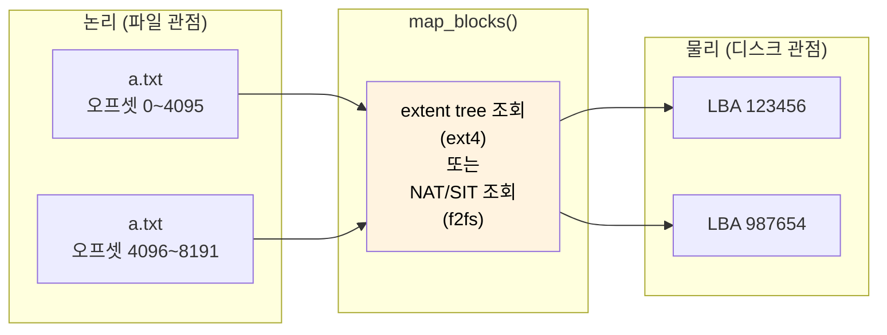

두 파일시스템의 함수:

- **ext4**: `ext4_map_blocks()` — `fs/ext4/inode.c:596`
- **f2fs**: `f2fs_map_blocks()` — `fs/f2fs/data.c:1594`

호출 시점이 **write 방식에 따라 다르다.** 이게 핵심이다.

| 방식 | map_blocks 시점 | 이유 |
|---|---|---|
| **delayed allocation** (ext4 기본, f2fs) | **writeback 때** | 모아서 할당하면 연속 배치가 쉬워 단편화가 준다 |
| `data=journal`, DIO | **write_begin 때** | 즉시 디스크 위치가 필요 |

**delayed allocation 이 기본**이라는 건, `write()` 시점엔 디스크 위치가 **아직 안 정해졌다**는
뜻이다. `write_begin` 은 "나중에 쓸 블록 개수"만 예약(reserve)해 두고 실제 할당은 미룬다.

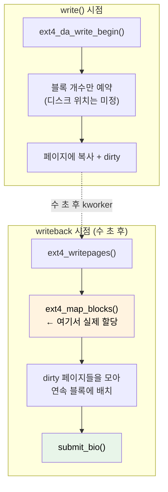

### 2.4 ext4 vs f2fs — 같은 3단계, 다른 철학


| 항목 | ext4 | f2fs |
|---|---|---|
| 갱신 방식 | 제자리(in-place) | 새 위치에 기록(append) |
| 매핑 자료구조 | extent tree (inode 안) | NAT(노드 주소 테이블) + SIT |
| 일관성 보장 | jbd2 저널 | checkpoint + 로그 |
| 블록 할당 시점 | delayed allocation | delayed allocation |
| 랜덤 write 특성 | 제자리라 단편화 적음 | 순차로 바뀌어 **플래시에 유리** |
| 대가 | 저널 이중 쓰기 | **GC 필요** (유효 블록 이동) |

f2fs 는 데이터를 성격별로 다른 영역(hot/warm/cold)에 나눠 쓴다. fsiotrace 의 f2fs 세분
플래그가 이걸 보여준다. GC 가 도는 IO 는 앱이 낸 게 아니라 파일시스템이 스스로 낸 것이라,
`comm` 이 앱 이름이 아니다.

---

## 3. writeback — dirty 페이지는 언제 디스크로 가나

### 3.1 트리거 4가지

`write()` 는 dirty 표시만 하고 끝났다. 실제로 디스크에 쓰는 계기는 넷이다.

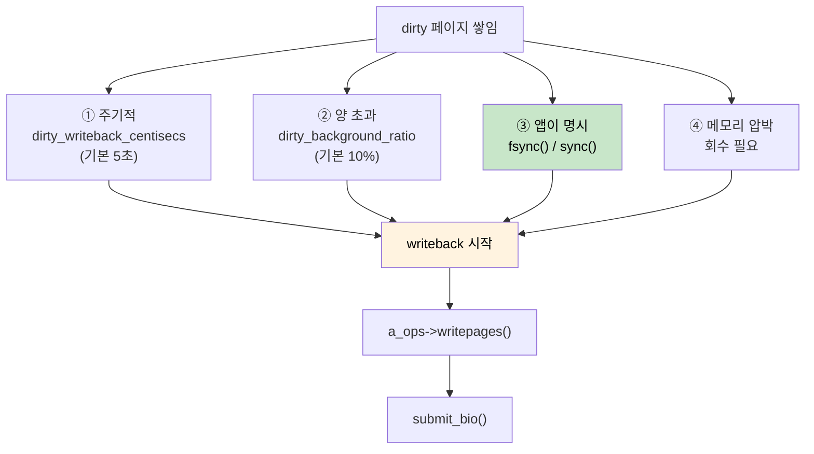

| 트리거 | 누가 실행 | fsiotrace 의 comm | 지연 |
|---|---|---|---|
| ① 주기적 | `kworker` (flusher) | `kworker/u16:3` 등 | ~5초 |
| ② 양 초과 | `kworker` | `kworker` | 즉시~ |
| ③ `fsync()` | **앱 자신** | 앱 이름 | 없음(동기) |
| ④ 메모리 압박 | `kswapd` / 앱 | 다양 | 즉시 |

**①②④ 는 앱과 무관한 스레드가 실행한다.** 그래서 BLK row 의 `comm` 이 `kworker` 로 나온다.
"누가 이 IO 를 냈는지" 를 알려면 원래 앱을 되찾아야 하는데, fsiotrace 가 `inode_ctx` 로
그걸 복원한다([설계 문서](/fsiotrace/design/) 참고).

### 3.2 fsync 는 무엇이 다른가

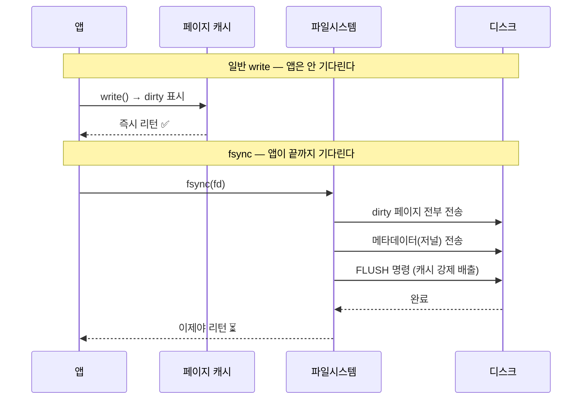

fsync 는 **데이터 + 메타데이터 + FLUSH** 세 가지를 모두 보장한다. UFS 계층에서
`SYNCHRONIZE_CACHE`(opcode 0x35) 가 보이면 이것이다.

---

## 4. read — page cache hit 는 어떤 기준인가

### 4.1 hit 판정의 실제 조건

"캐시에 있으면 hit" 는 절반만 맞다. 커널의 실제 판정은 **두 단계**다.

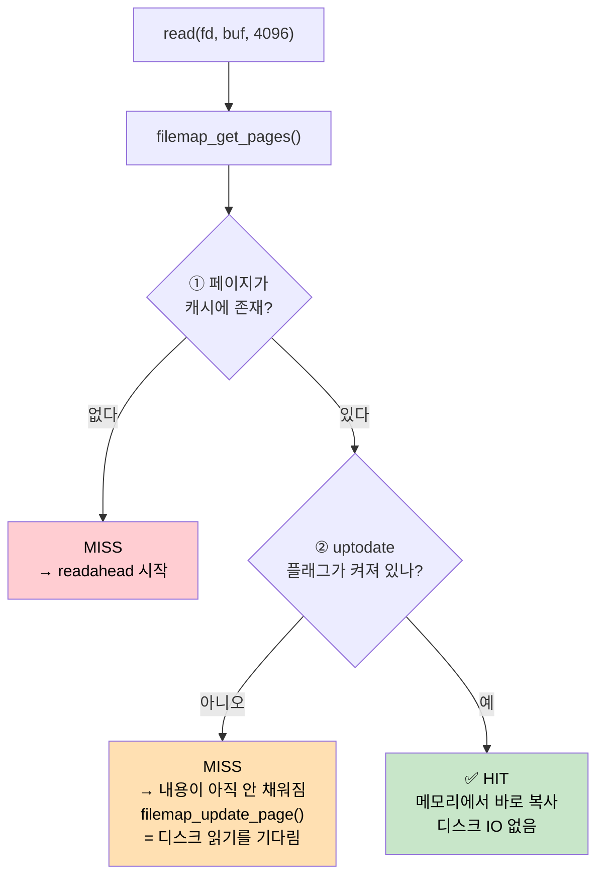

**②가 핵심이다.** 페이지가 캐시에 "있어도" `uptodate` 가 아니면 hit 이 아니다.
다른 스레드가 방금 페이지만 할당하고 아직 디스크에서 읽어오는 중일 수 있기 때문이다.

실제 커널 코드(`mm/filemap.c:2575` `filemap_get_pages()`)가 정확히 이 순서다:

```c
filemap_get_read_batch(mapping, index, last_index - 1, fbatch);
if (!folio_batch_count(fbatch)) {           // ① 캐시에 없음
    page_cache_sync_readahead(...);          //    → readahead 로 읽어온다
    filemap_get_read_batch(...);             //    → 다시 조회
}
// ...
if (!folio_test_uptodate(folio)) {           // ② 있지만 내용이 아직
    err = filemap_update_page(...);          //    → 채워질 때까지 대기
}
```

| 상태 | 캐시에 존재 | uptodate | 결과 | 디스크 IO |
|---|---|---|---|---|
| 완전 hit | ✅ | ✅ | 즉시 복사 | 없음 |
| 준비 중 | ✅ | ❌ | 대기 후 복사 | (다른 스레드가 이미 요청) |
| 완전 miss | ❌ | — | readahead 후 복사 | **발생** |

### 4.2 miss 면 무슨 일이 일어나나 — readahead

miss 라고 4KB 만 읽지 않는다. **커널은 앞으로 더 읽을 거라고 예측해서 미리 당겨온다.**

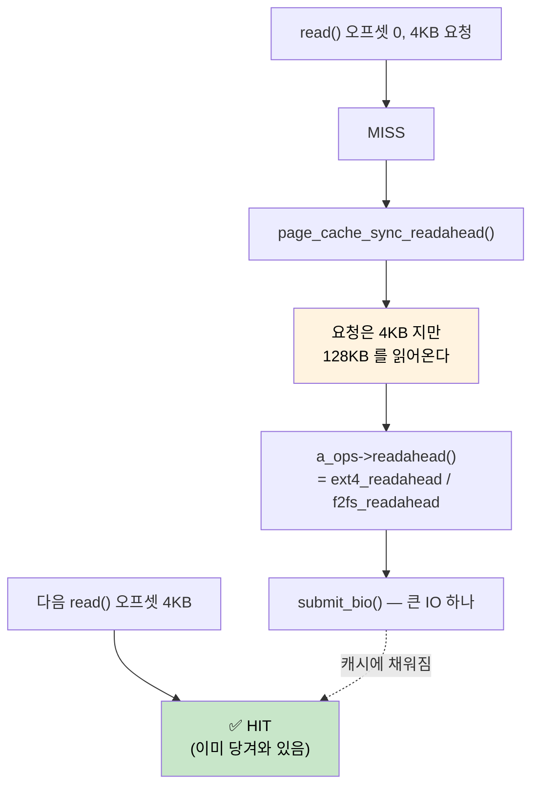

readahead 는 **순차 읽기를 감지하면 창(window)을 키우고, 랜덤이면 줄인다.**

| 패턴 | readahead 동작 | 결과 |
|---|---|---|
| 순차 읽기 | 창을 키움 (최대 128KB 등) | 첫 read 만 miss, 나머지 hit |
| 랜덤 읽기 | 창을 줄이거나 끔 | 매번 miss → 매번 디스크 IO |
| `posix_fadvise(RANDOM)` | 명시적으로 끔 | 불필요한 선반입 방지 |

**fsiotrace 에서 보이는 모습**: 앱이 4KB 씩 순차로 100번 읽으면 VFS row 는 100개인데
BLK row 는 몇 개뿐이다. readahead 가 크게 묶어서 가져왔기 때문이다. **VFS 요청 수와
실제 디스크 IO 수가 다른 게 정상**이다.

### 4.3 O_DIRECT — 캐시를 건너뛴다

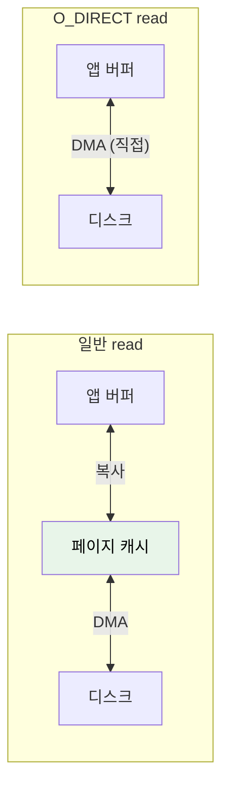

O_DIRECT 는 페이지 캐시를 거치지 않고 앱 버퍼로 바로 DMA 한다. 캐시 hit 개념 자체가 없고,
**항상 디스크 IO 가 발생**한다. 그래서 fsiotrace 에서 VFS row 와 BLK row 가 1:1 로 대응된다.

---

## 5. Block 계층 — bio 에서 request 로

FS 가 `submit_bio()` 를 부르면 여기부터다.

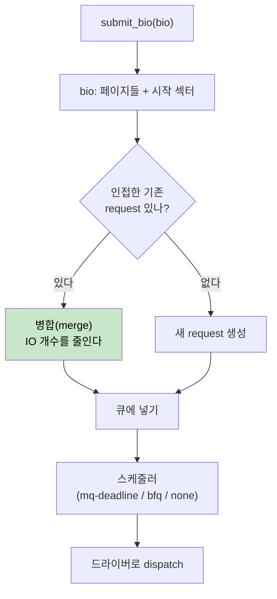

| 개념 | 설명 |
|---|---|
| **bio** | "이 페이지들을 이 섹터에 읽고/써라" — FS 가 만드는 요청 단위 |
| **request** | bio 여러 개를 병합한 것. 드라이버에 전달되는 단위 |
| **병합** | 인접 섹터면 합친다. **IO 개수가 줄어드는 주된 이유** |
| **plugging** | 잠깐 모았다가 한꺼번에 내보내 병합 기회를 늘린다 |

fsiotrace 에서 **FS row 수 > BLK row 수** 인 것이 정상인 이유가 병합이다.

---

## 6. UFS 계층 — SCSI 명령으로

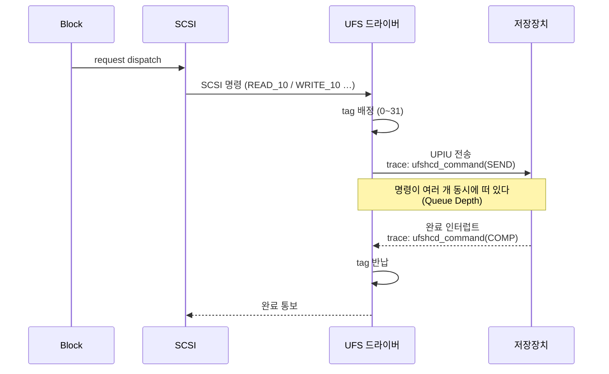

| 용어 | 뜻 |
|---|---|
| **tag** | 명령 식별 번호(0~31). 완료 시 반납되고 **재사용**된다 |
| **LUN** | 논리 장치 번호. `/data` 와 `/f2fs` 가 다른 LUN 일 수 있다 |
| **QD** | 동시에 떠 있는 명령 수 = send 했지만 complete 안 된 것 |
| **UPIU** | UFS 의 명령 패킷 형식 |

주요 opcode:

| opcode | 이름 | 뜻 |
|---|---|---|
| `0x28` / `0x88` | READ_10 / READ_16 | 읽기 |
| `0x2A` / `0x8A` | WRITE_10 / WRITE_16 | 쓰기 |
| `0x35` / `0x91` | SYNCHRONIZE_CACHE | 캐시 배출 (fsync 가 유발) |
| `0x42` | UNMAP | discard / trim |

---

## 7. 전체 흐름 다시 보기 — 층별 개수가 왜 다른가

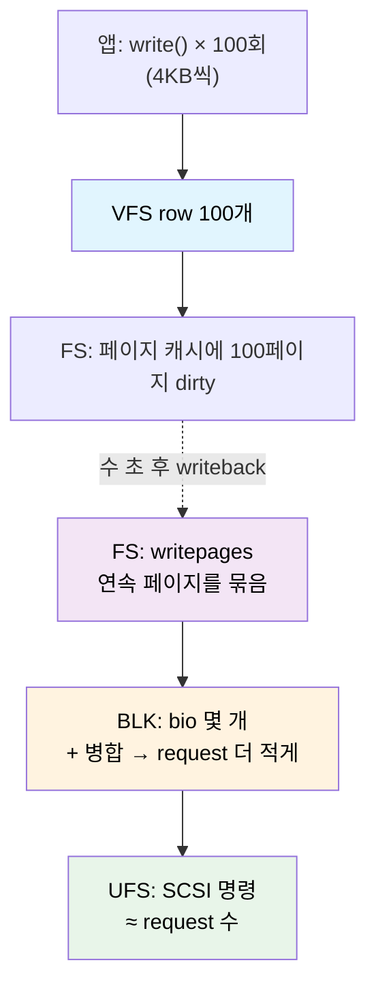

| 층 | row 수 | 왜 |
|---|---|---|
| VFS | **많다** (syscall 수) | 앱이 부른 횟수 그대로 |
| FS | 중간 | 페이지 단위로 묶임, writeback 때 한꺼번에 |
| BLK | 적다 | **병합**으로 크게 줄어듦 |
| UFS | ≈ BLK | request 하나 = 명령 하나 (대체로) |

**층마다 개수가 다른 게 정상이다.** 같아야 한다고 보면 오해한다.

시간축도 어긋난다:


---

## 8. 요약 — 세 문장으로

1. **VFS 는 함수 포인터(`f_op`, `i_op`, `a_ops`)로 파일시스템에 연결된다.** 그래서 VFS 코드는
   ext4 든 f2fs 든 몰라도 된다. 연결은 `open()` 때 `inode->i_fop` → `file->f_op` 복사로 이뤄진다.
2. **write 는 `write_begin` → 복사 → `write_end` 3단계로 캐시에만 쓰고 끝난다.** 디스크 블록
   할당(`map_blocks`)은 delayed allocation 때문에 **writeback 때로 미뤄지고**, 그 writeback 은
   앱이 아니라 `kworker` 가 수 초 뒤에 실행한다.
3. **read 의 hit 은 "캐시에 있고 + uptodate 인" 두 조건을 다 만족해야 한다.** miss 면
   readahead 가 요청보다 훨씬 크게 당겨오므로, VFS 요청 수와 디스크 IO 수는 원래 다르다.

## 9. 더 읽기

- [설계 (cross-layer · io_flags)](/fsiotrace/design/) — 이 4개 층을 fsiotrace 가 어떻게 한 줄로 잇는지
- [TSV 출력 형식](/fsiotrace/output-format/) — 각 컬럼의 의미
- [eBPF 동작 원리](/fsiotrace/bpf/) — 훅을 어떻게 거는지
- [사용법](/fsiotrace/usage/) — 실제 실행과 옵션

### 커널 소스 위치 (GKI 6.12 기준)

| 내용 | 파일 · 위치 |
|---|---|
| `vfs_write` / `vfs_read` | `fs/read_write.c` |
| ext4 a_ops | `fs/ext4/inode.c:3575` |
| ext4 map_blocks | `fs/ext4/inode.c:596` |
| **ext4 RMW 판정** | `fs/ext4/inode.c:1090` (`ext4_block_write_begin`) |
| f2fs a_ops | `fs/f2fs/data.c:4307` |
| f2fs map_blocks | `fs/f2fs/data.c:1594` |
| **f2fs RMW 판정** | `fs/f2fs/data.c:3855` (`f2fs_write_begin`) |
| page cache hit 판정 | `mm/filemap.c:2575` (`filemap_get_pages`) |
| UFS 명령 전송 | `drivers/ufs/core/ufshcd.c` (`ufshcd_send_command`) |
