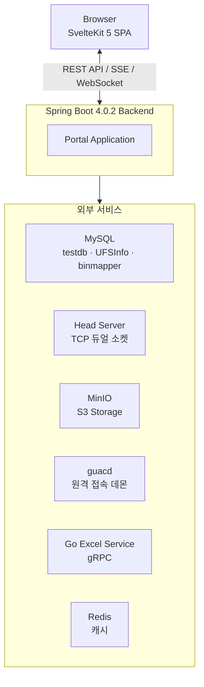

MOVE은 UFS(Universal Flash Storage) 테스트 자동화 관리 시스템입니다. 호환성/성능 테스트의 전체 생명주기를 관리하고, 실시간 슬롯 모니터링, 원격 접속, 로그 분석, 바이너리 디버깅 도구까지 통합 제공합니다.

## 핵심 기능

| 영역 | 기능 | 설명 |
|------|------|------|
| **테스트 관리** | 호환성/성능 테스트 | TestRequest → TestCase → History 3계층 CRUD |
| **성능 시각화** | 15종 파서별 차트 | ECharts 기반 동적 시각화 + Excel Export |
| **성능 비교** | Chart Overlay / Delta Table | Baseline 대비 수치 비교 |
| **실시간 모니터링** | 슬롯 상태 | HEAD TCP → SSE 실시간 푸시 |
| **원격 접속** | SSH/RDP 터미널 | Guacamole WebSocket 터널 + 다중 탭 |
| **로그 분석** | 로그 브라우저 | SSH/Local 모드 파일 탐색 + ripgrep 검색 |
| **파일 관리** | S3 스토리지 | MinIO 브라우저 (업로드/다운로드/폴더 관리) |
| **개발 도구** | Binary Struct Mapper | C/C++ 구조체 → 바이너리 매핑 |
| **TC 그룹** | TC 조합 관리 | 자주 사용하는 TC 조합 저장/빠른 적용 |

## 시스템 아키텍처 개요

## 기술 스택

- **백엔드**: Spring Boot 4.0.2 (Java 17)
- **프론트엔드**: SvelteKit 5 + TypeScript + TailwindCSS v4
- **프로덕션 배포**: 단일 JAR (프론트엔드 빌드 결과물 포함)

## 설계 결정

| 설계 결정 | 이유 |
|-----------|------|
| **단일 JAR 배포** | 프론트엔드를 `static/`에 복사하여 별도 웹서버 불필요 |
| **Multi-DataSource** | testdb(레거시 공유), UFSInfo(참조코드), binmapper(Portal 전용) 분리 |
| **SSE** | 슬롯 상태 실시간 푸시. WebSocket 대비 단방향이라 단순 |
| **Guacamole 터널** | VPN 없이 SSH/RDP 원격 접속 |
| **Go Excel Service** | 네이티브 Excel 차트 생성 (excelize) |

:::tip
자세한 아키텍처는 [시스템 개요](/architecture/system-overview/) 페이지를 참고하세요.
:::
