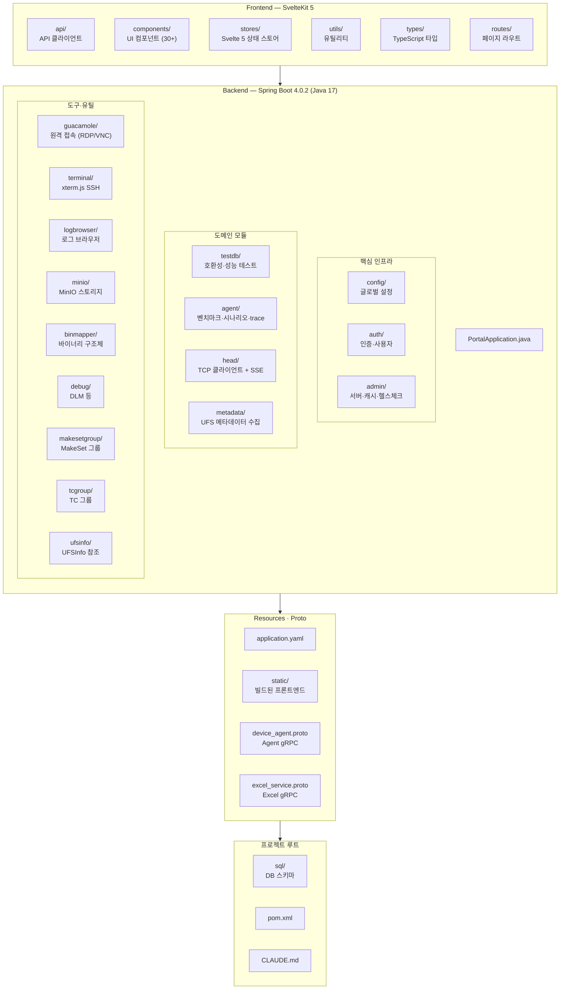

## 전체 구조



---

## 백엔드 패키지 상세

### config - 글로벌 설정

| 파일 | 역할 |
|------|------|
| `SecurityConfig` | Spring Security + OAuth2 설정 |
| `RedisCacheConfig` | Redis 캐시 (`JdkSerializationRedisSerializer`) |
| `SpaForwardingController` | SvelteKit SPA 라우팅 포워딩 |
| `GlobalExceptionHandler` | 전역 예외 처리 |
| `datasource/TestdbDataSourceConfig` | testdb DataSource (Primary) |
| `datasource/UfsInfoDataSourceConfig` | UFSInfo DataSource |
| `datasource/PortalDataSourceConfig` | binmapper (portal) DataSource |
| `websocket/WebSocketConfig` | WebSocket 설정 |
| `websocket/SpringWebSocketConfigurator` | Spring DI 지원 WebSocket 설정 |

### admin - 관리자

| 하위 | 주요 클래스 | 역할 |
|------|------------|------|
| `controller/` | `AdminController`, `AdminDbTableController` | Admin API, DB 테이블 조회 |
| `entity/` | `PortalServer` | 서버(VM) 엔티티 (portal_servers 테이블) |
| `repository/` | `PortalServerRepository` | JPA 리포지토리 |
| `service/` | `AdminHealthService`, `AdminCacheService`, `AdminInfoService`, `AdminMenuService`, `AdminVmStatusService`, `PortalServerService` | 헬스체크, 캐시 관리, VM 상태 등 |

### agent - Android 디바이스 벤치마크/시나리오

| 하위 | 주요 클래스 | 역할 |
|------|------------|------|
| `controller/` | `AgentController`, `JobExecutionController`, `ScheduledJobController` | REST API (디바이스, 벤치마크, 시나리오, trace, 스케줄) |
| `endpoint/` | `AgentScreenEndpoint` | WebSocket 실시간 화면 공유 |
| `entity/` | `AgentServer`, `BenchmarkPreset`, `ScenarioTemplate`, `JobExecution`, `ScheduledJob`, `AppMacro` | JPA 엔티티 6개 |
| `grpc/` | `AgentGrpcClient`, `AgentConnectionManager` | gRPC 클라이언트, 동적 채널 관리 |
| `repository/` | 6개 Repository | 각 엔티티별 JPA 리포지토리 |
| `service/` | `AgentServerService`, `BenchmarkPresetService`, `ScenarioTemplateService`, `JobExecutionService`, `ScheduledJobService`, `AppMacroService`, `NotificationService` | 비즈니스 로직 7개 서비스 |

### auth - 인증/사용자

| 하위 | 주요 클래스 | 역할 |
|------|------------|------|
| `controller/` | `AuthController` | 로그인/로그아웃/사용자 관리 API |
| `entity/` | `PortalUser` | 사용자 엔티티 (portal_users 테이블) |
| `repository/` | `PortalUserRepository` | JPA 리포지토리 |
| `service/` | `PortalUserService` | 사용자 CRUD, Spring Security UserDetailsService |

### debug - 디버그 도구

| 하위 | 주요 클래스 | 역할 |
|------|------------|------|
| `controller/` | `DlmController` | DLM 실행 API |
| `entity/` | `DebugType`, `DebugTool` | 디버그 타입/도구 엔티티 |
| `repository/` | `DebugTypeRepository`, `DebugToolRepository` | JPA 리포지토리 |
| `service/` | `DlmService`, `DebugToolService` | DLM 실행, 도구 관리 |

### guacamole - 원격 접속

| 하위 | 주요 클래스 | 역할 |
|------|------------|------|
| `config/` | `GuacamoleProperties` | guacd 글로벌 호스트/포트 설정 |
| `dto/` | `VmInfo` | VM 접속 정보 DTO |
| `endpoint/` | `GuacamoleTunnelEndpoint` | `@ServerEndpoint` WebSocket 터널 |
| `service/` | Guacamole 서비스 | RDP/VNC 연결 관리 |
| `controller/` | REST 컨트롤러 | VM 목록, 접속 정보 API |

### head - Head TCP 통신

| 하위 | 주요 클래스 | 역할 |
|------|------------|------|
| `config/` | `HeadConnectionProperties` | Head 연결 설정 |
| `entity/` | `HeadConnection`, `HeadSlotData` | 연결 정보, 슬롯 데이터 |
| `repository/` | JPA 리포지토리 | HeadConnection 리포지토리 |
| `service/` | 연결/파싱/상태/이미지 업로드 서비스 | TCP 데이터 처리 |
| `tcp/` | `HeadTcpClient`, `HeadConnectionManager` | TCP 클라이언트, 다중 연결 관리 |
| `controller/` | REST/SSE 컨트롤러 | 슬롯 상태 SSE 스트리밍 |

### makesetgroup - MakeSet 그룹

| 하위 | 주요 클래스 | 역할 |
|------|------------|------|
| `controller/` | `MakesetGroupController`, `MakesetGroupRequest` | REST API + 요청 DTO |
| `entity/` | `MakesetGroup`, `MakesetGroupItem` | 그룹/아이템 엔티티 |
| `repository/` | `MakesetGroupRepository` | JPA 리포지토리 |
| `service/` | `MakesetGroupService` | 그룹 CRUD |

### metadata - UFS 메타데이터 수집

| 하위 | 주요 클래스 | 역할 |
|------|------------|------|
| `config/` | `MetadataCollectionProperties` | 메타데이터 수집 설정 |
| `controller/` | `MetadataController`, `MetadataAdminController` | 메타데이터 조회/관리 API |
| `entity/` | `UfsMetadataType`, `UfsMetadataCommand`, `UfsProductMetadata` | 메타데이터 타입/명령/제품별 데이터 |
| `repository/` | 3개 Repository | 각 엔티티별 JPA 리포지토리 |
| `service/` | `MetadataCommandExecutor`, `MetadataMonitorService`, `MetadataTypeService` | 명령 실행, 모니터링, 타입 관리 |

### testdb - 테스트 관리 (호환성/성능)

| 하위 | 주요 클래스 | 역할 |
|------|------------|------|
| `controller/` | `CompatibilityTestRequestController`, `CompatibilityTestCaseController`, `CompatibilityHistoryController` | 호환성 테스트 API |
| | `PerformanceTestRequestController`, `PerformanceTestCaseController`, `PerformanceHistoryController` | 성능 테스트 API |
| | `PerformanceResultController`, `PerformanceParserController` | 성능 결과 데이터/파서 API |
| | `SetInfomationController`, `SlotInfomationController` | Set/Slot 정보 API |
| | `DashboardController`, `ExcelExportController` | 대시보드 통계, Excel 내보내기 |
| `entity/` | 9개 엔티티 | 호환성/성능 TR/TC/History, Set, Slot, Parser |
| `repository/` | 9개 Repository | 각 엔티티별 JPA 리포지토리 |
| `service/` | 10개 Service | CRUD + `PerformanceResultDataService` (데이터/Excel 공용) |
| `excel/` | `ExcelGrpcClient` | Go Excel 서비스 gRPC 클라이언트 |
| `reparse/` | `ReparseController`, `PerformanceReparseService`, `ReparseJob` | 성능 결과 재파싱 (비동기 Job) |

### ufsinfo - UFSInfo 참조 데이터

7개 코드 테이블 (CellType, Controller, Density, NandSize, NandType, OEM, UfsVersion) 각각 entity/repository/service/controller 4계층.

### 기타 패키지

| 패키지 | 역할 | 주요 클래스 |
|--------|------|------------|
| `logbrowser` | 로그 브라우저 | `SshLogBrowserService`, `LocalLogBrowserService`, `LogBrowserController`, `LogBrowserConfig` |
| `binmapper` | 바이너리 구조체 매핑 | `CppStructLexer`, `CppStructParser`, `BinaryReaderService` |
| `tcgroup` | TC 그룹 관리 | `TcGroupService`, `TcGroupController` |
| `minio` | MinIO 파일 스토리지 | `MinioStorageService`, `MinioController` |
| `terminal` | SSH 터미널 (xterm.js) | `SshTerminalEndpoint`, `SshConnectionService`, `SshConnectionInfo` |

---

## 프론트엔드 구조

### 스토어 (Svelte 5 Runes)

| 파일 | 역할 |
|------|------|
| `auth.svelte.ts` | 인증 상태 (`$state`), 사용자 정보, 로그인/로그아웃 |
| `tentacle.svelte.ts` | Tentacle/Head 연결 상태, 프리픽스, 연결 모드 |
| `menu.svelte.ts` | 사이드바 메뉴 상태, 활성 메뉴, 접기/펼치기 |
| `reparse.svelte.ts` | 재파싱 Job 상태 추적, 진행률 SSE |

### 주요 컴포넌트

| 컴포넌트 | 역할 |
|----------|------|
| `SlotCard.svelte` | 슬롯 상태 카드 (테스트 진행, 결과 표시) |
| `GuacamoleClient.svelte` | Guacamole RDP/VNC 클라이언트 |
| `XtermClient.svelte` | xterm.js SSH 터미널 클라이언트 |
| `TerminalDialog.svelte` | SSH 터미널 다이얼로그 |
| `SftpPanel.svelte` | SFTP 파일 전송 패널 |
| `LogBrowserDialog.svelte` | 로그 브라우저 다이얼로그 |
| `LogViewerDialog.svelte` | 로그 뷰어 다이얼로그 |
| `MakeSetDialog.svelte` | MakeSet 실행 다이얼로그 |
| `MakeSetGroupManager.svelte` | MakeSet 그룹 관리 |
| `MetadataDialog.svelte` | UFS 메타데이터 조회 다이얼로그 |
| `DlmDialog.svelte` | DLM 디버그 실행 다이얼로그 |
| `MemoDialog.svelte` | 메모 다이얼로그 |
| `PerfResultDialog.svelte` | 성능 결과 다이얼로그 |
| `ConfirmDialog.svelte` | 확인/취소 다이얼로그 |
| `MultiSelect.svelte` | 다중 선택 드롭다운 |
| `ReparseFloatingCard.svelte` | 재파싱 진행 플로팅 카드 |
| `PerfGenerator.svelte` | 성능 차트 코드 자동 생성 도구 |
| `PerfPreview.svelte` | 생성된 차트 실시간 미리보기 |
| `JsonTreeView.svelte` | JSON 재귀 트리 뷰 |
| `TiptapEditor.svelte` | 리치 텍스트 에디터 |
| `BarChart.svelte` / `DonutChart.svelte` | 대시보드 차트 |
| `ThemeSwitcher.svelte` | 다크/라이트 테마 전환 |
| `TableSkeleton.svelte` / `DataTableShell.svelte` | 테이블 로딩/래퍼 |
| `perf-chart/` | ECharts 기반 성능 차트 (`PerfChart`) |
| `perf-content/` | 15개 파서별 전용 시각화 컴포넌트 |
| `perf-compare/` | 성능 비교 (Overlay/SideBySide/Delta) |
| `data-table/` | shadcn 데이터 테이블 |
| `bin-mapper/` | BinMapper 전용 컴포넌트 |
| `ui/` | shadcn-svelte 기본 UI 컴포넌트 |
| `debugRegistry.ts` | 디버그 타입 → 컴포넌트 매핑 레지스트리 |

### 라우트 (페이지)

| 경로 | 페이지 | 설명 |
|------|--------|------|
| `/` | 레이아웃 | SPA 루트 레이아웃 |
| `/dashboard` | 대시보드 | 통계 차트, 최근 테스트 요약 |
| `/testdb/compatibility` | 호환성 테스트 | TR 목록 + 관리 |
| `/testdb/compatibility/[trId]` | 호환성 TR 상세 | TC/History 관리, FW 비교 |
| `/testdb/performance` | 성능 테스트 | TR 목록 + 관리 |
| `/testdb/performance/[trId]` | 성능 TR 상세 | TC/History 관리 |
| `/testdb/performance/compare` | 성능 비교 | Overlay/SideBySide/Delta 모드 |
| `/testdb/performance/history` | 성능 히스토리 | 히스토리 목록 |
| `/testdb/sets` | Set 관리 | 디바이스 Set CRUD |
| `/testdb/slots` | 슬롯 모니터링 | 카드 UI + 명령 전송 + 실시간 상태 |
| `/testdb/slot-infomations` | 슬롯 정보 | 슬롯 상세 정보 조회 |
| `/remote` | 원격 접속 | SSH/RDP/VNC 터미널 + SFTP |
| `/storage` | 파일 스토리지 | MinIO 파일 브라우저 |
| `/agent` | Agent | 3패널 레이아웃: 벤치마크/시나리오/trace/결과/스케줄 |
| `/ufsinfo` | UFS 정보 | UFSInfo 참조 데이터 조회 |
| `/devtools/bin-mapper` | BinMapper | 바이너리 구조체 매핑 도구 |
| `/devtools/perf-generator` | Perf Generator | 성능 차트 컴포넌트 코드 자동 생성 |
| `/devtools/ui-preview` | UI Preview | 컴포넌트 미리보기 (Mock 데이터) |
| `/admin` | 관리자 | Health, Users, Servers, Sets, Slots, UFS Info, Debug, Metadata 탭 |

#### Agent 라우트 상세 (`/agent`)

3패널 레이아웃에서 모드 전환으로 다양한 기능 제공:

| 컴포넌트 | 영역 | 역할 |
|----------|------|------|
| `AgentContextPanel` | 좌측 | 서버 선택, 디바이스 체크리스트, Quick Actions |
| `AgentBenchmarkForm` | 센터 | fio/iozone/tiotest 옵션 폼 + 프리셋 |
| `AgentScenarioBuilder` | 센터 | step/loop 편집기 + 캔버스 빌더 + 템플릿 |
| `AgentTraceForm` | 센터 | ftrace I/O trace 시작/중지 |
| `AgentResultsView` | 센터 | Job 히스토리 |
| `AgentScheduleView` | 센터 | 스케줄 Job 관리 (CRON) |
| `AgentMacroRecorder` | 센터 | 앱 매크로 녹화/편집 |
| `AgentMacroResultView` | 센터 | 매크로 실행 결과 |
| `AgentServerSheet` | 우측 시트 | 서버 CRUD + 접속 테스트 |
| `AgentMonitoringSheet` | 우측 시트 | CPU/Memory/Disk 실시간 차트 (SSE) |
| `AgentResultDetailSheet` | 우측 시트 | 벤치마크 결과 (IOPS/BW 차트, step/merge 모드) |
| `AgentTraceResultSheet` | 우측 시트 | trace 분석 (scatter 차트 5종, brush 필터) |
| `AgentScreenSheet` | 우측 시트 | 디바이스 실시간 화면 공유 |
| `AgentFloatingJobCard` | 플로팅 | 실행 중 Job 진행률 |
| `AgentStepEditDialog` | 다이얼로그 | 시나리오 step 편집 |
| `TraceScatterChart` | 공유 | trace scatter 차트 (brush + legend 동기화) |
| `scenario-canvas/` | 하위 폴더 | @xyflow/svelte 캔버스 빌더 컴포넌트 |
| `agent-result/` | 하위 폴더 | 결과 상세 뷰 하위 컴포넌트 |

---

## 설정 파일

### application.yaml

```yaml title="application.yaml (요약)"
server:
  port: 8080

spring:
  datasource:
    testdb:
      url: jdbc:mysql://127.0.0.1:3306/testdb
    ufsinfo:
      url: jdbc:mysql://127.0.0.1:3306/UFSInfo
    binmapper:
      url: jdbc:mysql://127.0.0.1:3307/binmapper
  data:
    redis:
      host: 127.0.0.1
      port: 6379
  grpc:
    client:
      channels:
        excel-service:
          address: static://localhost:50052

head:
  reconnect-delay-ms: 5000
  sse:
    push-interval-ms: 1000

guacamole:
  guacd-host: 192.168.1.248
  guacd-port: 4822

minio:
  endpoint: http://192.168.1.248
  port: 9000
```

### pom.xml 주요 의존성

| 카테고리 | 의존성 | 용도 |
|----------|--------|------|
| 웹 | `spring-boot-starter-web`, `spring-boot-starter-websocket` | REST API, WebSocket |
| 데이터 | `spring-boot-starter-data-jpa`, `spring-boot-starter-data-redis` | JPA + Redis 캐시 |
| DB 드라이버 | `mysql-connector-j`, `postgresql` | MySQL, PostgreSQL |
| 인증 | `spring-boot-starter-security`, `spring-boot-starter-oauth2-client` | Security + OAuth2 |
| gRPC | `spring-grpc-spring-boot-starter`, `protobuf-java`, `grpc-stub` | gRPC 통신 |
| 유틸 | `lombok`, `spring-boot-devtools` | 코드 생성, 핫 리로드 |
| 테스트 | `spring-boot-starter-test`, `spring-security-test` | JUnit 5 |

주요 버전: `protobuf.version=4.33.4`, `grpc.version=1.77.1`

### Proto 파일

| 파일 | 용도 | 대상 서비스 |
|------|------|------------|
| `device_agent.proto` | Agent 벤치마크/시나리오/trace/모니터링 RPC | Go Agent (`~/project/agent`, port 50051) |
| `excel_service.proto` | 성능 데이터 Excel 내보내기 RPC | Go Excel Service (`~/project/excel-service`, port 50052) |

:::note
Proto 파일은 Maven 빌드 시 `protobuf-maven-plugin`으로 자동 컴파일됩니다. macOS에서는 `protocExecutable=/opt/homebrew/bin/protoc`를 사용합니다.
:::
