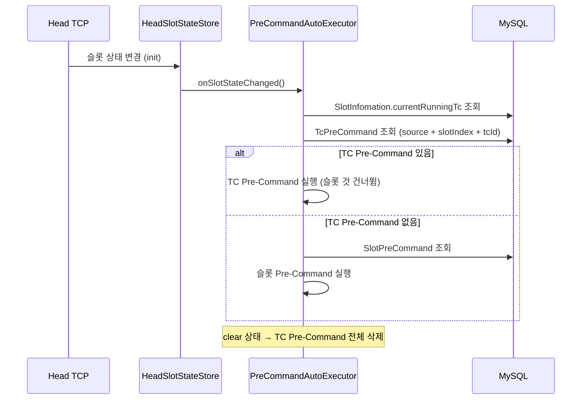

TC별 Pre-Command는 슬롯이 init 상태에 진입할 때 현재 실행 중인 TC에 맞는 사전 명령어를 자동 실행하는 기능입니다.

---

## 1. 개요

### 기존 슬롯 Pre-Command와의 차이

| | 슬롯 Pre-Command | TC별 Pre-Command |
|---|---|---|
| **등록 단위** | 슬롯 1개당 1개 | TC별로 각각 등록 |
| **실행 조건** | init 진입 시 | init 진입 시 + 현재 TC 매칭 |
| **우선순위** | 낮음 | **높음** (TC 것이 있으면 슬롯 것 무시) |
| **삭제** | 수동 | 슬롯 clear 시 자동 삭제, TC 삭제 시 자동 삭제 |

### 우선순위 규칙

1. 슬롯 init 진입
2. 현재 TC (`currentRunningTc`)에 Pre-Command가 등록되어 있는지 확인
3. **있으면** → TC Pre-Command 실행 (슬롯 Pre-Command 건너뜀)
4. **없으면** → 슬롯 Pre-Command 실행 (기존 동작)

---

## 2. 사용 방법

### TC 테이블에서 설정

슬롯 모니터링 페이지에서:

1. 슬롯 선택 → 우측 TC 테이블 표시
2. 각 TC 행의 **Pre-Cmd** 컬럼에 드롭다운 표시
3. 드롭다운에서 Pre-Command 선택 → **즉시 DB 등록**
4. X 버튼으로 해제

:::note
**NOTSTART** 상태인 TC만 Pre-Command를 설정/변경할 수 있습니다. 실행 중이거나 완료된 TC는 읽기 전용입니다.
:::

### TC에 Pre-Command 설정 시

- 해당 슬롯의 **슬롯 Pre-Command가 자동 해제**됩니다
- TC별로 다른 Pre-Command를 설정할 수 있습니다

---

## 3. 자동 삭제

TC Pre-Command는 다음 상황에서 자동 삭제됩니다:

| 상황 | 삭제 범위 |
|------|-----------|
| **슬롯 clear** | 해당 슬롯의 **모든** TC Pre-Command |
| **TC 삭제** (deleteTest) | 해당 TC의 Pre-Command |
| **수동 해제** (X 버튼) | 해당 TC의 Pre-Command |

---

## 4. DB 스키마

```sql
CREATE TABLE portal_tc_pre_commands (
    id BIGINT AUTO_INCREMENT PRIMARY KEY,
    source VARCHAR(50) NOT NULL,      -- compatibility / performance
    slot_index INT NOT NULL,
    tc_id INT NOT NULL,               -- currentRunningTc
    pre_command_id BIGINT NOT NULL,   -- FK → portal_pre_commands
    created_at DATETIME,
    UNIQUE KEY uk_source_slot_tc (source, slot_index, tc_id)
);
```

---

## 5. 실행 흐름


