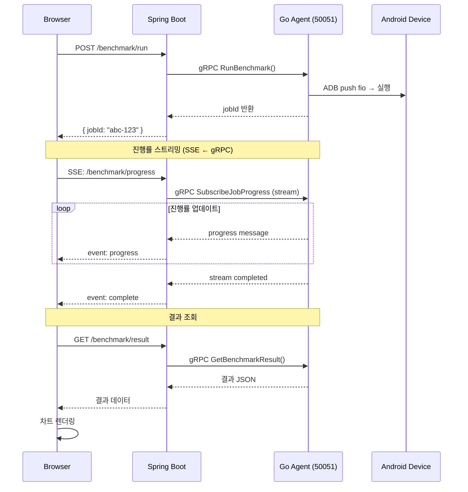
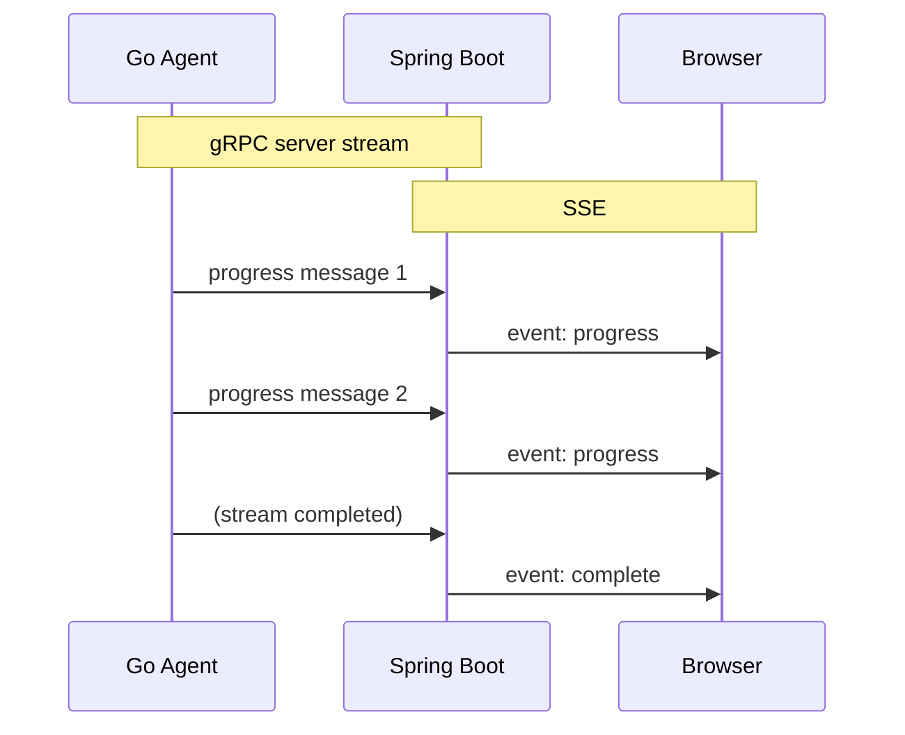

Agent 벤치마크는 Portal에서 가장 많은 계층을 거치는 흐름입니다. 브라우저 → Spring REST → gRPC → Go Agent → ADB → Android 디바이스까지 5단계를 거치며, 진행률은 gRPC 서버 스트리밍을 SSE로 브릿지하여 브라우저에 실시간으로 전달합니다.

## 전체 시퀀스



---

## Phase 1: 벤치마크 시작

### 프론트엔드 → REST API

사용자가 `AgentBenchmarkForm`에서 벤치마크를 실행하면:

```typescript
// frontend/src/lib/api/agent.ts
export function runBenchmark(data: {
    serverId: number;
    deviceIds: string[];
    tool: 'fio' | 'iozone' | 'tiotest';
    params: Record<string, string>;
    jobName?: string;
}): Promise<{ jobId: string }> {
    return post('/agent/benchmark/run', data);
}
```

### Controller → gRPC Client

```java
// agent/controller/AgentController.java
@PostMapping("/benchmark/run")
public ResponseEntity<?> runBenchmark(@RequestBody BenchmarkRunRequest dto) {
    AgentGrpcClient client = connectionManager.getOrCreate(
        dto.getServerId(), server.getHost(), server.getPort()
    );

    RunBenchmarkResponse response = client.runBenchmark(buildGrpcRequest(dto));

    // DB에 Job 실행 이력 저장
    jobExecutionService.save(JobExecution.builder()
        .jobId(response.getJobId())
        .serverId(dto.getServerId())
        .type("benchmark")
        .build());

    return ResponseEntity.ok(Map.of("jobId", response.getJobId()));
}
```

### 동적 gRPC 채널 관리

`AgentConnectionManager`는 서버별로 gRPC 채널을 캐싱합니다:

```java
// agent/grpc/AgentConnectionManager.java
public AgentGrpcClient getOrCreate(Long serverId, String host, int port) {
    return clients.compute(serverId, (id, existing) -> {
        if (existing != null && existing.matchesHostPort(host, port)) {
            return existing;  // 캐시 히트 — 기존 채널 재사용
        }
        if (existing != null) existing.close();  // host/port 변경 시 기존 채널 닫기
        return new AgentGrpcClient(host, port);  // 새 채널 생성
    });
}
```

**왜 동적 채널?**: Agent 서버는 여러 대이고, 각각 다른 host:port를 가집니다. 서버 정보가 DB에서 변경될 수 있으므로, 정적 설정 대신 런타임에 채널을 생성/캐싱합니다.

### AgentGrpcClient 채널 설정

```java
// agent/grpc/AgentGrpcClient.java
public AgentGrpcClient(String host, int port) {
    this.channel = ManagedChannelBuilder.forAddress(host, port)
        .usePlaintext()
        .maxInboundMessageSize(256 * 1024 * 1024)  // 256MB (대용량 결과)
        .keepAliveTime(30, TimeUnit.SECONDS)
        .keepAliveTimeout(5, TimeUnit.SECONDS)
        .build();

    this.blockingStub = DeviceAgentGrpc.newBlockingStub(channel);
    this.asyncStub = DeviceAgentGrpc.newStub(channel);
}
```

- **blockingStub**: 일반 RPC (RunBenchmark, GetBenchmarkResult 등)
- **asyncStub**: 스트리밍 RPC (MonitorDevices 등)
- **256MB 메시지**: 벤치마크 결과가 대용량일 수 있음

---

## Phase 2: 진행률 스트리밍 — gRPC → SSE 브릿지

벤치마크가 시작되면, 프론트엔드는 SSE로 진행률을 수신합니다. 백엔드는 Go Agent의 gRPC 서버 스트리밍을 SSE로 **브릿지**합니다.

### 브릿지 패턴



### 백엔드: gRPC 스트림 → SseEmitter

```java
// AgentController.java (간소화)
@GetMapping(value = "/benchmark/progress", produces = MediaType.TEXT_EVENT_STREAM_VALUE)
public SseEmitter streamProgress(@RequestParam String jobId, @RequestParam Long serverId) {
    SseEmitter emitter = new SseEmitter(0L);  // 무제한 타임아웃

    AgentGrpcClient client = connectionManager.get(serverId);
    Iterator<JobProgress> stream = client.subscribeJobProgress(jobId);

    // 별도 스레드에서 gRPC 스트림을 읽으며 SSE로 전달
    executor.submit(() -> {
        try {
            while (stream.hasNext()) {
                JobProgress progress = stream.next();
                emitter.send(SseEmitter.event()
                    .name(progress.getState().equals("COMPLETED") ? "complete" : "progress")
                    .data(progress));
            }
            emitter.complete();
        } catch (Exception e) {
            emitter.completeWithError(e);
        }
    });

    return emitter;
}
```

:::note[왜 SSE 브릿지가 필요한가?]
브라우저는 gRPC를 직접 호출할 수 없습니다. gRPC 서버 스트리밍 RPC의 응답을 SSE 이벤트로 변환하여 브라우저의 `EventSource` API로 수신할 수 있게 합니다. 이 패턴은 Portal에서 벤치마크 진행률, 디바이스 모니터링 등에 반복적으로 사용됩니다.
:::

### 프론트엔드: EventSource → FloatingJobCard

```typescript
// 진행률 SSE 구독
const source = new EventSource(
    `/api/agent/benchmark/progress?jobId=${jobId}&serverId=${serverId}`
);

source.addEventListener('progress', (e) => {
    const data: JobProgress = JSON.parse(e.data);
    // AgentFloatingJobCard에 진행률 표시
    updateJobProgress(data.jobId, data.progressPercent, data.message);
});

source.addEventListener('complete', (e) => {
    source.close();
    markJobCompleted(jobId);
});
```

**AgentFloatingJobCard**: 화면 우하단의 플로팅 카드로 진행률을 표시합니다. 사용자가 다른 페이지로 이동해도 계속 표시됩니다 (루트 레이아웃에 마운트).

---

## Phase 3: 결과 조회 및 시각화

벤치마크 완료 후, 사용자가 결과를 보면:

```typescript
// GET /api/agent/benchmark/result?jobId=abc-123&deviceId=dev-001
const result = await get(`/agent/benchmark/result?jobId=${jobId}&deviceId=${deviceId}`);
```

### 백엔드: gRPC GetBenchmarkResult

```java
@GetMapping("/benchmark/result")
public ResponseEntity<?> getBenchmarkResult(
        @RequestParam String jobId,
        @RequestParam String deviceId,
        @RequestParam Long serverId) {

    AgentGrpcClient client = connectionManager.get(serverId);
    BenchmarkResult result = client.getBenchmarkResult(jobId, deviceId);

    return ResponseEntity.ok(result);  // protobuf → JSON 자동 변환
}
```

### 프론트엔드: AgentResultDetailSheet

결과는 `AgentResultDetailSheet`에서 차트로 시각화됩니다:

- **Cycle별 IOPS/BW 차트** — `PerfChart` (ECharts) 사용
- **Step/Merge 모드** — 개별 step 결과 vs 전체 병합
- **Read/Write 탭** — 읽기/쓰기 성능 분리 표시
- **Trace 분석 연결** — trace 데이터가 있으면 `AgentTraceResultSheet`로 연결

---

## Job 영속화

벤치마크 실행 이력은 두 곳에 저장됩니다:

| 저장소 | 데이터 | 용도 |
|--------|--------|------|
| **MySQL** (`portal_job_executions`) | jobId, serverId, type, 상태, 생성시간 | 서버 사이드 이력 관리 |
| **localStorage** | jobId, 진행률, 상태 | 브라우저 새로고침 후 복원 |

---

## gRPC RPC 요약

| RPC | 유형 | 용도 |
|-----|------|------|
| `RunBenchmark` | Unary | 벤치마크 시작, jobId 반환 |
| `SubscribeJobProgress` | Server streaming | 실시간 진행률 (→ SSE 브릿지) |
| `GetJobStatus` | Unary | Job 상태 확인 |
| `GetBenchmarkResult` | Unary | 완료된 벤치마크 결과 조회 |
| `DeleteJob` | Unary | Job 삭제 |
| `CancelJob` | Unary | 실행 중 Job 취소 |

---

## 핵심 파일 경로

| 파일 | 역할 |
|------|------|
| `agent/controller/AgentController.java` | REST 엔드포인트 (벤치마크 시작/진행/결과) |
| `agent/grpc/AgentGrpcClient.java` | gRPC stub 래핑 (blocking + async) |
| `agent/grpc/AgentConnectionManager.java` | 서버별 gRPC 채널 캐싱 |
| `agent/service/JobExecutionService.java` | Job 이력 DB 저장 |
| `src/main/proto/device_agent.proto` | gRPC 서비스 정의 |
| `frontend/src/lib/api/agent.ts` | API 함수 + SSE 소스 생성 |
| `frontend/src/routes/agent/AgentFloatingJobCard.svelte` | 진행률 플로팅 카드 |
| `frontend/src/routes/agent/AgentResultDetailSheet.svelte` | 결과 차트 시각화 |
