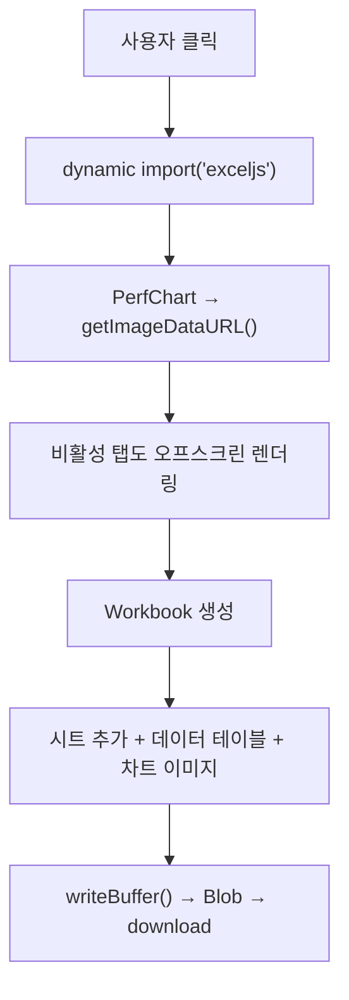
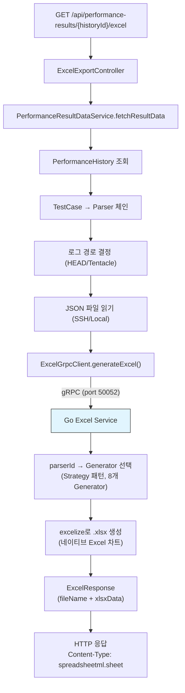

Portal의 Excel 내보내기는 **두 가지 독립적인 경로**로 동작합니다. 각각 다른 목적으로 설계되어 있어, 두 경로가 공존하는 이유를 이해하는 것이 중요합니다.

## 두 경로 비교

| | 프론트엔드 경로 | 백엔드 경로 |
|--|----------------|------------|
| **기술** | ExcelJS (JavaScript 라이브러리) | Go excelize (gRPC 서비스) |
| **차트** | 이미지로 캡처하여 삽입 | **네이티브 Excel 차트** 생성 |
| **편집 가능** | 차트 편집 불가 (이미지) | 차트 편집 가능 (네이티브) |
| **데이터 범위** | 현재 화면에 표시된 데이터 | 서버에서 전체 데이터 조회 |
| **오프라인** | 가능 (브라우저에서 처리) | 백엔드 + Go 서비스 필요 |
| **용도** | 빠른 WYSIWYG 내보내기 | 정식 보고서용 |

:::note[왜 두 경로가 필요한가?]
- **프론트엔드 경로**: 사용자가 보는 화면 그대로 즉시 내보내기. 차트가 이미지이므로 Excel에서 편집 불가
- **백엔드 경로**: 네이티브 Excel 차트를 포함한 정식 보고서. 차트 데이터를 Excel에서 수정 가능. Java의 Apache POI로는 네이티브 Excel 차트를 생성할 수 없어 Go의 excelize를 사용
:::

---

## 프론트엔드 경로 (ExcelJS)



### 오프스크린 렌더링

탭 기반 UI에서 비활성 탭의 차트도 내보내야 할 때, 화면에 보이지 않는 차트를 오프스크린에서 렌더링하여 이미지를 캡처합니다:

```typescript
// 비활성 탭의 차트를 캡처하는 패턴
const offscreenDiv = document.createElement('div');
offscreenDiv.style.cssText = 'position:fixed; left:-9999px; width:800px; height:400px';
document.body.appendChild(offscreenDiv);

const chart = echarts.init(offscreenDiv);
chart.setOption(chartOption);
const imageURL = chart.getDataURL({ type: 'png', pixelRatio: 2 });

chart.dispose();
document.body.removeChild(offscreenDiv);
```

---

## 백엔드 경로 (Go gRPC)



### ExcelExportController (35줄)

```java
// testdb/controller/ExcelExportController.java
@GetMapping("/{historyId}/excel")
public ResponseEntity<byte[]> exportExcel(@PathVariable Long historyId) {
    // 1. 데이터 서비스에서 결과 조회 (data API와 동일한 서비스 재사용)
    ResultData data = resultDataService.fetchResultData(historyId);

    // 2. Go Excel 서비스에 gRPC 요청
    ExcelResponse response = excelGrpcClient.generateExcel(
        data.parserId(), data.tcName(), data.fw(), data.setName(), data.rawJson()
    );

    // 3. 바이너리 응답
    return ResponseEntity.ok()
        .header("Content-Disposition", "attachment; filename=\"" + response.getFileName() + "\"")
        .contentType(MediaType.parseMediaType("application/vnd.openxmlformats..."))
        .body(response.getXlsxData().toByteArray());
}
```

### PerformanceResultDataService — 데이터 조회 (공유 서비스)

이 서비스는 **데이터 API**(`GET /{historyId}/data`)와 **Excel API** 양쪽에서 재사용됩니다:

```java
// testdb/service/PerformanceResultDataService.java
public ResultData fetchResultData(Long historyId) {
    // 1. DB 체인: History → TestCase → Parser
    PerformanceHistory history = historyService.findById(historyId);
    PerformanceTestCase tc = tcService.findById(history.getTestCaseId());
    PerformanceParser parser = parserService.findById(tc.getParserId());

    // 2. 로그 경로 결정
    String remotePath;
    if (history.getLogPath() != null) {
        // 완료된 테스트: logPath 기반
        if (history.getLogPath().contains("UFS")) {
            remotePath = headLogPath + "/" + history.getLogPath() + "/result.json";
        } else {
            remotePath = logPrefix + "/history/" + history.getLogPath() + "/result.json";
        }
    } else {
        // 진행 중 테스트: slotLocation 기반
        remotePath = logPrefix + "/slot" + history.getSlotLocation() + "/log/result.json";
    }

    // 3. JSON 읽기 (SSH 또는 Local)
    String json = logBrowserService.readFileContent(tentacleName, remotePath);

    // 4. JSON 유효성 검사 + 복구 시도
    if (!isValidJson(json)) {
        json = tryRepairJson(json);  // 불완전한 JSON 복구 (진행 중 테스트)
    }

    return new ResultData(parser.getId(), parser.getParserName(), tc.getName(), fw, setName, json, partial);
}
```

### ExcelGrpcClient (29줄)

Spring gRPC의 `GrpcChannelFactory`를 사용하여 정적 채널로 Go 서비스에 연결:

```java
// testdb/excel/ExcelGrpcClient.java
@Component
public class ExcelGrpcClient {
    private final ExcelServiceBlockingStub stub;

    public ExcelGrpcClient(GrpcChannelFactory channels) {
        ManagedChannel channel = channels.createChannel("excel-service");
        this.stub = ExcelServiceGrpc.newBlockingStub(channel);
    }

    public ExcelResponse generateExcel(long parserId, String tcName, String fw,
                                        String setName, String dataJson) {
        return stub.generateExcel(ExcelRequest.newBuilder()
            .setParserId(parserId)
            .setTcName(tcName)
            .setFw(fw)
            .setSetName(setName)
            .setDataJson(dataJson)
            .build());
    }
}
```

**채널 설정** (`application.yaml`):
```yaml
spring:
  grpc:
    client:
      channels:
        excel-service:
          address: static://localhost:50052
```

:::tip[Agent gRPC vs Excel gRPC 채널 관리 차이]
- **Agent**: 서버가 여러 대 → `AgentConnectionManager`로 동적 채널 관리
- **Excel**: 서버 1대 → `GrpcChannelFactory`로 정적 채널 설정
:::

---

## Go Excel Service 내부

Go 서비스는 `parserId`에 따라 적절한 Generator를 선택하는 **Strategy 패턴**을 사용합니다:

```
parserId → Generator Registry → 해당 Generator
    │
    ├── GenPerfGenerator (parserId 2, 3, 16)
    ├── FragmentWriteGenerator (parserId 4)
    ├── PerfByChunkGenerator (parserId 5)
    ├── ...
    └── (8개 Generator가 15개 parserId 커버)
```

- **레포**: `~/project/excel-service` (github.com/kakaromo/excel-service)
- **기술**: Go + excelize/v2 (네이티브 Excel 차트 생성 가능)
- **Proto**: `proto/excel_service.proto`

---

## 핵심 파일 경로

| 파일 | 역할 |
|------|------|
| `testdb/controller/ExcelExportController.java` | Excel 내보내기 REST API |
| `testdb/excel/ExcelGrpcClient.java` | Go Excel 서비스 gRPC 클라이언트 |
| `testdb/service/PerformanceResultDataService.java` | 결과 데이터 조회 (공유 서비스) |
| `src/main/proto/excel_service.proto` | gRPC 서비스 정의 |
| `~/project/excel-service/` | Go Excel 서비스 레포 |
