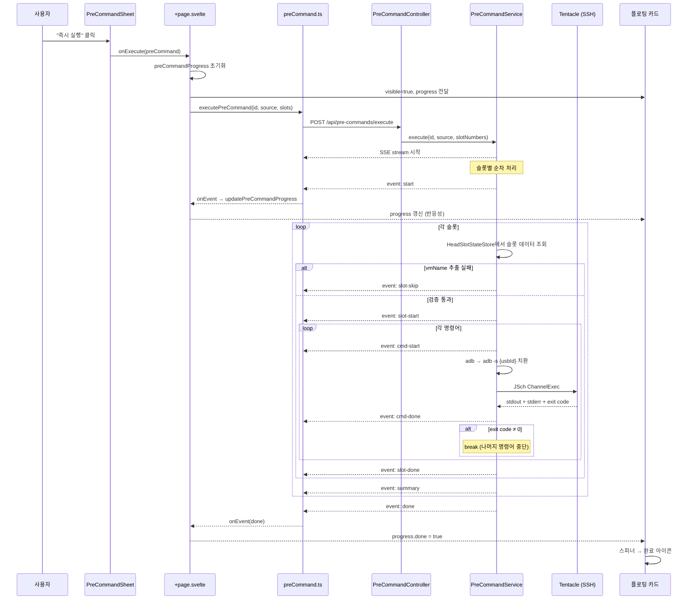
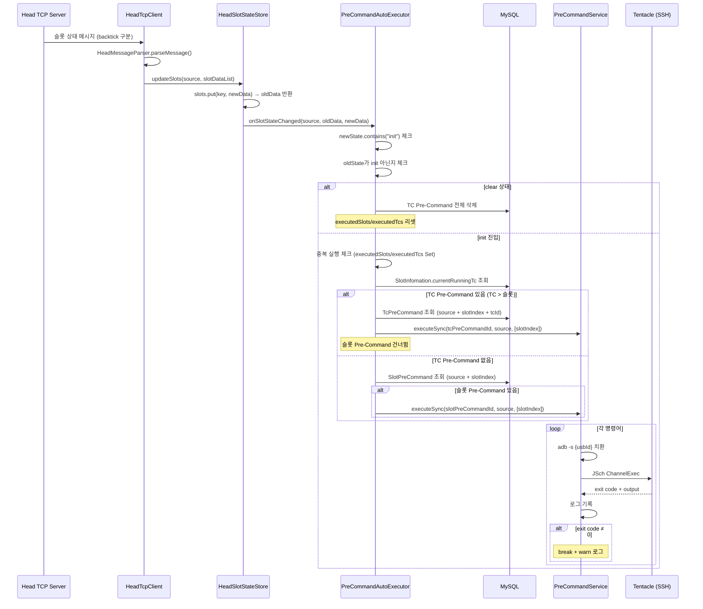
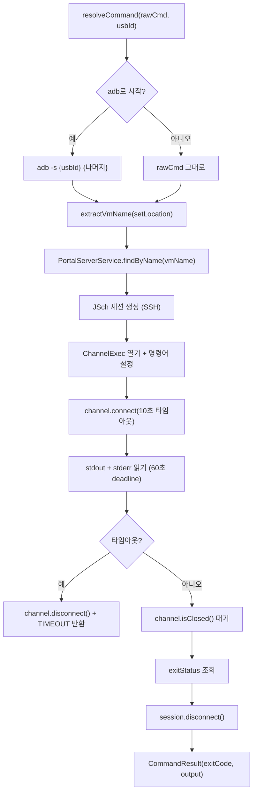
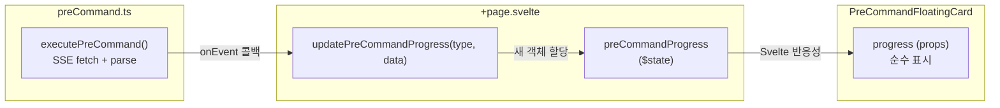
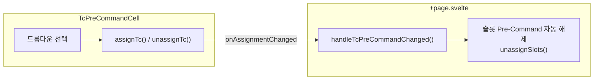
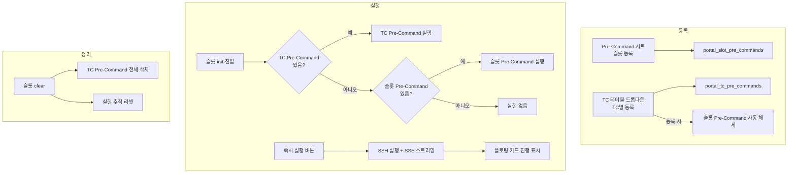

## 1. 즉시 실행 흐름

사용자가 "즉시 실행" 버튼을 클릭했을 때의 전체 흐름입니다.



### 타이밍 상세

1. **SSE 연결**: `fetch()` + `ReadableStream`으로 SSE 수신
2. **이벤트 파싱**: `\n\n` 블록 단위 파싱, 멀티라인 `data:` 지원
3. **상태 갱신**: 매 이벤트마다 `updatePreCommandProgress()` 호출 → 새 `progress` 객체 생성
4. **반응성**: Svelte 5 `$state`가 변경 감지 → 플로팅 카드 자동 리렌더
5. **스트림 종료**: reader.read()의 `done`이 true → 추가 `done` 이벤트 강제 발행 (안전장치)

---

## 2. 자동 실행 흐름 (TC 우선순위)

슬롯이 init 상태에 진입했을 때의 자동 실행 흐름입니다. TC Pre-Command가 슬롯 Pre-Command보다 우선합니다.



### 자동 실행 특성

| 항목 | 설명 |
|------|------|
| **비동기** | `ExecutorService.submit()`으로 별도 스레드에서 실행 |
| **SSE 없음** | `executeSync()` 사용 — 로그만 남김 |
| **TC 우선** | TC Pre-Command가 있으면 슬롯 Pre-Command 무시 |
| **중복 방지** | `ConcurrentHashMap.newKeySet()`으로 추적 (슬롯/TC 각각) |
| **재실행** | 슬롯이 init → 다른 상태 → 다시 init이 되면 재실행 |

---

## 3. SSH 명령어 실행 상세

하나의 명령어가 실행되는 과정입니다.



### SSH 세션 관리

- 명령어 **하나당 하나의 SSH 세션**을 생성하고 종료
- 세션 재사용을 하지 않는 이유: 명령어 간 환경 격리, ChannelExec는 세션당 하나
- 성능보다 안정성 우선 (세션 풀링은 추후 최적화 가능)

---

## 4. 프론트엔드 상태 관리 흐름

### 플로팅 카드 (즉시 실행)

플로팅 카드의 상태 관리는 부모 컴포넌트에서 직접 수행합니다.



### TC Pre-Command 셀 (TC 테이블)



### 설계 이유

Svelte 5 runes 모드에서 `bind:this` + `export function` 패턴이 외부 호출을 지원하지 않습니다. 따라서:

1. 플로팅 카드는 **순수 표시 컴포넌트** (상태 로직 없음)
2. 부모가 `PreCommandProgress` 객체를 매 이벤트마다 **새로 생성** (`{...spread}`)
3. Svelte의 참조 비교로 변경을 감지하여 리렌더

---

## 5. SSE 파싱 상세

Spring의 `SseEmitter`는 다음 형식으로 이벤트를 전송합니다:

```
event:cmd-start
data:{"slotIndex":0,"cmdIndex":0,"command":"adb -s usb:9-1.4.1 push file /dev"}

event:cmd-done
data:{"slotIndex":0,"cmdIndex":0,"status":"success","exitCode":0,
data:"output":"file pushed"}

```

### 파싱 규칙

1. `\n\n`으로 이벤트 블록 분리
2. 각 블록에서 `event:` 라인으로 이벤트 이름 추출
3. `data:` 라인은 **여러 줄일 수 있음** — 모두 합쳐서 JSON 파싱
4. `event` + `data` 모두 있을 때만 이벤트 발행
5. 스트림 종료(`reader.done`) 시 `done` 이벤트 강제 발행 (서버 이벤트 누락 대비)

### 에러 처리

| 상황 | 동작 |
|------|------|
| HTTP 에러 (4xx, 5xx) | `onError` 콜백 호출 |
| JSON 파싱 실패 | 해당 이벤트 무시 (다음 이벤트 계속 처리) |
| 네트워크 끊김 | AbortError 무시, 기타 에러는 `onError` 호출 |
| 사용자 중단 | `AbortController.abort()` → fetch 취소 |

---

## 6. 전체 흐름 요약


