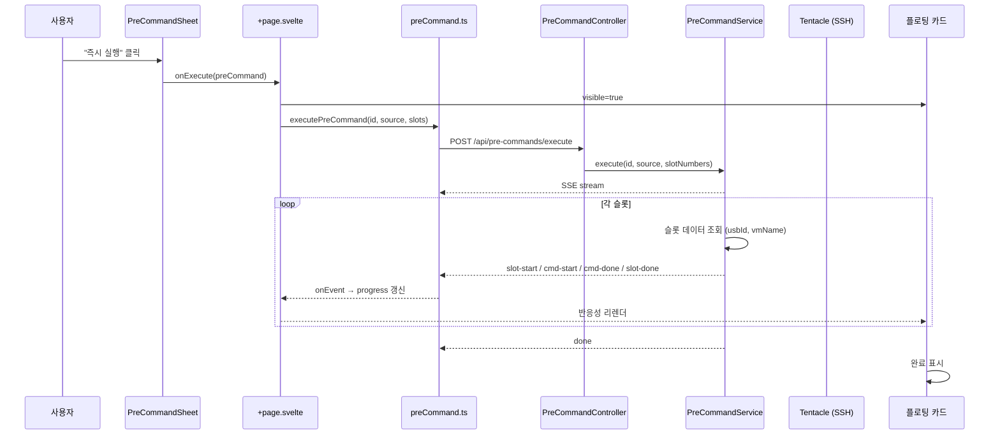
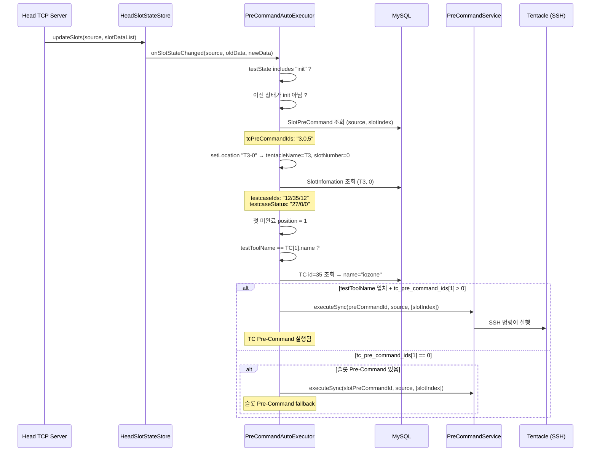
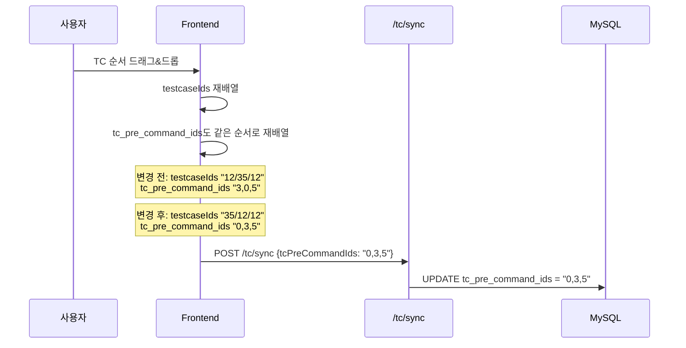
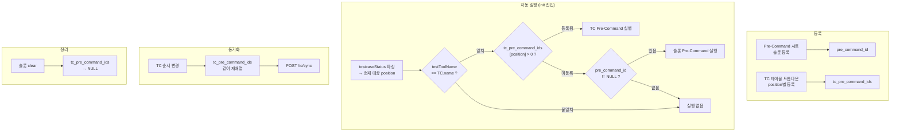

## 1. 즉시 실행 흐름

사용자가 "즉시 실행" 버튼을 클릭했을 때의 전체 흐름입니다.



---

## 2. 자동 실행 흐름 (TC 우선순위)

슬롯이 init 상태에 진입했을 때의 자동 실행 흐름입니다.



---

## 3. DB 데이터 흐름 상세

### 시나리오: Slot 0에 TC 3개, TC Pre-Command 2개 등록

**초기 등록 상태:**

```
portal_pre_commands:
  id=3: "tiotest 설치"   commands=["adb push tiotest /dev", "adb shell chmod +x /dev/tiotest"]
  id=5: "fio 설치"       commands=["adb push fio /dev", "adb shell chmod +x /dev/fio"]

portal_slot_pre_commands:
  source=compatibility, slot_index=0, pre_command_id=NULL, tc_pre_command_ids="3,0,5"

SlotInfomation (T3, 0):
  testcaseIds: "12/35/12"    testcaseStatus: "0/0/0"
```

**Phase 1: TC#12 (position 0) init 진입**

```
HEAD → testState: "Init", testToolName: "fio"
DB  → testcaseStatus: "0/0/0"  → 첫 미완료 = position 0
DB  → TC id=12, name="fio"    → testToolName 매칭 ✅
DB  → tc_pre_command_ids[0] = 3 > 0 ✅

→ Pre-Command id=3 "tiotest 설치" 실행
→ SSH: adb -s usb:9-1.4.1 push tiotest /dev
→ SSH: adb -s usb:9-1.4.1 shell chmod +x /dev/tiotest
```

**Phase 2: TC#12 (position 0) 완료 → TC#35 (position 1) init**

```
HEAD → testState: "Init", testToolName: "iozone"
DB  → testcaseStatus: "27/0/0"  → 첫 미완료 = position 1
DB  → TC id=35, name="iozone"  → testToolName 매칭 ✅
DB  → tc_pre_command_ids[1] = 0 → 미등록

→ 슬롯 Pre-Command fallback → pre_command_id = NULL → 실행 없음
```

**Phase 3: TC#35 (position 1) 완료 → TC#12 (position 2) init**

```
HEAD → testState: "Init", testToolName: "fio"
DB  → testcaseStatus: "27/36/0"  → 첫 미완료 = position 2
DB  → TC id=12, name="fio"      → testToolName 매칭 ✅
DB  → tc_pre_command_ids[2] = 5 > 0 ✅

→ Pre-Command id=5 "fio 설치" 실행
```

**Phase 4: 슬롯 clear**

```
HEAD → testState: "Clear"
AutoExecutor → handleClear()
  tc_pre_command_ids: "3,0,5" → NULL
  pre_command_id: NULL → 행 삭제
```

---

## 4. TC 순서 변경 동기화 흐름



---

## 5. 전체 흐름 요약


