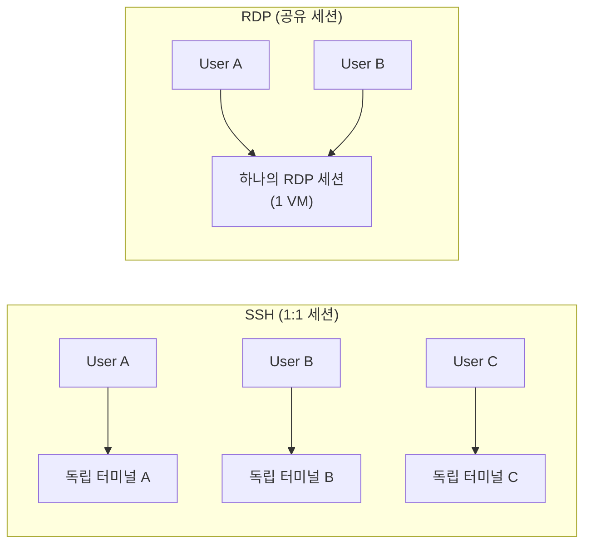
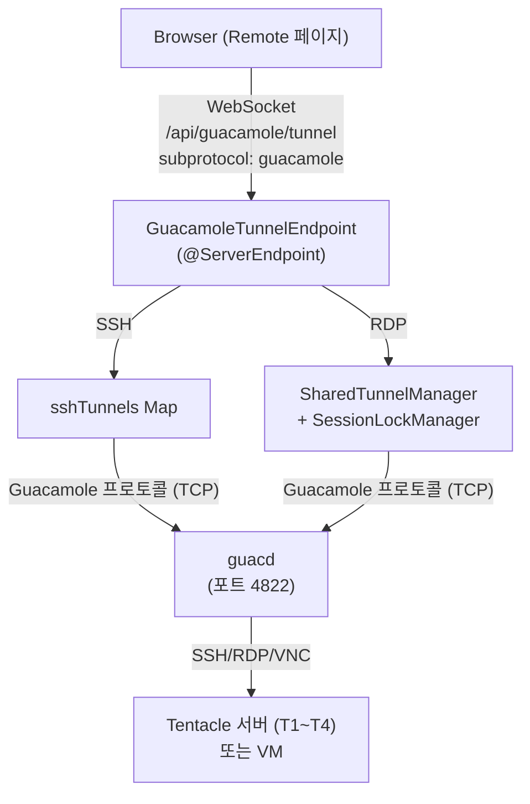
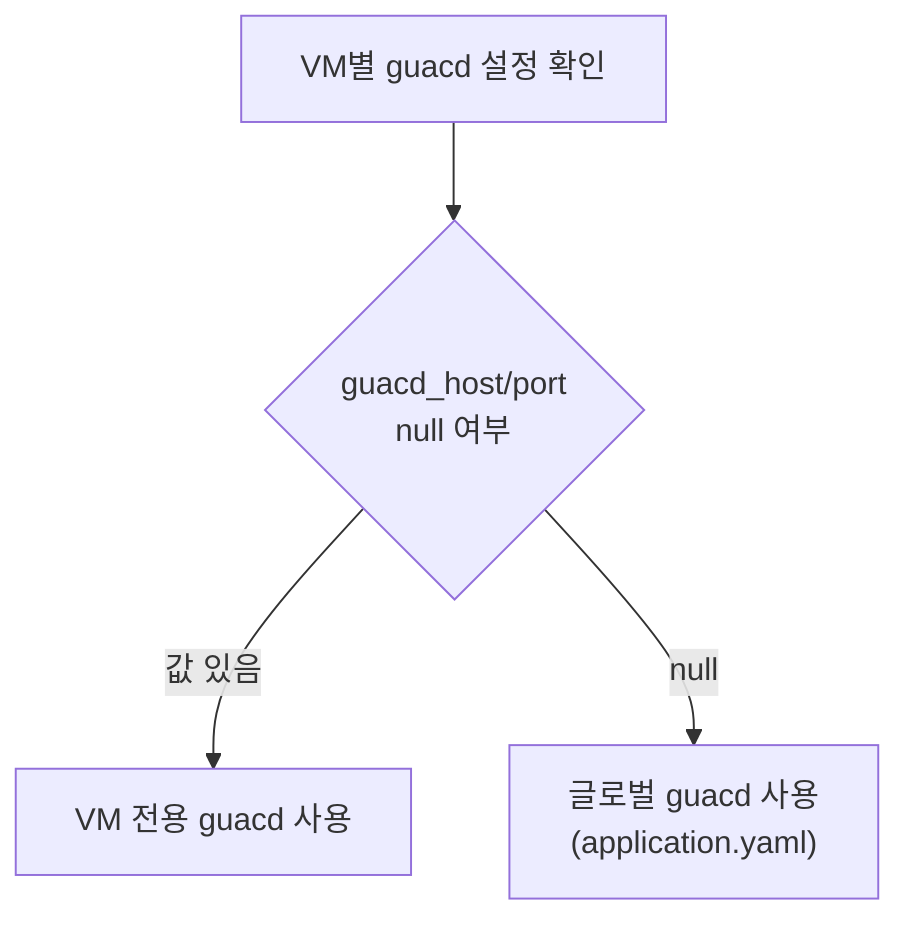

Portal의 원격 접속은 **Apache Guacamole** 프로토콜을 사용하여 브라우저에서 SSH/RDP/VNC 세션을 제공합니다. SSH와 RDP는 근본적으로 다른 세션 모델을 사용하며, 이 문서에서는 그 차이와 이유를 설명합니다.

## SSH vs RDP 세션 모델



| | SSH | RDP/VNC |
|--|-----|---------|
| **세션 모델** | 1:1 (사용자별 독립 터미널) | 공유 (VM당 하나의 세션) |
| **동시 접속** | 무제한 | Lock으로 제어 |
| **리소스** | 경량 (텍스트 기반) | 무거움 (GUI 디스플레이) |
| **잠금** | 불필요 | `SessionLockManager` |

:::note[왜 SSH는 1:1, RDP는 공유인가?]
- **SSH**: 각 연결이 독립적인 쉘 세션을 생성하며 리소스가 거의 들지 않습니다. 10명이 동시에 접속해도 10개의 가벼운 터미널이 열릴 뿐입니다.
- **RDP**: VM의 단일 GUI 디스플레이에 연결합니다. 여러 사용자가 동시에 같은 VM에 RDP 접속하면 세션이 충돌하거나 강제 로그아웃이 발생합니다. 따라서 VM당 하나의 RDP 세션만 허용하고, Lock으로 동시 접속을 제어합니다.
:::

---

## 전체 아키텍처



---

## Step 1: WebSocket 연결 시작

사용자가 Remote 페이지에서 서버를 클릭하면 WebSocket 연결이 시작됩니다.

```
Browser → WebSocket 핸드셰이크
    URL: /api/guacamole/tunnel?vm={vmName}&protocol={rdp|ssh|vnc}&user={username}
         &width=1920&height=1080&dpi=96
```

### @OnOpen — 세션 초기화

```java
// guacamole/endpoint/GuacamoleTunnelEndpoint.java
@OnOpen
public void onOpen(Session session, EndpointConfig config) {
    // 1. 쿼리 파라미터 파싱
    String vmName = params.get("vm");
    String protocol = params.get("protocol");
    String user = params.get("user");

    // 2. DB에서 VM 설정 조회
    PortalServer vmConfig = serverService.findByName(vmName);

    // 3. 세션 설정
    session.setMaxIdleTimeout(0);        // 무제한 유휴 타임아웃
    session.setMaxTextMessageBufferSize(1024 * 1024);  // 1MB

    // 4. guacd 주소 결정 (VM별 또는 글로벌 fallback)
    String guacdHost = vmConfig.getGuacdHost() != null
        ? vmConfig.getGuacdHost()
        : globalGuacamoleProperties.getGuacdHost();
    int guacdPort = vmConfig.getGuacdPort() != null
        ? vmConfig.getGuacdPort()
        : globalGuacamoleProperties.getGuacdPort();

    // 5. 프로토콜별 분기
    switch (protocol) {
        case "ssh" -> connectSsh(session, vmConfig, guacdHost, guacdPort);
        case "rdp" -> connectRdp(session, vmConfig, guacdHost, guacdPort, user);
        case "vnc" -> connectVnc(session, vmConfig, guacdHost, guacdPort);
    }
}
```

### guacd 주소 결정 (Fallback 패턴)



---

## Step 2a: SSH 연결 (1:1)

```java
private void connectSsh(Session session, PortalServer vm, String guacdHost, int guacdPort) {
    // 1. Guacamole 설정 구성
    GuacamoleConfiguration config = new GuacamoleConfiguration();
    config.setProtocol("ssh");
    config.setParameter("hostname", vm.getIp());
    config.setParameter("port", String.valueOf(vm.getSshPort()));
    config.setParameter("username", vm.getSshUser());
    config.setParameter("password", vm.getSshPassword());

    // 2. guacd에 직접 연결
    GuacamoleSocket socket = new ConfiguredGuacamoleSocket(
        new InetGuacamoleSocket(guacdHost, guacdPort), config
    );

    // 3. 터널 생성 및 등록
    GuacamoleTunnel tunnel = new SimpleGuacamoleTunnel(socket);
    sshTunnels.put(session, tunnel);  // 1:1 매핑

    // 4. 읽기 스레드 시작 (guacd → browser)
    startReaderThread(session, tunnel);
}
```

**읽기 스레드**: guacd에서 오는 Guacamole 프로토콜 메시지를 WebSocket으로 중계합니다.

```
guacd → GuacamoleTunnel.read() → WebSocket.send(message) → Browser
```

**쓰기**: 브라우저에서 오는 키 입력은 `@OnMessage`에서 직접 터널에 전달합니다.

```
Browser → WebSocket.onMessage() → GuacamoleTunnel.write(message) → guacd
```

---

## Step 2b: RDP 연결 (공유)

```java
private void connectRdp(Session session, PortalServer vm, String guacdHost, int guacdPort, String user) {
    String vmName = vm.getName();

    // 1. 세션 잠금 획득
    if (!sessionLockManager.tryAcquire(vmName, user)) {
        String currentUser = sessionLockManager.getCurrentUser(vmName);
        session.close(new CloseReason(
            CloseReason.CloseCodes.CANNOT_ACCEPT,
            "이미 " + currentUser + "님이 사용 중입니다."
        ));
        return;
    }

    // 2. 공유 터널 획득 또는 생성
    SharedGuacamoleTunnel sharedTunnel = sharedTunnelManager.getOrCreate(vmName, () -> {
        GuacamoleConfiguration config = new GuacamoleConfiguration();
        config.setProtocol("rdp");
        config.setParameter("hostname", vm.getIp());
        config.setParameter("port", String.valueOf(vm.getRdpPort()));
        config.setParameter("width", width);
        config.setParameter("height", height);
        // ...
        return new ConfiguredGuacamoleSocket(
            new InetGuacamoleSocket(guacdHost, guacdPort), config
        );
    });

    // 3. 세션 등록
    rdpSessions.put(session, vmName);
    sessionUsers.put(session, user);

    // 4. 공유 읽기 (첫 번째 연결 시만 스레드 시작)
    sharedTunnel.addViewer(session);
}
```

### SessionLockManager

| 메서드 | 동작 |
|--------|------|
| `tryAcquire(vmName, user)` | VM에 대한 잠금 획득 시도. 이미 다른 사용자가 잠금을 가지고 있으면 실패 |
| `release(vmName)` | 잠금 해제 |
| `getCurrentUser(vmName)` | 현재 잠금을 가진 사용자 이름 반환 |

---

## Step 3: 메시지 중계

WebSocket과 Guacamole 터널 사이에서 양방향 메시지 중계가 이루어집니다.

### 브라우저 → 서버 (키 입력, 마우스)

```java
@OnMessage
public void onMessage(Session session, String message) {
    // SSH: 해당 세션의 전용 터널에 쓰기
    if (sshTunnels.containsKey(session)) {
        sshTunnels.get(session).getWriter().write(message);
    }
    // RDP: 공유 터널에 쓰기
    else if (rdpSessions.containsKey(session)) {
        String vmName = rdpSessions.get(session);
        sharedTunnelManager.get(vmName).write(message);
    }
}
```

### 서버 → 브라우저 (화면 업데이트)

```
SSH: 전용 reader 스레드가 tunnel.read() → session.send()
RDP: SharedTunnel의 reader가 tunnel.read() → 모든 viewer에 broadcast
```

---

## Step 4: 연결 종료

```java
@OnClose
public void onClose(Session session) {
    // SSH: 터널 닫기
    if (sshTunnels.containsKey(session)) {
        sshTunnels.remove(session).close();
    }
    // RDP: 뷰어 제거 + 잠금 해제
    else if (rdpSessions.containsKey(session)) {
        String vmName = rdpSessions.remove(session);
        sharedTunnelManager.get(vmName).removeViewer(session);
        sessionLockManager.release(vmName);
        sessionUsers.remove(session);
    }
}
```

---

## VNC 접속

VNC는 RDP와 유사한 패턴이지만, 프로토콜 파라미터가 다릅니다:

```java
config.setProtocol("vnc");
config.setParameter("hostname", vm.getIp());
config.setParameter("port", String.valueOf(vm.getVncPort()));
config.setParameter("password", vm.getVncPassword());
```

VNC도 `SharedTunnelManager`와 `SessionLockManager`를 사용합니다.

---

## 핵심 파일 경로

| 파일 | 역할 |
|------|------|
| `guacamole/endpoint/GuacamoleTunnelEndpoint.java` | WebSocket 엔드포인트 (SSH/RDP/VNC) |
| `guacamole/GuacamoleProperties.java` | 글로벌 guacd 설정 (`application.yaml`) |
| `guacamole/SharedTunnelManager.java` | RDP 공유 터널 관리 |
| `guacamole/SessionLockManager.java` | VM별 세션 잠금 |
| `admin/entity/PortalServer.java` | VM 정보 (IP, 포트, guacd 설정) |
| `frontend/src/routes/remote/` | Remote 페이지 (서버 목록, 탭 관리) |
