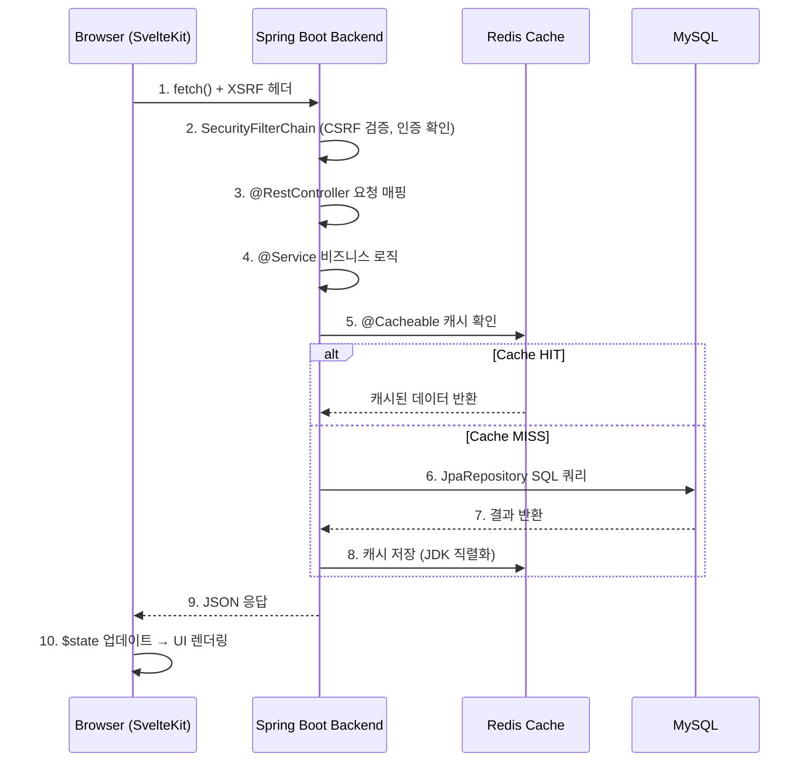
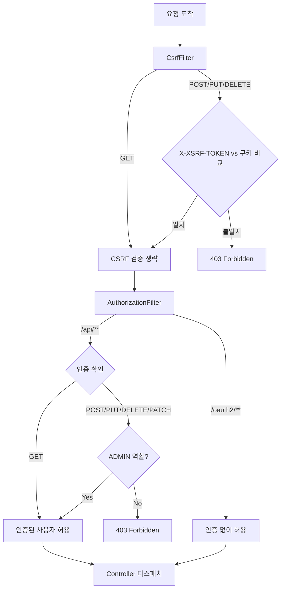
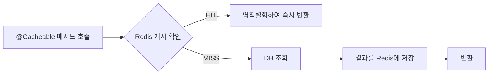
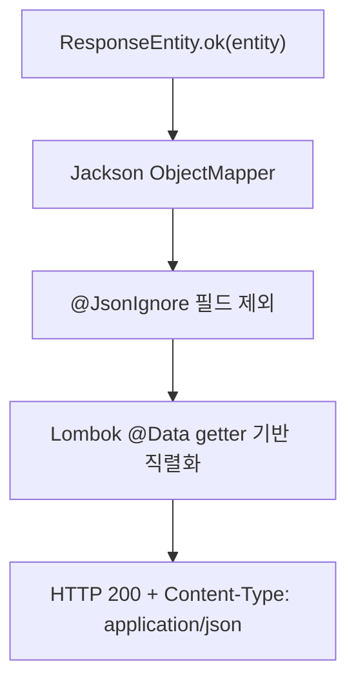
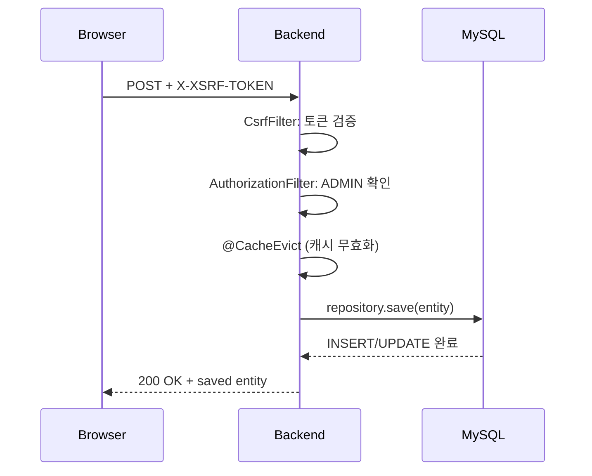

브라우저에서 발생한 API 요청이 Spring Boot 백엔드를 거쳐 DB에 도달하고, 응답이 돌아오기까지의 전체 경로를 추적합니다.

## 전체 시퀀스



---

## Step 1: 프론트엔드 — API 요청 발신

### client.ts (API 래퍼)

모든 API 호출은 `frontend/src/lib/api/client.ts`의 `request()` 함수를 통해 이루어집니다.

```typescript
// frontend/src/lib/api/client.ts
async function request<T>(path: string, init?: RequestInit): Promise<T> {
    const headers: Record<string, string> = { 'Content-Type': 'application/json' };

    // POST/PUT/DELETE/PATCH → XSRF 토큰 자동 첨부
    const method = init?.method?.toUpperCase();
    if (method === 'POST' || method === 'PUT' || method === 'DELETE' || method === 'PATCH') {
        headers['X-XSRF-TOKEN'] = getCsrfToken();
    }

    const res = await fetch(`/api${path}`, { headers, ...init });

    // 401 → OAuth2 로그인 페이지로 리다이렉트
    if (res.status === 401) {
        window.location.href = '/oauth2/authorization/galaxy';
        throw new Error('Unauthorized');
    }

    if (!res.ok) { /* 에러 처리 */ }
    return res.json();
}

// 편의 함수
export function get<T>(path: string): Promise<T> { ... }
export function post<T>(path: string, body: unknown): Promise<T> { ... }
export function put<T>(path: string, body: unknown): Promise<T> { ... }
export function del<T = void>(path: string): Promise<T> { ... }
```

**핵심 동작:**
- **XSRF 토큰**: `document.cookie`에서 `XSRF-TOKEN` 값을 읽어 `X-XSRF-TOKEN` 헤더에 추가
- **401 처리**: Spring Security가 비인증 요청에 401을 반환하면, Galaxy SSO 페이지로 리다이렉트
- **409 처리**: 비즈니스 에러(중복 등)는 서버 메시지를 파싱하여 사용자에게 표시

### 도메인별 API 함수

각 도메인은 별도 파일에서 타입 안전한 API 함수를 제공합니다:

```typescript
// frontend/src/lib/api/agent.ts
import { get, post, put, del } from './client.js';

export function fetchAgentServers(): Promise<AgentServer[]> {
    return get('/agent/servers');
}

export function createAgentServer(data: ...): Promise<AgentServer> {
    return post('/agent/servers', data);
}
```

---

## Step 2: Spring Security — 인증 및 CSRF 검증

요청이 백엔드에 도착하면 `SecurityFilterChain`이 가장 먼저 처리합니다.



**파일**: `config/SecurityConfig.java`

```java
http.csrf(csrf -> csrf
    .csrfTokenRepository(CookieServerCsrfTokenRepository.withHttpOnlyFalse())
    // SPA에서 JavaScript로 쿠키를 읽어야 하므로 httpOnly=false
);
```

:::note[CSRF 쿠키가 httpOnly=false인 이유]
SPA(Single Page Application) 아키텍처에서는 JavaScript가 CSRF 토큰 쿠키를 읽어 요청 헤더에 포함해야 합니다. 서버에서 설정한 `XSRF-TOKEN` 쿠키를 `document.cookie`에서 읽을 수 있어야 하므로 `httpOnly=false`로 설정합니다.
:::

---

## Step 3: Controller — 요청 매핑

인증을 통과한 요청은 `@RestController`의 매핑된 메서드로 전달됩니다.

```java
// testdb/controller/PerformanceTestRequestController.java
@RestController
@RequestMapping("/api/performance-test-requests")
@RequiredArgsConstructor
public class PerformanceTestRequestController {
    private final PerformanceTestRequestService service;

    @GetMapping
    public ResponseEntity<List<PerformanceTestRequest>> findAll() {
        return ResponseEntity.ok(service.findAll());
    }

    @PostMapping
    public ResponseEntity<PerformanceTestRequest> create(@RequestBody PerformanceTestRequest entity) {
        return ResponseEntity.ok(service.save(entity));
    }
}
```

**패턴:**
- `@RequestMapping("/api/{도메인}")` — 도메인별 URL 프리픽스
- `@RequiredArgsConstructor` — Lombok이 Service 의존성 자동 주입
- `@RequestBody` — JSON → Java 객체 자동 역직렬화
- `ResponseEntity.ok()` — 200 응답 + 객체 → JSON 직렬화

---

## Step 4: Service — 비즈니스 로직 + 트랜잭션

```java
@Service
@Transactional
@RequiredArgsConstructor
public class PerformanceTestRequestService {
    private final PerformanceTestRequestRepository repository;

    @Cacheable(value = "performanceTestRequest", unless = "#result == null")
    public Optional<PerformanceTestRequest> findById(Long id) {
        return repository.findById(id);
    }

    public PerformanceTestRequest save(PerformanceTestRequest entity) {
        return repository.save(entity);
    }
}
```

- `@Transactional` — 메서드 단위 트랜잭션 관리
- `@Cacheable` — Redis 캐시 확인 후, miss일 때만 DB 조회 (Step 5 참조)

---

## Step 5: Redis 캐시 — 선택적 단축 경로

`@Cacheable`이 적용된 메서드는 Redis를 먼저 확인합니다.



**캐시 설정** (`config/RedisCacheConfig.java`):

| 구분 | 캐시 | TTL |
|------|------|-----|
| TestDB | performanceTestRequest, performanceTestCase, performanceHistory 등 | 10분 |
| UFSInfo | cellType, controller, density, nandSize, nandType, ufsVersion | 1시간 |

**직렬화**: `JdkSerializationRedisSerializer` 사용 — Hibernate 프록시 객체와의 호환성 문제를 피하기 위한 선택입니다. 자세한 이유는 [Redis 캐시 아키텍처](/architecture/caching)를 참조하세요.

---

## Step 6-7: JPA Repository → MySQL

캐시 miss 시 JPA가 SQL 쿼리를 생성하여 MySQL에 요청합니다.

```java
public interface PerformanceTestRequestRepository
        extends JpaRepository<PerformanceTestRequest, Long> {
    // 기본 CRUD 자동 제공: findById, findAll, save, deleteById 등
}
```

### Multi-DataSource 라우팅

Portal은 3개의 독립적인 MySQL 데이터소스를 사용합니다. 어떤 Repository가 어떤 DB에 연결되는지는 **패키지 경로**로 결정됩니다:

| DataSource | 패키지 | DB (포트) | 용도 |
|------------|--------|-----------|------|
| **testdb** (Primary) | `com.samsung.move.testdb` | testdb (3306) | 성능/호환성 테스트 데이터 |
| **portal** | `com.samsung.move.{admin,agent,auth,binmapper,...}` | portal (3307) | Portal 전용 데이터 |
| **ufsinfo** | `com.samsung.move.ufsinfo` | ufsinfo (3306) | UFS 참조 코드 |

각 DataSource는 독립적인 `EntityManagerFactory`와 `TransactionManager`를 가집니다:

```java
// config/datasource/TestdbDataSourceConfig.java
@Configuration
@EnableJpaRepositories(
    basePackages = "com.samsung.move.testdb",    // ← 패키지로 DataSource 결정
    entityManagerFactoryRef = "testdbEntityManagerFactory",
    transactionManagerRef = "testdbTransactionManager"
)
public class TestdbDataSourceConfig { ... }
```

:::tip[왜 DataSource를 분리하는가?]
- **testdb**: 레거시 시스템과 공유하는 DB. Portal이 단독으로 스키마를 변경할 수 없음
- **ufsinfo**: UFS 참조 코드를 다른 팀과 공유. 읽기 전용에 가까움
- **portal**: Portal만 사용하는 데이터 (Agent, Admin, BinMapper 등). 자유롭게 스키마 변경 가능
:::

---

## Step 8-9: 응답 반환

Service → Controller → Spring MVC가 Java 객체를 JSON으로 직렬화하여 HTTP 응답을 반환합니다.



---

## Step 10: 프론트엔드 — 상태 업데이트 및 렌더링

API 응답은 Svelte 5 runes를 통해 UI에 반영됩니다:

```svelte
<script lang="ts">
  import { fetchAgentServers } from '$lib/api/agent.js';

  let servers = $state<AgentServer[]>([]);

  async function loadServers() {
      servers = await fetchAgentServers();  // $state 업데이트 → UI 자동 반영
  }

  // 파생 값: 서버 목록이 바뀌면 자동 재계산
  let activeServers = $derived(servers.filter(s => s.enabled));
</script>
```

**Svelte 5 반응성 흐름:**
1. `$state` 변수에 API 응답 할당
2. `$derived` 값이 자동 재계산
3. `$effect`로 등록된 부수효과 실행
4. DOM 자동 업데이트

---

## 변형: 뮤테이션 요청 (POST/PUT/DELETE)

쓰기 요청은 추가 단계가 있습니다:



**차이점:**
- CSRF 토큰 검증이 추가됨 (GET은 생략)
- ADMIN 역할 검증 (POST/PUT/DELETE/PATCH)
- `@CacheEvict`로 관련 캐시 무효화

---

## 핵심 파일 경로 요약

| 계층 | 파일 | 역할 |
|------|------|------|
| API 래퍼 | `frontend/src/lib/api/client.ts` | XSRF 헤더, 401 처리, 에러 핸들링 |
| 도메인 API | `frontend/src/lib/api/{domain}.ts` | 타입 안전한 API 함수 |
| Security | `config/SecurityConfig.java` | CSRF, 인증, 권한 설정 |
| Controller | `{domain}/controller/*Controller.java` | REST 엔드포인트 |
| Service | `{domain}/service/*Service.java` | 비즈니스 로직 + 캐시 |
| Repository | `{domain}/repository/*Repository.java` | JPA 데이터 접근 |
| DataSource | `config/datasource/*DataSourceConfig.java` | DB 연결 (3개) |
| Redis | `config/RedisCacheConfig.java` | 캐시 매니저 설정 |
