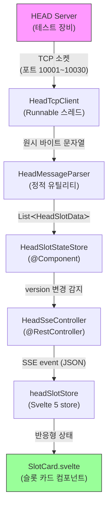
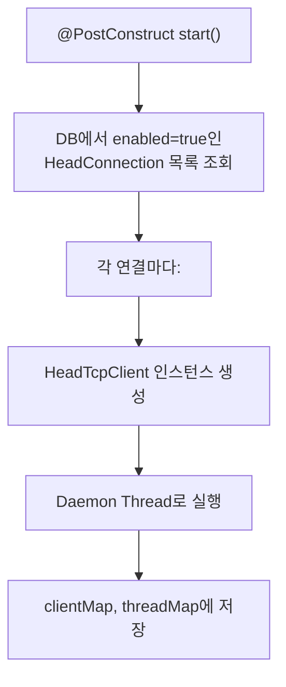
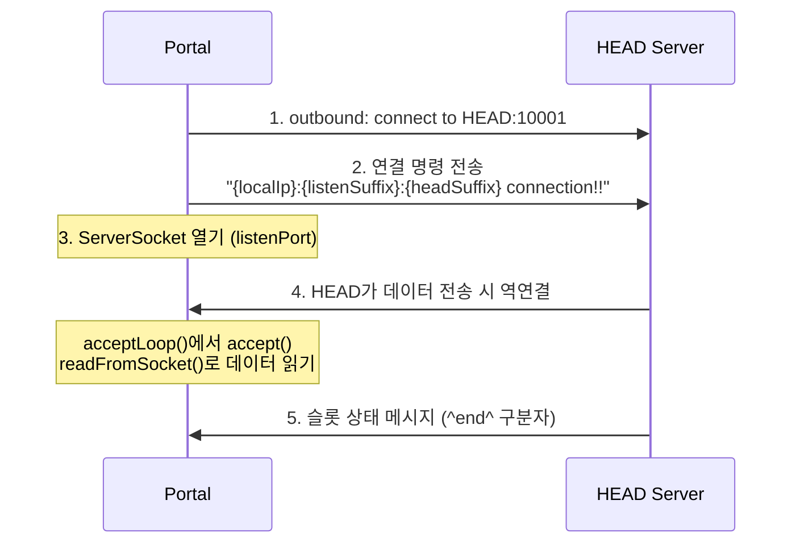
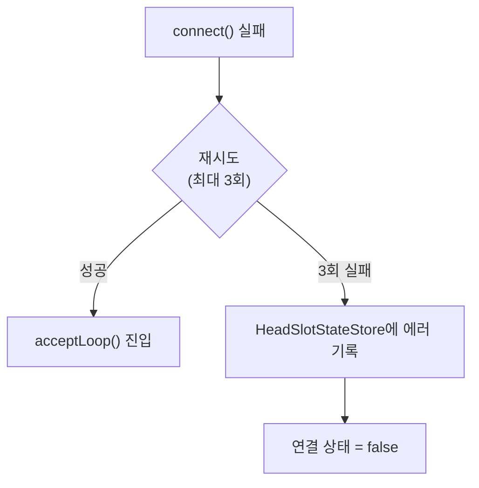

실시간 슬롯 모니터링은 Portal에서 가장 복잡한 데이터 흐름 중 하나입니다. HEAD 서버의 TCP 소켓에서 시작하여 브라우저 UI까지 **8개 컴포넌트**를 거칩니다.

## 전체 시퀀스



---

## Step 1: HeadConnectionManager — 연결 시작

앱이 시작되면 `HeadConnectionManager`가 DB에서 활성화된 HEAD 연결 목록을 읽고 각각에 대해 `HeadTcpClient` 스레드를 생성합니다.



**파일**: `head/tcp/HeadConnectionManager.java`

| 필드 | 타입 | 용도 |
|------|------|------|
| `clientMap` | `ConcurrentHashMap<String, HeadTcpClient>` | name → TCP 클라이언트 |
| `threadMap` | `ConcurrentHashMap<String, Thread>` | name → 실행 스레드 |
| `testModeMap` | `ConcurrentHashMap<String, Boolean>` | 테스트 모드 연결 추적 |

---

## Step 2: HeadTcpClient — TCP 듀얼 소켓

HEAD 서버와의 통신은 **듀얼 소켓** 방식으로 동작합니다. Portal이 HEAD에 먼저 연결(outbound)하고, HEAD가 데이터를 보낼 때 Portal의 ServerSocket(inbound)으로 역연결합니다.



**파일**: `head/tcp/HeadTcpClient.java` (495줄)

### 포트 공식

```
listenPort = 10000 + suffix
headPort = 10000 + headSuffix
```

예: HEAD 서버 포트 10001 (suffix=01), Portal 리스닝 포트 10030 (suffix=30)

### 재연결 메커니즘



- `MAX_RETRIES = 3`
- Keep-alive 활성화, TCP No-delay 활성화
- 메시지 구분자: `^end^`

---

## Step 3: HeadMessageParser — 메시지 파싱

TCP로 수신된 원시 문자열을 구조화된 `HeadSlotData` 객체로 변환합니다.

**파일**: `head/service/HeadMessageParser.java`

### 메시지 유형

| 패턴 | 설명 | 예시 |
|------|------|------|
| `initslots[(N)][fields]^` | 초기 슬롯 상태 (연결 직후) | 모든 슬롯 일괄 전송 |
| `update[(N)][fields]^` | 슬롯 상태 변경 | 개별 슬롯 업데이트 |
| `slotcount;(N)` | 총 슬롯 수 | 메타데이터 |

### 필드 매핑 (backtick 구분, 32개)

```
fields[0]  → runningTime
fields[1]  → setModelName
fields[2]  → remainBattery
fields[3]  → freeArea
fields[4]  → testToolName
fields[5]  → testTrName (기본값: "NONE")
fields[6]  → state
fields[7]  → testState
fields[8]  → testArea
fields[9]  → setLocation
fields[10] → runningState
fields[15] → preIdGlobalCxt;bootCxt;smartReport;osv (세미콜론 분리)
fields[16] → usbId
fields[20] → deviceName
fields[21] → fwVer
...
```

### 파생 필드

`connection` 값은 `state`에서 파생됩니다:

| state | connection | 의미 |
|-------|-----------|------|
| 1~4 | 1 | 연결됨 |
| 7 | 2 | 업로드 가능 |
| 기타 | 0 | 미연결 |

`testState`도 특정 state 값에서 오버라이드됩니다:

| state | testState 오버라이드 | 의미 |
|-------|---------------------|------|
| 1 | Waiting | 대기 |
| 4 | Inactive | 비활성 |
| 8 | Booting | 부팅 중 |
| 9 | Booting Fail | 부팅 실패 |

---

## Step 4: HeadSlotStateStore — 인메모리 상태 관리

파싱된 슬롯 데이터를 스레드 안전한 자료구조에 저장하고, **버전 번호**로 변경을 추적합니다.

**파일**: `head/service/HeadSlotStateStore.java`

```java
@Component
public class HeadSlotStateStore {
    // key: "source:slotIndex" → HeadSlotData
    private final ConcurrentHashMap<String, HeadSlotData> slots = new ConcurrentHashMap<>();

    // 변경될 때마다 증가 — SSE 컨트롤러가 이 값을 감시
    private final AtomicLong version = new AtomicLong(0);

    // 연결 상태 추적
    private final ConcurrentHashMap<String, Boolean> connectionStatuses = new ConcurrentHashMap<>();
    private final ConcurrentHashMap<String, String> connectionErrors = new ConcurrentHashMap<>();

    public void updateSlots(String source, List<HeadSlotData> slotList) {
        for (HeadSlotData slot : slotList) {
            String key = source + ":" + slot.getSlotIndex();
            slots.put(key, slot);
        }
        version.incrementAndGet();  // ← SSE push 트리거
    }
}
```

**핵심 설계:**
- `ConcurrentHashMap` — 다수의 HeadTcpClient 스레드가 동시에 쓸 수 있음
- `AtomicLong version` — SSE 컨트롤러가 폴링하여 변경 감지
- Key 구조: `"source:slotIndex"` — 여러 HEAD 서버의 슬롯을 하나의 맵에서 관리

---

## Step 5: HeadSseController — SSE 이벤트 전송

`@Scheduled`로 주기적으로 version을 확인하고, 변경이 있을 때만 연결된 모든 브라우저에 push합니다.

**파일**: `head/controller/HeadSseController.java`

### SSE 연결 수립

```java
@GetMapping(value = "/slots/stream", produces = MediaType.TEXT_EVENT_STREAM_VALUE)
public SseEmitter stream(@RequestParam(required = false) String source) {
    SseEmitter emitter = new SseEmitter(0L);  // 타임아웃 없음

    // 초기 상태 즉시 전송
    emitter.send(SseEmitter.event()
        .name("init")
        .data(buildPayload(source)));

    // 구독 목록에 추가
    emitters.add(new EmitterWrapper(emitter, source, version));

    emitter.onCompletion(() -> emitters.remove(wrapper));
    emitter.onTimeout(() -> emitters.remove(wrapper));

    return emitter;
}
```

### 주기적 push (version 기반)

```java
@Scheduled(fixedDelayString = "${head.sse.push-interval:500}")
public void pushUpdates() {
    long currentVersion = stateStore.getVersion();

    for (EmitterWrapper wrapper : emitters) {
        if (wrapper.lastVersion < currentVersion) {
            wrapper.emitter.send(SseEmitter.event()
                .name("update")
                .data(buildPayload(wrapper.source)));
            wrapper.lastVersion = currentVersion;
        }
    }
}
```

**최적화:**
- `EmitterWrapper`가 각 클라이언트의 `lastVersion`을 추적
- version이 변경되지 않으면 아무것도 전송하지 않음 (불필요한 네트워크 트래픽 방지)
- `CopyOnWriteArrayList` — 반복 중 안전하게 추가/제거 가능

### 데이터 보강

SSE 전송 전에 DB의 `SlotInfomation` 데이터를 merge합니다:

```
HeadSlotData (TCP에서 온 실시간 데이터)
    +
SlotInfomation (DB에서 조회: testCaseIds, testCaseStatus)
    =
최종 SSE 페이로드
```

---

## Step 6: headSlotStore — 프론트엔드 수신 및 상태 관리

**파일**: `frontend/src/lib/api/headSlotStore.svelte.ts`

```typescript
export function createHeadSlotStore(source?: string) {
    let slots = $state<HeadSlotData[]>([]);
    let connected = $state(false);
    let version = $state(0);

    function dedup(raw: HeadSlotData[]): HeadSlotData[] {
        const map = new Map<number, HeadSlotData>();
        for (const s of raw) map.set(s.slotIndex, s);
        return [...map.values()];
    }

    function connect() {
        const params = source ? `?source=${source}` : '';
        eventSource = new EventSource(`/api/head/slots/stream${params}`);

        eventSource.addEventListener('init', (e) => {
            const payload = JSON.parse(e.data);
            slots = dedup(payload.slots);     // 중복 제거 후 상태 업데이트
            version = payload.version;
            connected = true;
        });

        eventSource.addEventListener('update', (e) => {
            const payload = JSON.parse(e.data);
            slots = dedup(payload.slots);
            version = payload.version;
        });

        eventSource.onerror = () => {
            connected = false;
            // EventSource는 기본적으로 자동 재연결
        };
    }

    return { get slots() { return slots; }, connect, disconnect, retry };
}
```

**핵심 동작:**
- **dedup**: HEAD가 같은 slotIndex에 대해 중복 메시지를 보낼 수 있으므로, `Map<slotIndex, data>`로 마지막 값만 유지
- **자동 재연결**: `EventSource` API는 연결 끊김 시 자동으로 재연결을 시도
- **수동 재연결 (retry)**: 백엔드에 `reconnectHead(source)` 요청 후 SSE 재연결 — HEAD TCP 연결 자체를 복구

---

## 재연결 전략 요약

| 계층 | 재연결 방식 | 조건 |
|------|------------|------|
| **TCP** (HeadTcpClient) | 최대 3회 자동 재시도, `reconnectDelayMs` 간격 | 소켓 에러, HEAD 서버 다운 |
| **SSE** (EventSource) | 브라우저 자동 재연결 | 네트워크 일시 단절 |
| **수동** (retry 버튼) | 백엔드 TCP 재연결 + SSE 재연결 | 사용자가 명시적으로 요청 |

---

## 핵심 파일 경로

| 파일 | 역할 |
|------|------|
| `head/tcp/HeadConnectionManager.java` | HEAD 연결 생명주기 관리 |
| `head/tcp/HeadTcpClient.java` | TCP 듀얼 소켓 통신 (495줄) |
| `head/service/HeadMessageParser.java` | TCP 메시지 → HeadSlotData 변환 |
| `head/service/HeadSlotStateStore.java` | 인메모리 상태 + 버전 관리 |
| `head/controller/HeadSseController.java` | SSE 스트리밍 + DB 보강 |
| `frontend/src/lib/api/headSlotStore.svelte.ts` | EventSource 수신 + Svelte 상태 |
