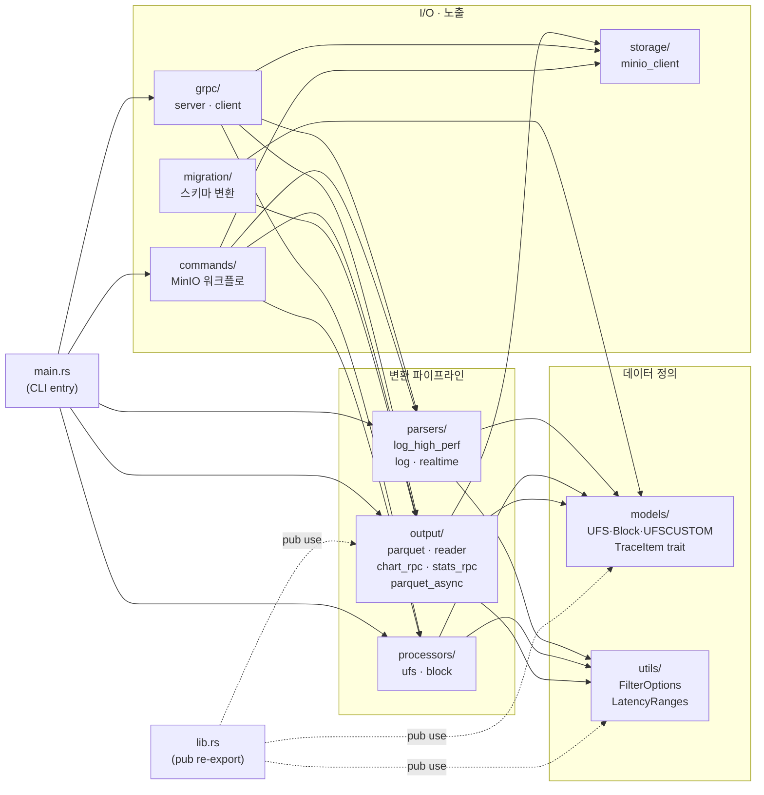

## 30초 요약

`trace`는 Rust 단일 바이너리. `src/` 아래에 **데이터 흐름과 1:1 대응되는 모듈**이 있고, `lib.rs`가 외부 노출 API를 정리합니다.

```
log file → parsers/ → Vec<UFS|Block|UFSCUSTOM> → processors/ → output/ → parquet/csv/png
                                                                  ↘ grpc/server.rs (RPC 응답)
```

각 박스가 디렉토리고, 박스 사이의 화살표가 함수 호출입니다.

## 디렉토리 지도

| 디렉토리 | 역할 | 핵심 타입/함수 |
|---|---|---|
| `models/` | 트레이스 이벤트 구조체 정의 | `UFS`, `Block`, `UFSCUSTOM`, `TraceItem` trait, `TraceType` enum |
| `parsers/` | 로그 파일 → `Vec<UFS\|Block\|UFSCUSTOM>` | `log_high_perf.rs`(mmap+rayon), `log.rs`(레거시), `realtime.rs`(tail -f) |
| `processors/` | bottom half latency 계산 | `ufs::ufs_bottom_half_latency_process`, `block::block_bottom_half_latency_process` |
| `output/` | parquet/CSV/차트/통계 직렬화 | `parquet.rs`(write), `reader.rs`(read), `chart_rpc.rs`, `stats_rpc.rs` |
| `storage/` | MinIO/S3 client | `minio_client.rs` (rust-s3 래퍼) |
| `grpc/` | gRPC 서버/클라이언트 | `server.rs`(8개 RPC), `client.rs` |
| `commands/` | high-level 워크플로 (MinIO) | `process_minio_log`, `migrate_parquet` |
| `migration/` | 구 parquet 스키마 마이그레이션 | `migrate_parquet_file` |
| `utils/` | 필터/압축/인코딩/로깅 | `FilterOptions`, `LatencyRanges`, `compression` |

`main.rs`는 CLI 인자 파싱 + 위 모듈을 묶는 얇은 entry point. `lib.rs`는 위 모듈 중 외부에서 필요한 것만 `pub use`로 재노출합니다.

## 모듈 의존도 그래프

화살표 = "A가 B를 호출/import한다". `models/`가 모든 모듈의 공통 어휘이고, `output/`이 가장 다양한 후방 의존을 가집니다. 새 trace_type을 추가하려면 화살표를 거꾸로 따라가며 손대야 합니다.



읽는 법:

- **하나의 trace_type을 추가하려면** 화살표를 따라 `models/` → `parsers/` → `processors/` → `output/` 4곳에 모두 손이 가야 합니다 (`grpc/server.rs`의 분기 포함하면 5곳)
- **`utils/FilterOptions`는 모든 변환 단계가 참조** — 새 필터 키를 추가하면 영향 범위가 4 모듈
- **`storage/`는 단방향** — `output`/`grpc`만 호출하고 자신은 다른 trace 모듈을 모름. MinIO를 다른 backend로 바꿀 때 격리 잘 됨
- **`migration/`은 곁가지** — 구 parquet → 신 parquet만 다루고 파이프라인엔 없음

## 데이터 플로우 — 로컬 분석

```
trace <log> <prefix>
  │
  ├─ parsers::log_high_perf::parse_log_file_high_perf()
  │     ├─ mmap2로 파일 매핑
  │     ├─ rayon으로 chunk 분할 → 각 chunk 병렬 파싱
  │     └─ 결과: (Vec<UFS>, Vec<Block>, Vec<UFSCUSTOM>)
  │
  ├─ processors::ufs::ufs_bottom_half_latency_process(ufs_traces)
  ├─ processors::block::block_bottom_half_latency_process(block_traces)
  │     └─ par_sort_by(time) 후 send↔complete 매칭, DtoC/CtoC/CtoD/QD 계산
  │
  └─ output::
       ├─ parquet::save_ufs_to_parquet(...)
       ├─ statistics::print_ufs_statistics(...)
       └─ charts::generate_*_charts(...)
```

`models/trace_item.rs`의 `TraceItem` trait이 세 트레이스 타입을 통일하는 인터페이스:

```rust
pub trait TraceItem {
    fn timestamp(&self) -> f64;
    fn lba(&self) -> u64;
    fn size(&self) -> u32;
    fn is_aligned(&self) -> bool;
    // ...
}
```

덕분에 `output/charts.rs`나 `output/statistics.rs`가 트레이스 타입별로 분기하지 않고 generic 하게 처리할 수 있습니다.

## 데이터 플로우 — gRPC 서버

```
trace --grpc-server
  │
  └─ tonic 서버 (port 50051/50053) — 8개 RPC
       │
       ├─ ProcessLogs        → MinIO 로그 다운 → 파서 → parquet → MinIO 업로드
       ├─ ConvertToCsv       → MinIO parquet 다운 → CSV → MinIO 업로드
       ├─ GetJobStatus       → in-memory job map 조회
       ├─ ListFiles          → MinIO ListObjects 래퍼
       ├─ ReadParquet        → parquet → 행 단위 stream
       ├─ StartRealtimeParsing → parsers::realtime::run_realtime_parser spawn
       ├─ StopParsing        → CancellationToken trigger
       ├─ GetChartData       → chart_rpc::build_*_chart_payload (Arrow IPC)
       └─ GetTraceStats      → stats_rpc::build_*_stats_payload (JSON)
```

`server.rs`는 RPC 핸들러만 두고, 실제 계산은 모두 `output/chart_rpc.rs`, `output/stats_rpc.rs`, `parsers/realtime.rs`에 위임합니다. 덕분에 같은 함수를 CLI 모드에서도 재사용 가능.

## 두 가지 reader backend

`GetChartData` / `GetTraceStats`가 MinIO에서 parquet을 읽을 때 환경변수로 백엔드 선택:

| `TRACE_PARQUET_READER` | 동작 | 적합한 상황 |
|---|---|---|
| `sync` (기본) | MinIO GET 전체 → `/tmp/*.parquet` → `File::open` | 작은 parquet (< 100MB) |
| `async` | `head_object` + range-GET footer → `ParquetRecordBatchStream` | 5GB+ parquet, `/tmp` 없음 |

async 경로는 `output/parquet_async.rs`의 `MinioParquetReader`가 핵심. footer 2-step fetch + row group 단위 async read로 메모리/디스크 모두 절약합니다. 자세한 건 [l2-trace의 06-async-reader](/learn/l2-trace/06-async-reader/) 참고.

## Filter & LatencyRanges — 전역 상태

`utils/filter.rs`의 `FilterOptions`는 시간/섹터/latency/QD/CPU 필터를 묶은 구조체. `lib.rs`에서 `OnceLock<FilterOptions>`로 보관되고, 파서·프로세서·출력 모두 같은 인스턴스를 참조합니다.

```rust
// lib.rs
static FILTER_OPTIONS: OnceLock<FilterOptions> = OnceLock::new();

pub fn set_filter_options(opts: FilterOptions) { /* ... */ }
pub fn get_filter_options() -> &'static FilterOptions { /* ... */ }
```

`LatencyRanges`도 동일 패턴. CLI/MinIO/gRPC 어느 진입점에서 들어오든 한 번 set한 뒤로는 같은 필터를 사용합니다.

## 새 trace_type을 추가하려면

```
1. models/<new_type>.rs       — 구조체 + TraceItem 구현
2. models/trace_type.rs       — TraceType enum에 등록
3. parsers/log_high_perf.rs   — 정규식/byte search 매칭 로직 추가
4. parsers/realtime.rs        — process_<type>() 함수 + WindowBuffer 필드
5. processors/<new_type>.rs   — bottom half latency 계산
6. output/parquet.rs          — save_<type>_to_parquet
7. output/reader.rs           — read_<type>_from_parquet
8. output/chart_rpc.rs        — build_chart_batch_<type>
9. output/stats_rpc.rs        — build_<type>_stats_payload
10. grpc/server.rs            — trace_type == "<type>" 분기
```

10단계 — 적지 않습니다. 그래서 trace 타입 추가는 신중히. UFSCUSTOM이 가장 최근 추가된 예시라, 같은 패턴으로 PR을 따라가면 됩니다.

## 다음 — Parser pipeline

다음 장은 `parsers/log_high_perf.rs`가 어떻게 5GB 파일을 mmap + rayon으로 청크 병렬 파싱하는지 코드 투어로 봅니다.

→ [2. Parser pipeline](/learn/l2-trace-rust/02-parser-pipeline/)
