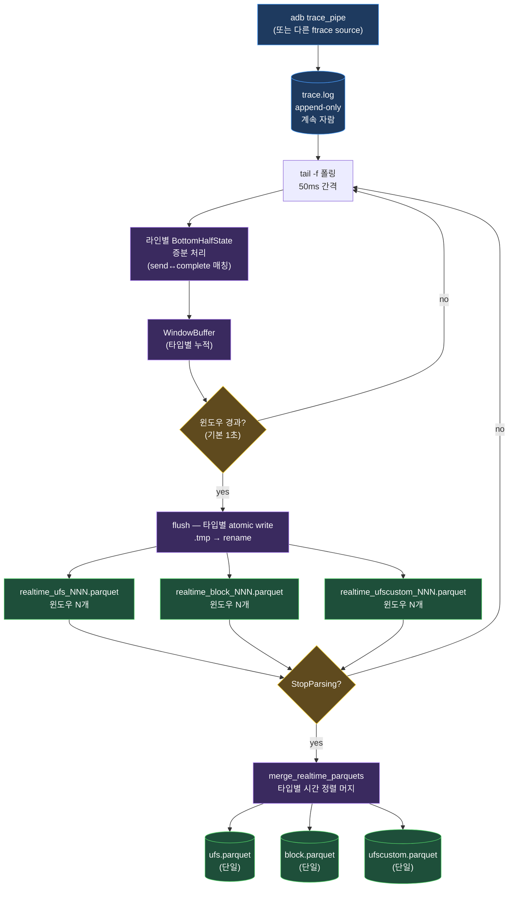

import SequenceTimeline from '../../../../components/learn/SequenceTimeline.svelte';

## 30초 요약

batch 모드(`parse_log_file_high_perf`)는 로그가 다 쌓인 뒤 일괄 처리. realtime 모드(`parsers/realtime.rs`)는 **로그가 자라는 동안** 처리합니다.



핵심:

- **Atomic write** — `.tmp`로 쓰고 완료 후 `.parquet`로 rename → reader가 partial 읽을 일 없음
- **타입별 분리 파일** — 한 윈도우에 UFS/Block/UFSCUSTOM이 섞여 들어와도 별도 파일로 출력
- **증분 bottom half** — `BottomHalfState`가 윈도우 간 send↔complete 매칭 상태를 유지
- **Stop 시 자동 머지** — 윈도우 파일들을 시간 정렬 후 단일 parquet으로 합침

## 시각화 — 윈도우를 가로지르는 매칭

batch 모드와 가장 다른 점은 **`BottomHalfState`가 윈도우 사이에서 살아남는다**는 것. send_req가 윈도우 1에서 들어왔는데 complete_rsp는 윈도우 3에서 도착하는 흔한 케이스를 그림으로 봅니다. ▶ 재생.

<SequenceTimeline
  client:visible
  height={420}
  caption="윈도우 1에 send(tag=10) 도착 → pending에 등록 → 윈도우 1 flush 시 send 미출력. 윈도우 3에 complete(tag=10) 도착 → pending에서 꺼내 DtoC 산출 → 윈도우 3에 send+complete 모두 출력."
  altText="t=0~10이 윈도우 1: send_req(tag=10)가 BottomHalfState.pending에 들어가고 윈도우 종료 시 ufs_001.parquet로 flush되지만 send는 아직 매칭 안 되어 출력되지 않음. t=10~20이 윈도우 2: 다른 send/complete가 처리되고 ufs_002.parquet 출력. t=20~30이 윈도우 3: tag=10의 complete_rsp 도착 → pending에서 꺼내 DtoC 산출 후 send+complete 모두 ufs_003.parquet에 출력. atomic rename으로 reader 충돌 방지."
  lanes={[
    { id: 'log',     label: 'trace.log', sublabel: 'tail -f append', layer: 'hw' },
    { id: 'state',   label: 'BottomHalfState', sublabel: 'pending across windows', layer: 'state' },
    { id: 'win',     label: '윈도우 buffer', sublabel: 'WindowBuffer (1초)', layer: 'tx' },
    { id: 'fs',      label: '파일시스템', sublabel: '.tmp → atomic rename', layer: 'be' },
  ]}
  messages={[
    { from: 'log', to: 'state',  t: 5,  label: 'send(tag=10) t=5', kind: 'sync', note: 'pending.insert((10, R), 5.0)' },
    { from: 'log', to: 'win',    t: 7,  label: 'complete(tag=99) t=7', kind: 'sync', note: '다른 요청 매칭 → win에 push' },
    { from: 'win', to: 'fs',     t: 10, label: 'flush 윈도우1 → ufs_001.tmp', kind: 'async', note: 'tag=10 send는 아직 출력 X' },
    { from: 'fs', to: 'fs',      t: 11, label: 'rename → ufs_001.parquet', kind: 'async', note: 'reader 충돌 0' },
    { from: 'log', to: 'win',    t: 15, label: 'send(tag=20) t=15', kind: 'sync', note: 'pending에 등록 + win에도 push' },
    { from: 'log', to: 'win',    t: 18, label: 'complete(tag=20) t=18', kind: 'sync', note: 'pending.remove → DtoC=3' },
    { from: 'win', to: 'fs',     t: 20, label: 'flush 윈도우2 → ufs_002.parquet', kind: 'async' },
    { from: 'log', to: 'state',  t: 25, label: 'complete(tag=10) t=25', kind: 'sync', note: 'pending.remove((10,R)) → send_time=5, DtoC=20' },
    { from: 'state', to: 'win',  t: 26, label: 'tag=10 send + complete 함께 출력', kind: 'async', note: 'send_req도 보존 (action 컬럼)' },
    { from: 'win', to: 'fs',     t: 30, label: 'flush 윈도우3 → ufs_003.parquet', kind: 'async' },
    { from: 'fs', to: 'fs',      t: 35, label: 'stop 호출 → merge_realtime_parquets', kind: 'async', note: 'ufs_*.parquet → ufs.parquet 단일' },
  ]}
/>

핵심 관찰:

- **tag=10의 send는 t=5에 들어왔지만 윈도우 1 flush(t=10) 시점엔 출력 안 됨** — pending에만 보관
- **complete는 윈도우 3에서 도착** — 그제서야 pending에서 send를 꺼내 DtoC 계산하고 두 이벤트를 모두 윈도우 3 buffer에 push
- **`send_req` 이벤트도 parquet에 들어감** — 두 이벤트가 같은 row 두 개로 저장되며 `action` 컬럼으로 구분 (이전 세션에서 `Vec<UFS>` 반환으로 변경한 부분)
- **atomic rename**으로 reader가 partial parquet을 읽을 위험 0

## tail -f 폴링 루프

```rust
loop {
    if cancel_token.is_cancelled() { break; }

    let current_size = fs::metadata(&log_source)?.len();

    if current_size > last_offset {
        let mut file = File::open(&log_source)?;
        file.seek(SeekFrom::Start(last_offset))?;
        let mut bytes_read: u64 = 0;
        let mut reader = BufReader::new(file);
        let mut line_buf = String::new();

        loop {
            line_buf.clear();
            match reader.read_line(&mut line_buf) {
                Ok(0) => break,  // EOF
                Ok(n) => {
                    if !line_buf.ends_with('\n') {
                        // 불완전 라인 → 보관, 다음 iteration에서 합침
                        incomplete_line.push_str(&line_buf);
                        break;
                    }
                    bytes_read += n as u64;
                    // ... 라인 처리
                }
                Err(_) => break,
            }
        }
        last_offset += bytes_read;  // 실제 읽은 바이트만큼만 전진
    }

    if window_start.elapsed() >= window_duration && buffer.total_count() > 0 {
        flush_window(&mut buffer, output_path, file_seq)?;
    }

    if current_size <= last_offset {
        tokio::time::sleep(poll_interval).await;  // 50ms
    }
}
```

세 가지 디테일이 중요합니다.

### 1. 불완전 라인 보관

`tail -f`로 읽는 도중 파일이 자라고 있어서 라인 중간에서 read가 끊길 수 있음. `\n`으로 끝나지 않으면 `incomplete_line`에 저장하고 다음 iteration에서 앞에 붙여 다시 처리:

```rust
let line = if !incomplete_line.is_empty() {
    let full = format!("{}{}", incomplete_line, line_buf);
    incomplete_line.clear();
    full
} else {
    line_buf.clone()
};
```

### 2. last_offset은 bytes_read로

처음 구현은 `last_offset = current_size`였는데, 이게 버그였어요. 파일이 read 도중에도 자라기 때문에 다음 iteration에서 **이미 읽은 영역을 또 읽어** 이벤트가 중복됩니다 → QD 폭주. 실제로 읽은 완전한 라인의 누적 바이트(`bytes_read`)만큼만 전진해야 정확합니다.

### 3. 50ms 폴링

`poll_interval = Duration::from_millis(50)`. inotify 기반 watch도 가능하지만:
- macOS/Linux 서로 다른 API
- 프레임마다 syscall 오버헤드는 어차피 작음
- 50ms면 사람 눈에 거의 실시간

이 정도면 충분히 단순.

## BottomHalfState — 윈도우 간 상태 유지

batch 모드는 한 번에 다 보지만, realtime은 **send_req가 1번 윈도우에 들어오고 complete_rsp가 3번 윈도우에 들어오는** 상황이 흔합니다. 그래서 매칭 상태가 윈도우를 넘어 유지돼야 함.

```rust
pub struct BottomHalfState {
    // UFS pending — send_req가 들어왔지만 아직 complete가 안 온 것들
    pub pending_ufs: HashMap<(u32, Box<str>), UFS>,
    // Block pending
    pub pending_block: HashMap<(u64, Box<str>), Block>,
    // Block issue dedup
    pub issued_block_keys: HashSet<(u64, Box<str>, u32)>,

    // UFS QD/CtoC/CtoD 상태
    pub current_qd: u32,
    pub last_complete_time: Option<f64>,
    pub last_qd_zero_complete_time: Option<f64>,
    pub first_c: bool,
    pub first_complete_time: f64,

    // Block QD/CtoC/CtoD 상태 (UFS와 분리)
    pub block_current_qd: u32,
    pub block_last_complete_time: Option<f64>,
    // ...

    // continuous 판단용 prev 정보
    pub prev_ufs_request: Option<(u64, u32, Box<str>)>,
    pub prev_block_end_sector: Option<u64>,
    pub prev_block_io_type: Option<Box<str>>,

    // UFSCUSTOM 상태
    pub ufscustom_current_qd: u32,
    // ...
}
```

UFS와 Block의 QD를 **별도 필드**로 나눈 이유: 둘이 같이 들어오는 트레이스에서 같은 `current_qd`를 쓰면 서로의 큐가 섞여 의미를 잃음.

## process_ufs / process_block — `Vec<T>` 반환

batch 모드의 `processors::*`는 `Vec<UFS>`를 통째로 받아 in-place 수정. realtime은 한 이벤트씩 들어오므로 다른 시그니처가 필요합니다.

```rust
pub fn process_ufs(&mut self, mut ufs: UFS) -> Vec<UFS> {
    match &*ufs.action {
        "send_req" => {
            // QD/CtoD 계산 + pending 등록
            self.pending_ufs.insert(key, ufs);
            vec![]  // 아직 출력하지 않음
        }
        "complete_rsp" => {
            // pending에서 꺼내 DtoC 계산
            if let Some(send_ufs) = self.pending_ufs.remove(&key) {
                vec![send_ufs, ufs]  // send + complete 모두 출력
            } else {
                vec![ufs]  // orphan complete (이전 세션 잔여)
            }
        }
        _ => vec![ufs],
    }
}
```

처음엔 send_req를 `Option<UFS>`로 None 반환했는데, 그러면 send_req가 parquet에 저장되지 않아 batch 결과와 달라졌음. **send_req도 보존**하기 위해 `Vec<UFS>`로 변경. 둘 다 같은 `action` 필드를 갖고 들어가서 통계 단계가 알아서 분리합니다.

## 윈도우 flush — 타입별 atomic write

```rust
fn flush_window(buffer: &mut WindowBuffer, output_dir: &Path, file_seq: u32)
    -> Result<Vec<(String, u64)>, Box<dyn Error + Send + Sync>>
{
    let mut results = Vec::new();

    if !buffer.ufs_traces.is_empty() {
        let name = format!("realtime_ufs_{:06}.parquet", file_seq);
        let tmp_path = output_dir.join(format!("{}.tmp", name));
        let final_path = output_dir.join(&name);

        save_ufs_to_parquet(&buffer.ufs_traces, &tmp_path.to_string_lossy(), 50_000)?;
        fs::rename(&tmp_path, &final_path)?;  // atomic

        results.push((final_path.to_string_lossy().to_string(),
                     buffer.ufs_traces.len() as u64));
    }
    // Block, UFSCUSTOM 동일 패턴
    buffer.clear();
    Ok(results)
}
```

파일명이 **타입별로 분리**된 게 핵심. 처음엔 `realtime_NNNNNN.parquet` 한 파일에 모두 저장했는데, 한 윈도우에 두 타입이 동시에 들어오면 나중 타입이 앞 타입을 덮어쓰는 버그가 있었어요. 타입별 prefix로 해결.

`50000`은 row group size — Parquet 내부 압축/인덱싱 단위.

## Stop 시 머지

윈도우 파일들이 쌓인 뒤 클라이언트가 `--client stop`을 호출하면, 타입별로 모아 시간 정렬 후 단일 parquet으로 머지:

```rust
fn merge_realtime_parquets(output_dir: &Path)
    -> Result<Vec<String>, Box<dyn Error + Send + Sync>>
{
    for (prefix, type_name) in [
        ("realtime_ufs_", "ufs"),
        ("realtime_block_", "block"),
        ("realtime_ufscustom_", "ufscustom"),
    ] {
        // 디렉토리에서 prefix 매칭 파일 모두 수집
        let mut files: Vec<_> = fs::read_dir(output_dir)?
            .filter_map(|e| e.ok())
            .map(|e| e.path())
            .filter(|p| /* prefix 매칭 */)
            .collect();
        files.sort();

        // 타입별로 read → 시간 정렬 → save
        let mut all_traces = Vec::new();
        for f in &files {
            let traces = read_ufs_from_parquet(&f.to_string_lossy())?;
            all_traces.extend(traces);
        }
        all_traces.sort_by(|a, b| a.time.partial_cmp(&b.time).unwrap_or(Equal));

        let merged_path = output_dir.join(format!("{}.parquet", type_name));
        save_ufs_to_parquet(&all_traces, &merged_path.to_string_lossy(), 50_000)?;

        // 윈도우 파일들 삭제
        for f in &files { let _ = fs::remove_file(f); }
    }
    Ok(merged_files)
}
```

DuckDB의 `read_parquet('realtime_*.parquet')` 글로브로도 조회는 가능하지만, **단일 파일로 머지하면 다운스트림이 단순**해집니다 (path 한 개만 넘기면 됨).

## gRPC 측에서 사용

```bash
# 1. 서버 띄우기
./target/release/trace --grpc-server --port 50053

# 2. realtime 시작 (다른 터미널)
./target/release/trace --grpc-client realtime \
    --server localhost:50053 \
    --source-path /tmp/agent/job123/trace.log \
    --output-dir /tmp/agent/job123/realtime \
    --log-type ufs \
    --window 1

# → ParquetFileReady 메시지가 윈도우마다 stream으로 도착
# {file_path: "realtime_ufs_000001.parquet", event_count: 1234, ...}

# 3. 중단
./target/release/trace --grpc-client stop \
    --server localhost:50053 \
    --job-id <REALTIME_JOB_ID>

# → 자동 머지 후 is_final=true 메시지 1개 (ufs.parquet path)
```

서버 측 RPC 정의는 `proto/log_processor.proto`의 `StartRealtimeParsing`, `StopParsing`. 자세한 RPC 스펙은 향후 `06-grpc-rpcs`에서.

## 처리 가능한 처리량

대략적인 측정 (M2 Pro):

| 윈도우 크기 | 초당 이벤트 | 윈도우당 parquet 크기 | 머지 후 총 크기 |
|---|---|---|---|
| 1초 | ~1M events/s | ~5MB | 5GB / 5000s |
| 5초 | ~1M events/s | ~25MB | 5GB / 5000s |

Parquet write 자체는 윈도우 크기와 무관 — row group이 50k로 고정이라 batch 모드 throughput에 가깝습니다. 다만 윈도우가 짧을수록 **알림(ParquetFileReady) 빈도**가 높아서 다운스트림(라이브 차트 등)이 더 부드럽게 갱신.

## 다음 — Debug story

마지막 장은 이번 세션에서 잡은 **QD 150 스파이크 버그**를 처음부터 끝까지 추적합니다. realtime 모드의 미묘한 에지 케이스를 어떻게 발견하고 고치는지 사례.

→ [5. Debug story](/learn/l2-trace-rust/05-debug-stories/)
