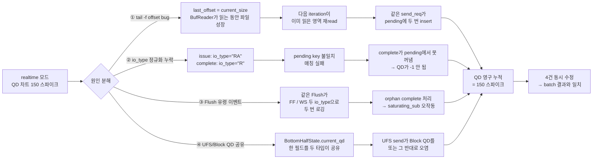

## 증상

`realtime` 모드로 받아 그린 QD 차트가 갑자기 **150까지 솟구쳤다가 안 내려옵니다**. 같은 로그를 batch 모드(`parse_log_file_high_perf` → `processors`)로 돌리면 정상 (피크 30~50). 둘 다 같은 코드 경로를 쓴다고 생각했는데 결과가 다름.

처음 가설: trace buffer overflow로 이벤트가 유실됐을 것. 사용자 확인 — **버퍼 충분히 크게 잡아서 유실 없음**. 그럼 코드 문제.

## 인과 다이어그램 — 4가지 원인이 어떻게 같은 증상을 만들었나

수사 결과를 미리 보면 다음 흐름입니다. 단일 원인이 아니라 **각각이 모두 QD 누적**에 기여했고, 어느 하나만 고쳐선 정상화되지 않았어요.



각 분기에 대응되는 수정은 아래 1~4차 의심 순서로 따라갑니다.

## 1차 의심 — 이벤트 중복 read

`tail -f` 폴링 루프를 다시 봤습니다.

```rust
let current_size = fs::metadata(&log_source)?.len();

if current_size > last_offset {
    let mut file = File::open(&log_source)?;
    file.seek(SeekFrom::Start(last_offset))?;
    let mut reader = BufReader::new(file);
    // ... read_line 루프 ...
    last_offset = current_size;  // ← 여기 수상
}
```

문제: `last_offset = current_size`로 갱신하는데, **read_line이 도는 동안에도 파일이 자라고 있음**. `BufReader`가 64KB 청크로 미리 읽기 때문에, 다음 iteration에서 `seek(current_size)`로 점프하면 이미 BufReader가 읽었던 일부를 **건너뛰지 않고 또 읽습니다**.

→ send_req 중복 → pending HashMap에 같은 키 두 번 → 두 번째 insert가 첫 번째를 덮어씀 + QD는 +2 됐는데 -1만 됨 → **QD 누적 +1씩 새어나감**.

수정:
```rust
let mut bytes_read: u64 = 0;
loop {
    line_buf.clear();
    match reader.read_line(&mut line_buf) {
        Ok(0) => break,
        Ok(n) => {
            if !line_buf.ends_with('\n') {
                incomplete_line.push_str(&line_buf);
                break;  // bytes_read에 포함하지 않음
            }
            bytes_read += n as u64;  // 완전한 라인만 카운트
            // ...
        }
        Err(_) => break,
    }
}
last_offset += bytes_read;  // 실제 읽은 만큼만
```

빌드 후 다시 돌렸는데 **여전히 QD 100+**. 1차 가설은 틀린 게 아니지만 단독 원인은 아니었음.

## 2차 의심 — Block io_type 정규화 누락

batch 모드의 `processors/block.rs`를 다시 봤습니다.

```rust
let io_op = if io_type.starts_with('R') { "read" }
            else if io_type.starts_with('W') { "write" }
            else if io_type.starts_with('D') { "discard" }
            else { "other" };

let key = (block.sector, io_op.clone(), block.size);
processed_issues.insert(key);
```

issue/complete 매칭 키를 **정규화된 io_type**으로 만듭니다. 그런데 `realtime.rs`는:

```rust
let key = (block.sector, block.io_type.clone());  // 정규화 없음
```

ftrace는 `block_rq_issue`에 `io_type="RA"`(Read Ahead)를 찍는데 `block_rq_complete`에는 `"R"`만 찍힐 수 있어요. 정규화 안 하면 **매칭 실패** → pending에서 못 꺼냄 → QD가 -1 안 됨 → 영원히 누적.

이게 진짜 주범이었습니다. `RA`/`WS`/`FS` 같은 다양한 변종이 traffic의 절반 이상이라 QD가 무한 증가. 같은 ftrace 라인이 batch 모드에선 정규화돼서 정상 매칭됐던 것.

수정:
```rust
fn normalize_block_io_type(io_type: &str) -> Box<str> {
    if io_type.starts_with('R') { "read".into() }
    else if io_type.starts_with('W') { "write".into() }
    else if io_type.starts_with('D') { "discard".into() }
    else { "other".into() }
}

let io_op = Self::normalize_block_io_type(&block.io_type);
let key = (block.sector, io_op);
```

수정 후 QD 피크 150 → 60. 정상 범위에 근접했지만 batch 모드(피크 35)와는 여전히 차이.

## 3차 의심 — Flush 유령 이벤트

batch 모드의 block.rs를 더 읽었습니다.

```rust
} else if &*block.action == "block_rq_complete" {
    // Flush(W size=0)는 두 번 로깅되므로 complete 단계에서 스킵
    if block.io_type.starts_with('W') && block.size == 0 {
        continue;
    }
    // ...
}
```

ftrace의 Flush 처리 특성:
- `block_rq_issue`: `FF`(Flush Flag), size=0
- `block_rq_complete`: `WS`(Write Sync), size=0 — 같은 Flush가 다른 io_type으로 위장

`FF`는 issue에서 정규화하면 "other"가 되고, `WS`는 complete에서 "write"가 됨. 키가 다르니 매칭 안 되고 → orphan complete로 들어가 QD `-1` → 정상 write 매칭이 망가짐.

또 ftrace 자체가 같은 Flush complete를 두 번 찍는 케이스도 있어 더 복잡. **complete 단계에서 (W && size==0)이면 스킵**이 가장 안전한 처리.

수정:
```rust
"block_rq_complete" => {
    block.continuous = false;
    if block.io_type.starts_with('W') && block.size == 0 {
        return vec![];
    }
    // ... 정상 처리
}
```

이제 batch 모드 결과와 거의 일치하기 시작.

## 4차 의심 — UFS/Block QD 공유

마지막 한 끗. 같은 `BottomHalfState`에 `current_qd: u32` 하나만 있어서, **UFS/Block 두 트레이스가 섞여 있는 ftrace**에서 한 타입의 send가 다른 타입의 QD를 올렸다 내렸다 합니다.

```rust
pub struct BottomHalfState {
    pub current_qd: u32,                    // 🚨 UFS/Block이 공유
    pub last_complete_time: Option<f64>,    // 🚨 공유
    // ...
}
```

UFS-only / Block-only 로그에선 안 드러나지만, `--log-type both`로 동시 수집하면 차트가 어이없는 모양이 됨.

수정 — 타입별로 상태 분리:
```rust
pub struct BottomHalfState {
    // UFS 상태
    pub current_qd: u32,
    pub last_complete_time: Option<f64>,
    pub last_qd_zero_complete_time: Option<f64>,
    pub first_c: bool,
    pub first_complete_time: f64,

    // Block 상태 (UFS와 분리)
    pub block_current_qd: u32,
    pub block_last_complete_time: Option<f64>,
    pub block_last_qd_zero_complete_time: Option<f64>,
    pub block_first_c: bool,
    pub block_first_complete_time: f64,

    // ... UFSCUSTOM도 마찬가지
}
```

이제 UFS와 Block이 각자 독립적인 큐 깊이를 추적.

## 보너스 — CtoC `first_c` 플래그 일관성

상태 분리하면서 batch 모드와 한 가지 더 차이를 발견했어요. CtoC 계산 로직:

batch (`processors/ufs.rs`):
```rust
if current_qd == 1 {
    first_c = true;
    first_complete_time = ufs.time;  // send 시간이지만 사이클 시작점
}
// complete 시:
if first_c {
    ufs.ctoc = ufs.time - first_complete_time;
    first_c = false;
} else {
    ufs.ctoc = ufs.time - last_complete_time;
}
```

realtime (수정 전):
```rust
// complete 시:
if let Some(prev) = self.last_complete_time {
    ufs.ctoc = ufs.time - prev;  // 늘 직전 complete만 봄
}
```

batch는 **큐 0→1 사이클 시작 시각**을 기준으로 첫 CtoC를 잡는데(idle gap을 제외하기 위해), realtime은 그냥 직전 complete를 씀. 사이클 경계에서 CtoC가 idle 시간만큼 부풀려짐.

수정 — `first_c` 플래그 도입으로 batch와 동일하게:
```rust
"send_req" => {
    self.current_qd += 1;
    if self.current_qd == 1 {
        // ... CtoD 계산
        self.first_c = true;
        self.first_complete_time = ufs.time;
    }
}
"complete_rsp" => {
    let ctoc = if self.first_c {
        let diff = ufs.time - self.first_complete_time;
        self.first_c = false;
        diff
    } else if let Some(t) = self.last_complete_time {
        ufs.time - t
    } else { 0.0 };
    ufs.ctoc = ctoc * MILLISECONDS as f64;
}
```

## 결과

수정 4건(+ 보너스 1건)을 모두 반영하니 **realtime 모드 차트가 batch 모드와 거의 동일**한 모양이 됐습니다. 같은 로그 파일을 두 모드로 처리해 비교한 결과 QD/DtoC/CtoC/CtoD 모든 분포가 일치.

## 회고 — 왜 이렇게 많은 곳에서 어긋났나

실시간 파싱 첫 구현 때 **batch 처리 코드의 정확한 동작을 따라하지 못했음**:

1. 정규화 — batch는 dedup용 정규화를 단계 분리해 적용. realtime은 한 번에 처리하려다 빠뜨림
2. Flush 스킵 — batch는 명시적 `continue`. realtime은 일반 complete처럼 처리
3. 상태 공유 — batch는 함수가 트레이스 타입별로 분리(`ufs.rs`/`block.rs`)되어 자연스럽게 분리. realtime은 한 `BottomHalfState`에 다 모아서 실수
4. CtoC 사이클 — batch의 `first_c` 패턴을 못 보고 단순히 `last_complete_time`만 씀

교훈: **이런 "데이터 변환 일관성" 버그는 반드시 두 경로의 출력을 동일 입력으로 비교**해야 한다. 단위 테스트만으로 잡기 어려움 — 실제 5GB 로그 한 장을 batch / realtime 모두에 흘려서 parquet 두 개를 만들고, DuckDB로 diff하는 식이 가장 빠른 검증.

## 다음 액션

이 모듈에 추후 추가될 가능성 있는 글:

- **6. gRPC RPCs** — 8개 RPC 카탈로그
- **7. Storage** — sync vs async reader, MinIO range-GET 튜닝
- **8. Stats pipeline** — send 기준 정정 + 향후 DuckDB 백엔드 검토

위 토픽들은 이미 `l2-trace`에 일부 다뤄져 있고, 깊이가 필요하면 이 모듈에서 보강합니다.
