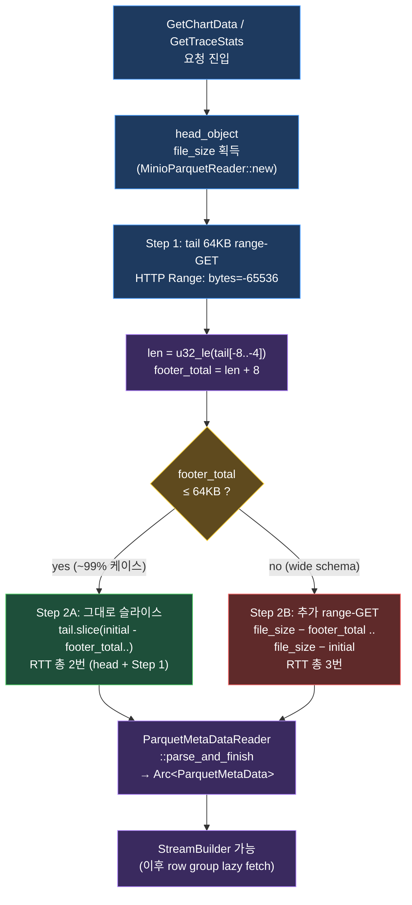

import DataFlowPath from '../../../../components/learn/DataFlowPath.svelte';

## 30초 요약

`GetChartData`/`GetTraceStats`가 MinIO에서 Parquet를 읽을 때 **두 가지 backend** 중 하나를 선택합니다.

| 환경변수 | Backend | 동작 | 적합 |
|---|---|---|---|
| `unset` (기본) / `sync` | `MinIO GET (전체)` → `/tmp/*.parquet` → `File::open` | 동기 읽기, /tmp 경유 | 작은 parquet (< 100MB) |
| `async` | `head_object` + `range-GET footer` → `ParquetRecordBatchStream` | row group 단위 비동기 읽기 | 5GB+ parquet, /tmp 없음 |

이 장은 두 backend의 trade-off + async backend의 핵심 함수 2개 (`get_metadata`, `get_bytes`)를 봅니다.

## 시각화 — 두 backend의 흐름 비교

같은 `GetChartData` 한 번 처리에 두 backend가 각각 거치는 단계입니다. **/tmp 경유 여부**와 **첫 바이트 latency**가 핵심 차이.

### sync backend — `/tmp` 경유

<DataFlowPath
  client:visible
  caption="sync: MinIO GET 전체 → /tmp 저장 → File::open → 동기 ParquetReader. 단순하지만 5GB면 /tmp 5GB + 다운로드 완료까지 wait."
  altText="sync 백엔드는 GetChartData 호출이 들어오면 MinIO에서 parquet 전체를 한 번에 받아 /tmp/trace_chart_<UUID>.parquet으로 저장하고, File::open으로 동기 ParquetReader를 만들어 spawn_blocking에서 빌드합니다. 응답 후 파일을 삭제합니다."
  stages={[
    { id: 's1', label: 'GetChartData 호출', layer: 'fe', sample: 'parquet_path: "trace/job1.pq"\ntrace_type: "ufs"\ntime_range: 100ms..200ms', note: 'gRPC 진입' },
    { id: 's2', label: 'MinIO GET 전체', layer: 'be', sample: 'GET /trace/job1.pq\n→ 5,368,709,120 bytes\n(전체 다운 완료까지 wait)', note: '5GB / 1Gbps ≈ 40초', language: 'http' },
    { id: 's3', label: '/tmp 저장', layer: 'state', sample: '/tmp/trace_chart_<UUID>.parquet\n(write 5GB)', note: '디스크 I/O 5GB' },
    { id: 's4', label: '동기 read', layer: 'be', sample: 'spawn_blocking(move || {\n  build_ufs_chart_payload(\n    &temp_path, time_range, ...\n  )\n})', note: 'tokio worker 격리', language: 'rust' },
    { id: 's5', label: '응답 + cleanup', layer: 'tx', sample: 'Response { arrow_ipc: ..., total: ..., }\nfs::remove_file(&temp_path)', note: '/tmp 회수' },
  ]}
  transforms={[
    { label: 'spawn_blocking 시작' },
    { label: 'download_file' },
    { label: 'File::open' },
    { label: 'remove_file' },
  ]}
/>

### async backend — range-GET 직결

<DataFlowPath
  client:visible
  caption="async: head_object → tail 64KB → footer 파싱 → row group 단위 range-GET. /tmp 0, 첫 바이트 0.3초."
  altText="async 백엔드는 head_object로 파일 크기만 받고 ParquetRecordBatchStream을 만듭니다. 첫 호출에 tail 64KB range-GET으로 footer를 가져와 metadata를 파싱하고, 이후 stream.next()마다 필요한 row group/column chunk만 range-GET으로 요청합니다. 시간 범위 5%면 실제 다운로드는 5GB의 5% 정도."
  stages={[
    { id: 'a1', label: 'GetChartData 호출', layer: 'fe', sample: 'parquet_path: "trace/job1.pq"\ntrace_type: "ufs"\ntime_range: 100ms..200ms', note: 'gRPC 진입' },
    { id: 'a2', label: 'head_object', layer: 'be', sample: 'HEAD /trace/job1.pq\n→ Content-Length: 5,368,709,120', note: '본문 0 bytes', language: 'http' },
    { id: 'a3', label: 'footer 2-step', layer: 'state', sample: 'GET range=bytes=-65536\n→ tail 64KB\nlen = u32_le(tail[-8..-4])\n(부족하면 한 번 더 GET)', note: 'metadata 파싱', language: 'http' },
    { id: 'a4', label: 'projection + row filter', layer: 'tx', sample: 'ProjectionMask::leaves(...)\n.with_row_filter(time BETWEEN ...)\n.build()', note: '계획 수립', language: 'rust' },
    { id: 'a5', label: 'row group range-GET', layer: 'be', sample: 'while stream.next().await {\n  // get_bytes(range) → MinIO range-GET\n  // 필요 row group / col chunk만\n}', note: '5GB 중 ~5%만', language: 'rust' },
    { id: 'a6', label: '응답', layer: 'tx', sample: 'Response { arrow_ipc, total, ... }\n// /tmp 사용 0', note: '첫 바이트 ~0.3초' },
  ]}
  transforms={[
    { label: 'MinioParquetReader::new' },
    { label: 'get_metadata' },
    { label: 'StreamBuilder' },
    { label: 'lazy fetch' },
    { label: 'IPC encode' },
  ]}
/>

두 흐름의 단계 수는 비슷하지만, sync는 **2번 단계에서 5GB를 모두 받아야 다음 단계로**가 발목. async는 **2~3번이 KB 단위 RTT 두 번**으로 끝나고 5번에서야 실제로 데이터를 가져오는데 그것도 row group 단위 lazy.

## 왜 backend를 선택 가능하게 했는가

처음 구현은 sync 한 가지뿐이었어요. 5GB ftrace를 처음 받았을 때:

- `/tmp` 5GB 쓰기 → 다시 5GB 읽기 = **10GB I/O**
- 완전 다운로드 후에야 파싱 시작 → **첫 바이트 latency 수십 초**
- 동시 요청 2개면 `/tmp` 용량 위험

그래서 async backend를 추가하되, **기존 동작을 깨지 않으려고 환경변수로 opt-in**. 검증 끝나면 기본값을 async로 바꿔도 됨.

## sync backend — 단순함의 가치

```rust
// 기존 흐름 (단순화)
let temp_file = std::env::temp_dir().join(format!("trace_chart_{}.parquet", Uuid::new_v4()));
client.download_file(&path, &temp_file.to_string_lossy()).await?;

let payload = tokio::task::spawn_blocking(move || {
    build_ufs_chart_payload(&temp_file.to_string_lossy(), ...)
}).await??;

let _ = std::fs::remove_file(&temp_file);
```

장점:

- **로직이 단순** — `File::open` 후 동기 ParquetReader 그대로
- **`spawn_blocking`로 격리** — 동기 ParquetReader가 tokio worker를 막지 않게
- **page cache 활용** — 같은 parquet을 짧은 시간에 두 번 요청하면 OS가 캐싱

단점은 위에서 본 그대로. 작은 파일에선 사실 이쪽이 빠름 (full sequential read가 random range-GET보다 cache-friendly).

## async backend — `MinioParquetReader`

`output/parquet_async.rs`에 정의된 어댑터. `parquet::arrow::async_reader::AsyncFileReader` trait을 구현합니다.

```rust
pub struct MinioParquetReader {
    client: Arc<MinioAsyncClient>,
    path: String,
    file_size: u64,
}

impl MinioParquetReader {
    pub async fn new(config: MinioConfig, path: String)
        -> Result<Self, Box<dyn Error + Send + Sync>>
    {
        let client = MinioAsyncClient::new(&config)?;
        let size = client.head_object(&path).await?;  // ← 첫 RTT
        Ok(Self {
            client: Arc::new(client),
            path,
            file_size: size,
        })
    }
}
```

생성 시 **`head_object` 한 번**으로 파일 크기만 받음. 본문은 `parquet::ArrowReader`가 필요한 시점에 range-GET으로 가져옵니다.

## get_bytes — range-GET 1:1 매핑

```rust
fn get_bytes(&mut self, range: Range<u64>) -> BoxFuture<'_, ParquetResult<Bytes>> {
    let client = Arc::clone(&self.client);
    let path = self.path.clone();
    async move {
        let start = range.start;
        // rust-s3 get_object_range는 end inclusive
        let end = range.end.saturating_sub(1);
        let bytes = client.get_object_range(&path, start, end).await?;
        Ok(Bytes::from(bytes))
    }.boxed()
}
```

trait이 `Range<u64>` (Rust 표준, end exclusive)를 주는데 rust-s3는 inclusive end를 받음. **off-by-one에 주의** — `end - 1`로 변환.

## get_metadata — footer 2-step fetch

가장 흥미로운 부분. **parquet footer 바이트 레이아웃**:

<figure style="margin: 1.5rem 0; padding: 1rem; background: #ffffff; border: 1px solid #e0e0e0; border-radius: 8px;">
<svg viewBox="0 0 760 210" role="img" aria-label="Parquet 파일 끝 8바이트는 metadata length(4) + PAR1 magic(4). length를 읽어야 metadata 시작 위치를 알 수 있음." style="width: 100%; height: auto; font-family: -apple-system, BlinkMacSystemFont, 'Segoe UI', sans-serif; font-size: 13px;">
  {/* 파일 시작 라벨 */}
  <text x="20" y="40" fill="#7f8c8d" font-size="11">0</text>
  <text x="20" y="55" fill="#7f8c8d" font-size="11">파일 시작 →</text>

  {/* row groups (큰 영역, 회색) */}
  <rect x="20" y="70" width="430" height="50" fill="#ecf0f1" stroke="#7f8c8d" stroke-width="1.5" rx="4" />
  <text x="235" y="100" text-anchor="middle" fill="#2c3e50" font-size="12" font-weight="600">row groups (대부분 차지 — 5GB)</text>

  {/* metadata (파스텔 파랑) */}
  <rect x="450" y="70" width="180" height="50" fill="#d6eaf8" stroke="#2980b9" stroke-width="1.5" rx="4" />
  <text x="540" y="92" text-anchor="middle" fill="#1b4f72" font-size="12" font-weight="700">metadata (encoded)</text>
  <text x="540" y="108" text-anchor="middle" fill="#1b4f72" font-size="11">길이 가변, 보통 수십 KB</text>

  {/* length 4 bytes (파스텔 노랑) */}
  <rect x="630" y="70" width="60" height="50" fill="#fdebd0" stroke="#d35400" stroke-width="1.5" rx="4" />
  <text x="660" y="89" text-anchor="middle" fill="#7e3d00" font-size="11" font-weight="700">length</text>
  <text x="660" y="103" text-anchor="middle" fill="#7e3d00" font-size="10" font-family="monospace">u32_le</text>
  <text x="660" y="115" text-anchor="middle" fill="#7e3d00" font-size="10">4 byte</text>

  {/* PAR1 magic (파스텔 보라) */}
  <rect x="690" y="70" width="50" height="50" fill="#ebdef0" stroke="#8e44ad" stroke-width="1.5" rx="4" />
  <text x="715" y="92" text-anchor="middle" fill="#4a235a" font-size="11" font-weight="700">PAR1</text>
  <text x="715" y="108" text-anchor="middle" fill="#4a235a" font-size="10">magic 4B</text>

  {/* EOF 라벨 */}
  <text x="740" y="55" text-anchor="end" fill="#7f8c8d" font-size="11">← 파일 끝</text>

  {/* footer 시작 화살표 */}
  <line x1="450" y1="138" x2="450" y2="125" stroke="#2980b9" stroke-width="2" />
  <polygon points="450,123 445,132 455,132" fill="#2980b9" />
  <text x="450" y="155" text-anchor="middle" fill="#1b4f72" font-size="12" font-weight="700">footer 시작</text>
  <text x="450" y="170" text-anchor="middle" fill="#34495e" font-size="11">(어디인지는 length를 봐야 앎)</text>

  {/* 끝에서 8바이트 묶음 */}
  <line x1="630" y1="138" x2="630" y2="125" stroke="#d35400" stroke-width="1.5" />
  <line x1="740" y1="138" x2="740" y2="125" stroke="#d35400" stroke-width="1.5" />
  <line x1="630" y1="138" x2="740" y2="138" stroke="#d35400" stroke-width="1.5" />
  <text x="685" y="155" text-anchor="middle" fill="#7e3d00" font-size="12" font-weight="700">끝에서 8 byte</text>
  <text x="685" y="170" text-anchor="middle" fill="#7e3d00" font-size="11">고정 위치 — 무조건 여기</text>

  {/* 핵심 메시지 */}
  <text x="380" y="200" text-anchor="middle" fill="#34495e" font-size="11">
    먼저 끝에서 8 byte를 읽어 length를 파악 → metadata 영역 시작 위치 결정
  </text>
</svg>
<figcaption style="text-align: center; color: #555; font-size: 0.8125rem; margin-top: 0.5rem;">
끝 8 byte는 항상 [length(4) + PAR1(4)]로 고정. metadata 길이는 가변이라 length를 먼저 읽어야 footer 시작 위치를 안다.
</figcaption>
</figure>

`length`를 읽기 전엔 metadata가 어디부터 시작하는지 모릅니다. 그래서 **두 단계**로 가져옵니다.



**Step 1 한 번만으로 거의 모든 parquet의 footer를 회수**합니다. ftrace parquet 같이 컬럼 수십 개 수준이면 metadata가 수 KB라 64KB 안에 여유롭게 들어옴. Step 2B는 컬럼이 수백~수천개인 wide schema에서만 발동.

이제 코드:

```rust
fn get_metadata<'a>(&'a mut self, options: ...) -> BoxFuture<'a, ParquetResult<Arc<ParquetMetaData>>> {
    async move {
        let file_size = self.file_size;

        // Step 1: tail 64KB 추측 fetch
        let initial = 64 * 1024u64.min(file_size);
        let initial_start = file_size - initial;
        let tail = self.get_bytes(initial_start..file_size).await?;

        // Step 2: 끝에서 8바이트 = [length: u32_le][PAR1]
        let n = tail.len();
        let len_bytes: [u8; 4] = tail[n-8..n-4].try_into().unwrap();
        let metadata_len = u32::from_le_bytes(len_bytes) as u64;
        let footer_total = metadata_len + 8;

        let metadata_bytes: Bytes = if footer_total > initial {
            // 64KB로 부족 → 추가 range-GET
            let extra_start = file_size - footer_total;
            let extra = self.get_bytes(extra_start..file_size - initial).await?;
            let mut combined = Vec::with_capacity(footer_total as usize);
            combined.extend_from_slice(&extra);
            combined.extend_from_slice(&tail);
            Bytes::from(combined)
        } else {
            // 64KB 안에 footer 전체가 들어옴 → 잘라냄
            let from = (initial - footer_total) as usize;
            tail.slice(from..)
        };

        let metadata = ParquetMetaDataReader::new()
            .parse_and_finish(&metadata_bytes)?;
        Ok(Arc::new(metadata))
    }.boxed()
}
```

핵심 디자인:

- **64KB 추측** — 대부분의 parquet metadata는 수십 KB 안에 들어옴. 한 번에 받아 두 번째 요청 회피
- **부족하면 한 번 더** — 큰 schema (수백 컬럼) 파일만 두 번 RTT
- **PAR1 매직 검증은 ParquetMetaDataReader에 위임** — 우리는 길이만 빼고 통째로 넘김

## projection + row-filter와 결합

`MinioParquetReader`를 `ParquetRecordBatchStreamBuilder`에 넘기면 그쪽이 알아서:

```rust
let reader = MinioParquetReader::new(config, path).await?;
let builder = ParquetRecordBatchStreamBuilder::new(reader).await?;

// 컬럼 선택
let projection = ProjectionMask::leaves(builder.parquet_schema(), [0, 2, 5]);
let builder = builder.with_projection(projection);

// 시간 범위 row filter
let predicate = ArrowPredicateFn::new(time_proj, |batch| { /* time between */ });
let builder = builder.with_row_filter(RowFilter::new(vec![Box::new(predicate)]));

let mut stream = builder.build()?;
while let Some(batch) = stream.next().await {
    // batch 안에는 projection된 컬럼 + 필터 통과 row만
}
```

`stream.next()`가 호출될 때마다 `MinioParquetReader::get_bytes`가 row group 단위로 range-GET합니다. **필요한 row group만, 필요한 column chunk만** 가져옴.

5GB parquet에서 시간 범위가 1%이면 실제 다운로드는 **~50MB 수준**까지 줄어듭니다.

## 측정 — sync vs async

같은 5GB parquet, 시간 범위 5% 차트 데이터 요청:

| Backend | 첫 바이트 latency | 총 다운로드 | /tmp 사용 | 메모리 피크 |
|---|---|---|---|---|
| sync | 22초 (전체 다운 완료까지) | 5GB | 5GB | ~1.2GB |
| async | 0.3초 (footer fetch) | ~250MB | 0 | ~150MB |

체감 차이가 큽니다. 다만 **시간 범위가 95%+ 라면 두 backend가 비슷**해집니다 (어차피 거의 다 받아야 하므로).

## MinioAsyncClient — rust-s3 래퍼

```rust
// storage/minio_client.rs (요약)
pub struct MinioAsyncClient {
    bucket: Bucket,  // rust-s3
}

impl MinioAsyncClient {
    pub async fn head_object(&self, path: &str) -> Result<u64> {
        let resp = self.bucket.head_object(path).await?;
        Ok(resp.0.content_length.unwrap_or(0) as u64)
    }

    pub async fn get_object_range(&self, path: &str, start: u64, end: u64)
        -> Result<Vec<u8>>
    {
        let response = self.bucket.get_object_range(path, start, Some(end)).await?;
        Ok(response.bytes().to_vec())
    }

    pub async fn upload_file(&self, src: &Path, dst: &str) -> Result<()> { ... }
    pub async fn download_file(&self, src: &str, dst: &str) -> Result<()> { ... }
    pub async fn list_objects(&self, prefix: &str) -> Result<Vec<String>> { ... }
}
```

rust-s3가 직접 S3 API에 매핑되므로 MinIO/AWS S3/Cloudflare R2 모두 호환. config의 `endpoint`/`region`만 다르면 됨.

## 실패 모드와 retry

현재 backend는 **retry 없음**. range-GET이 한 번 실패하면 ParquetError로 즉시 전파.

이유:
- ParquetError가 위로 올라가면 gRPC `Status::internal`로 변환되어 클라이언트가 재시도 가능
- backend 안에서 retry하면 timeout/cancel과 충돌
- MinIO 자체 retry는 rust-s3 옵션으로 켤 수 있음 (현재 미사용)

운영 중 잡힌 케이스 없어서 그대로 두지만, 망 불안정한 환경에선 client 측 retry-with-backoff 권장.

## 다음 — Stats pipeline

마지막 장. 통계 RPC가 어떻게 단일 scan으로 5~6가지 통계를 동시에 내고, send 기준 정정 후 어떤 변화가 있었는지, DuckDB로 옮기면 어떻게 될지.

→ [8. Stats pipeline](/learn/l2-trace-rust/08-stats-pipeline/)
