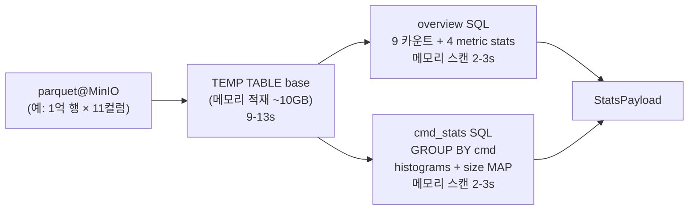

## 30초 요약

`GetTraceStats` 가 같은 응답 (`StatsPayload`) 을 만드는 방식이 **3가지**입니다. 환경변수 `TRACE_STATS_ENGINE` + 빌드 feature 로 골라짐:

| 엔진 | 활성 조건 | 1억 row 응답 | 핵심 |
|---|---|---|---|
| `sync` (default) | 항상 | 1분+ | parquet 전체 다운로드 → 단일 RecordBatch scan |
| `async` | `TRACE_PARQUET_READER=async` | 1분+ | `MinioParquetReader` 의 range-GET + 컬럼 prune |
| `duckdb` | `--features stats-duckdb` 빌드 + `TRACE_STATS_ENGINE=duckdb` | **17s** | DuckDB httpfs 가 MinIO range-GET + SQL 집계 |

세 path 모두 같은 byte-equal 응답을 보장 (`build_payload` 결과 비교 테스트 보유). 운영에선 **duckdb path** 가 default. sync/async 는 회귀 비교 + 폴백용.

이 장은 세 path 의 공통 데이터 흐름과 path 별 trade-off, 그리고 duckdb path 의 1억 row 최적화 결과를 다룹니다. 최적화 여정 자체 (시도하고 포기한 GROUPING SETS, reservoir 등) 는 [9. DuckDB tuning](/learn/l2-trace-rust/09-duckdb-tuning/) 에서.

## 응답 페이로드

세 path 가 모두 만들어내는 `StatsPayload`:

```rust
pub struct StatsPayload {
    pub total_events: u64,
    pub send_count: u64,
    // 트레이스 관측 기간 = max(event_time) - min(event_time).
    // RPC 응답 시간이 아니라 로그가 다룬 시간 범위.
    pub duration_seconds: f64,
    pub continuous_count: u64,
    pub continuous_ratio: f64,
    pub aligned_count: u64,
    pub aligned_ratio: f64,
    pub read_total_bytes: u64,
    pub write_total_bytes: u64,
    pub discard_total_bytes: u64,
    // 4종 latency 의 min/max/avg/stddev/median/p99/p999/p9999/p99999/p999999/count
    pub dtoc: DetailedLatencyStats,
    pub ctod: DetailedLatencyStats,
    pub ctoc: DetailedLatencyStats,
    pub qd: DetailedLatencyStats,
    // cmd 별 같은 stats + count/send/size/continuous
    pub cmd_stats: Vec<CmdStatsEntry>,
    // cmd × {dtoc, ctoc, ctod} × bucket
    pub latency_histograms: Vec<LatencyHistogramEntry>,
    // cmd × size → count
    pub cmd_size_counts: Vec<CmdSizeCountEntry>,
    pub schema_version: &'static str,
}
```

`duration_seconds` 는 **트레이스 데이터의 관측 기간** — 첫 이벤트와 마지막 이벤트 사이 경과 시간(초).
RPC 호출에 걸린 시간 (즉 응답 latency) 과 헷갈리기 쉬운데 **무관**합니다. UI 에선 보통
"관측 기간 X.XXs (이 trace 가 다룬 시간 범위)" 처럼 표시.

응답 자체는 작음 — 수십 KB. 무거운 건 **계산 비용**.

## Path 1: sync — 단순 scan (legacy + fallback)

```
parquet (MinIO 다운로드)
   ↓ filter_existing_columns (구버전 호환)
   ↓ read_projected_parquet (필수 컬럼만 + 시간 row-filter)
   ↓ apply_filters (FilterOptions: latency/QD/CPU)
   ↓ build_chart_batch_<type> (공용 스키마: opcode/io_type → cmd)
   ↓ build_payload — 단일 scan + percentile sort
   ↓ proto 변환
```

`stats_rpc.rs::build_payload_v2` 가 이 단일 scan 의 본체. 1억 row 가 메모리에 RecordBatch 로 올라가면 `for i in 0..n` 한 번에 6갈래 누산:

```rust
for i in 0..n {
    let act = action.value(i);
    if act == request_action      { send_count += 1; }
    if act == target_action       { /* continuous, aligned 누적 */ }
    if act == complete_action     { /* read/write/discard bytes */ }
    /* by_cmd HashMap 인덱싱, dtoc/ctoc/ctod/qd vec push */
}
// percentile 은 별도 패스 — 정렬 필수 (sort_unstable + linear interpolation)
```

장점: 외부 의존성 0, 디버깅 쉬움. 단점: 1억 row 다운로드 + 단일 스레드 정렬 = 1분+. 실제 운영에선 안 씀.

자세한 구현은 [예전 stats RPC 글](https://github.com/kakaromo/trace/blob/main/src/output/stats_rpc.rs) 코드 참고.

## Path 2: async — range-GET + 컬럼 prune

`stats_rpc_async.rs` + `parquet_async::MinioParquetReader`. parquet footer 만 먼저 받아 **필요한 컬럼의 row group offset 만 range-GET**:

```rust
let reader = MinioParquetReader::new(config, parquet_path).await?;
let batch = reader.read_columns_with_filter(&columns, time_range).await?;
// 이후 build_payload_v2 동일
```

- 4GB parquet → 200MB 만 fetch (컬럼 prune + time WHERE 가 row group skip)
- 그래도 응답 합산은 Rust 단일 스레드 → 1분+ 동급
- sync 대비 다운로드 단계만 단축

## Path 3: duckdb — production

`stats_rpc_duckdb.rs`. DuckDB 의 `httpfs` extension 으로 MinIO 를 직접 read:

```sql
-- 1) 정규화된 base view (컬럼 alias + filter pushdown)
CREATE TEMP TABLE base AS
SELECT time, action, opcode AS cmd, lba, size, qd, dtoc, ctoc, ctod, cpu,
       TRY_CAST(continuous AS BOOLEAN) AS continuous
FROM read_parquet('s3://bucket/path/ufs.parquet')
WHERE <filter pushdown>;

-- 2) overview — 단일 SELECT 로 9 카운트 + 4 metric × (min/max/avg/stddev/percentiles/count)
SELECT count(*), count(*) FILTER (WHERE action='send_req'),
       (max(time) - min(time))/1000.0,
       count(*) FILTER (WHERE action='send_req' AND continuous),
       count(*) FILTER (WHERE action='send_req' AND lba % 8 = 0 AND size % 8 = 0 AND size > 0),
       <COALESCE(sum(...) FILTER ...) for read/write/discard bytes>,
       <MetricBuilder("dtoc"), MetricBuilder("ctoc"), MetricBuilder("ctod"), MetricBuilder("qd")>
FROM base;

-- 3) cmd 별 + histograms + size MAP — 단일 SELECT, GROUP BY cmd
SELECT cmd, count(*), count(*) FILTER (WHERE action='send_req'),
       sum(size) FILTER (WHERE action='complete_rsp'),
       count(*) FILTER (WHERE action='send_req' AND continuous),
       count(*) FILTER (WHERE action='send_req'),
       <MetricBuilder dtoc/ctoc/ctod/qd>,
       <count FILTER per (latency, range)>,  -- histograms
       histogram(size) FILTER (WHERE action='complete_rsp')  -- size MAP
FROM base GROUP BY cmd;
```

3 SQL 만으로 응답 완성. 실측 (1억 row, 회사 32 코어 / 150GB RAM):

| 단계 | 시간 |
|---|---|
| pool acquire | 0s |
| base materialize | 9-13s (첫 풀스캔) |
| overview SQL | 2-3s (메모리 스캔) |
| cmd_stats SQL | 2-3s (메모리 스캔) |
| **TOTAL** | **17s** |

`TRACE_STATS_TIMING=1` 로 단계별 측정 가능.

## 시각화 — duckdb path 의 풀스캔 1번 + 메모리 스캔 2번



머티리얼라이즈가 비싼 대신 그 위 두 SQL 이 메모리 위에서만 돈다는 게 핵심. parquet 압축 해제 / S3 range-GET 비용을 한 번만 지불.

## MetricBuilder — percentile LIST form

`duckdb_common::MetricBuilder` 가 metric (dtoc/ctoc/ctod/qd) 별로 11컬럼을 만들어주는 빌더:

```rust
MetricBuilder {
    expr: "dtoc",
    where_clause: "action = 'complete_rsp' AND dtoc > 0",
    percentiles: &[0.5, 0.99, 0.999, 0.9999, 0.99999, 0.999999],
    include_stddev: true,
}.build_columns()
```

생성되는 SQL 컬럼들:

```sql
COALESCE(min(dtoc) FILTER (WHERE action='complete_rsp' AND dtoc > 0), 0)::DOUBLE,
COALESCE(max(...) FILTER (WHERE ...), 0)::DOUBLE,
COALESCE(avg(...) FILTER (WHERE ...), 0)::DOUBLE,
COALESCE(stddev_samp(...) FILTER (WHERE ...), 0)::DOUBLE,
-- percentile 은 LIST form 으로 한 번에 6개 — 정렬 1회
(COALESCE(quantile_disc(dtoc, [0.5, 0.99, 0.999, 0.9999, 0.99999, 0.999999])
   FILTER (WHERE ...), [0,0,0,0,0,0]))[1]::DOUBLE,  -- p50
(...)[2]::DOUBLE,  -- p99
(...)[3]::DOUBLE,  -- p999
(...)[4]::DOUBLE,  -- p9999
(...)[5]::DOUBLE,  -- p99999
(...)[6]::DOUBLE,  -- p999999
count(*) FILTER (WHERE ...)::BIGINT
```

핵심:

- **`quantile_disc` LIST form** — 6 percentile 호출 = 6번 정렬이 아니라, 한 번 정렬 후 인덱싱. 1억 row 기준 정렬 비용 6배 절감
- **`COALESCE` 디폴트** — FILTER 가 매치 0개일 때 NULL 대신 0
- **`reservoir_quantile` 시도했으나 회귀** — 정확도 손실 (p999 1% 미만이지만 회사 측 응답 수치 차이로 거부) → quantile_disc 유지

## DuckDB pool 워밍 — connection 단위 SET

`duckdb_pool.rs::SecretCustomizer` 가 connection 마다 실행:

```sql
LOAD httpfs;
LOAD parquet;
SET enable_object_cache=true;  -- chunk 캐시. 회사 환경에서 Config 무시되는 케이스 → 명시 SET
SET threads=32;                -- num_cpus. Config 누락 케이스 대비
CREATE OR REPLACE SECRET trace_minio (
    TYPE S3,
    KEY_ID '...', SECRET '...',
    ENDPOINT 'minio:9000', REGION 'ap-northeast-2',
    URL_STYLE 'path', USE_SSL false
);
```

`enable_object_cache=true` 가 없으면 같은 row group 을 두 SQL 이 반복 fetch + 압축 해제 → 23s + 20s = 43s. SET 후 17s. 가장 큰 단일 절감.

`autoload`/`autoinstall` 은 OFF — 사내망에서 extensions.duckdb.org 차단 시 매 LOAD 가 timeout hang. `LOAD` 만 명시 (httpfs 는 `~/.duckdb/extensions/` 에 미리 사내 설치).

## TEMP TABLE 머티리얼라이즈 — default ON, OFF 가능

```rust
let materialize = std::env::var("TRACE_STATS_DUCKDB_MATERIALIZE")
    .map(|v| v != "0" && !v.eq_ignore_ascii_case("false"))
    .unwrap_or(true);
let setup_sql = if materialize {
    format!("DROP TABLE IF EXISTS base; CREATE TEMP TABLE base AS {base_sql};")
} else {
    format!("DROP VIEW IF EXISTS base; CREATE TEMP VIEW base AS {base_sql};")
};
```

VIEW 면 매 SQL 이 read_parquet 다시 도는 비용. object_cache 가 chunk 는 캐시하지만 압축 해제는 매번. TABLE 로 메모리 적재하면 두 SQL 모두 메모리 스캔.

비용:
- 메모리 ~10GB (1억 row × 11 컬럼, DuckDB columnar 압축 후)
- 첫 풀스캔 = 머티리얼라이즈 비용 (9-13s)

회사 150GB RAM 에서는 default ON 이 유리. 작은 환경 (8GB 이하 RAM):

```bash
TRACE_STATS_DUCKDB_MATERIALIZE=0 ./target/release/trace --grpc-server
```

## sector_bytes — UFS 4KB, Block 512B

DuckDB SQL 안에서도 같은 매직 넘버:

```rust
let sector_bytes: u64 = if trace_type == "ufs" || trace_type == "ufscustom" { 4096 } else { 512 };
// SQL 안: size::BIGINT * {sector_bytes}
```

새 trace_type 추가 시 반드시 확인.

## continuous/QD send 기준 — parquet 컬럼 그대로

DuckDB path 도 동일 의미 유지:

```sql
-- continuous: parquet 의 continuous 컬럼 그대로 사용 (파서/프로세서가 send 시점에 계산해 저장)
count(*) FILTER (WHERE action='send_req' AND continuous) AS continuous_count

-- QD: send_req 만 집계 (UFS/Block). UFSCUSTOM 은 complete 만 존재하므로 complete 기준.
COALESCE(quantile_disc(qd::DOUBLE, [...]) FILTER (WHERE action='send_req'), [...])
```

옛 parquet (continuous 컬럼 없음) 는 base view 의 `TRY_CAST(continuous AS BOOLEAN)` 가 NULL 반환 → FILTER 매치 안 됨 → continuous_count = 0. 정확도가 필요하면 `--migrate` 로 parquet 재생성.

## sync vs duckdb 응답 검증

`stats_rpc.rs::tests::build_payload_ufs_with_continuous_col` 가 **고정 12행 fixture** 로 `build_payload_v2` 결과의 invariant 를 검증:

```rust
assert_eq!(p.total_events, 12);
assert_eq!(p.send_count, 6);
assert!((p.duration_seconds - 0.011).abs() < 1e-9);
assert_eq!(p.continuous_count, 2);
assert_eq!(p.aligned_count, 3);
assert_eq!(p.read_total_bytes, 16 * 4096);
// ... cmd_stats / histograms / size_counts 모두 expected 값 비교
```

duckdb path 도 같은 응답을 byte-equal 로 내야 함 (회사 환경에서 회귀 비교). reservoir 도입 시도가 거부된 이유.

## 통계 RPC vs 차트 RPC

| 축 | `GetChartData` | `GetTraceStats` |
|---|---|---|
| 응답 형식 | Arrow IPC bytes + 요약 | JSON proto |
| 응답 크기 | 수 MB (decimate 후 ~30K row) | 수십 KB |
| 풀스캔 횟수 | 머티리얼라이즈 1 + overview 1 + decimate 1 = 3 | 머티리얼라이즈 1 + overview 1 + cmd_stats 1 = 3 |
| 1억 row (duckdb) | ~30s | ~17s |
| 호출 빈도 | 사용자 인터랙션마다 (zoom, pan) | 페이지 진입 시 1회 |
| 캐싱 | L5 cache (key: parquet fingerprint) | L5 cache 동일 |

L5 cache (`output::cache::TraceCacheBundle`) 가 같은 parquet 의 같은 요청을 메모리 hit. moka 기반 size-aware LRU + TTL + single-flight (동시 요청 dedup).

## 다음 — 최적화 회고

[9. DuckDB tuning](/learn/l2-trace-rust/09-duckdb-tuning/) 에서 1분+ → 17s 까지의 단계와 시도하고 포기한 카드들을 기록합니다.
