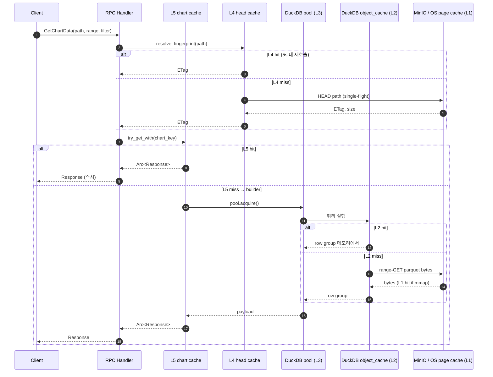
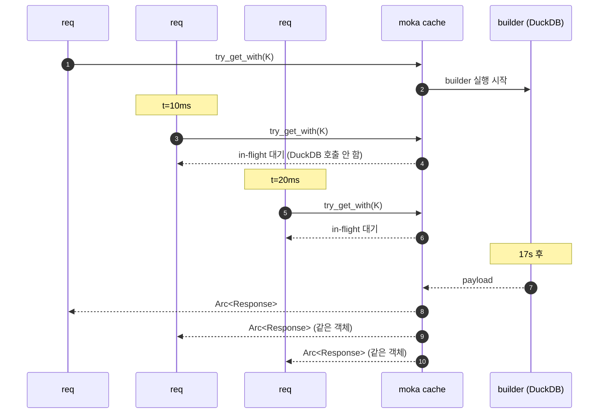

## 30초 요약

trace 서버 한 번의 RPC 응답에 캐시 5개가 협력합니다.

| 레이어 | 위치 | 보관 단위 | 크기/한도 | TTL/TTI | 코드 |
|---|---|---|---|---|---|
| **L1** | OS page cache | mmap 페이지 | 커널 관리 | — | `parsers/log_high_perf.rs:136` |
| **L2** | DuckDB object_cache | parquet metadata + row group | DuckDB 메모리 한도 | — | `output/duckdb_pool.rs:104,161` |
| **L3** | r2d2 pool | DuckDB connection | `POOL_SIZE` (default 4) | — | `output/duckdb_pool.rs` |
| **L4** | moka head | HEAD object info | 4096 entries | TTL 5s | `output/cache.rs:84-87` |
| **L5 chart** | moka chart response | `GetChartDataResponse` | weight 합 2GB | TTI 4h | `output/cache.rs:63-71` |
| **L5 stats** | moka stats response | `GetTraceStatsResponse` | weight 합 1GB | TTI 4h | `output/cache.rs:72-83` |

핵심 효과:
- **L2** 가 stats RPC 23s → 17s 의 단일 최대 개선
- **L5** 가 cold 17s → 두 번째 호출 0ms (운영 hit 률 가장 높음)
- **single-flight** (`try_get_with`) 가 동시 N 요청을 1회 실행으로 collapse → 17s × 5명 동시 = 85s → 17s

L1~L3 는 기반 설비라 짧게, L4/L5 는 직접 설계한 부분이라 깊게 봅니다.

## 5계층이 한 요청 안에서 어떻게 협력하나

GetChartData RPC 한 번의 시퀀스 — 모든 레이어가 hit 인 hot path 와 모두 miss 인 cold path 를 같이.



같은 키로 들어오는 동시 요청은 L4·L5 둘 다 single-flight 로 1번만 실행됨 (3.4 절에서 자세히).

## L5 — 응답 캐시 (가장 큰 효과)

### 왜 L5 가 hit 률이 가장 높나

세 가지 사용 패턴이 겹침:
- portal 다중 사용자가 같은 화면을 시간차로 봄
- 한 사용자가 시간 범위 슬라이더를 같은 영역에 머물게 함
- 같은 차트의 여러 메트릭을 잇따라 조회

1억 row stats 17s → 두 번째 호출부터 0ms. 운영 ROI 가 가장 큰 캐시.

### 키 직렬화 — 왜 serde 안 쓰는가

`ChartKey` 의 바이트 레이아웃:

```
┌──────┬──────────┬─────────────────────────┬──────────────┬──────────────┬──────────┬────────┐
│ 'C'  │ SCHEMA_V │ BaseId                  │ time_range   │ target_pts   │ filter   │ actions│
│ 1B   │ 1B       │ endpoint+bucket+path+   │ 0 or 17B     │ 4B           │ 가변     │ 가변   │
│      │          │ fingerprint+trace_type+ │              │              │          │        │
│      │          │ schema_version          │              │              │          │        │
└──────┴──────────┴─────────────────────────┴──────────────┴──────────────┴──────────┴────────┘
```

`StatsKey` 는 첫 바이트만 `'S'` 로 다르고, 끝이 `actions` 대신 `latency_ranges_ms`. C/S prefix 로 두 도메인이 절대 충돌하지 않음 (`stats_and_chart_keys_disjoint` 테스트 보장).

명시 push 함수만 쓰는 이유 (`output/cache.rs:113-198`):
- `serde_json` 같은 외부 직렬화는 **새 필드 추가 시 조용히 깨짐** — 직렬화가 자동이라 빠뜨려도 컴파일 OK
- `push_str / push_u64 / push_f64_canonical` 명시 push 는 누락이 git diff 에 즉시 보임
- 새 `FilterOptions` 필드 추가 시 반드시 `push_filter` (`output/cache.rs:153-181`) 도 갱신해야 함 — **한 번 잊으면 같은 의미의 두 요청이 다른 키를 가지게 돼서 캐시 hit 률이 떨어짐**

직렬화 정규화 3가지:
- `push_f64_canonical` — `NaN → 0.0` 정규화. "필터 비활성" 과 "NaN 필터" 가 같은 키
- `cpu_list` — `sort_unstable + dedup` 후 직렬화. 사용자가 `[3,1,2]` 보내든 `[1,2,3]` 보내든 같은 키 (`key_stable_across_cpu_list_order` 테스트)
- `actions / latency_ranges_ms` — 정렬 후 직렬화

### 자동 무효화 — fingerprint(ETag) 가 키 안에 박혀 있다

`BaseId.fingerprint` 가 MinIO HEAD 의 ETag/Last-Modified 를 담음. parquet 가 갱신되면:

1. MinIO HEAD 가 새 ETag 발급
2. L4 head 캐시가 5초 TTL 로 만료된 후 재조회
3. 새 ETag → 새 fingerprint → 새 캐시 키
4. 이전 entry 와 키 다름 → 자동 miss → 재계산

**수동 invalidate API 가 없는 이유**가 이거. fingerprint 가 알아서 처리.

L4 head 가 5초 TTL 인 이유: 너무 길면 무효화 지연, 너무 짧으면 슬라이더 드래그 시 HEAD 폭주. 5초가 균형점.

### Single-flight — `try_get_with`

문제: 같은 키로 N 요청 동시 도착 시, naïve `get + insert` 는 N번 DuckDB 실행.

해결: moka `try_get_with` 가 in-flight Future 를 공유.



운영 효과: **17s × 5명 동시 = 85s 누적 부하 → 17s 1회**.

회귀 테스트 (`output/cache.rs:343-378`): 32개 spawn → 빌더 호출 카운트 == 1.

```rust
let cache: Cache<String, Arc<u64>> = Cache::builder().max_capacity(64).build();
let calls = Arc::new(AtomicUsize::new(0));
let mut handles = Vec::new();
for _ in 0..32 {
    let cache = cache.clone();
    let calls = calls.clone();
    handles.push(tokio::spawn(async move {
        cache.try_get_with::<_, String>("k".to_string(), async move {
            calls.fetch_add(1, Ordering::SeqCst);
            sleep(Duration::from_millis(50)).await;
            Ok(Arc::new(42_u64))
        }).await.unwrap()
    }));
}
// ...
assert_eq!(calls.load(Ordering::SeqCst), 1);
```

에러 처리: `try_get_with` 는 `Err` 시 entry 미삽입 → 다음 호출이 정상 재시도. 부분 실패가 캐시에 박히지 않음.

### Weight 기반 size LRU (W-TinyLFU)

`max_capacity` 가 entry **개수**가 아니라 **weight 합계**. weigher 함수가 entry 마다 weight 산정:

```rust
// chart — Arrow IPC 가 응답의 가장 큰 비중
.weigher(|_k, v: &ChartEntry| -> u32 {
    v.response.arrow_ipc.len() as u32 + 4 * 1024
})
.max_capacity(2 * 1024 * 1024 * 1024) // 2GB

// stats — cmd_stats / histograms / size_counts 합으로 추정
.weigher(|_k, v: &StatsEntry| -> u32 {
    4 * 1024
        + (v.response.cmd_stats.len() as u32) * 256
        + (v.response.latency_histograms.len() as u32) * 256
        + (v.response.cmd_size_counts.len() as u32) * 64
})
.max_capacity(1024 * 1024 * 1024) // 1GB
```

큰 entry 와 작은 entry 가 같은 풀에서 공정하게 evict — 50MB Arrow IPC 1개 = 50KB 응답 1000개 의 자리.

evict 정책은 단순 LRU 가 아니라 **W-TinyLFU** (Caffeine Java 알고리즘의 Rust 포팅). "최근 1회 본 키" 가 "오래 자주 본 키" 를 밀어내는 LRU 의 약점을 보완. trace 처럼 portal 여러 사용자가 같은 핫 키를 반복 조회하는 패턴에 잘 맞음.

## L4 — head metadata

5초 TTL, max 4096 entries. 슬라이더 드래그 시 HEAD 폭주 방지가 단일 목적. Single-flight 도 동일하게 적용 — `resolve_fingerprint` (`grpc/server.rs:88-116`) 가 `try_get_with` 패턴.

```rust
let entry_result = self.caches.head.try_get_with(head_key, async move {
    let client = MinioAsyncClient::new(&cfg).map_err(|e| format!("minio client: {e}"))?;
    let info = client.head_object_full(&path_owned).await
        .map_err(|e| format!("head_object: {e}"))?;
    Ok::<_, String>(cache::HeadEntry { info })
}).await;
match entry_result {
    Ok(entry) => entry.info.fingerprint(),
    Err(_) => "fingerprint:unknown".to_string(),  // 안전한 디그레이드
}
```

실패 시 `fingerprint:unknown` fallback → 캐시 키가 비결정적이 되며 사실상 캐시 비활성화. MinIO 일시 장애에도 RPC 가 죽지 않고 그냥 캐시 효과만 사라짐.

## L1~L3 — 기반 설비

### L1 — OS page cache (mmap)

`memmap2::MmapOptions::new().map(&file)` (`parsers/log_high_perf.rs:136`). rayon 청크 병렬 파싱이 같은 mmap 공유 → 페이지 재사용.

코드가 직접 제어하는 게 아니라 OS 가 알아서 함. 같은 로그 파일을 두 번째 파싱하면 디스크 I/O 없이 page cache 에서 끝.

### L2 — DuckDB object_cache

parquet footer + metadata + row group 캐시. **stats RPC 23s → 17s 의 핵심**.

같은 parquet 을 여러 SQL (overview / cmd_stats / histograms) 이 반복 fetch 시 S3 range-GET + 압축 해제 회피. 활성화는 두 군데에서:

```rust
// output/duckdb_pool.rs:99-105 — Config 단계
let config = Config::default()
    .threads(threads)?
    .max_memory(&memory_limit)?
    .enable_object_cache(true)?
    // ...

// output/duckdb_pool.rs:158-163 — connection 단계 (SecretCustomizer)
conn.execute_batch(&format!(
    "LOAD httpfs; LOAD parquet; \
     SET enable_object_cache=true; \
     SET threads={threads}; \
     ..."
))?;
```

per-connection `SET` 은 회사 환경에서 `Config::enable_object_cache(true)` 가 안 박히는 케이스 대비 명시. 둘 중 하나만 빠져도 23s → 43s 회귀 (실제 사례 — `09. DuckDB tuning` 참고).

### L3 — r2d2 connection pool

`POOL_SIZE` (default 4) 동안 connection 재사용. SecretCustomizer 가 매 acquire 시:
- `LOAD httpfs; LOAD parquet;` (extension 로드)
- `SET enable_object_cache=true; SET threads=N;` (per-connection 설정)
- `CREATE OR REPLACE SECRET trace_minio (...)` (S3 인증)

환경변수로 풀 튜닝:

| 변수 | 기본값 | 의미 |
|---|---|---|
| `TRACE_STATS_DUCKDB_POOL_SIZE` | 4 | r2d2 max_size — 동시 RPC 처리 가능 수 |
| `TRACE_STATS_DUCKDB_THREADS` | num_cpus | DuckDB 내부 병렬도 |
| `TRACE_STATS_DUCKDB_MEMORY` | "4GB" | DuckDB max_memory |
| `TRACE_STATS_DUCKDB_TEMP` | std::env::temp_dir() | spill-to-disk 디렉토리 |

## 운영 가이드

### hit/miss 어떻게 보나

| 레이어 | 로깅 | 비고 |
|---|---|---|
| L5 | `[GetChartData] cache=miss → build` / `[GetTraceStats] cache=miss → build` | hit 시 무로깅 (try_get_with 가 클로저 자체 스킵) |
| L4 | 무로깅 | 디버깅 필요 시 임시 println |
| L2 | DuckDB PRAGMA | `PRAGMA database_size` 등 |

L5 hit 까지 측정하고 싶으면 핸들러 본체에서 `try_get_with` 직전에 `cache.contains_key(&key)` 로 체크해 로그 — 단 race 가능 (정확한 카운터는 `EvictionListener` + AtomicU64 가 더 정확).

### 캐시가 안 박히는 듯 보일 때 체크리스트

1. **fingerprint 가 매번 바뀌는가?** — MinIO 가 ETag 발급 안 하는 케이스 (driver 설정). HEAD 응답에 `ETag` 또는 `Last-Modified` 가 있어야 함
2. **filter/time_range 의 NaN 처리?** — `push_f64_canonical` 가 NaN→0.0 정규화. 호출자가 NaN 을 의도적으로 보내면 정상 동작 (0과 같은 키)
3. **cpu_list 순서?** — 정렬 후 직렬화돼서 영향 없어야 함. 그래도 의심되면 `key_stable_across_cpu_list_order` 테스트로 회귀 확인
4. **moka 0.12 미만?** — `try_get_with` 시그니처가 다름. `Cargo.toml:45` 확인
5. **새 `FilterOptions` 필드?** — `push_filter` 에 추가했는지 확인. 안 했으면 그 필드 변경이 키에 안 반영돼 의도치 않은 hit/miss

### 메모리 산정

대략적인 운영 메모리 하한:

```
L5 chart 2GB  (max_capacity)
+ L5 stats 1GB
+ L4 head 무시할만 (4096 × ~수백B)
+ DuckDB 4GB (TRACE_STATS_DUCKDB_MEMORY default)
+ 프로세스 자체 ~200MB
= ~7GB minimum
```

portal 동시 사용자 N 명, 평균 응답 크기 R, hit 률 H 일 때 일시적 추가 메모리 ≈ `(1-H) × N × R` (in-flight builder 들이 동시에 생성 중인 응답).

## 향후 개선 / 한계

현재 부재한 4가지와 도입 트리거:

| 부재 기능 | 도입 트리거 | 난이도 / 접근 |
|---|---|---|
| **hit/miss 메트릭 노출** | portal 측 캐시 효과를 정량 모니터링 필요 시 | 낮음 — moka `EvictionListener` + `AtomicU64` 카운터 + Prometheus endpoint |
| **수동 invalidate API** | "특정 path 즉시 비우기" 운영 요구 시 | 낮음 — `caches.chart.invalidate_entries_if(...)` 한 줄. 현재는 fingerprint 자연 무효화로 충분 |
| **디스크 영속화** | 서버 재시작이 잦고 cold 시간이 운영 비용일 때 | 중간 — moka 자체엔 없음. sled/sqlite 외부 직렬화 + 부팅 시 워밍업 |
| **분산/멀티 노드** | trace 서버를 N 대로 수평 확장할 때 | 높음 — Redis/memcached 로 캐시 외부화. 단, 현재 단일 노드 설계라 우선순위 낮음 |

지금 도입하지 않은 이유:
- 메트릭/invalidate 는 **요구가 안 들어옴** — 운영 중에 "캐시 효과를 모르겠다" 라는 피드백이 나오는 시점에 추가
- 영속화 는 trace 서버 재시작이 드물고, 재시작 후 첫 호출만 cold 면 portal 사용자가 17s 만 기다리면 됨
- 분산 은 trace 가 의도적으로 단일 바이너리·단일 프로세스 설계 (이전 챕터 참고). 멀티 노드로 가야 하는 시점이 오면 캐시 뿐 아니라 전체 아키텍처 재설계가 더 클 것

## 모듈 끝

이걸로 trace 의 캐시 시스템 전반을 다뤘습니다. 1억 row 1분+ → 17s → 0ms (hit) 의 여정 중 마지막 0ms 가 L5 의 몫. portal 에서 같은 화면을 여러 사용자가 본다면 hit 률이 가장 높아 ROI 가 가장 큽니다.

새 trace_type 을 추가하거나 새 필터를 도입할 때는 키 빌더 (`output/cache.rs`) 갱신을 잊지 않도록 — 그 외엔 캐시는 알아서 동작합니다.
