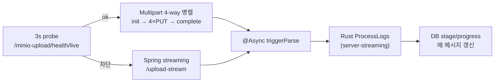

import CodeTour from '../../../../components/learn/CodeTour.svelte';
import uploadRaw from '../../../../snippets/TraceJobService-uploadAndParse.java?raw';
import triggerRaw from '../../../../snippets/TraceJobService-triggerParse.java?raw';

## 30초 요약

업로드는 환경에 따라 두 경로 중 하나로 흐릅니다 — 클라이언트가 자동 선택.

핵심 원칙은 두 경로 공통:

1. **DB INSERT 를 MinIO PUT 보다 먼저** — `jobId` 를 선발급해야 MinIO object key 에 id 를 박을 수 있음
2. **MinIO PUT 후 `triggerParse(jobId)` 호출** — 메서드가 `@Async` 라 즉시 리턴, 실제 gRPC 스트림은 백그라운드
3. **Rust `ProcessLogs` 는 server-streaming** — Java 쪽은 `Iterator<ProcessLogsProgress>` 로 받아 매 메시지마다 `stage` + `progress` 를 DB 에 반영

그 결과 **upload API 응답 지연은 파일 저장 시간까지만** 이고, 프론트는 `GET /api/trace/jobs/{id}` 를 2 초 polling 해 "어느 단계 N%" 를 본다.

multipart 경로는 Spring JVM 을 우회해 nginx → MinIO 로 직접 흐르므로 **GB 급 파일에서 3-5배 빠름**. 차단 환경에서는 streaming 으로 자동 폴백되어 끝까지 동작.

## 왜 DB INSERT 가 먼저인가

"파일을 먼저 저장하고 DB 는 나중" 이 더 직관적이지만, MOVE 는 반대입니다.

- jobId 가 있어야 **MinIO 경로에 id 를 박아 고유성 보장** 가능 (`{user}/{date}/{jobId}/{filename}`)
- 실패 복구 시점에서도 **DB row 가 단일 source of truth** — parquet row 가 없어도 jobs 로는 "업로드 시도" 이력이 남음
- upload 가 크래시돼도 `UPLOADED` 상태 job 이 DB 에 남아 있어 수동 `/reparse` 로 재진입 가능

같은 이유로 `uploadPath` / `parquetPrefix` 는 처음엔 `"placeholder"` 로 INSERT 하고, `jobId` 를 받은 뒤 채워서 한 번 더 save 합니다.

## 왜 `@Async` 인가

gRPC `ProcessLogs` 는 **server-streaming** — Rust 가 매 단계마다 `stage` + `progress_percent` 를 push 합니다. 이를 동기로 기다리면:

- upload API 응답이 **파싱 완료까지** 지연 (수 GB 파일이면 수십 초~수 분)
- HTTP 클라이언트 timeout 에 걸림
- JVM 스레드가 gRPC I/O 에 오래 blocked

`@Async` 를 붙이면 Spring 이 별도 executor 스레드에 밀어넣어 업로드 API 는 곧바로 반환, 스트림 구독은 백그라운드에서 돕니다. 단, **Portal 이 재시작되면 `PARSING` 상태 job 이 남는** 단점이 있어 복구는 수동 `/reparse` 엔드포인트로 처리합니다 (`TraceJobService.reparse`).

## 코드 투어 — `uploadAndParse`

<CodeTour
  client:visible
  language="java"
  source="TraceJobService.java#uploadAndParse"
  height={620}
  code={uploadRaw}
  steps={[
    {
      id: 'pre-insert',
      title: 'DB INSERT 를 선행',
      lines: [11, 26],
      body: '
MinIO PUT 보다 먼저 INSERT. <code>uploadPath</code>/<code>parquetPrefix</code> 는 <code>"placeholder"</code> 로 두고, jobId 를 받은 뒤 채워서 save 한다. 이유는 MinIO object key 에 <strong>jobId 를 박기 위함</strong>.
',
    },
    {
      id: 'patch-paths',
      title: 'jobId 기반 경로 재계산',
      lines: [28, 34],
      body: '
<code>{user}/{date}/{jobId}/{filename}</code>. 같은 파일명이 여러 번 올라와도 jobId 가 달라 충돌 없음. <code>parquetPrefix</code> 는 bucket 내 디렉터리 역할.
',
    },
    {
      id: 'minio-put',
      title: 'MinIO 원본 업로드',
      lines: [36, 41],
      body: '
bucket 이 없으면 자동 생성. 파싱에 실패해도 원본은 남아있어야 <code>/reparse</code> 로 재시도 가능.
',
    },
    {
      id: 'async-trigger',
      title: '@Async triggerParse(jobId)',
      lines: [42, 44],
      body: '
이 호출은 <strong>동기로 보이지만 실제로는 즉시 반환</strong> — Spring 이 <code>@Async</code> 메서드를 다른 thread 로 디스패치. upload API 는 응답을 이미 돌려준 뒤 파싱이 진행됨.
',
    },
  ]}
/>

## 코드 투어 — `triggerParse`

<CodeTour
  client:visible
  language="java"
  source="TraceJobService.java#triggerParse"
  height={680}
  code={triggerRaw}
  steps={[
    {
      id: 'load-and-parsing',
      title: 'status=PARSING 진입',
      lines: [5, 13],
      body: '
다른 요청이 중간에 이 job 을 보면 PARSING 이어야 "진행 중" 으로 표시. 실패 복구 시에도 초기 상태 전환이 명시적이라 race 가 줄어든다.
',
    },
    {
      id: 'grpc-request',
      title: 'ProcessLogsRequest 조립',
      lines: [14, 21],
      body: '
<code>setLogType("auto")</code> — Rust 가 파일 내용 sniff 로 UFS/Block/UFSCUSTOM 을 결정. 업로드 시점에 타입을 요구하지 않아 UI 가 단순.
',
    },
    {
      id: 'stream-loop',
      title: 'Iterator 로 server-streaming 수신',
      lines: [22, 36],
      body: '
Rust 가 <strong>단계마다 push</strong> 하는 <code>ProcessLogsProgress</code> 를 하나씩 꺼내 <code>stage</code>/<code>progress</code> 를 DB 에 반영. 매 메시지 <code>save</code> 라 트래픽은 있지만, 프론트의 2 초 polling 이 실시간처럼 보이는 이유가 이것.
',
    },
    {
      id: 'terminal',
      title: '최종 메시지 = 완료 판정',
      lines: [38, 46],
      body: '
스트림이 끝났을 때 <code>last</code> 를 기준으로 성공/실패 분기. 중간 메시지가 실패를 담았더라도 최종만 보면 OK.
',
    },
    {
      id: 'output-files',
      title: 'output_files[] → TraceParquet upsert',
      lines: [48, 61],
      body: '
<code>(jobId, traceType)</code> 유니크 → 재파싱 시에도 row 는 그대로 두고 경로만 갱신. <code>detectTraceType</code> 은 파일명 꼬리 (<code>*ufs.parquet</code> 등) 를 본다.
',
    },
    {
      id: 'finalize',
      title: 'PARSED + currentStage=COMPLETED',
      lines: [63, 71],
      body: '
프론트는 이 순간 polling 을 중단할 수 있다. 이후 사용자가 차트 탭을 누르면 별도 RPC (GetChartData) 가 나감.
',
    },
  ]}
/>

## 동시성 모델

- `@Async` 는 **Spring default TaskExecutor** 사용 (설정하지 않으면 `SimpleAsyncTaskExecutor`). 동시 업로드가 많으면 전용 pool 권장
- 한 jobId 에 대해 `triggerParse` 가 중복 호출되지 않게, `reparse` 는 `status != PARSING` 을 검사하고 실패 시 `IllegalStateException`
- Portal 재시작 시 `PARSING` 상태로 남은 job 은 **자동 복구되지 않는다** — 운영자가 `/reparse` 를 수동 호출하는 설계 (stream 재연결 로직을 만들 바에 원본을 그대로 두고 다시 시작하는 쪽이 간단)
- Multipart 업로드 도중 사용자 cancel / 첫 PUT 실패 → `/upload/abort` 가 호출되어 S3 multipart abort + Job 삭제. 실패 시에도 streaming fallback 으로 자동 재시도되므로 사용자 입장에선 끊김 없음
- `reparse` / `delete` 는 **owner 또는 admin** 만 실행 가능 (Job 자체는 전체 공개)

## 직접 해보기

- [ ] 업로드 직후 `SELECT id, status, progressPercent, currentStage FROM portal_trace_jobs` 를 수 초 간격으로 조회해 stage 변화 확인
- [ ] Portal 로그에서 `triggerParse` 가 upload 응답 이후 다른 스레드에서 도는지 스레드 ID 로 확인
- [ ] `/api/trace/jobs/{id}/reparse` 호출 → 같은 원본으로 재파싱 (parquet 덮어쓰기)
- [ ] Rust 서비스를 일부러 죽이고 재시작 → DB 에 `FAILED` 로 찍히는지

다음: [2. parquet 스키마 3종 + 공용 10컬럼 정규화](/learn/l2-trace/02-parquet-schema/) →
