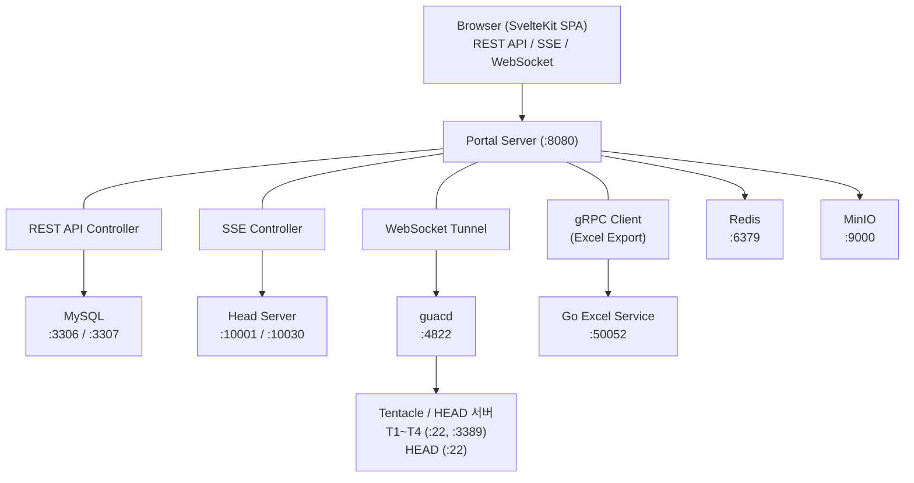

Samsung Portal의 인프라 구성을 설명합니다.

## 서버 구성

| 서버 | 역할 | 포트 | 비고 |
|------|------|------|------|
| **Portal Server** | Spring Boot 웹 애플리케이션 | 8080 | REST API, SSE, WebSocket |
| **MySQL (testdb)** | 호환성/성능 테스트 데이터 | 3306 | testdb, UFSInfo 스키마 |
| **MySQL (portal)** | Portal 도구/사용자 데이터 | 3307 | binmapper 스키마 |
| **Redis** | 캐시 | 6379 | JDK Serialization |
| **Head Server** | 하드웨어 테스트 제어 | 10001, 10030 | TCP 듀얼 소켓 |
| **guacd** | Guacamole 원격 접속 데몬 | 4822 | SSH/RDP 프로토콜 변환 |
| **MinIO** | S3 호환 오브젝트 스토리지 | 9000 | 파일 관리 |
| **Go Excel Service** | Excel 차트 생성 | 50052 | gRPC 서버 |
| **Tentacle T1** | 테스트 디바이스 서버 | SSH 22, RDP 3389 | 디바이스 연결 |
| **Tentacle T2** | 테스트 디바이스 서버 | SSH 22, RDP 3389 | 디바이스 연결 |
| **Tentacle T3** | 테스트 디바이스 서버 | SSH 22, RDP 3389 | 디바이스 연결 |
| **Tentacle T4** | 테스트 디바이스 서버 | SSH 22, RDP 3389 | 디바이스 연결 |
| **HEAD** | Head 서버 (SSH 접속용) | SSH 22 | 로그 조회, 원격 접속 |

---

## 네트워크 다이어그램



---

## 포트 정리

### Portal Server

| 포트 | 프로토콜 | 용도 |
|------|----------|------|
| 8080 | HTTP | REST API, SSE, WebSocket, 정적 파일 서빙 |

### 데이터베이스

| 포트 | 프로토콜 | 용도 |
|------|----------|------|
| 3306 | MySQL | testdb (호환성/성능 테스트), UFSInfo (참조 데이터) |
| 3307 | MySQL | binmapper (Portal 도구), portal_users, tc_groups |
| 6379 | Redis | 엔티티 캐시 (TTL: TestDB 10분, UFSInfo 1시간) |

### Head TCP

| 포트 | 프로토콜 | 용도 |
|------|----------|------|
| 10001 | TCP | Compatibility Head 명령 전송 (outSocket) |
| 10002 | TCP | Compatibility Head 상태 수신 (inSocket) |
| 10030 | TCP | Performance Head 명령 전송 (outSocket) |
| 10032 | TCP | Performance Head 상태 수신 (inSocket) |

포트 계산: `10000 + portSuffix` (DB `portal_head_connections` 테이블에서 관리)

### 외부 서비스

| 포트 | 프로토콜 | 용도 |
|------|----------|------|
| 4822 | TCP | guacd (Guacamole 데몬) |
| 9000 | HTTP | MinIO S3 API |
| 50052 | gRPC | Go Excel Service |

### Tentacle / HEAD 서버

| 포트 | 프로토콜 | 용도 |
|------|----------|------|
| 22 | SSH | 로그 브라우저, 원격 접속 |
| 3389 | RDP | 원격 데스크톱 접속 |

---

## Nginx 리버스 프록시

외부에서 `http://move.samsungds.net` (포트 없이) 접속 시 Spring Boot(:8080)로 프록시합니다. WebSocket, SSE 모두 지원.

### 설정 파일

`/etc/nginx/sites-available/portal.conf`:

```nginx
server {
    listen 80;
    server_name move.samsungds.net;

    # 요청 크기 제한 해제 (파일 업로드 대응)
    client_max_body_size 0;

    # 프록시 타임아웃 (SSE/장시간 연결 대응)
    proxy_read_timeout 300s;
    proxy_send_timeout 300s;
    proxy_connect_timeout 10s;

    # WebSocket 엔드포인트 (Guacamole, SSH Terminal, Agent Screen)
    location ~ ^/api/(guacamole/tunnel|guacamole/ws|terminal/ssh|agent/screen/) {
        proxy_pass http://127.0.0.1:8080;
        proxy_http_version 1.1;
        proxy_set_header Upgrade $http_upgrade;
        proxy_set_header Connection "upgrade";
        proxy_set_header Host $host;
        proxy_set_header X-Real-IP $remote_addr;
        proxy_set_header X-Forwarded-For $proxy_add_x_forwarded_for;
        proxy_set_header X-Forwarded-Proto $scheme;
        proxy_read_timeout 3600s;
    }

    # SSE 엔드포인트 (Head slots stream, Pre-Command execute 등)
    location ~ ^/api/.*/stream {
        proxy_pass http://127.0.0.1:8080;
        proxy_http_version 1.1;
        proxy_set_header Host $host;
        proxy_set_header X-Real-IP $remote_addr;
        proxy_set_header X-Forwarded-For $proxy_add_x_forwarded_for;
        proxy_set_header X-Forwarded-Proto $scheme;
        proxy_buffering off;
        proxy_cache off;
        proxy_read_timeout 300s;
    }

    # 나머지 전체 (REST API + 정적 파일)
    location / {
        proxy_pass http://127.0.0.1:8080;
        proxy_set_header Host $host;
        proxy_set_header X-Real-IP $remote_addr;
        proxy_set_header X-Forwarded-For $proxy_add_x_forwarded_for;
        proxy_set_header X-Forwarded-Proto $scheme;
    }
}
```

### 적용 방법

```bash
# 1. 설정 파일 복사 + 심볼릭 링크
sudo cp portal.conf /etc/nginx/sites-available/portal.conf
sudo ln -sf /etc/nginx/sites-available/portal.conf /etc/nginx/sites-enabled/portal.conf

# 2. 기본 설정 비활성화 (충돌 방지)
sudo rm -f /etc/nginx/sites-enabled/default

# 3. 문법 확인
sudo nginx -t

# 4. 적용
sudo systemctl reload nginx
```

### 프록시 경로 요약

| 경로 패턴 | 프록시 대상 | 특수 처리 |
|-----------|-------------|-----------|
| `/api/guacamole/tunnel` | `:8080` | WebSocket Upgrade |
| `/api/guacamole/ws` | `:8080` | WebSocket Upgrade |
| `/api/terminal/ssh` | `:8080` | WebSocket Upgrade |
| `/api/agent/screen/*` | `:8080` | WebSocket Upgrade |
| `/api/*/stream` | `:8080` | SSE (buffering off) |
| `/*` (나머지) | `:8080` | 일반 HTTP |

### 주요 설정 설명

| 설정 | 값 | 이유 |
|------|-----|------|
| `client_max_body_size 0` | 무제한 | 파일 업로드 (MinIO, FW 바이너리) |
| `proxy_read_timeout 3600s` | 1시간 | WebSocket 장시간 연결 유지 |
| `proxy_buffering off` | SSE 경로 | SSE 이벤트 즉시 전달 |
| `Upgrade / Connection` | WebSocket 경로 | HTTP → WebSocket 프로토콜 전환 |

### 확인

```bash
# Nginx 상태 확인
sudo systemctl status nginx

# WebSocket 연결 테스트
curl -i -N \
  -H "Connection: Upgrade" \
  -H "Upgrade: websocket" \
  -H "Sec-WebSocket-Version: 13" \
  -H "Sec-WebSocket-Key: test" \
  http://move.samsungds.net/api/guacamole/tunnel

# 일반 API 테스트
curl http://move.samsungds.net/api/pre-commands
```

:::tip
Nginx 로그 확인: `sudo tail -f /var/log/nginx/error.log /var/log/nginx/access.log`
:::
