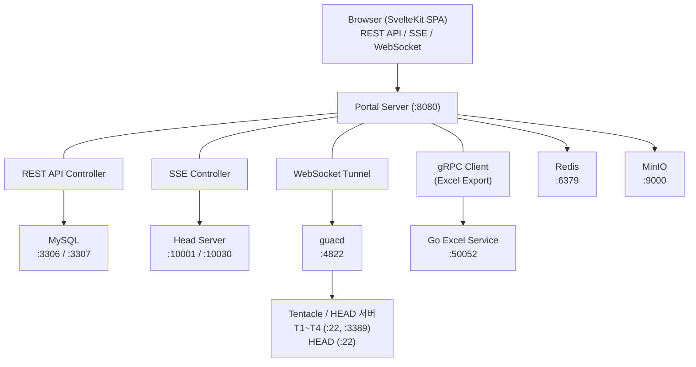

Samsung Portal의 인프라 구성을 설명합니다.

## 서버 구성

| 서버 | 역할 | 포트 | 비고 |
|------|------|------|------|
| **Portal Server** | Spring Boot 웹 애플리케이션 | 8080 | REST API, SSE, WebSocket |
| **MySQL (testdb)** | 호환성/성능 테스트 데이터 | 3306 | testdb, UFSInfo 스키마 |
| **MySQL (portal)** | Portal 도구/사용자 데이터 | 3307 | binmapper 스키마 |
| **Redis** | 캐시 | 6379 | JDK Serialization |
| **Head Server** | 하드웨어 테스트 제어 | 10001, 10030 | TCP 듀얼 소켓 |
| **guacd** | Guacamole 원격 접속 데몬 | 4822 | SSH/RDP 프로토콜 변환 |
| **MinIO** | S3 호환 오브젝트 스토리지 | 9000 | 파일 관리 |
| **Go Excel Service** | Excel 차트 생성 | 50052 | gRPC 서버 |
| **Tentacle T1** | 테스트 디바이스 서버 | SSH 22, RDP 3389 | 디바이스 연결 |
| **Tentacle T2** | 테스트 디바이스 서버 | SSH 22, RDP 3389 | 디바이스 연결 |
| **Tentacle T3** | 테스트 디바이스 서버 | SSH 22, RDP 3389 | 디바이스 연결 |
| **Tentacle T4** | 테스트 디바이스 서버 | SSH 22, RDP 3389 | 디바이스 연결 |
| **HEAD** | Head 서버 (SSH 접속용) | SSH 22 | 로그 조회, 원격 접속 |

---

## 네트워크 다이어그램



---

## 포트 정리

### Portal Server

| 포트 | 프로토콜 | 용도 |
|------|----------|------|
| 8080 | HTTP | REST API, SSE, WebSocket, 정적 파일 서빙 |

### 데이터베이스

| 포트 | 프로토콜 | 용도 |
|------|----------|------|
| 3306 | MySQL | testdb (호환성/성능 테스트), UFSInfo (참조 데이터) |
| 3307 | MySQL | binmapper (Portal 도구), portal_users, tc_groups |
| 6379 | Redis | 엔티티 캐시 (TTL: TestDB 10분, UFSInfo 1시간) |

### Head TCP

| 포트 | 프로토콜 | 용도 |
|------|----------|------|
| 10001 | TCP | Compatibility Head 명령 전송 (outSocket) |
| 10002 | TCP | Compatibility Head 상태 수신 (inSocket) |
| 10030 | TCP | Performance Head 명령 전송 (outSocket) |
| 10032 | TCP | Performance Head 상태 수신 (inSocket) |

포트 계산: `10000 + portSuffix` (DB `portal_head_connections` 테이블에서 관리)

### 외부 서비스

| 포트 | 프로토콜 | 용도 |
|------|----------|------|
| 4822 | TCP | guacd (Guacamole 데몬) |
| 9000 | HTTP | MinIO S3 API |
| 50052 | gRPC | Go Excel Service |

### Tentacle / HEAD 서버

| 포트 | 프로토콜 | 용도 |
|------|----------|------|
| 22 | SSH | 로그 브라우저, 원격 접속 |
| 3389 | RDP | 원격 데스크톱 접속 |

---

## 외부 접속 설정 (포트 포워딩)

외부에서 `http://move.samsungds.net` (포트 없이) 접속 시 Spring Boot(:8080)로 연결합니다.

### iptables 포트 포워딩 (권장)

Nginx 리버스 프록시 대신 **iptables**로 80 → 8080 직접 포워딩합니다. 중간 프록시가 없으므로 WebSocket, SSE(timeout 0/무한)에 영향 없음.

```bash
# 80 → 8080 포워딩 추가
sudo iptables -t nat -A PREROUTING -p tcp --dport 80 -j REDIRECT --to-port 8080

# 확인
sudo iptables -t nat -L PREROUTING -n --line-numbers
```

### 영구 적용 (재부팅 후에도 유지)

```bash
# Ubuntu/Debian
sudo apt install iptables-persistent
sudo netfilter-persistent save

# 또는 수동 저장/복원
sudo iptables-save > /etc/iptables.rules
# /etc/rc.local 또는 systemd service에 추가:
# iptables-restore < /etc/iptables.rules
```

### 삭제 (원복)

```bash
# 규칙 번호 확인
sudo iptables -t nat -L PREROUTING -n --line-numbers

# 해당 번호 삭제 (예: 1번)
sudo iptables -t nat -D PREROUTING 1
```

### 확인

```bash
# 포트 포워딩 확인
curl http://move.samsungds.net/api/pre-commands

# WebSocket 연결 테스트
curl -i -N \
  -H "Connection: Upgrade" \
  -H "Upgrade: websocket" \
  -H "Sec-WebSocket-Version: 13" \
  -H "Sec-WebSocket-Key: test" \
  http://move.samsungds.net/api/guacamole/tunnel
```

:::tip
Nginx 리버스 프록시는 SSE timeout(0=무한)과 충돌하므로 사용하지 않습니다. iptables는 L4 포워딩이라 프로토콜에 영향 없음.
:::
