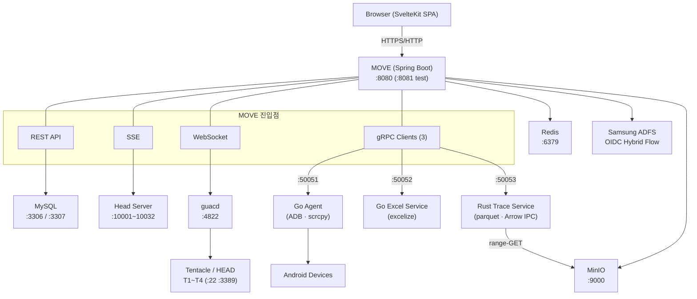

MOVE 의 인프라 구성을 설명합니다. 포트·호스트는 **프로파일별** 로 `application-{dev,prod,test}.yaml` 에서 분기됩니다.

## 서버 구성

| 서버 | 역할 | 포트 | 비고 |
|------|------|------|------|
| **MOVE (Portal Server)** | Spring Boot 웹 애플리케이션 | 8080 (일반) / 8081 (test) | REST API · SSE · WebSocket |
| **MySQL (testdb)** | 호환성/성능 테스트 데이터 | 3306 | `testdb`, `ufsinfo` 스키마 |
| **MySQL (binmapper)** | Portal 전용 데이터 | 3307 | `binmapper` 스키마 (portal users, metadata, agent 등) |
| **Redis** | 엔티티 캐시 | 6379 | JDK Serialization |
| **Head Server** | 하드웨어 테스트 제어 | 10001·10002 (compat) / 10030·10032 (perf) | TCP 듀얼 소켓 |
| **guacd** | Guacamole 원격 접속 데몬 | 4822 | SSH/RDP 프로토콜 변환 |
| **MinIO** | S3 호환 오브젝트 스토리지 | 9000 | 파일 관리 + Trace parquet range-GET |
| **Go Excel Service** | Excel 차트 생성 | **50052** | gRPC 서버 (`excelize/v2`) |
| **Go Agent Service** | Android 디바이스 제어 | **50051** | gRPC + scrcpy WebSocket |
| **Rust Trace Service** | I/O trace parser + Arrow IPC | **50053** | parquet + MinIO async range-GET |
| **Tentacle T1~T4** | 테스트 디바이스 서버 | SSH 22 / RDP 3389 | 디바이스 연결 호스트 |
| **HEAD (SSH)** | Head 서버 SSH 채널 | SSH 22 | 로그 조회, 원격 접속 |
| **ADFS (외부)** | Samsung AD SSO | 443 (HTTPS) | OIDC Hybrid Flow |

---

## 네트워크 다이어그램



---

## 포트 정리

### MOVE (Portal Server)

| 프로파일 | 포트 | 용도 |
|------|------|------|
| local / dev / prod | 8080 | REST · SSE · WebSocket · SPA 정적 서빙 |
| **test** | 8081 | **격리된 테스트 인스턴스** (포트 분리로 ADFS callback 불가 → 로컬 로그인만) |

### 데이터베이스

| 포트 | 프로토콜 | 용도 |
|------|----------|------|
| 3306 | MySQL | `testdb` (호환성/성능), `ufsinfo` (참조 데이터) |
| 3307 | MySQL | `binmapper` — portal_users / metadata / agent / head_connections / action_permissions / ... |
| 6379 | Redis | 엔티티 캐시 (TTL: TestDB 10분, UFSInfo 1시간). `JdkSerializationRedisSerializer` |

### Head TCP

| 포트 | 프로토콜 | 용도 |
|------|----------|------|
| 10001 | TCP | Compatibility Head 명령 전송 (outSocket) |
| 10002 | TCP | Compatibility Head 상태 수신 (inSocket) |
| 10030 | TCP | Performance Head 명령 전송 (outSocket) |
| 10032 | TCP | Performance Head 상태 수신 (inSocket) |

포트 계산: **`10000 + portSuffix`** (`portal_head_connections` 테이블의 `portSuffix` + `listenPortSuffix` 관리)

### 외부 서비스

| 포트 | 프로토콜 | 용도 |
|------|----------|------|
| 4822 | TCP | guacd (Guacamole 데몬) — 글로벌 fallback, VM 별 override 가능 |
| 9000 | HTTP | MinIO S3 API |
| **50051** | gRPC | Go Agent Service (`~/project/agent`) — ListDevices / RunBenchmark / SubscribeJobProgress / RunScenario / MonitorDevices 등 |
| **50052** | gRPC | Go Excel Service (`~/project/excel-service`) — 성능 결과 → 네이티브 Excel 차트 .xlsx |
| **50053** | gRPC | Rust Trace Service (`~/project/trace`) — I/O trace parser + parquet + Arrow IPC ChartPayload / StatsPayload / MinIO range-GET async reader |

### Tentacle / HEAD 서버

| 포트 | 프로토콜 | 용도 |
|------|----------|------|
| 22 | SSH | 로그 브라우저, 원격 터미널, Pre-Command, Metadata SSH, T32 JTAG 서버 |
| 3389 | RDP | 원격 데스크톱 접속 (guacd 경유) |

`tentacle.head.host` 는 프로파일별 분리 — `dev/prod/test` 각각 IP 설정 (2026-04-17 이후).

---

## 외부 접속 설정

외부에서 `https://memo.samsungds.net` (운영) · `https://memo-dev.samsungds.net` (개발) 로 접속합니다. test 인스턴스는 **:8443** 별도 포트.

### iptables 포트 포워딩 (운영 기본)

**Nginx 리버스 프록시 대신 iptables 로 80/443 → 8080 직접 포워딩**. 중간 프록시 없으므로 WebSocket, SSE(timeout 0/무한) 에 영향 없음.

```bash
# 80 → 8080 포워딩 추가 (HTTP)
sudo iptables -t nat -A PREROUTING -p tcp --dport 80 -j REDIRECT --to-port 8080

# 443 → 8080 포워딩 추가 (HTTPS 종료는 외부 LB 에서)
sudo iptables -t nat -A PREROUTING -p tcp --dport 443 -j REDIRECT --to-port 8080

# test 인스턴스용 8443 → 8081
sudo iptables -t nat -A PREROUTING -p tcp --dport 8443 -j REDIRECT --to-port 8081

# 확인
sudo iptables -t nat -L PREROUTING -n --line-numbers
```

### 영구 적용 (재부팅 후에도 유지)

```bash
# Ubuntu/Debian
sudo apt install iptables-persistent
sudo netfilter-persistent save

# 또는 수동 저장/복원
sudo iptables-save > /etc/iptables.rules
# /etc/rc.local 또는 systemd service:
# iptables-restore < /etc/iptables.rules
```

### 삭제 (원복)

```bash
# 규칙 번호 확인
sudo iptables -t nat -L PREROUTING -n --line-numbers
# 해당 번호 삭제 (예: 1번)
sudo iptables -t nat -D PREROUTING 1
```

### 확인

```bash
# 포트 포워딩 확인
curl https://memo-dev.samsungds.net/api/pre-commands

# WebSocket 연결 테스트
curl -i -N \
  -H "Connection: Upgrade" \
  -H "Upgrade: websocket" \
  -H "Sec-WebSocket-Version: 13" \
  -H "Sec-WebSocket-Key: test" \
  https://memo-dev.samsungds.net/api/guacamole/tunnel
```

:::tip[왜 iptables 인가]
Nginx 리버스 프록시는 SSE timeout(0=무한) 과 충돌하고 WebSocket 프록시 헤더 설정이 번거롭습니다. **iptables 는 L4 포워딩** 이라 프로토콜에 영향 없음 — 문서 분량 / 디버깅 난이도 모두 감소.
:::

---

## 프로파일 별 배치

| 항목 | local | dev | prod | test |
|---|---|---|---|---|
| `server.port` | 8080 | 8080 | 8080 | **8081** |
| `portal.base-url` | `http://localhost:8080` | `https://memo-dev.samsungds.net` | `https://memo.samsungds.net` | `https://memo.samsungds.net:8443` |
| `portal.auth.disabled` | **true** (가상 Developer) | false | false | false |
| `portal.adfs.enabled` | false | true | true | **false** (포트 분리로 callback 불가, 로컬 로그인만) |
| `tentacle.head.host` | `""` | 개발 IP | 운영 IP | test IP |
| nginx | — | — | — | — |
| iptables | (옵션) | 80/443 → 8080 | 80/443 → 8080 | 8443 → 8081 |

`run.sh` 에 8가지 메뉴로 각 프로파일 빌드/실행 옵션 제공. 빌드는 `mvnd` (Maven Daemon), 실행은 `java -jar` (graceful shutdown).

---

## 관련 문서

- [Agent 아키텍처](/architecture/agent/) — Go Agent(:50051) gRPC 상세
- [Excel Export 아키텍처](/architecture/excel-export/) — Go Excel(:50052)
- [Trace Analysis 아키텍처](/architecture/trace-analysis/) — Rust Trace(:50053) + MinIO range-GET
- [인증 및 권한](/architecture/authentication/) — ADFS Hybrid Flow + 프로파일 분기
- [용어집](/reference/glossary/) — 포트·서비스 이름 빠른 조회
- [변경 이력](/reference/changelog/) — 프로파일 분리 / Rust 서비스 도입 / nginx→iptables 전환 타임라인
